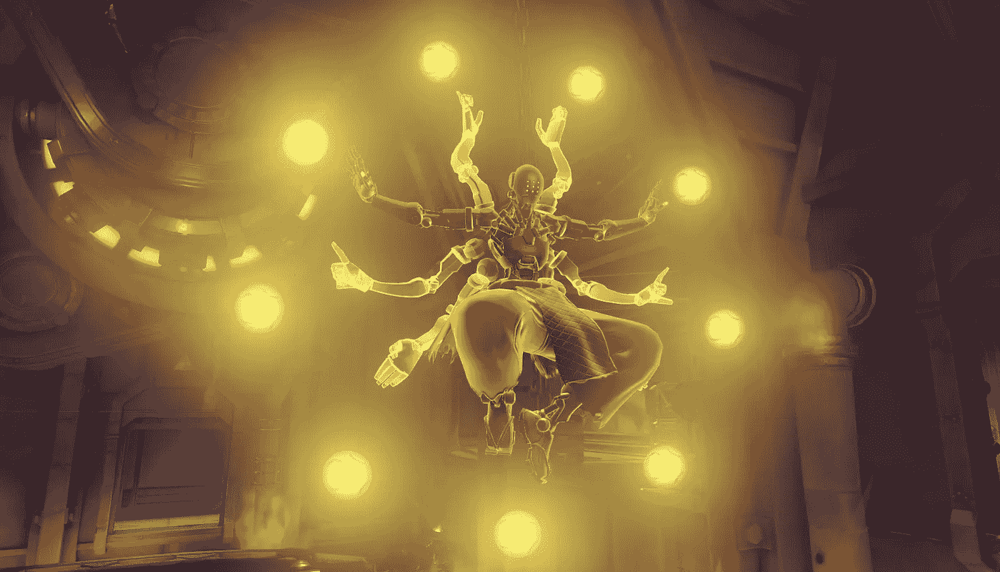
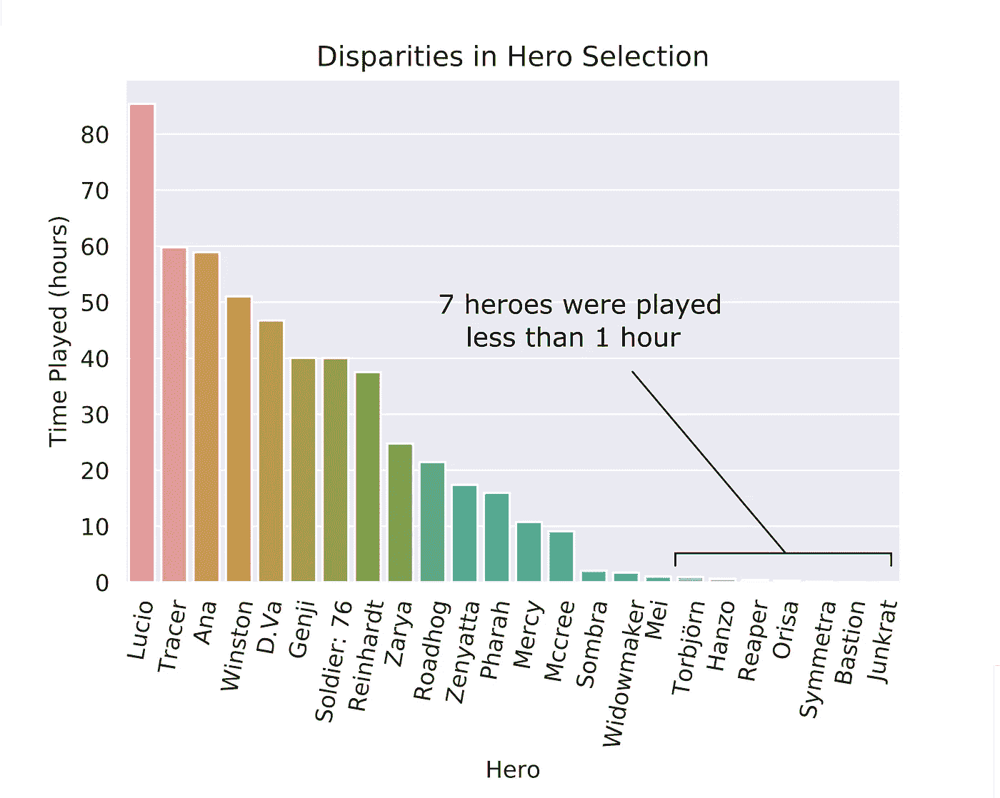
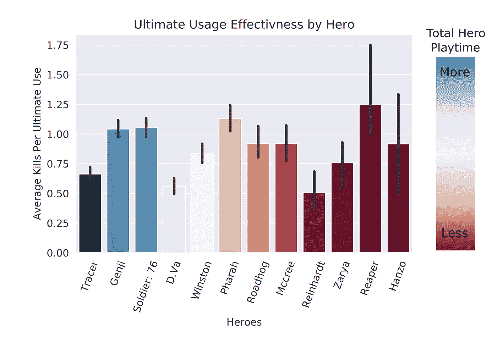
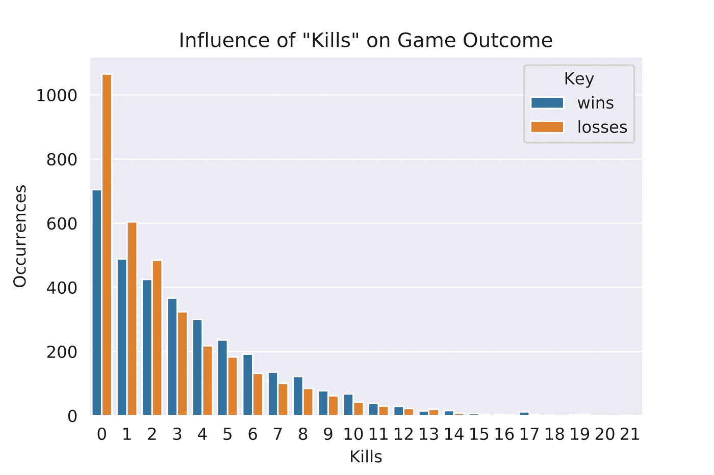

# 平衡“监视”中的指标

> 原文：<https://medium.com/analytics-vidhya/balance-metrics-in-overwatch-58f40da3175e?source=collection_archive---------10----------------------->

Overwatch 是暴雪娱乐公司在美国和/或其他国家的商标或注册商标。([来源](https://playoverwatch.com/en-us/media))

**简介**

看守是一个竞争性的团队第一人称射击游戏。6 人一组在四种不同类型的地图中对抗，为胜利而战。这款游戏于 2016 年推出，为了我的分析，我查看了 2017 年 3 月的职业游戏数据。这些数据是通过游戏分析网站 Winston's Lab 获得的。此时游戏中有 24 个英雄。这是一个有限的数据集，所以“见解”不是全球性的，它们是特定于这个特定的补丁，以及数据来自的特定日期。然而，这里用来分析平衡的技术可以应用于任何视频游戏数据。

**问题**

在这个数据集的范围内，我问:“守望相助是一个平衡的游戏吗？”。我选择了几个不同的领域，试图获得“游戏平衡”的感觉。我观察了每个英雄的游戏时间，最终效果，以及杀戮对游戏结果的影响。在一个更广泛的范围内，我想了解度量标准如何被用来判断游戏的平衡性。

**分析**

1)播放时间:

“提货率”是衡量平衡的一个常用指标。一个角色在职业水平的游戏中被选择的频率说明了他们的有效性。看守允许玩家在游戏中的任何时候切换到任何其他英雄，所以与“选择率”相比，“玩的时间”是一个更好的英雄使用指标。下图显示了该数据集中每个英雄的游戏时间。

图 1:所有英雄的出场时间。

从这个图我们可以看到，某些英雄根本没有看到太多的发挥。在许多比赛中，他们从未被选中。这表明，相对于其他角色，他们的效用被认为很低，所以没有被选中。相反，卢西奥，这位出场次数最多的英雄，提供了如此多的效用，以至于没有一支球队能够不选他。

2)最终有效性:

我也对游戏中英雄的终极能力平衡感兴趣。每个英雄都有强大的终极能力。这些能力随着时间的推移而充电，如果英雄们表现得特别好，充电会更快。不是每个英雄的终极能力都能杀死敌人，但是我在下图中展示了所有英雄的终极能力。

图 2:所有拥有终极伤害的英雄的终极“效果”。

请注意，图 2 中的颜色反映了图 1 所示的播放时间。这反映在误差线的大小上。更少的游戏时间意味着更多的价值差异。从这个柱状图可以看出，终极能力很难被正确使用。尽管这些能力很强大，但它们需要技巧。它还表明，即使在职业级别的比赛中，也没有一个终极是如此强大，以至于它可以持续胜过其他终极。这是良好平衡的标志。从发展的角度来看，这张图表显示了一个可能的变量，可以在重新平衡英雄时进行调整和观察。

3)杀戮和游戏结果:

团队游戏平衡的另一个方面是个人对游戏结果的影响。我观察了一场比赛中一个英雄杀死的总数量，以及这是如何影响比赛结果的。我想知道在杀人数量和游戏结果之间是否有很强的联系。在这种情况下，我发现两者之间几乎没有联系。

图 3:按胜负分布的杀戮

你可以看到有一些不同，但是在胜利和失败中的死亡分布之间没有明显的对比。换句话说，杀死的数量不会强烈影响游戏的结果。这一开始可能没有意义。如果你，作为一个个体，表现得很好，你不应该有更高的成功机会吗？一个简单(但不是唯一！)解释是 Overwatch 是团队游戏。比赛是 6 对 6，比赛的目标不是作为一个个体来表现。比赛的目的是完成目标。这是值得指出的，因为这是我(我肯定其他人)在玩游戏时有时会忽略的东西。

**结论**

平衡是一个难题。这三个指标只是可以用来判断的所有指标的一瞥，也许还可以调整游戏平衡。随着游戏收集更多的信息，设计师现在有工具来做出更好的平衡决策。使问题复杂化的是，过度依赖这些指标可能会导致意想不到的后果。古德哈特定律很好地诠释了这一观点。古德哈特定律指出:“当一个衡量标准成为目标时，它就不再是一个好的衡量标准”。除了对数据科学家来说是一条好的建议之外，它还告诉我们这些指标不应该作为目标。度量是指标。他们不提供解决方案，他们只能指出问题所在。这个分析是有限的，但它有助于指出那些不怎么玩的英雄，以及对终极能力的力量平衡的更好理解。

那么 Qverwatch 是一款平衡游戏吗？不，很可能不会，它可能永远不会是一个“完美”平衡的游戏，但每个补丁，每个新英雄，每次变化，每次迭代都会改变动态以找到一个新的平衡点。更重要的是,《守望先锋》一直是一款“有趣”的游戏(这种说法需要在其他数据中找到证据)。这些统计数据可能有助于指导平衡，但真正的问题是:“平衡”还是“乐趣”？

[**原代码**](https://github.com/mvkumar14/Lambda-Portfolio/blob/master/Unit1_Build_Week_102419.ipynb) **为探索性和解释性的视觉效果**

https://github . com/mvkumar 14/Lambda-Portfolio/blob/master/unit 1 _ Build _ Week _ 102419 . ipynb