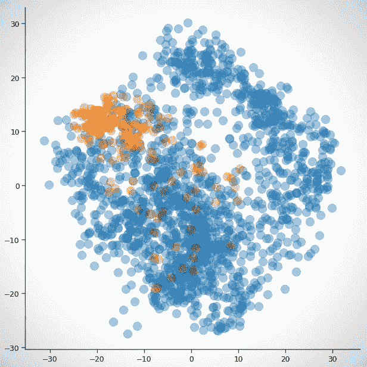

# 如何使用 SMOTE 处理不平衡数据

> 原文：<https://medium.com/analytics-vidhya/balance-your-data-using-smote-98e4d79fcddb?source=collection_archive---------0----------------------->

## 通过 Python 中的案例研究

有了像 ***scikit-learn*** 这样的库，构建分类模型只是几分钟的事情。但是，在没有正确检查数据结构的情况下构建模型可能会导致灾难性的结果。

想象你是一名医生。不幸的是，你在你的一个病人身上发现了肿瘤。还有…