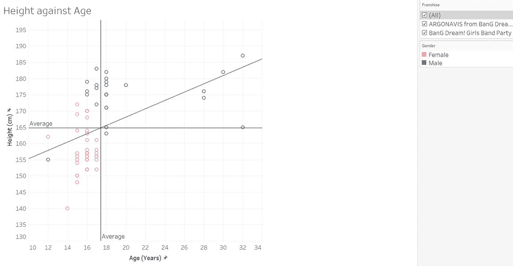

# BanG 梦想！女子十二乐坊派对！—字符信息数据库和表格分析

> 原文：<https://medium.com/analytics-vidhya/bang-dream-girls-band-party-character-database-and-tableau-analysis-f0446e2e570c?source=collection_archive---------3----------------------->

那次我决定突袭班多里维基建立我自己的角色数据库。

原始数据和结果可视化

上图:BanG 梦！女子十二乐坊派对！人物(Morfonica 和 RAISE A SUILEN 未图示)，下图:来自 BanG Dream 的 ARGONAVIS！特性

你好！这篇文章是我使用我的 [Bandori 事件卡追踪器和人物数据库](https://drive.google.com/file/d/1ulzRMKwEHjZSApGSftLswIvvkxpRZzy2/view?usp=sharing)电子表格指南的第二部分，也是我制作和分析它的经验。第一部分进入活动卡片追踪器，可以在这里找到: [BanG Dream！女子十二乐坊派对！—事件卡跟踪器](https://thianjiawen.medium.com/bang-dream-girls-band-party-event-card-tracker-5362450c768d)

在继续之前，请打开[电子表格](https://drive.google.com/file/d/1ulzRMKwEHjZSApGSftLswIvvkxpRZzy2/view)并在阅读本文时参考它，因为本文中嵌入的 CSV 表格可能有点难以查看，因为表格相当大。此外，我还创建了一个 Tableau 工作簿，显示本文中使用的可视化效果: [Bandori 和 ARGONAVIS 字符信息](https://public.tableau.com/app/profile/ordinary.twilight/viz/BandoriCharacterInformation/BandoriandARGONAVISCharacterInformation)请查看工作簿，以便更轻松地与数据进行交互！

对于不玩[霹雳梦](https://en.wikipedia.org/wiki/BanG_Dream!)(又名 Bandori)的读者来说:

1.  Bandori 是一种节奏游戏，你可以随着日本歌曲的节拍敲击音符来得分。如果你做得足够好，你会因为你的努力而得到一颗闪亮的粉红色全组合星。关于选择最佳歌曲配乐的更专业的观点，可以看看我的另一篇文章: [BanG Dream！女子十二乐坊派对！宋元探索性分析使用 Tableau](https://thianjiawen.medium.com/bang-dream-girls-band-party-song-meta-exploratory-analysis-using-tableau-8418ecb4d098)
2.  截至 2020 年 10 月，该游戏由 5 个波段的 25 个角色组成(如果你玩的是内容领先一年的日本版游戏，则为 7 个波段的 35 个角色)。游戏中的卡片以稀有性、特征和属性为特征，有很多组合会影响你的力量和分数。一般来说，如果你优先考虑原始乐队的力量，你会想要一个在同一乐队中具有相同属性的高稀有性团队。
3.  该游戏定期举办活动，奖品包括升级物品的资源和收集的新卡([有时是非常漂亮的卡](https://bestdori.com/assets/en/characters/resourceset/res020017_rip/card_after_training.png))。往届活动的卡片可以在[米歇尔贴纸交易所](https://bandori.fandom.com/wiki/Michelle_Sticker_Exchange)找到，并使用米歇尔贴纸获得。关于决定得到哪张卡的更多信息，请查看我为[第一部分](https://thianjiawen.medium.com/bang-dream-girls-band-party-event-card-tracker-5362450c768d)写的文章！
4.  该系列的粉丝不仅仅热爱游戏，他们也热爱角色！所有 35 个班多里女孩都有鲜明的个性和古怪的互动，而新的《阿尔戈纳维斯》系列中的 25 个男孩有潜力成长和发展成为像班多里的角色一样受人喜爱的人。

我们开始吧！

向大家问好！

**人物信息**

如果您打开 Google Sheets 工作簿的字符信息表，您将看到以下内容:

BanG Dream 全部 60 个角色的角色信息！来自 BanG Dream 的女子十二乐坊党和 ARGONAVIS！

这个表太大了，所以我先把它分解一下。

我可能应该解释一下为什么这个表如此之大:我包括了班多里衍生剧《爆炸之梦》中的 25 个角色。为了避免混淆，ARGONAVIS(全部大写)指的是整个 Bandori 衍生产品，而 Argonavis 指的是乐队。这种区分也是官方使用的，所以我在这里还是坚持一下。ARGONAVIS 的简短说明:

1.  与班多里的全女性演员相比，他们都是男性。
2.  到目前为止，两个系列中的角色都没有任何接触。ARGONAVIS 是一个非常新的平台，所以这在未来可能会有所改变。
3.  平均来说，ARGONAVIS 的角色比 Bandori 的老(大部分是大学生而不是高中生),这个系列应该有一个稍微成熟的基调。但是，角色组成乐队的基本前提以及整个动漫+游戏+现场乐队的概念仍然保持不变。
4.  本质上:Bandori，但与男孩代替。

除了我的分析之外，我还想做一个可以被其他粉丝使用的信息库。为了收集数据，我从维基页面上搜集了班多里语和阿尔戈纳维斯语中所有 60 个角色的简介信息。典型的配置文件如下所示:

[小霞富山在 BanG Dream Wikia 上的](https://bandori.fandom.com/wiki/Toyama_Kasumi)个人资料

有很多比我拍的更详细的东西，但我优先考虑了可以分组的特征，并在 Tableau 的帮助下进行比较。这些是我收集的变量:

1.  名字:很明显为什么。
2.  乐队:原因很明显，因为班多里和阿尔戈纳维斯是关于乐队的。
3.  乐器:每个乐队中的特定角色。我没有使用特定的模型，因为那不会让我把角色分组在一起，因为每个人都有独特的乐器。
4.  学校:用来估计年龄。影响角色可能与谁互动。
5.  年份:用于估计年龄。
6.  同学们:也许是为了将来的分析。班多里的很多乐队也是同学，有趣的是《阿尔戈纳维斯》中的一些角色在同一个系里。)
7.  生日(用来估计年龄，也影响游戏性，因为在角色生日时会有特别的奖励。)
8.  十二宫杀手(为了好玩，也因为它已经在页面上了。)
9.  身高(数据越多，我就越开心……)
10.  图像颜色(每个角色和乐队都有一个独特的颜色分配给他们，作为各种签名。我整理了十六进制的颜色代码，让我的画面体验不那么痛苦，与乐队/角色更相关。)
11.  Epithet(仅限 Bandori，这些只是描述角色的一行程序。我认为他们对粉丝来说很有趣，但在我的分析中没有太大用处。)
12.  重量(仅适用于阿尔戈纳维斯，不幸的是，没有给出班多瑞角色的重量。)

其他不直接来自档案的变量:

1.  特许经营权(在这种情况下相当于性别，决定这样做，这样我会有更多的过滤选项。)
2.  眼睛颜色/头发颜色:我只是从图片和 Wikia 描述中粗略估计了一下颜色(一直没有)。动漫中的头发和眼睛有很多种颜色，但我把它们“四舍五入”为最接近的基本颜色，以防止我在超级英雄数据集中不得不处理的巨大混乱。
3.  年龄:这出乎意料的棘手。班多里从未给出任何角色的年龄，直到我看到阿尔戈纳维斯的数据，我才设法找到一个估计值。ARGONAVIS 的一个男孩 12 岁(在那个节目中最小)，他在中学一年级。据我所知，日本的初中和高中各持续 3 年，大学就在高中毕业后，没有中断参军(这是一些国家的情况)，我几乎可以估计每个人的年龄。然而，我发现日本的学年开始于 4 月 1 日，而不是 1 月，这意味着从 1 月到 3 月出生的每个人严格来说都比他们学年的大部分时间小一岁。经过一段时间的恐慌和编辑，我设法对每个人的年龄有了一个相当准确的估计。耶！

关于称谓的注意事项:日本人有很多方式来说“我”或者称呼另一个人。这种变化非常令人着迷，但其他人已经为班多里最初的 25 个角色做了一个[惊人的图表](https://www.reddit.com/r/BanGDream/comments/8l572r/bandori_name_reference_chart/)。此外，ARGONAVIS Wikia 缺乏这方面的信息(以及许多其他东西)，所以我决定不关注这一点。

分析时间到了！在制作一个简短的画面故事之前，我将我的视觉化图像分组到仪表板上，以便突出人物阵容中的趋势。

*1。基本的*
树形图是我在这里选择的武器，因为它们允许我很好地将每个人分组，同时能够以标签的形式显示细节。颜色也有帮助。

按波段排序的字符

乐队角色:简单介绍每个人和他们在乐队中的角色。是的，真的有人兼做长号手和键盘手。

按仪器分类的字符

仪器:之前的图表，但排序不同。大多数乐队遵循人声、吉他、贝斯、键盘和鼓的标准格式，但一些乐队同时混合了双吉他、小提琴、DJ 甚至人声和萨克斯管！

按学校/工作场所分类的人物

学校/工作/组织:每个人的跟踪者指南。几乎班多里的每个人都在读高中(大多数人要么在[花崎川高中](https://bandori.fandom.com/wiki/Hanasakigawa_Girls%27_High_School)要么在[羽冈高中](https://bandori.fandom.com/wiki/Haneoka_Girls%27_High_School))，而阿尔戈纳维斯的年龄范围很广，从中学生到工作的成年人都有！我不太确定为什么 ARGONAVIS 学院的孩子们在同一所学校，尽管他们应该来自日本的不同地区…可能是我不太熟悉的游戏情节的一部分…

*2。评估每个人*
请注意，坐标轴不是从零开始的，因为我想更好地查看图表，因为找到一个 0 厘米高、0 公斤重的 0 岁儿童有点没用。

身高对年龄

身高对年龄:不是很高的 0.23 的 R 平方值(有道理，因为我们在某个年龄停止生长)。使用过滤器的力量，我们可以看到 Bandori 的平均高度是 157.78 厘米，而 ARGONAVIS 的平均高度是 174.84 厘米。在现实生活中:

> 17 岁日本男性的平均身高为 170.7 厘米(5 英尺 6 英寸)，女性为 157.8 厘米(5 英尺 1 英寸)。说到体重，男性体重为 62.5 公斤(137.7 磅)，女性为 52.9 公斤(116.6 磅)。([来源](https://livejapan.com/en/in-tokyo/in-pref-tokyo/in-shinjuku/article-a0000962/))

我们可以看到，尽管动画演员看起来不真实，但他们的相对尺寸实际上非常接近现实！如果角色的数据点高于/低于趋势线，这意味着他们比他们的年龄所暗示的要高/矮！当然，许多年龄段数据点的缺乏影响了趋势线的准确性。

身高体重比(体重数据仅适用于 ARGONAVIS 角色)

身高体重比:R 的平方值为 0.75，所以这是一个相当不错的正相关关系，符合我们在现实生活中所知道的……看起来最高最重的人也是最老的人之一(他 32 岁)！有趣的是，[的另一个人](https://argo-bdp.fandom.com/wiki/Koharu_Mitsurugi)也是 32 岁，比《阿尔戈纳维斯》中几乎一半的演员都要矮、要轻。平均体重 63.84 kg，也是蛮接近现实生活的！数据点高于/低于其趋势线的角色会比给定其体重的预期值高/矮，这显示在角色的体形中(瘦/浅黄色)。

按年龄排序的角色(范围从 12 岁到 32 岁)

年龄:从基本信息表中可以看出，绝大多数演员都是青少年，平均年龄是 5 岁(他们在一个乐队)。年龄最大的人(32 岁)几乎是最年轻的人 (12 岁)的三倍！也可以看出，阿尔戈纳维斯的年龄范围比班多里大得多，但其人物的平均年龄是大学年龄，而不是班多里的高中年龄。

按高度排序的字符(范围从 140 厘米到 187 厘米)

身高:哇，性别之间没有太多的重叠…最高的女孩[的身高是 Argonavis 的歌手](https://bandori.fandom.com/wiki/Wakana_Rei)[的身高，他是他的乐队中较矮的一个。最矮的男孩是 12 岁，他比同龄的女孩矮并不奇怪，因为那个女孩高得不正常。她还经常穿 6 厘米(我想是这么高)的厚底鞋，这让她的身高增加了很多。总的来说，最矮的角色是一个 14 岁的 140 厘米高的孩子。有趣的是，她总是被安排在她乐队的主唱旁边，主唱是乐队里最高的角色，身高 172 厘米，这种身高差异看起来非常惊人…](https://argo-bdp.fandom.com/wiki/Ren_Nanahoshi)

*3。头发/眼睛的颜色*
请注意，颜色是近似的，基于我所看到的，可能不是 100%准确，尽管我很确定我的视力没有*那么差。为了更简单的分组，不同的色调被集中成相同的颜色。*

**

*按头发颜色排序的字符，图表颜色表示眼睛颜色*

*从颜色组合图中，我们可以看到金发和棕色眼睛是最常见的 5 个字符的组合。下一个最常见的组合是有 3 个角色的绿色头发和绿色眼睛，但是请注意其中 2 个(他们碰巧是双胞胎)的头发是蓝绿色而不是绿色。粉红色的头发和粉红色的眼睛也有 3 个字符拥有组合。*

**

*按头发颜色(上图)和眼睛颜色(下图)分组的角色*

*尽管黑色的头发和蓝色的眼睛分别是最常见的颜色，当放在一起时，它们只出现在两个字符中。在这里找不到太多的趋势，因为动漫的颜色倾向于反抗自然…因此 [*橙色*头发和眼睛](https://bestdori.com/assets/en/characters/resourceset/res013034_rip/card_after_training.png) …*

**4。最佳角色的生日！**

**

*显示角色庆祝生日的日期的图表*

*请记住，这两个系列是分开的，所以如果你同时玩这两个游戏，你只能收获 6 月 16 日三岁生日的喜悦…6 月 15 日和 3 月 20 日恰好是每个系列双胞胎的生日。*

**

*按星座排序的字符*

*有趣的是，他们的星座暗示他们是双胞胎:双鱼座有两条鱼，而双子座是双胞胎。请注意，我对生肖一无所知，一切都是从谷歌上找到的，所以我知道的还不够深入。我所知道的是[哈古米](https://bandori.fandom.com/wiki/Kitazawa_Hagumi)、[科科罗](https://bandori.fandom.com/wiki/Tsurumaki_Kokoro)、[三崎五藤](https://argo-bdp.fandom.com/wiki/Misaki_Goto)和[游斗](https://argo-bdp.fandom.com/wiki/Yuto_Goryo)非常冲动，似乎很适合狮子座。三崎奥泽、[健太](https://argo-bdp.fandom.com/wiki/Kenta_Satozuka)和[林科](https://bandori.fandom.com/wiki/Shirokane_Rinko)倾向于相当冷静和有条理，我想这符合天秤座的刻板印象……现在我想知道这是不是班多里故意的。*

*至于游戏性和生日，10 月总体来说是最好的一个月，也是 Bandori 最好的一个月，月底感觉圣诞节提前到来了。由于双胞胎的生日，三月也不算太糟糕。ARGONAVIS 的生日分布非常均匀，一个月有两个生日，除了六月，由于有了[二条命](https://argo-bdp.fandom.com/wiki/Haruka_Nijo) [双胞胎](https://argo-bdp.fandom.com/wiki/Kanata_Nijo)……她得到了一个额外的生日*

**5。签名颜色**

**

*Fanart 艺术家，我希望这是有帮助的…*

*HTML 颜色代码:这是一个调色板，用于每个 Bandori/ARGONAVIS 字符和波段。它不用于任何直接的分析，但我做这个是希望其他班多里的粉丝会发现这是有帮助的，或者至少看起来不错。我发现非常有趣的是，这两个系列在颜色光谱中的颜色分布相当均匀，尽管系列本身遵循许多性别比喻。*

*至此，我对两个球队的性格信息的分析就结束了。我希望你喜欢它，如果你还没有检查过，这里是我的电子表格指南的第一部分。如果您对这个可视化和文章有任何反馈，请在这里告诉我[！](https://www.reddit.com/r/BanGDream/comments/jupnvb/bang_dream_girls_band_party_event_card_tracker/)*