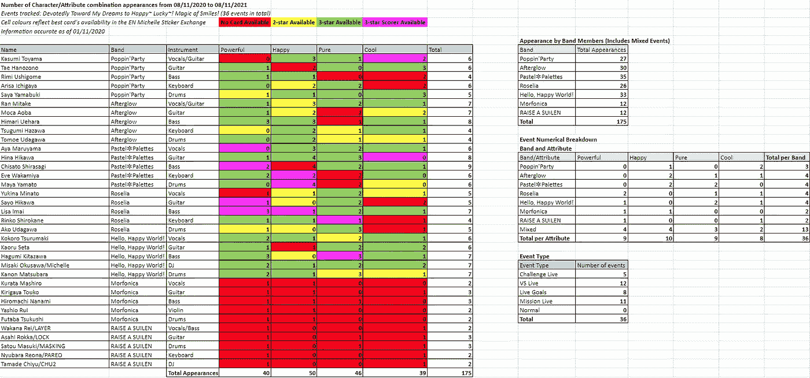

# BanG 梦想！女子十二乐坊派对！—事件卡跟踪器

> 原文：<https://medium.com/analytics-vidhya/bang-dream-girls-band-party-event-card-tracker-5362450c768d?source=collection_archive---------11----------------------->

你应该从米歇尔贴纸交换处得到哪张卡片？

人物事件追踪器(截至 JP server，2020 年 11 月)

你好！这篇文章是我使用我的 [Bandori 事件卡追踪器和人物数据库](https://drive.google.com/file/d/1ulzRMKwEHjZSApGSftLswIvvkxpRZzy2/view?usp=sharing)电子表格指南的第一部分，也是我制作和分析它的经验。第二部分进入人物信息分析，可以在这里找到:[邦梦！女子十二乐坊派对！—人物信息数据库和表格分析](https://thianjiawen.medium.com/bang-dream-girls-band-party-character-database-and-tableau-analysis-f0446e2e570c)

在继续之前，请打开[电子表格](https://drive.google.com/file/d/1ulzRMKwEHjZSApGSftLswIvvkxpRZzy2/view)并在阅读本文时参考它，因为本文中嵌入的 CSV 表格不会显示为电子表格添加更多功能的单元格颜色。

对于不玩 BanG Dream(又名 Bandori)的读者来说:

1.  Bandori 是一种节奏游戏，你可以随着日本歌曲的节拍敲击音符来得分。如果你做得足够好，你会因为你的努力而得到一颗闪亮的粉红色全组合星。关于选择最佳歌曲配乐的更专业的观点，可以看看我的另一篇文章: [BanG Dream！女子十二乐坊派对！宋元探索性分析使用 Tableau](https://thianjiawen.medium.com/bang-dream-girls-band-party-song-meta-exploratory-analysis-using-tableau-8418ecb4d098)
2.  截至 2020 年 10 月，该游戏由 5 个波段的 25 个角色组成(如果你玩的是内容领先一年的日本版游戏，则为 7 个波段的 35 个角色)。游戏中的卡片以稀有性、特征和属性为特征，有很多组合会影响你的力量和分数。一般来说，如果你优先考虑原始乐队的力量，你会想要一个在同一乐队中具有相同属性的高稀有性团队。
3.  游戏会定期举办活动，奖品包括升级物品的资源和收集的新卡([有时是非常漂亮的卡](https://bestdori.com/assets/en/characters/resourceset/res020017_rip/card_after_training.png))。往届活动的卡片可以在[米歇尔贴纸交易所](https://bandori.fandom.com/wiki/Michelle_Sticker_Exchange)找到，并使用米歇尔贴纸获得。

我们开始吧！

**事件卡跟踪器**

我玩 Bandori 数据分析已经有一段时间了，并且有了尝试预见未来的想法。这也许是在全球服务器上玩的最大好处:你可以提前知道一年的内容，这给了你足够的时间来计划！考虑到这一点，我打开了 [Bandori 事件时间线](https://bandori.party/events/)(感谢它的过滤器)并开始工作…这就发生了。

2021 年 11 月之前 EN 服务器的 Bandori 事件卡追踪器(数据基于 JP 服务器事件)

每个单元格显示每个特定字符/属性组合出现的事件数。如果您使用本文开头的 Google Sheets 链接而不是本文中的嵌入式表格来查看电子表格，您会看到单元格是根据米歇尔贴纸交易所截至 2020 年 11 月是否有特定字符/属性组合的卡片来着色的，这可能会帮助想要特定组合卡片的玩家，以便使他们的活动阵容更强大。请注意显示 3 星记分员在交换中可用的单元格，因为这是交换中可用的最强类型的卡。完整的电子表格还包括一个表格，显示了交易所在一年后的情况，建议玩家是否应该等待更好的卡片出现。

综上所述，我得到了大约 36 个事件(大约 175 次出现除以每个事件的 5 个字符)。

每个角色出现的次数(包括混合波段事件)

我还根据属性和波段总结了事件。

每个波段/属性组合的事件数量

我们可以看到，下一年的英国服务器将有很多愉快的事件，而不是很多很酷的事件。不过，这些数字分布得相当均匀，这并不奇怪，因为连续的事件往往会在属性中循环。

看起来，在接下来的一年里，我会经常看到 Pastel✽Palettes。将两个表格中的数据结合在一起，[赤坂白杉](https://bandori.fandom.com/wiki/Shirasagi_Chisato)(pastel✽palettes)[上原喜玛拉雅](https://bandori.fandom.com/wiki/Uehara_Himari)(余晖)和[希娜 Hikawa](https://bandori.fandom.com/wiki/Hikawa_Hina) (Pastel✽Palettes)将成为频繁出现的事件人物。就乐队而言，我真的很惊讶罗塞莉娅在最初的 5 支乐队中出现得最少，特别是因为罗塞莉娅是班多里最受欢迎的乐队之一。Morfonica 和 RAISE A SUILEN 将在明年 3 月和 6 月左右首次亮相，这解释了它们活动数量少的原因。

我承认我制作这个追踪器的动机是想看看用我的米歇尔贴纸换这个[玛雅](https://bestdori.com/info/cards/303/Maya-Yamato-A-Reporter-s-Job)是否值得。我有足够的贴纸，喜欢玛雅的角色，需要更多的玛雅卡片来加强我的阵容，但我想确保我会在活动中使用这些卡片，这样我辛苦赚来的米歇尔贴纸就不会浪费了。从表中，我确信我的购买是值得的，因为快乐玛雅卡将在未来一年的 4 个事件中需要，这是所有 140 个字符/属性组合中最高的！

此事件卡追踪器的限制:

1.  在我的大部分分析中，我没有考虑事件类型。对于某些事件，即使我拥有所有属性正确的事件角色，如果团队较弱，我会选择使用我最强的得分团队，因为这样虽然会失去事件奖励，但总的来说会得到更多分数！我做了一个表来统计每种类型的事件数量，看起来优先考虑高频段功率的 VS 现场事件出现的频率最高。
2.  数字低不一定说明卡没用。回到第一点，如果我的活动团队很弱，我可能需要用相同活动属性的 4 星卡来提升整体的能量。因此，4 星强大的 Arisa 卡可能仍然会派上用场…

按事件类型划分的事件数量

如果您对事件跟踪器有任何反馈，请务必在这里告诉我[！这是第一部分，看看第二部分](https://www.reddit.com/r/BanGDream/comments/jupnvb/bang_dream_girls_band_party_event_card_tracker/)[这里](https://thianjiawen.medium.com/bang-dream-girls-band-party-character-database-and-tableau-analysis-f0446e2e570c)。如果你是班多里玩家，我希望这个追踪器对你有用！