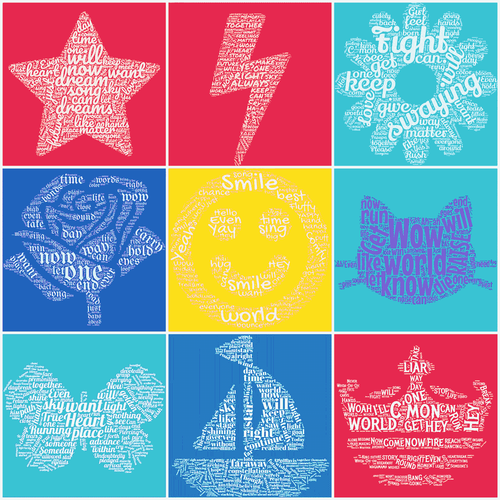

# BanG 梦想！女子乐队派对歌曲歌词如词云

> 原文：<https://medium.com/analytics-vidhya/bang-dream-girls-band-party-song-lyrics-as-word-clouds-79693ab4c528?source=collection_archive---------15----------------------->

我对制作数据驱动的漂亮壁纸的追求。

从左到右，从上到下:狂欢派对，余辉，彩色调色板，罗塞莉娅，你好，快乐世界！，提出一个 SUILEN，Morfonica，Argonavis，GYROAXIA

最近，我一直在做相当多的 BanG Dream ✕数据可视化项目，包括游戏的[宋遇到](https://thianjiawen.medium.com/bang-dream-girls-band-party-song-meta-exploratory-analysis-using-tableau-8418ecb4d098) a，以及创建一个电子表格，供粉丝为[未来事件](https://thianjiawen.medium.com/bang-dream-girls-band-party-event-card-tracker-5362450c768d)制定策略或快速参考他们最喜欢的[角色的信息](https://thianjiawen.medium.com/bang-dream-girls-band-party-character-database-and-tableau-analysis-f0446e2e570c)。如果你以前从未听说过 BanG Dream(粉丝也称之为 Bandori)，这里有一个非常简短的介绍:

1.  Bandori 是一种节奏游戏，你可以随着日本歌曲的节拍敲击音符来得分。如果你做得足够好，你会因为你的努力而得到一颗闪亮的粉红色全组合星。
2.  BanG Dream 系列还扩展到动画、漫画和由一些游戏角色的配音女演员组成的现实生活乐队，为粉丝或 BanG 梦想家提供身临其境的体验。
3.  截至 2020 年 10 月，该游戏由 5 个波段的 25 个角色组成(如果你玩的是内容领先一年的日本版游戏，则为 7 个波段的 35 个角色)。
4.  该系列的粉丝不仅仅热爱游戏，他们也热爱角色！所有 35 个班多里女孩都有鲜明的个性和古怪的互动，而新的《阿尔戈纳维斯》系列(班多里的全男性衍生剧)中的 25 个男孩有潜力成长和发展成为像班多里的角色一样受人喜爱的人。请注意，所有大写的 ARGONAVIS 指的是系列，而 Argonavis 指的是乐队。

我一直在 Spotify 上播放 Bandori 在 loop 上的歌曲，同时试图想出更多数据可视化的想法，当时我有了用一堂课的歌词制作单词云的想法。这是班多里歌曲的播放列表，也是阿尔戈纳维斯歌曲的播放列表，这样你就可以了解它们是什么样的了:

BanG 梦想！女子十二乐坊派对！播放列表

来自 BanG Dream 的 ARGONAVIS！播放列表

在那之后，我花了几个小时从 [BanG Dream Wikia](https://bandori.fandom.com/wiki/BanG_Dream!_Wikia) 搜集了所有我能找到的翻译歌词，并使用[单词云生成器](https://www.wordclouds.com/)将它们转换成单词云。为了使单词 clouds 在本质上可识别为 Bandori，我决定使用基于实际乐队图标、颜色和美学的形状、颜色和字体。我还创建了用成员自己独特的颜色给单词着色的变体，但我觉得乐队颜色版本更漂亮，尽管不同的成员颜色更容易看到单个单词。

从左到右，从上到下:狂欢派对，余辉，彩色调色板，罗塞莉娅，你好，快乐世界！，提出一个 SUILEN，Morfonica，Argonavis，GYROAXIA

我还创作了单词 clouds 的桌面和手机壁纸版本，因为我对新壁纸很感兴趣:

稍微深入一点的分析:

1.  余辉是一个童年的朋友乐队，基于游戏中的故事。他们组成乐队是为了待在一起，看日落对他们来说意义非凡。很自然地，他们的歌曲中有很多提到天空和待在一起的想法，即使他们的想法是“永远一样”。考虑到他们的形象和声音给人的感觉很像摇滚，他们的信息令人惊讶地有益健康。
2.  你好，快乐世界！有一个非常明确的使命:让世界微笑。因此,“微笑”和“世界”这两个词在他们的歌曲中大量出现并不奇怪。他们歌曲的欢快和略带孩子气的语调(因此我选择了这个字体)也意味着像“耶！”出现很多。他们的座右铭是“快乐，幸运，微笑，耶！”这也解释了很多…
3.  莫弗尼卡是这个街区最新的孩子。据我所知，就我仅有的一点数据和他们的象征(一只蝴蝶)而言，他们都是关于蜕变和想要变得更好，这可能解释了为什么像“想要”、“心”、“奔跑”和“位置”这样的词在他们迄今为止的两首歌中占据了很大的比重。随着时间的推移，这张图表会发生最大的变化，我很兴奋地看到它在一年后的样子！
4.  Pastel*Palettes 的音乐非常做作，他们的一些歌曲有*非常*重复和朗朗上口的歌词。这解释了“摇摆”的存在，因为这个词(在日语中)在一首特定的歌曲中重复了很多次。《Fight》也重复了很多(那首歌的歌词:“Fight！战斗！继续战斗！战斗！战斗！战斗！绝不放弃！”整首歌都在重复)，但是 Pasupare 的很多歌都是关于“永不放弃”和“继续尽你最大的努力”，这是与他们蓬松可爱的外表相反的强烈信息。
5.  波普派对的歌曲大多是关于追逐你的梦想。成员都是普通的女学生，她们的很多歌曲都是关于正常生活和其中“闪亮的，令人心跳”的部分。乐队希望通过他们的音乐找到这种“闪亮、震撼心灵”的感觉，这就是为什么许多歌词如此关注歌曲和梦想。有时歌词也会变得非常重复，这将有助于单词的权重。Poppin 'Party 拥有迄今为止最多的歌曲，所以我不认为这张排行榜的构成在未来会有很大变化。
6.  举起一个 sulen…重复歌词的另一个罪犯。在这种情况下，乐队的高能声音意味着对合唱团的大量喊叫和重击。在 Bandori 的例子中,“wow”通常意味着歌曲的发声部分，但在 RAS 的例子中，你可以听到这个词作为伴唱歌手在歌曲中大喊的一部分。总的来说，乐队的音乐传达了这样的信息:养一只 Suilen 是最好的，他们将用他们的音乐征服世界。他们的很多歌曲也专注于突破自己的极限，不管有多痛苦。这可能解释了图表中的许多单词。为什么是猫？这是我能找到的最接近猫耳耳机的东西了，所以…无论如何，一个没有进入图表的重量级单词是“地狱”。之所以出现这么多，是因为有一首歌叫《地狱！还是地狱？”这个词在那里出现了很多次……“请选择！见鬼了。还是地狱？”
7.  一句话:戏剧性。就像“背叛保持模糊，然后倒下”那种戏剧性。乐队的音乐倾向于专注于他们达到音乐巅峰的道路，而“从现在开始团结一致”的想法在他们的歌曲中占据了相当大的比重。他们的歌曲似乎没有超级清晰的标志性词汇，我认为这部分是因为他们的歌词严重依赖隐喻和大量的戏剧。“一”出现得如此频繁的部分原因是因为歌曲《合一》中的歌词:“合一…成为全部的一！”每个合唱团重复 3 次…
8.  Argonavis 非常倾向于星座的意象(乐队名字的灵感)，以及乐队是驶向冒险的船上的船员的想法。这解释了为什么像“天空”和“星星”这样的词会在他们的歌曲中大量出现。由于 ARGONAVIS 专营权仍相对较新，Argonavis 和 GYROAXIA 都没有太多带有翻译歌词的歌曲，他们的词云肯定会随着他们的发展而变化。如果 Argonavis 的形象让你想起 Poppin 'Party，这可能并不奇怪，因为这两个乐队都是各自专营权的主角，并以温暖人心和欢快的歌曲为特色。
9.  GYROAXIA 在许多方面与 Argonavis 截然相反。从美学角度来看，它让人想起余辉，但从态度角度来看，它混合了罗塞莉娅的完美主义和阿苏伊伦的愤怒和鲁莽。他们的歌曲是为了让人群疯狂，这一切解释了为什么像“世界”这样的词和像“来吧”和“嘿”这样的感叹词是他们歌曲中的主要成分。

总之，单词 clouds 显示了每个乐队的歌曲如何反映他们的动机和风格。余辉爱他们的“一如既往”，Poppin '党的梦想很多，并提出了一个 SUILEN 想接管世界…然而，有一些限制:

1.  根据我在网上找到的翻译，我不知道它们有多准确，因为我不会说日语，但我认为根据我对歌曲含义的了解，它们相当不错。
2.  有些歌曲还没有翻译，所以我不能把它们加进去。因此，Morfonica 的 cloud 只基于两首歌曲，而 Poppin 'Party 有 20 多首歌曲。
3.  单词云的形状和大小限制意味着有些单词没有包括在内，但我认为基于单词云生成器创建的 CSV，显示的单词是最常见的。你好，快乐世界的 CSV！可以在下面找到，它显示了乐队的歌曲如何真正实现乐队的使命，让世界微笑。其他频段的 CSV 可以在下面显示的 GitHub 配置文件中找到。我不会在本文中嵌入其余的表格，因为这些表格包含许多行，尤其是对于 Poppin 'Party。

说完，我的 Bandori word cloud 项目就结束了！我可能会考虑尝试用我的刮掉的歌词做一个情感分析项目，但那是另外一天的项目！感谢您阅读本文！

 [## 暮光之城

### GitHub Gist:通过在 GitHub 上创建一个帐户，星叉 TwilightWitch 的 Gist。

gist.github.com](https://gist.github.com/TwilightWitch) 

Hello，Happy World 的歌里的词，用出现频率加权。