# BanG 梦想！女子十二乐坊派对！利用 Tableau 对歌曲进行元探索性分析

> 原文：<https://medium.com/analytics-vidhya/bang-dream-girls-band-party-song-meta-exploratory-analysis-using-tableau-8418ecb4d098?source=collection_archive---------6----------------------->

想把分数最大化应该种哪首歌？

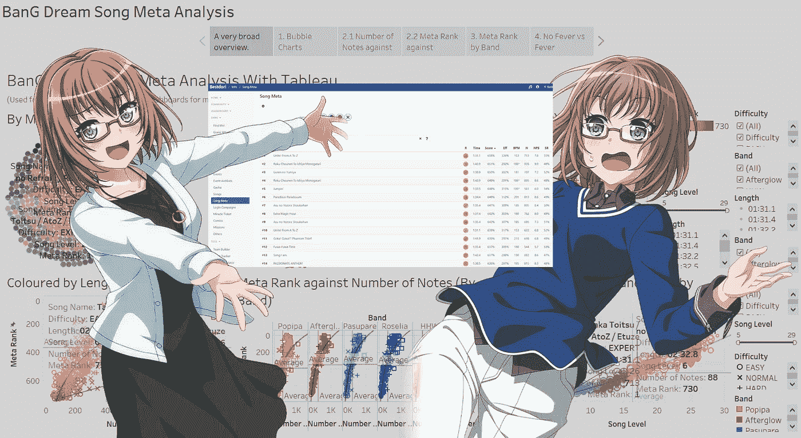

呼呼和…数据是最好的…玛雅图片鸣谢:Bestdori

想象一下:你是一个初学者，最近开始玩 Bang Dream。你对这个游戏还不是很在行，但是你已经知道了一些基本知识，比如:

1) Bang Dream(粉丝称为 Bandori)是一款节奏游戏，你可以随着通常快节奏的日本歌曲的节奏敲击音符来得分，如果你玩得好，就可以获得闪亮的粉红色全连击星。

2)截至 2020 年 10 月，游戏由 5 个波段的 25 个角色组成(如果你玩的是日版游戏，则为 7 个波段的 35 个)。游戏中的卡片以稀有性、特征和属性为特征，有很多组合会影响你的力量和分数。这是影响你分数的一个非常关键的因素，但是我不会在这里讨论它。一般来说，如果你优先考虑原始乐队的力量，你会想要一个在同一乐队中具有相同属性的高稀有性团队。

3)游戏定期举办活动，奖品包括升级物品的资源和收集的新卡([有时是非常漂亮的卡](https://static.wikia.nocookie.net/bandori/images/b/b7/Super_Fun_Strategy_Meeting_T.png/revision/latest?cb=20181220040410))。

假设有一个新的活动推出，你决定一定要拿到那张活动卡，因为你真的真的*真的*喜欢它。不幸的是，现实是一个东西，你没有足够的时间整天玩，你的技能还没有真正令人惊叹，所以最困难的歌曲是遥不可及的，*和*你的活动乐队阵容不惊人，因为 [Babanbo-sama](https://www.youtube.com/watch?v=d-Obra3jQ00&list=PLi6JjODFVq31KIs7VzFU1XfybePhw6qKn&index=12) 没有祝福你所需的卡。

Fuee… GIF 信用:期限

现在，在你像上面的雪之少女一样抓狂之前，有些东西可以让你的探索变得更容易。这是什么？

和大多数游戏一样，是策略！原始的力量只能带你走这么远，战略性的歌曲选择将帮助你超越你的体重，达到这些事件点。

等等……策略？我是来听音乐的，不是来下棋的！

关于那个…我不想打断你，年轻的学徒，但是班多里基本上是数学:

1)嘎查获取人物？概率。

2)卡力？取决于事件奖励的加法和乘法。

3)曲谱？加法/乘法。

4)酒店？特里瓦格。(好吧，我开玩笑的……)

我们的策略是最大化我们的歌曲分数。为此，我们将利用班多里的神话歌曲 Meta，它受到各地竞技玩家的崇敬。宋元是什么，是什么让它如此强大？

“Meta 基本上是得分最高/让你得到最多分数的东西。这是有效的 T2 时间，有效的 T4 时间，有效的时间因此，举例来说，如果我说一首歌是'元'，这意味着播放这首歌将是最容易得到最多的点。"

我不得不搜索定义(此处致谢:[‘Meta’在 BanG Dream 的形式中是什么意思！女子十二乐坊派对？](https://bangdreaming.tumblr.com/post/163856466319/what-does-meta-mean-in-the-form-of-bang-dream))因为我是最近才知道宋元的存在的！我想一个相似的类比将是持续地选择相同的地图来玩射击游戏，因为你知道地图有一个对你非常有利的布局(在非常方便的位置/许多隐藏的地方有许多战利品等)。Meta rank 表明这首歌获得高分有多容易，假设你能为它获得完整的组合(以相对较好的准确度击中每个音符)。

Meta rank 通常更喜欢音符密度高(即长度短、音符数量多)的歌曲，以及一些其他因素，如技能活跃时的音符位置和模式(对我来说太复杂了，无法在此进行分析，但如果你很好奇，这里是最佳 meta rank 歌曲的 beatmap(我无法在歌曲中幸存，这太可怕了):[Unite from A to Z Bestdori 的专家 beat map](https://bestdori.com/tool/simulator/125/expert/Unite-From-A-To-Z))。

基本上，班多里的歌并不是都是平等打造的。一首歌曲有相当多的组成部分，当考虑在一起时，它揭示了歌曲或歌曲元的得分效率:

1)音符的数量

2)歌曲长度

3)纸币密度(纸币/秒)

4) Beatmap 模式( [Bestdori 图表和模拟器](https://bestdori.com/tool/chartsimulator)

一定要注意，歌曲 meta 假设你是一个相对较强的演奏者，音符准确率高(大多可以挖掘完美音符)，乐队阵容强大。歌曲元不考虑音符的类型(轻敲/快速滑动/按住/滑动等。)这影响了歌曲的难度，也影响了你个人技能水平下的农业可行性。然而，大多数歌曲元趋势也适用于得分技能较弱的乐队以及难度较低的歌曲，这使得该发现适用于大多数 BanG Dream 球员。

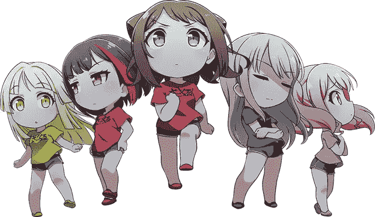

如果你不是很强壮，不要担心，你有这个！演职员表: [bandori.party](https://bandori.party/asset/624/Garupa-PICO-Season-2-Key-Visual-Chibis/)

在我们开始分析之前，请注意以下几点:

1)我使用 Tableau Desktop 创建了此处显示的可视化效果。我使用的 Tableau 工作簿可从以下位置获得:

[霹雳梦！(Bandori)歌曲元分析](https://public.tableau.com/app/profile/ordinary.twilight/viz/BandoriSongMeta/BanGDreamSongMetaAnalysis)

本文中的所有图表都可以在 Tableau Public 上在线找到，或者在本文附带的文档中找到。通读文章时，请使用工作簿中的 Tableau 故事，因为通读我对数据的解释时，与图表互动会更容易！

2)我将更加专注于分析我的结果。如果你想要 Tableau 的深入教程，你来错地方了，但是用简单的谷歌搜索就能找到令人惊叹的 [Tableau 教程](https://help.tableau.com/current/guides/get-started-tutorial/en-us/get-started-tutorial-home.htm)。

3)我用的歌曲元数据集(基于 2019 年日本服务器)可以在这里找到: [Garupa！(JP)-元图表](https://docs.google.com/spreadsheets/d/1qPMZ89sj9ku7T7BbHLjplKLnYpGH-DAjg0vhvw_bCNE/edit#gid=555706888)然而，最新的歌曲元数据可以在这里找到: [Bestdori 歌曲元](https://bestdori.com/info/songmeta)

4)你会意识到我在这个分析中相当频繁地使用 Bestdori。这是一个粉丝制作的网站，有很多有用的功能，如游戏事件信息，团队生成器，Beatmap 模拟器(如果游戏视频太快，你的眼睛跟不上，就用这个)以及我的分析所基于的歌曲 Meta。声明:我与 Bestdori 的制作者没有任何关系，但作为一名 Bandori 玩家，我经常使用该网站来优化我的活动表现。

5)我尝试在可能的地方添加游戏视频的链接，这样当我提到一首特定的歌曲时，每个人都知道我在说什么。然而，如果我找不到好的视频，我就把这首歌链接到 Bestdori 歌曲模拟器。再说一次，我不隶属于任何制作这些视频的了不起的球员。

6)我在全球服务器上玩 Bandori 大概半年了。在那之前我没有节奏游戏的经验，虽然我可以有把握地说我是 BanG Dream 的超级粉丝，但我绝不是游戏方面的专家。然而，根据我的经验和其他在网上发布提示和技巧的歌迷的经验，歌曲 meta 是一个非常可靠的方法来策划你的歌曲选择！

7)非常重要的一点是，如果你真的要在活动中使用它:请注意，我的大部分分析使用了歌曲数据，而没有考虑在多现场直播中遇到的发烧模式。简短解释:发烧模式(可以在本文链接的大多数游戏性视频中看到)在短时间内将一个人的分数提高 2 倍，通常是在一首歌的合唱期间。当与积极的技能叠加时，结果是特别有力的。我选择在这里不包括这种效果，因为我更感兴趣的是比较歌曲本身。然而，除了我将指出的几首歌曲之外，我稍后将讨论的结果将主要适用于多现场。

**图表阅读指南**

我承认，乍一看，这些图表看起来就像训练后的 T2 四星卡片艺术一样详细和复杂……这里有一个提示:当阅读图表时，只考虑 2 个变量，即使图表可能显示更多。一般来说，散点图有大约 4 个变量(x 和 y 轴，颜色和形状)和一些过滤器。当你考虑图形的形状时，把所有点都当作空白圆。考虑颜色时，仅关注 x 轴方向。这可能会更容易解释图表！

我将如此多的细节塞进每张图表的理由(这是对班多里关注细节的一个轻微的误导吗？也许……)是为了理论上你可以从一个眼神中得到你需要的所有信息，只要你改变你的参考框架。事后看来，我承认这有点复杂。

我们开始吧！

**班多利宋分析**

**1。气泡图**

先说简单的。气泡图是一种很好的浏览数据的方式，这里的结果也不例外。这里的目的是通过歌曲级别和难度来分析歌曲，并在我们深入实际歌曲元之前获得一些总体趋势。

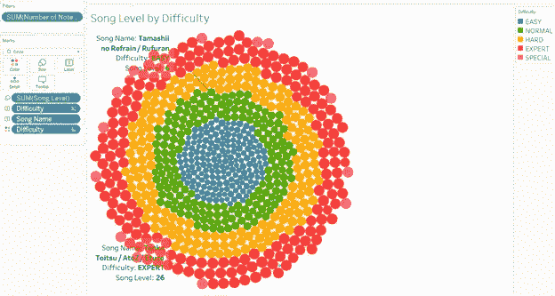

有趣的是，这些可能是我见过的最漂亮的图表，因为它们有漂亮的形状和颜色…

*1.1 歌曲难度等级*

我更改了 Tableau 的默认颜色以反映 Bandori 在游戏中的颜色，并启用了难度类别的手动排序，以便圆圈按顺序显示，难度随着与图形中心的距离增加而增加。每个圆圈的大小(1 个圆圈对应一首特定难度的歌曲)指的是歌曲级别。我还添加了一个过滤器来删除由于原始源代码的格式而产生的空值。这些步骤中的大部分也适用于气泡图的其余部分。

歌曲等级和难度指南:每个难度涵盖一个范围的歌曲等级。一般来说，当比较歌曲时，人们会查看歌曲级别，因为它提供了更精确的比较形式，但是如果更广泛的比较就足够了，难度范围也是有用的。

*5–12:简单
11–16:普通
15–23:困难
20–29:专家
25–29:特殊(一般与专家范围相似)*

请注意，由于特定的歌曲，范围有所重叠。比如 [Ringing Bloom(硬难度)](https://www.youtube.com/watch?v=uZBAoospjAY) ( [Beatmap 此处](https://bestdori.com/tool/simulator/175/hard/Ringing-Bloom))就是一首 23 级的歌，而且比比较容易的“专家”歌要难。

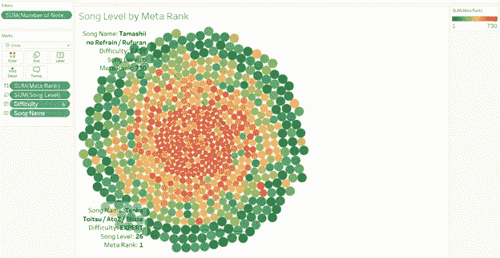

另外，这张图表让我想起了一个色觉测试…

*1.2 元等级歌曲等级*

除了现在与歌曲元排名相对应的颜色之外，该图表与之前的图表基本相同。等级越高(数字越小)，根据我之前解释的标准，这首歌的得分效率越高，圆圈的绿色越暗。红色圆圈表示较低的元排名，黄色圆圈表示一般。

我的发现并不令人惊讶:歌曲越难，它在元歌曲中的排名就越靠前。毕竟，更难的歌曲有更多的音符，这给了玩家更多的得分机会！图表外缘清晰的深绿色环也显示专家和特别歌曲平均来说是相当好的元歌曲，而红色中心显示简单歌曲没有那么好。

最佳元:最短歌曲。最差元:最长的歌。

*1.3 歌曲长度对歌曲级别*

颜色越深，歌曲的持续时间越长。我没想到这里会有什么趋势，我是对的。这是因为每首歌曲都有 4 个难度(一小部分有第 5 个特殊难度)，所以不应该有太多的模式，因为有或多或少相同数量的特定持续时间的歌曲，并且这些难度都分布在 4 个波段上。虽然这张图表很漂亮，但我不能否认这一点。

在我们继续下一个图表之前，请注意:你会注意到我始终特别标记了两个数据点。这些指的是排名最好和最差的元歌曲，分别是[Unite from A to Z(Tenka Toitsu)Expert](https://www.youtube.com/watch?v=bafNF4-CBPo)(# 1)和[Soul ' s essay(tamashi no essay/Rufuran)Easy](https://www.youtube.com/watch?v=TV-WShFiTBM)([beat map here](https://bestdori.com/tool/simulator/17/easy/Soul-s-Refrain))(# 730)。我包括了注释(这对我来说是新的，我刚刚发现它们在这个项目中存在)，这样我们将对所有的图表有一致的基准。希望 730 个数据点看起来不那么可怕…

值得注意的是，Unite from A to Z 是最短的歌曲(1 分 30.1 秒)，而 Soul 的副歌(2 分 32.8 秒)是该数据集中所有歌曲中最长的，这解释了它们在图中的相对位置。其他来源可能会列出不同的歌曲作为最短的(例如，大逃亡)，但我认为差异是最小的。请原谅命名上的差异，我不得不为这张图表使用备用名，因为原来的名字是日文。不幸的是，在游戏的英文版本中出现的正确翻译并没有出现在一些歌曲的这个字段中。

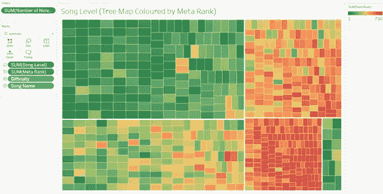

顺时针:专家、普通、困难、容易、特殊。矩形大小指的是歌曲等级，颜色指的是元等级。

顺时针:容易、困难、特殊、专家和普通。矩形大小指元级别，颜色指歌曲级别。

1.4 树形地图——选择你的战斗！

这个图表最好在 Tableau 上查看，因为当您将光标移到每个矩形上时，它会提供交互式工具提示。为什么是树状图？正如我们之前看到的，气泡图很漂亮，但要分离出特定的数据点有点困难，比如每个难度的最高歌曲级别或最低歌曲级别。这就是树状图更好的地方，特别是如果你想要的是一个简单的方法来找到数据点。

每个图表的大部分代表不同的难度，这使得我们更容易找到每个难度所需的数据点。作为初学者，你可能会对普通歌曲的最佳元歌曲感兴趣，也对最简单的普通歌曲感兴趣。

要找到最佳的 meta Normal 歌曲，请在第二个图表的 Normal 部分找到最小的(右下角)矩形。在这种情况下，它是一首 14 级歌曲，有 254 个音符。它持续了 1 分 32.2 秒，并有一个令人惊讶的好 meta 排名 175。

要找到最简单的普通歌曲，在第一个图表的普通部分找到最小的(右下角)矩形。在这种情况下，答案是[是！BanG 梦想！](https://bestdori.com/tool/chart/1/normal/Yes-BanG-Dream)(在图表中称为 YBD)是一首 10 级歌曲，有 153 个音符。时长 2 分 0.1 秒，元排名 522。有趣的是，这两首歌都来自乐队 Poppin 'Party 和 Yes！BanG 梦想！对大多数困难来说是最简单的歌。

我对每个难度都重复了这个过程，并总结到下表中，括号中是歌曲等级和元等级。如果困难之间有联系，我使用歌曲元来区分，假设更差的歌曲元(更低的音符密度)使歌曲稍微容易一些。我还列出了启用发烧模式的歌曲的最佳和最差排名:

*在这个数据集中，Teardrops 是最难的特辑歌曲。然而，自从这个数据集在 2019 年制作以来，[六万亿年和一夜之间的故事特辑](https://www.youtube.com/watch?v=VlDxsqEq--U)已经凭借*另一个*29 级怪物窃取了冠军。如果你想看歌曲的节拍图，可以看看 Bestdori 的模拟器。

这张桌子揭示了一些事情:

1) Ringing Bloom 是 Expert 之前所有难度下最难弹的一首歌，在歌曲水平上超过了后续难度类别中最容易弹的一首歌。需要注意的是 [Ringing Bloom 专家](https://www.youtube.com/watch?v=MP_JQdokAnI)也不逊色，是一首 28 级的歌曲，有 1094 个音符，是这个数据集中最高的。

2)一旦发烧模式被激活，就歌曲元而言，Jumpin '至高无上。这并不令人惊讶，因为由于这首特定歌曲的持续时间短(1 分 33.6 秒)和[密集的节拍图](https://bestdori.com/tool/chart/170/expert/Jumpin)，有可能为这首歌曲的很大一部分激活某种形式的分数提升。

3) Unite from A to Z 是免费 Live、VS Live 等游戏模式中未激活发烧模式时，较高级别的最好的一首歌来 farm。然而,《从 A 到 Z 的专家》在《发烧激活》这首歌中排名第二，这是一首适合所有模式的好歌，前提是你能可靠地挺过去。

4)波平的《洗牌》和《灵魂的副歌》和其他同样难度的歌曲相比，一直是最差的元歌。泪珠也是臭名昭著的坏元歌曲。

除了将它们用作交互式目录(如果我只想要极值的话，对一个表进行排序就足够了)之外，树状图还能让我快速挑出每个类别中的异常。这对于第一张图表来说是最有用的，在第一张图表中，与其他具有相同难度的歌曲相比，比该部分中的其他矩形具有更暖颜色的矩形具有不成比例的更低的元排名。例如，即使专家部分中的大多数矩形是绿色的，也可以看到一些黄色的矩形。这些对应于具有异常低的元排名的专家歌曲，例如灵魂的副歌和泪珠。相当多的这些歌曲恰好是游戏中最长的歌曲。因此，树状图提供了一种更有组织的方式来可视化我们的数据。

**2。散点图**

接下来的几个图表！泡沫图很漂亮，但它们并没有很好地显示趋势…是时候展示散点图了！

*2.1 音符数对照宋级*

仪表板概述。

我再次按照难度给点着色，这次我决定用数据点的大小来说明长度。尽管这张图有很多事情在进行，但我还是很喜欢它，因为它一口气显示了如此多的趋势，却没有太多的压倒性变化:

1)歌曲水平和难度之间的关系被再次建立，因为难度带被非常清楚地看到。与气泡图相比，这里更容易看到的是歌曲在特定难度范围内的分布，以及范围之间的重叠。光是看一眼，我就知道大部分专家歌集中在 25、26 级左右，大部分硬歌集中在 17、18 级左右。然而，我也可以说，硬歌似乎比其他歌曲更多地重叠了其他难度水平，这是有道理的，因为硬通常被视为专家的垫脚石，尤其是当难度开始重叠时。我记得在我有勇气尝试我的第一首专业歌曲之前，我花了几个月爬上坚硬的水平…

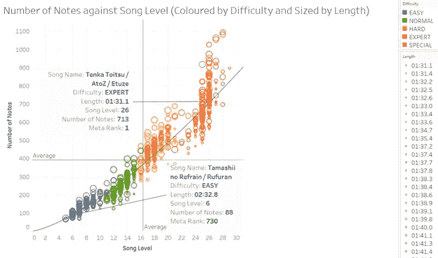

难度随着音符数量和歌曲级别的增加而增加。

2)难度与音符数:不出所料，音符数与歌曲难度呈正相关。我也意识到音符数量的变化是随着难度的增加而增加的。(只需对比一下 8 级和 26 级歌曲的垂直传播。)

3)音符的长度和数量:从图中较大的圆圈在它们的歌曲级别中位置较高可以看出，歌曲越长，音符就越多。毫不奇怪，真的。三个兴趣点:

a)首先，似乎大圆圈也作为其等级中音符数量最少的歌曲出现。为什么？我检查了这些点以及它们的节拍图，并得出结论，这些歌曲往往有很多音符属于“按住”类型的部分，因此尽管长度相对较长，但音符数量较少。

b)第二个兴趣点与孤独的 29 级歌曲、[六万亿年和一夜之间的故事](https://www.youtube.com/watch?v=oFNBnJsV3TM)有关。尽管这首歌相对较短，只有 1 分 43 秒，却有近 900 个音符，这可能是这首歌难度如此之大的原因之一。这大约是每秒 8.7 个音符*…呀。*

c)感兴趣的最后一点与 Unite from A to Z 有关。你看不到图中的点，因为它真的很小，但我觉得有趣的是，这首歌实际上没有那么多音符，因为有很多长度相似的歌曲有更多的音符。同样，这也是更复杂的因素出现的地方。

4)第二个图表仍然是同一个图表，但是被着色以反映元排名。在这个图表中，难度由点的形状来表示。这个分析实际上更像是一个颜色实验，这是我在可视化数据时最喜欢玩的东西之一。正如色彩趋势明确显示的那样，歌曲级别越高，歌曲 meta 排名越好。将这个图表与上一个图表进行比较，可以推断出较长的歌曲往往具有比它们的级别所暗示的更低的元得分。

歌曲元随着音符数量和歌曲级别的增加而增加。

5)第三个图表用于显示趋势线优化。形状代表难度等级。使用线性趋势线，R 平方值为 0.911765，表明歌曲级别与歌曲中的音符总数之间有很强的正相关性。然而，给定散点图的形状，音符数量的增加如何随着歌曲音量的上升而增加，非线性趋势线会更合适。因此，我将趋势线改为幂趋势线，公式如下:

音符数= 7.35769 *(歌曲等级^ 1.40062)

引起我注意的是如何在非常接近最佳拟合线的地方找到最佳和最差的元歌曲。这条线能描述每一级的完美音符数吗？也许是，但完美的估计是非常不可能的，因为歌曲元更复杂…另一个有趣的事情是音符的平均数量是 391.4，向图表的下端倾斜更多，可能是因为音符较少的歌曲数量更多，如轻松和正常的歌曲。

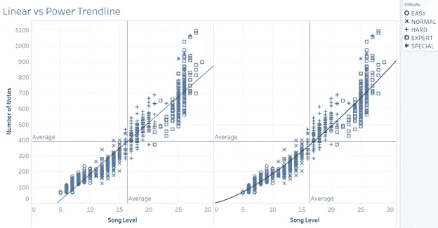

力量趋势线效果更好。

*2.2 相对于音符数量的元等级*

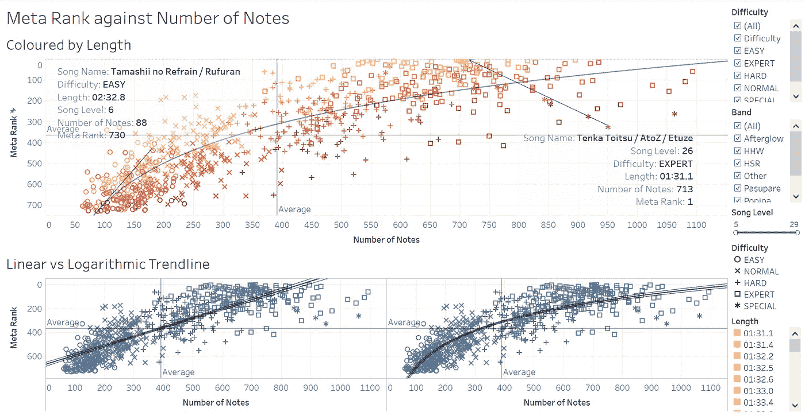

仪表板概述。

关于图表本身的几点说明:

1)这里最需要注意的是元排名轴是如何反转的。我这样做是因为我发现这更直观，因为更高、更好的排名在图表中的位置更高，即使数字更小。

2)至于颜色，是根据长度来定的，所以标记越红，歌曲越长。标记形状与难度相对应，平均线将图表分成 4 个象限。值得注意的是，这里最“普通”的歌曲之一是 [Alchemy Hard](https://www.youtube.com/watch?v=L6m5WKSzjiw) ，这是一首 17 级的歌曲，有 395 个音符，元排名为 373。

3)关于趋势线:从第二个图表来看，线性趋势线的 R 平方值不是很高，为 0.700977，这支持了我的猜测，即根据散点图的形状，趋势不是线性的。因此，我改变了趋势线来反映对数趋势，以显示在较高的元排名中，音符的数量是如何趋于平稳的。然而，900-1100 个音符范围内的点的分散似乎表明了一种可能的抛物线关系，因为有太多音符的歌曲持续太久，对元排名产生负面影响。不幸的是，我没有足够的数据来证实这一点。需要注意的是，趋势线似乎把短歌和长歌整齐的分开了。趋势线左边的点可以被认为是特别元的歌曲，即使在考虑歌曲中音符的数量之后。

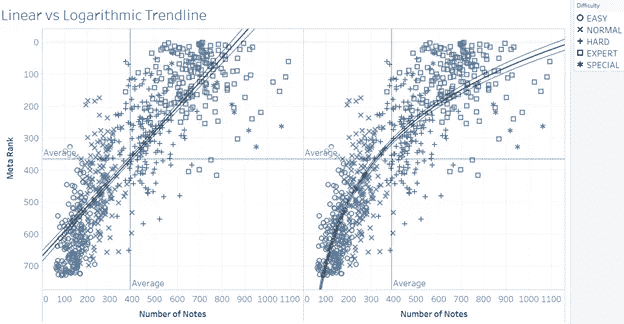

对数趋势线效果更好。

这张图表有相当多的东西要看…

元排名似乎在特定数量的音符时达到峰值，并随着长度的减少而增加。

1)我将从明显的趋势开始:一般来说，音符越多，歌曲元排名越高。这是有道理的，毕竟要获得高分，你需要尽可能多的得分机会，对吗？然而，游戏的评分机制会干扰这种效果:更多的音符确实会给你一个得分更高的机会，但对于一些音符数量非常高的歌曲来说，每个音符的得分可能会低得惊人。因此，我认为在游戏中可能会有一个理论上的最高分，如果一个真正优秀的玩家能够以 100%的准确率完整地组合一首强大的元歌曲和一个狂热模式下的疯狂强大的团队。我的猜测是，这个理论上的最大值非常接近 300 万点。

2)数据分布:随着笔记数量的增加，排名的扩散增加了不少。一般来说，专家/特殊困难经历的范围最广(合并了两者，因为它们的难度范围几乎相同)。

3)长度和元等级:即使较长的歌曲具有更多的音符，也可以看到较长的歌曲倾向于落在图表的趋势线之下，这表明它们具有比预期更低的等级。meta 受密度(音符数/时间)影响很大的事实可以解释这一点。这是非常值得注意的，因为它表明聪明的歌曲选择可以胜过纯粹的技能。我用分数模拟器说明了这一点(下图):使用游戏中可用的最佳阵容，一个技术高超的玩家使用 Unite from A to Z Expert(26，713 注)可以得到大约 2，040，719 分，而 ring Bloom Expert(28，1094 注)只能得到大约 1，871，161 分。尽管敲钟开花肯定需要更多的技巧来玩，但由于得到了完整的连击而不是很高的分数，结果是更多的吹嘘权利。

左图:Unite from A to Z 专家的模拟分数(26 级，#1)。右图:打铃绽放专家(28 级，#60)积分模拟得分:[最佳团队建造者](https://bestdori.com/tool/teambuilder)

4)我注意到的一些奇怪的事情是，相当多的正常歌曲(例如 KIZUNA 音乐)如何落入指示高于平均等级但低于平均音符的象限…有趣。我想这些歌曲对于希望超越体重的初学者来说是完美的！这种按象限分析的方法就是为什么我在这里的大多数图表中包含了平均值的参考线。

5)确认元排名是如何计算的:元排名相对于得分效率。分数大小与难度相对应，因此这个图表看起来有点不平衡。由于元排名是基于得分效率，这里的高 R 平方值(0.986632)并不奇怪。然而，非常有趣的是，图表的两端似乎逐渐变细，而不是像我预期的那样遵循严格的线性关系。似乎最好的和最差的歌曲之间的得分效率非常相似，但灵魂副歌与尾部的距离有点令人惊讶。

6)此处没有过多讨论基准测试，因为正如预期的那样，它们位于图表的两端。在这张图表中，最普通的歌曲是 Natsunodon！正常，一首 14 级的歌，367 个音符。有趣的是，它的邻居是如何混合了努力，正常，甚至专家宋([夏天的天空&太阳！孙！七个！](https://www.youtube.com/watch?v=IMI0_n4dBVM))。

7)回到我在开始提到的假设玩家:如果我无法在高于 24 级的任何事情中幸存，并且我想要特定乐队(例如，Poppin 'Party)的歌曲以完成游戏中的特定任务，该怎么办？简单:只要过滤掉所有不必要的点，你就会找到你的元友好集列表！

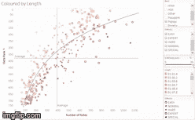

抱歉 GIF 小！

**3。按波段进行元分析**

顺时针方向:欢乐派对(Popipa)，余辉，彩色调色板(Pasupare)，你好，快乐世界！罗塞莉娅。

没有乐队的乐队是什么？每个乐队都有非常鲜明的特点和音乐风格，但歌曲总体来说节奏相当快，适合节奏游戏。某些乐队的死忠粉丝会忍不住说他们最喜欢的乐队的歌曲是最难的，但我认为事实并非如此。为什么？

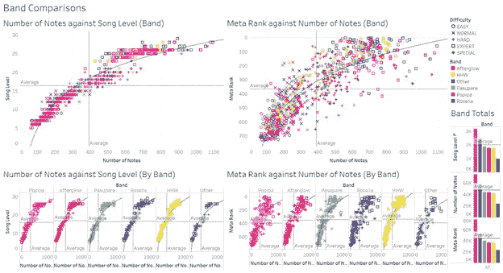

是时候再次使用过滤器的力量了！

这一次我做的是根据创作这首歌的乐队给这些点上色。“其他”类别的存在是因为一些歌曲是由不属于主要 5 个乐队的乐队完成的(例如，提出一个 SUILEN，因为在制作数据集时乐队不在游戏中，尽管它的歌曲在游戏中)。我还翻转了歌曲级别/音符数图表的轴，以匹配元级别/音符数图表。从上面的仪表板可以看出，每个波段的点分布彼此相对相似。但是，当我根据波段分割分布时，可以看到形状的细微差异:

单个波段分布。

1)余辉、粉彩*调色板(Pasupare)和 Hello，Happy World！与 Poppin'Party (Popipa)和 Roselia 相比，HHW 的图表相对精简。这并不奇怪，因为我知道 Popipa 和 Roselia 比其他乐队有更多的歌曲。这两个乐队恰好在现实生活中也存在，有助于更高的歌曲输出。尤其是《余晖》在元歌曲和非元歌曲之间有一个可怕的难度差距，因为其前 50 名的歌曲都是 26 级及以上。

2)一旦按波段划分，图形的形状会有细微的不同。Roselia 有很多倾向于更高歌曲水平的专家歌曲。考虑到乐队有相对强烈的摇滚风格，较高的难度应该不会太令人惊讶。罗塞莉娅的歌曲在音符数量上倾向于更长的一端。同样值得注意的是，许多最好的元排名歌曲来自 Pasupare 和 Roselia。前 10 名由 3 首 Pasupare 歌曲、3 首 Roselia 歌曲、1 首 Popipa 歌曲、1 首余辉歌曲和 2 首 Hello，Happy World 歌曲组成。一开始我觉得很惊讶，因为罗塞莉亚和帕苏帕雷的音乐风格截然相反(哥特摇滚和偶像流行)。然而，这两个乐队都有非常快节奏的曲目。

歌曲数量扭曲了总数。

3)“波段总数”图表有点意外，但我发现它很有趣，因为它教会我检查数量很重要。光看图表，你觉得 Popipa 平均难度最高的歌，音符最多，平均排名最差，也情有可原吧？没有。这张图表提醒我，在下结论之前，我必须注意每个乐队的歌曲数量。供参考，歌曲数量如下:

狂欢派对:49 首歌曲

罗塞莉娅:36 首歌

彩色调色板:28 首歌曲

你好，快乐世界！:26 首歌曲

余晖:25 首歌

其他:15 首歌曲

**总计:179 首歌**

很明显，Poppin 'Party 比其他乐队有更多的歌曲…几乎是余辉的两倍！

**4。发烧模式 vs 不发烧**

发烧模式会导致一个人的分数在短时间内翻倍，通常是在音符趋于密集的合唱部分。这种双重效应有时可以与技能叠加，这是一个非常有效的得分组合。是时候分析结果了！

*4.1 笔记数量对比得分效率*

发烧模式平均得分更高。

尽管两个图表都遵循相似的评分效率和元排名随着笔记数量的增加而提高的趋势(请注意，从 A 到 Z 专家联合在每个图表的最右侧，而不是顶部)，但根据发烧图表如何更向右移动，发烧模式的评分效率高于所有非发烧模式的评分效率。另一个需要注意的是发烧模式的点数分布如何比没有发烧模式的歌曲更广。发烧模式似乎在歌曲结构如何影响得分效率以及歌曲元方面增加了一个不可预测的元素，但如果你想获得更高的得分以转换成更多的事件点，请更经常地玩 Multi Live，这样你就可以获得发烧模式的好处！

*4.2 使用先前图表的比较*

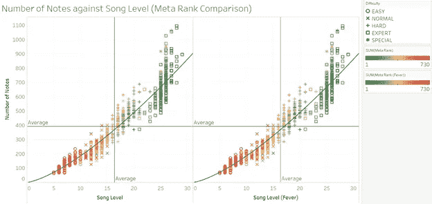

几乎相同，这不应该太令人惊讶，因为相同的歌曲被认为是。

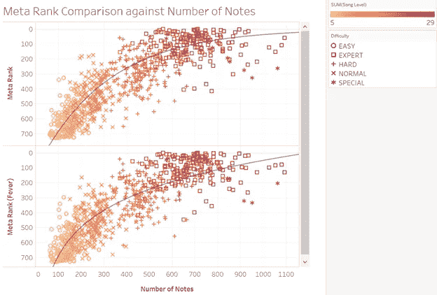

现在，这些图表应该是你的老朋友了…

这两个图已经在前面的部分中进行了深入的分析，但是我包括这一部分来演示这两种模式的歌曲元如何遵循相似的趋势。第一个图在形状上毫不奇怪地相同，因为考虑的是相同的歌曲，但是可以看到 meta rank 的颜色分布也遵循非常相似的趋势，大多数点的颜色没有任何显著差异。第二张图在 Tableau 中查看效果更好，因为您可以查看各个点的标签。然而，为了更好地了解发烧和不发烧之间的元排名变化，我制作了下一个图表。

*4.3 元等级(发烧与不发烧)*

重要的图表让你决定哪种模式最适合哪首歌！

从图表中可以看出，无论模式如何，大多数歌曲都有非常相似的排名，因为两种类型的元排名之间的关系是强线性的(R 平方值为 0.964545)。位于趋势线左侧的歌曲在发烧模式下比没有发烧模式下更有效，反之亦然。值得注意的是，两首歌曲尤其受益于发烧模式:秘密基地硬(#220 发烧，#335 不发烧)和 Goka！Gokai！？幽灵小偷！简单(#431 有发热，#594 无)。想要练习简单但相对高分的歌曲的初学者应该考虑这些歌曲作为开始。然而，随着你在游戏中的进步，你会想把重点放在顶级的元歌曲上，因为它们在两种模式下都有很高的分数，所以对农业积分来说是极好的！

**5。数据集的局限性**

1)尽管数据集反映的趋势反映了游戏中观察到的趋势，但数据集已经*非常*过时了。这个数据来自 2019 年，我上次检查全球服务器时，截至 2020 年 10 月，已经有 207 首歌曲。日本服务器在内容方面领先一年，所以他们有 283 首歌。这意味着我的数据集丢失了一百多首歌曲，以及至少 400 个单独的点，因为每首歌曲至少有 4 个困难。

2)因为过时，数据集实际上完全省略了一种歌曲类型:全长歌曲。游戏中一首歌的正常长度约为 2 分钟，但完整曲目往往至少有 4.5 分钟长，1000++音符是专家难度的标准。(专家完整版[火鸟](https://www.youtube.com/watch?v=EFUMovYn8BU)居然有 2331 个音符！)然而，由于它们的长度，这些完整歌曲的元排名真的很低。如果我有这些歌曲的数据，我高度怀疑我的歌曲元图会在图表的右下角有一个非常奇怪的点簇，偏离了趋势线。这些数据不包括一些限量发行的歌曲，这有点遗憾，因为我想看看[小鲨鱼](https://www.youtube.com/watch?v=u7voGzAzb-k)和[年猫](https://www.youtube.com/watch?v=pExVG4K6acg)与其他歌曲相比表现如何…

3)歌曲元排名并不真正承认不同的音符类型。一般来说，由于音符组合的原因，同一级别内的歌曲在难度上可能会有很大差异，极少数歌曲只需要轻敲。(比较[快乐合成器专家](https://www.youtube.com/watch?v=hJPIUueUAs8)和[从头到尾团结专家](https://www.youtube.com/watch?v=bafNF4-CBPo))

4)这里使用的得分效率值是就技能类型和水平而言的绝对最佳情况。数据集包括不太理想(即更正常)情况下的值，但我使用了最佳情况，因为这是元排名的基础。最后一张图比较了最坏情况、中等情况和最好情况。虽然这三种情况遵循非常相似的路线，但最差情况的结果分布更广(R 平方值略低，为 0.941095)。

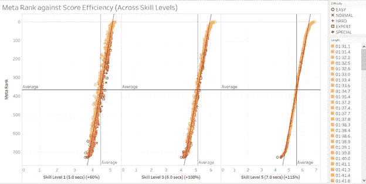

随着技能水平和类型的提高，分布越来越紧密。

5)与上一点相关，我用分数模拟器生成的假设场景在现实生活中很可能不会发生，除非这位令人惊叹的球员也有惊人的运气，获得了组成最佳球队所需的所有有限角色。

6)实际的得分机制实际上有一定程度的随机性，除非你所有的角色都有完全相同的得分能力(不经常发生)。即使是分数模拟器也承认这一点，实际分数通常会经历某种程度的变化。

**6。捆绑一切**

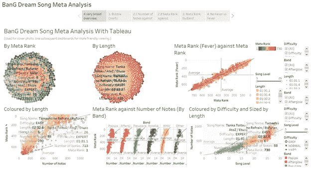

怪物仪表盘。别担心，我包括了更理智的版本。仪表板应该自动调整大小以适合您的屏幕。

同样，本文中的所有图表都可以在 [BanG Dream 上找到！(Bandori)宋元分析](https://public.tableau.com/profile/thian.jiawen#!/vizhome/BandoriSongMeta/BanGDreamSongMetaAnalysis)。您将能够找到原始数据集、单个图表、仪表盘和一个故事，该故事根据文章的流程带您浏览所有内容。如果你喜欢的话，就玩玩这些数据吧，我希望你能找到一些有趣的见解！记得这里有最新的歌曲元数据: [Bestdori 歌曲元数据](https://bestdori.com/info/songmeta)。

要回答本文第一部分中的问题，如果你在没有发烧模式的情况下玩，你应该从 A 到 Z 专家农场 Unite，如果你假设你能够完全组合这些歌曲，你应该跳专家！我们可以看到，如果你想最大限度地发挥你的乐队阵容的全部潜力，歌曲元是要走的路。但是，请记住，歌曲 meta 有自己的限制和假设，这将需要您调整推荐的策略，以适应您自己的风格。最终，宋元应该被当作一个向导，尽管是一个体面的向导。为了获得闪亮的新活动名称，你最终决定种植的歌曲实际上取决于许多其他因素，例如你自己的能力以及你是否愿意一遍又一遍地练习同一首歌曲。

如果你一直坚持到最后，非常感谢你！玩得开心，我希望这篇文章能帮助你得到你梦想中的活动卡！祝你好运！

谢谢你看完这个，我们来玩吧！图片来源: [bandori.party](https://bandori.party/asset/562/Garupa-PICO-Hello-Happy-World-Chibis/)