# 使用 Power BI 的班加罗尔餐馆分析

> 原文：<https://medium.com/analytics-vidhya/bangalore-restaurant-analysis-using-power-bi-fca11ad476d6?source=collection_archive---------3----------------------->

在本文中，我将解释一些有用的见解，这些见解是我通过使用 Power BI 建模和报告功能分析来自[Kaggle.com](https://www.kaggle.com/himanshupoddar/zomato-bangalore-restaurants)的数据集而收集到的。(此处 可以访问 [**的报告)。它将帮助任何开始使用 Power BI 的人了解我们如何快速清理和建模手头的一些数据，以获得快速的洞察力。**](https://app.powerbi.com/view?r=eyJrIjoiNWQwNzVjOWItMDQ4OS00NzIwLTgzZjgtZDgxZjM3MWM3NGMyIiwidCI6ImU1MTc1MzgxLWJlNzYtNGQxYy1iOGU4LTljOWU2ZDc1OTcyZSIsImMiOjh9)

数据集是 6 个月前的 Zomato 摘录。分析 Zomato 数据集的目的是为了更好地了解班加罗尔餐饮服务业的现状。我们还想确定影响不同地方不同类型餐厅的因素，受欢迎的美食和餐饮类型，班加卢鲁就是这样一个城市，拥有超过 12，000 家餐厅，供应来自世界各地的美食。

# 清理和转换数据

数据源是一个由 17 列数据集组成的 CSV 文件。在 Power BI Desktop 上，我们从 CSV 文件中单击“获取数据”,然后在查询编辑器中转换/清理数据。默认情况下，第一行被提升为标题，列类型被更改。

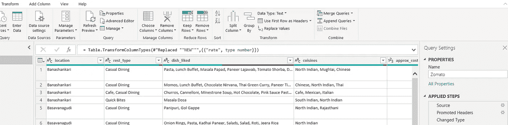

查询编辑器中最初应用的步骤

1.  我删除了以下各列，因为我不会将它们用作此分析的一部分:reviews_list、menu_item、listed_in(city)。

*注意:列“rest_type”和“listed_in(type)”可能看起来是多余的，但是仔细查看它们，我们会观察到值的差异。“rest_type”指的是餐厅类型，“listed_in(type)”指的是餐食类型。因此，我们保留这两列。*

2.我对“rate”列执行了多次替换值操作，以从所有值中删除“/5”，替换空白值，替换“-”以及替换“NEW”。然后，我将“rate”的数据类型转换为 decimal。

3.对于像“Café”这样名字的餐馆,“é”会被替换为特殊字符，如“\\”、“”。我对列“name”执行了多次替换操作来处理相同的问题。

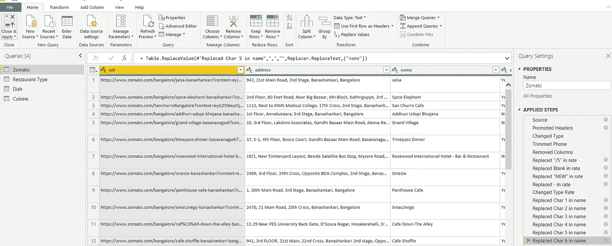

应用于清理数据的步骤

*注意:在超级查询语言“M”中有大量可用的函数，可以进一步探索这些函数，以便在单个步骤中连接字符的替换。*

# 分析和建模

## 观察

1.  数据集中大约有 51k 行。
2.  不同的地址有相同的餐厅名称(连锁餐厅)。
3.  同一地址适用于同一地点的多家餐厅。
4.  数据集中的每个条目已经处于位置级别，即每个餐馆名称和地址的单个位置，但是如果我们分析像“rest_type”、“dish_liked”和“cuisines”这样的列，它们在单个列中串联了多个条目。我们希望提取这些的单个值来执行分析，如顶级美食、菜肴或餐馆类型。
5.  “列出的地址(类型)”列中的名称-地址组合存在多个条目。

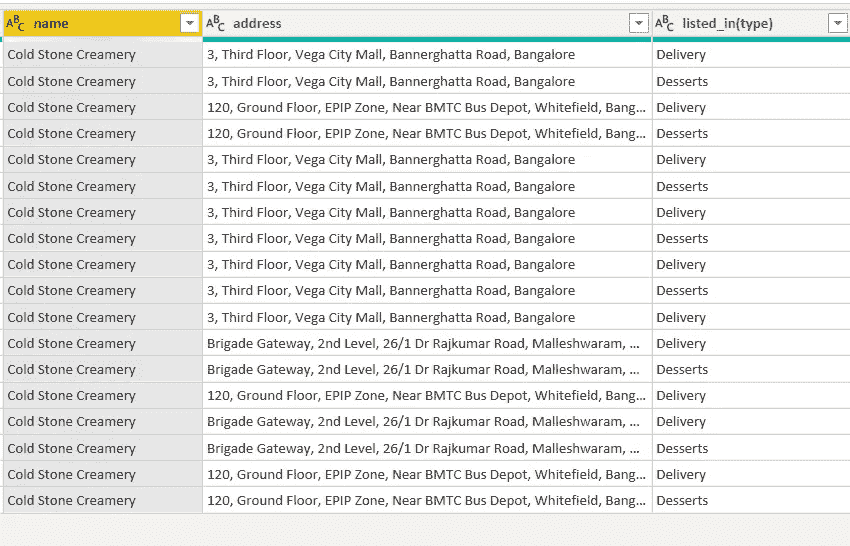

相同餐馆的多个条目，但列出的 _in(类型)不同

6.即使对于名称-地址组合的相同“listed_in(type)”值，我们也会注意到不同投票值或比率值的多行。我们还看到 phone 列中的值之间存在不一致，这与姓名-地址-列表(类型)的相同组合的数字之间的空格有关。

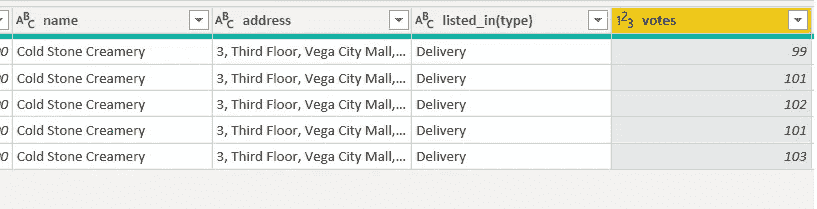

具有不同投票的相同名称-地址-列表 _in(类型)的多个条目

## 结论

***结论 1*** :从该查询中获取“名称”的总数来计算单个餐馆的数量或连锁餐馆的数量是不正确的。我们可以创建一个名为“餐馆地址”的新的自定义列，它是字段“名称”和“地址”的串联，用来唯一地标识一个位置上的餐馆。

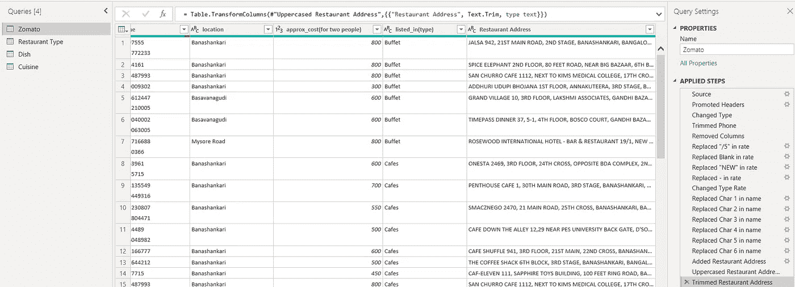

增加了自定义栏“餐厅地址”

*注意:我还添加了将自定义列“餐馆地址”转换为大写并进行修剪的步骤，因为我注意到相同地址的字母大小写和间距不一致。*

***结论 2*** :我们需要从 rest_type、cuisines 和 disease _ liked 列中提取唯一的值，并通过类似的“餐馆地址”列将它们实现为与餐馆相关的单独查询。因此，我们也可以从查询“Zomato”中排除这些列。请参考下面的“餐厅类型”表。

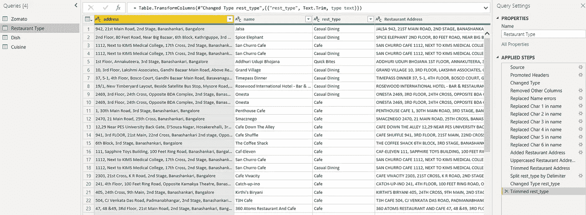

实现查询"餐厅类型"的步骤

实施:

1.  首先为餐馆类型创建一个单独的查询，首先，复制当前查询“Zomato ”,并将其重命名为餐馆类型。
2.  将“删除其他列”步骤更改为仅保留“地址”、“姓名”、“休息类型”。删除清除 rate 列的所有步骤，因为我们不会为该查询保留它。
3.  保留添加自定义列“餐馆地址”的步骤。
4.  其他步骤—右键单击 rest_type 列，然后单击“按分隔符拆分列”。通过选择逗号作为分隔符进行如下选择，并将数据拆分成行。

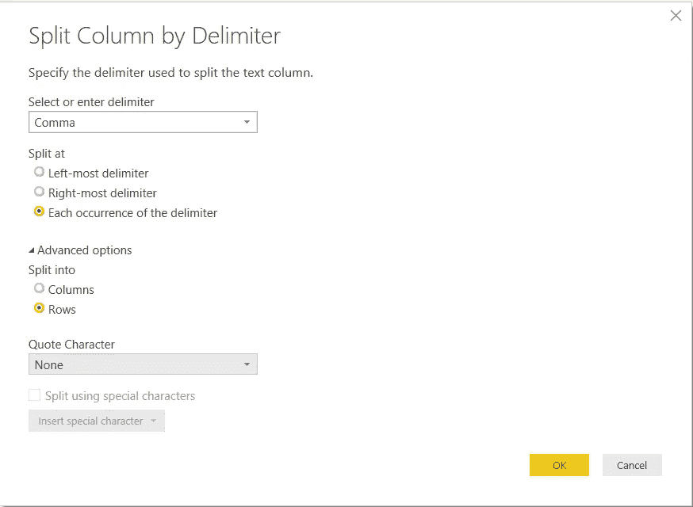

拆分列设置来拆分列 rest_type

5.再次右键单击“rest_type”来变换和修剪列。最终的表格应该和上面截图中显示的一样。

我们可以用类似的方式实现菜肴和烹饪查询。

***结论 3*** :在“Zomato”查询中，我们可以在所有其他列级别聚合“投票”、“费率”、“电话”和“2 的费用”的数据，以得到一个聚合的数据集。为此，我们右键单击一列并选择“Group”来执行以下操作，并将其命名为“Aggregate Rows”:

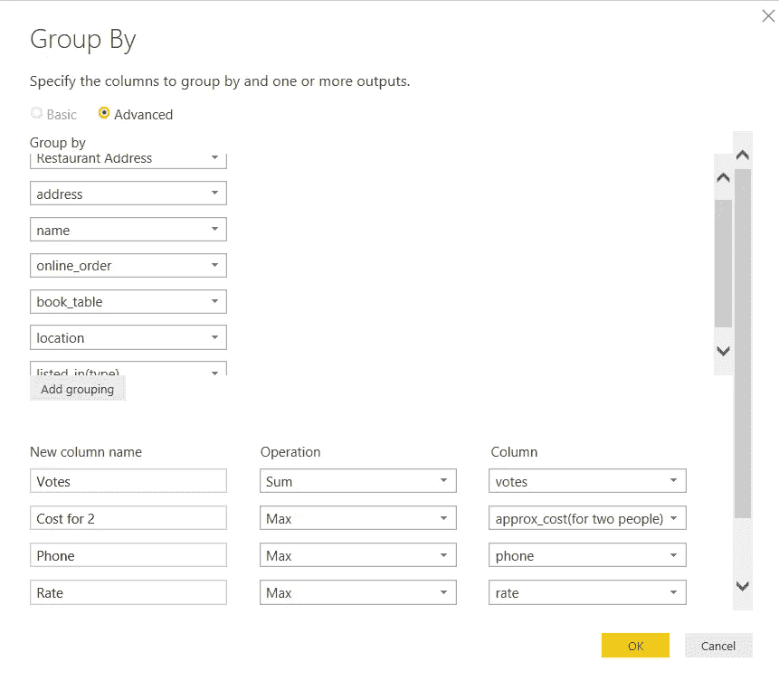

基于投票、两人费用、价格和电话来聚合 Zomato 表的分组设置

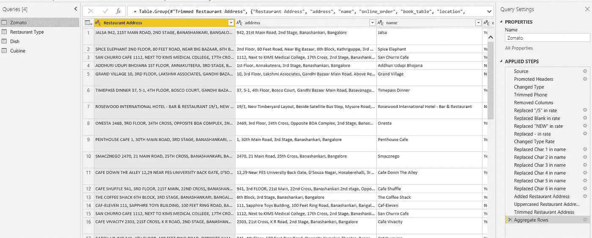

应用于查询 Zomato 的聚合步骤

使用我们的自定义列餐馆地址将建立多对多关系，如下所示，这是最终表的外观。

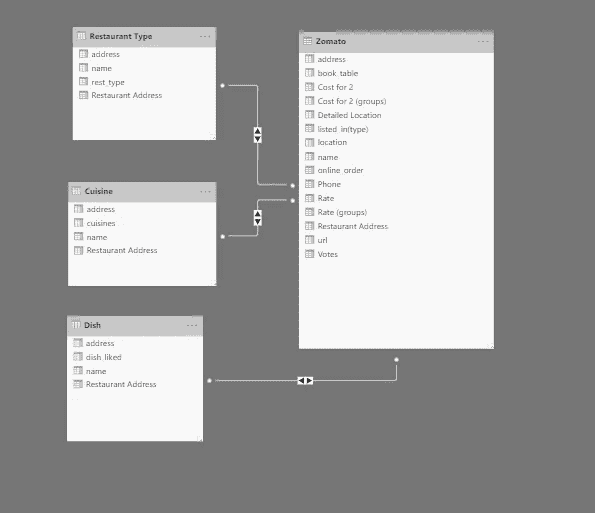

数据模型

报告(您可以在此 访问报告 [**)**](https://app.powerbi.com/view?r=eyJrIjoiNWQwNzVjOWItMDQ4OS00NzIwLTgzZjgtZDgxZjM3MWM3NGMyIiwidCI6ImU1MTc1MzgxLWJlNzYtNGQxYy1iOGU4LTljOWU2ZDc1OTcyZSIsImMiOjh9)

既然数据已经清理完毕，可以进行报告了，我就可以讨论我在本次活动中收集的报告和可视化结果了。

我将我的报告分成以下几部分:

1.  对数据集中更高层次见解的概述。
2.  一些分析性的见解。
3.  帮助用户根据他们的输入选择餐馆的报告。

**导言**:第一份报告作为起点。有一个简短的介绍，报告了几个基本数字。它为您提供了导航至概览、分析或搜索报告的选项。(用于导航目的的书签的标准用法)

报告 1 —简介

***概述*** :概述中有 2 个报告。

*第一份概览报告的快速洞察-*

*   CCD，Just Bake，Domino's，Five Star Chicken & Pizza Hut 都是拥有最多餐厅的连锁餐厅。
*   最受欢迎的菜肴是北印度菜，其次是中国菜和南印度菜。
*   很大一部分餐馆提供网上点餐，但很少有餐馆提供餐桌预订。
*   最大数量的餐馆(44.7 %)属于送餐类型。
*   班加罗尔市中心的餐馆数量密集。

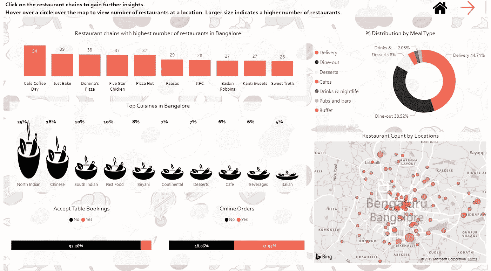

报告 2 —概述

报告上的所有可视化都是交互式的，可以用来过滤其他内容并获得具体的见解！

*第二份概览报告的快速洞察-*

*   鸡肉、汉堡、巧克力和披萨是餐式咖啡馆最受欢迎的菜肴
*   拉维尔路、Koramangala 第三街区、圣马可路、桑基路和教堂街的餐厅平均得分最高。
*   通过从可用的切片器中选择一种膳食类型，可以过滤掉这两种可视化效果。

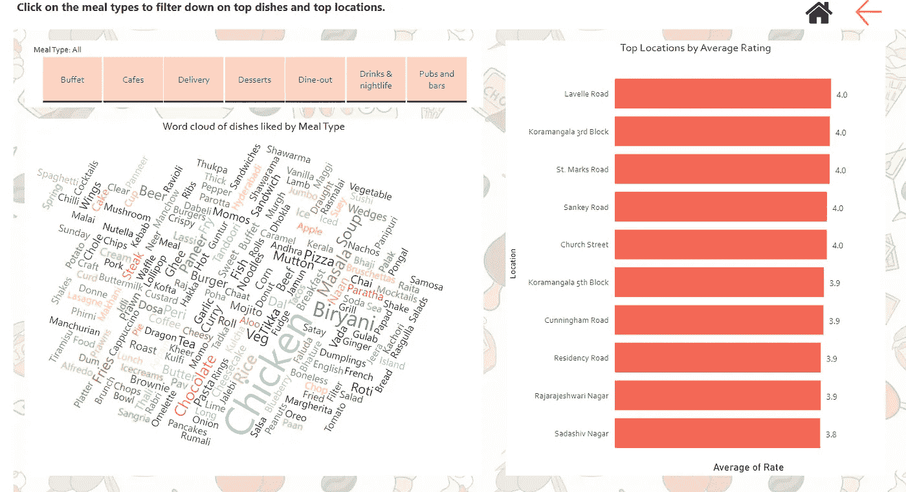

报告 3 —概述

通过从可用的切片器中选择一种膳食类型，可以过滤掉这两种可视化效果。

***分析*** :有 1 份报告可作为分析的一部分。

*快速洞察分析报告*

*   大多数餐厅提供 1000 卢比以下的双人食物！
*   大多数餐厅都属于 3-4 级！
*   即使不提供餐桌预订，餐馆也能保持较高的收视率。

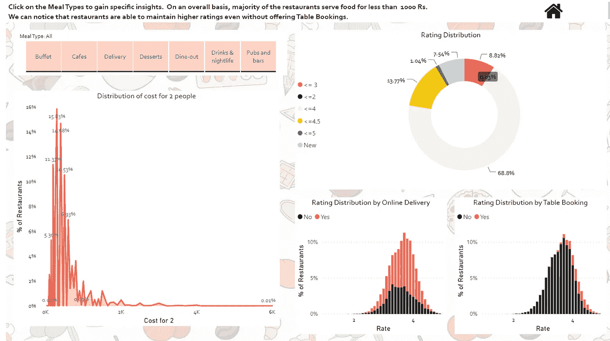

报告 4 —分析

报告上的所有可视化都是交互式的，可以用来过滤其他内容并获得具体的见解！可以通过从可用的切片器中选择膳食类型来过滤可视化。

***搜索*** :该报告根据用户输入的位置、菜系和食物类型，列出餐馆以及一些有用的信息。结果可以根据预订桌位的可用性、在线订单和价格范围进一步筛选。可以基于评级(最高评级在前)和成本(最低成本 2 在前)对餐馆进行排序。

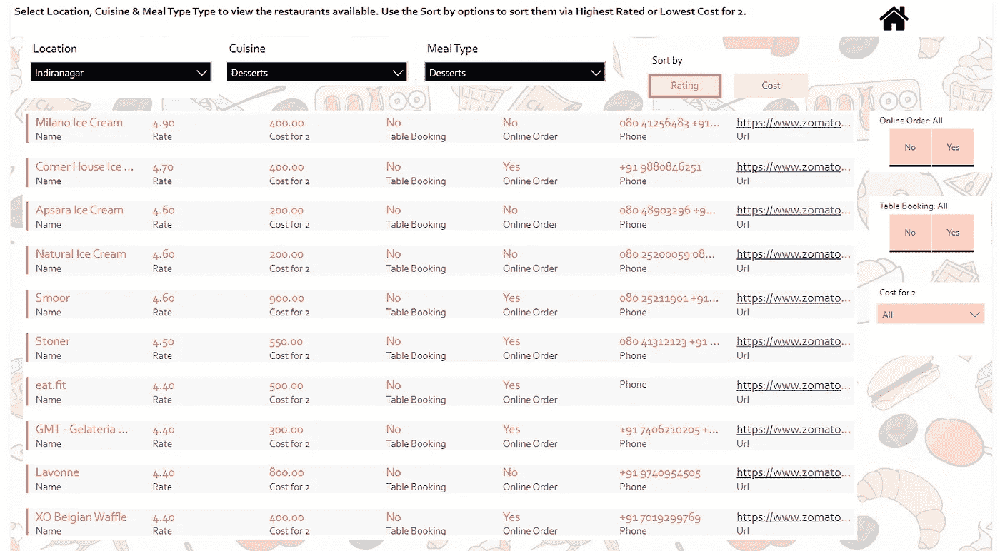

报告 5 —搜索

仍然有很大的空间从这个数据集中获得进一步的见解，但我希望这是一个有用的起点。欢迎任何反馈:)！

报告的链接是[这里的](https://app.powerbi.com/view?r=eyJrIjoiNWQwNzVjOWItMDQ4OS00NzIwLTgzZjgtZDgxZjM3MWM3NGMyIiwidCI6ImU1MTc1MzgxLWJlNzYtNGQxYy1iOGU4LTljOWU2ZDc1OTcyZSIsImMiOjh9)****。****