# 孟加拉文字识别系统—深度学习方式(1/n)

> 原文：<https://medium.com/analytics-vidhya/bangla-character-recognition-system-the-deep-learning-way-1-n-8671a33a7860?source=collection_archive---------6----------------------->

## 用于手写孟加拉文字识别的卷积神经网络。

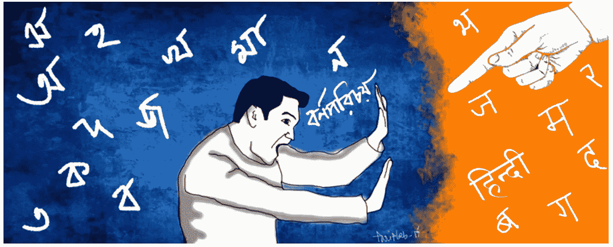

নমস্কার !！(孟加拉语你好)，这是 [Christina](https://medium.com/u/45dbeb02fb04?source=post_page-----8671a33a7860--------------------------------) (ক্রিস্টিনা)和 [Sayan](https://medium.com/u/9e9e4910bc48?source=post_page-----8671a33a7860--------------------------------) (সায়ন)，布朗大学数据科学倡议的研究生。作为《数据 2040——数据科学中的深度学习和高级主题》课程的一部分，我们正在进行 Kaggle 竞赛: [*孟加拉语。AI 手写字形分类*](https://www.kaggle.com/c/bengaliai-cv19/) *。*

孟加拉语(孟加拉语的同义词)是五大口语语言之一，拥有超过数亿的使用者。它是孟加拉国的官方语言，也是印度第二大通用语言(仅次于印地语)。这种语言总共有 40 个辅音和 10 个元音。然而，可以有连接词，它们是通过连接一对辅音/元音(统称为字素根)形成的。通过将字素词根与另一个元音或辅音重音(与发音符号同义)组合，可以实现另一个元音和/或辅音形式的进一步添加。总来说，这形成了一个字形。

> ***字形=字形根+元音变音+辅音变音。***

这种复杂性导致大约 13，000 种不同的字形变化(相比之下，英语中大约有 250 种)。其中，只有大约 1000 个出现在训练集中。因此，在没有明确设置识别规则(在软件 1.0 的意义上)或获得所有 10k+字素的手写样本的情况下，集中于破译孟加拉语手写的组件对于组装孟加拉语 OCR 系统是重要的。

这是我们两个第一次尝试 kaggle 比赛或设计神经网络，所以请原谅我们在设置或执行中的任何错误。不管你在机器学习/深度学习领域的专业知识/兴趣如何，请随时加入我们在沟壑和平原(损失函数:P)中的冒险，我们滑着爬着到达顶峰(我的意思是度量:P)。哦，是的，非常欢迎你的评论，请帮助我们取得更好的成绩(关于课程和比赛)。

在这里，我们将在一系列文章中介绍:问题陈述、带有探索性数据分析的数据集描述、图像处理管道、神经网络架构和结果，这是其中的第一篇。

让我们开始吧…

# 探索性数据分析

正如我们所知，我们在这个问题中有 3 个目标要预测(每个目标有几个不同的子类，如下所示):

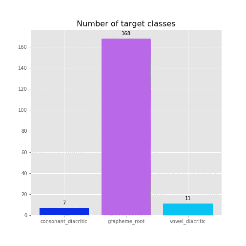

主要目标:

*   字形根:168 个亚型(如দ্ব，ন，ল্ড，ক্ল，…)
*   元音变音符号:11 种亚型(如◌া，ি◌，◌ী，◌ু，◌ূ，◌ৃ，◌া，◌ৗ)
*   辅音音调符号:7 个子类型(Null，◌্য (য-ফলা)，◌্র (র-ফলা)，র্ ( রফ)，◌ঁ，◌র্্য(张贵文-张贵文)，张贵文(张贵文-张贵文)

## 字形根分布

由于 167 个唯一的字素根的可能类别标签的数量很大，我们选择基于来自特定字素根出现的数据集中的图像总数来绘制前 10 个和后 10 个字素根。

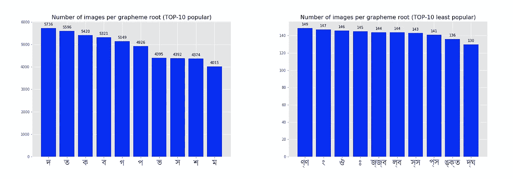

这是总体分布图。

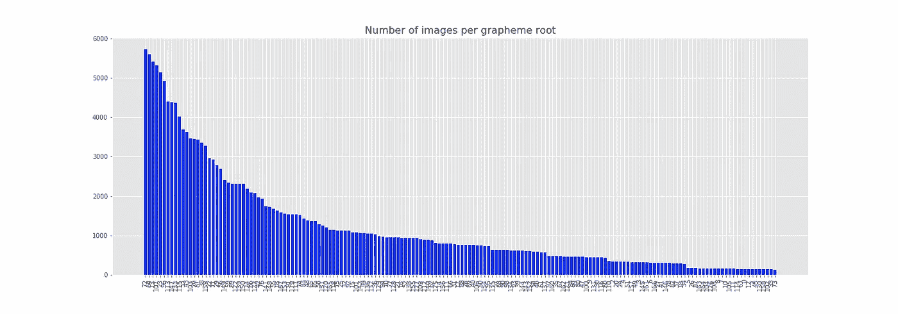

从视觉上看，前 10 个常见的字素词根是:

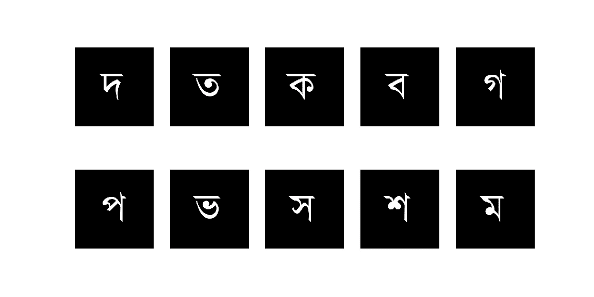

而底部 10 个(或最不流行的)字素根是:

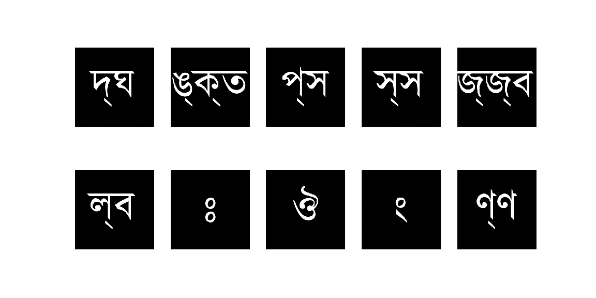

## 元音音调符号

同样，在元音的情况下(*图片在*下面)

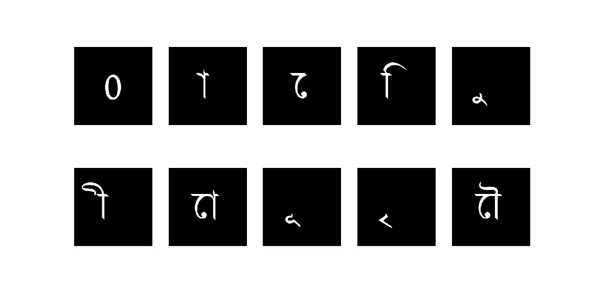

分布仍然很不均匀。

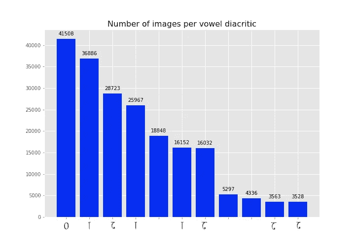

抱歉的字体:(但是，你可以按照上面照片的顺序

## 辅音发音符号

这些角色，

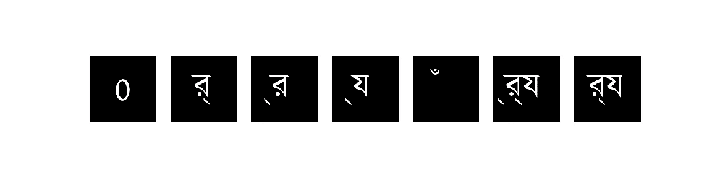

分布，

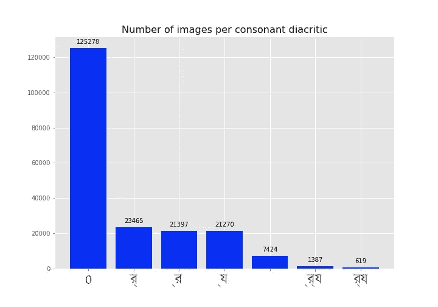

再次，字体都乱了

元音和辅音的分布表明，大多数字素是完整的，没有使用任何附加符号。特别是实际上辅音发音符号似乎很少(比元音)。这很直观，因为，根据定义，一个字素很可能是两个辅音的连词，因此很少需要第三个辅音。另一方面，元音更可能与一个辅音(或两个辅音的组合)相关联。

不同目标和子类不平衡背后的另一个主要原因可能是孟加拉语词汇的本质。某些字素词根比某些深奥的词根使用得多是很自然的，而有些词(由字素构成)实际上从来没有在口语中使用过，有些只能在古代文本中找到或由亲语作者使用。

总的来说，这没什么好奇怪的，然而，现在我们不确定这会如何影响训练，或者这种不平衡是否值得担心。我们走着瞧。

# 图像预处理

这是数据集中的一个样本图像。

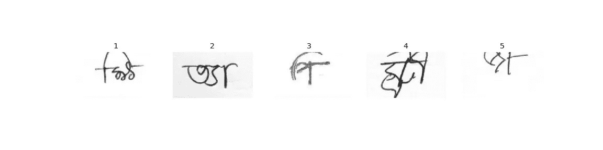

正如我们所看到的，手写原始图像有几个问题:

*   图像的不透明度不均匀。有些较亮(1 和 3)，有些较暗(4)。某些图像是从不同的照明条件下扫描的，因此有一个梯度的灰色噪声流过(2)，而一些图像在页面之外(5)。
*   最常见的区别是与画布相比，字形偏离中心。
*   这是来自扫描的光学噪音。

为了在将图像发送到训练之前直接缓解这些问题，我们使用`OpenCV-python` ⁴去噪- >灰度- >阈值- >寻找文本轮廓- >将轮廓图像调整为 64x64 的正方形。

1.  移除 Noise⁵:
    这里我们使用非局部均值去噪，它使用来自整个图像的数据，而不是高斯/中值技术，后者着眼于靠近感兴趣像素的区域来移除噪声。
2.  Grayscaling⁶:
    由于以. png 格式保存图像会从原始灰度图像中引入虚假通道(相同数据的 3 个副本)，我们将其转换回原始灰度。
3.  Thresholding⁷:
    在这种方法中，低于某个临界值的所有像素值都被降低到 0，而高于该临界值的所有值都被设置为 255。为了选择临界值，我们使用 Otsu 的二值化方法，其中基于图像的直方图选择每个图像的阈值(假设双峰分布)。
4.  轮廓和 reshaping⁸:
    一旦完成，我们使用轮廓(基本上是黑色文本周围的区域)，在主要笔迹周围放置一个边界框，裁剪掉图片的其余部分，然后重新缩放为 64x64 的正方形。

示例代码片段:

```
def resize_threshold(image,resize_size=64):      image_denoise = cv2.fastNlMeansDenoisingColored(image, None, 10, 10, 7, 15)
     #grayscale operation
     image_bw = cv2.cvtColor(image_denoise, cv2.COLOR_BGR2GRAY)

     #Thresholding
     ret, image = cv2.threshold(image_bw, 127, 255, cv2.THRESH_BINARY_INV + cv2.THRESH_OTSU)

     # Find Countours
     contours, _ = cv2.findContours(image,cv2.RETR_TREE,cv2.CHAIN_APPROX_NONE)[-2:] 

    ### Some boiler plate code
    resized_image = cv2.resize(image, (resize_size, resize_size),interpolation=cv2.INTER_AREA) return resized_image
```

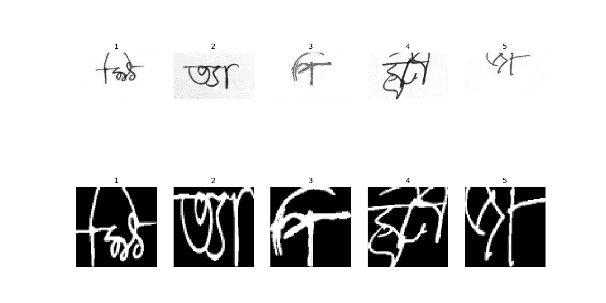

之前和之后

上面你可以看到预处理前后的图像样本。

# 接下来…

到目前为止，我们已经为训练准备好了图像。在接下来的几篇文章中，我们将在未来的深度学习管道中完成以下步骤。

1.  数据扩充:
    一封信仍然是一封有点模糊的信，即使它被旋转(而不是翻转 BTW)也是一样的，即使它写得一塌糊涂也是一样的(很像 ta 给一份写得很差的作业打分的磨难)。
    我们计划使用 python 中的 Albumentation⁹包向训练图像随机添加扭曲，同时保持相同的目标标签。我们希望这能改善学习过程。
2.  神经网络架构:
    不用说，我们计划采用卷积神经网络架构。到目前为止，这是纳塔尔建筑的简要蓝图。这本身就是一个实至名归的岗位。

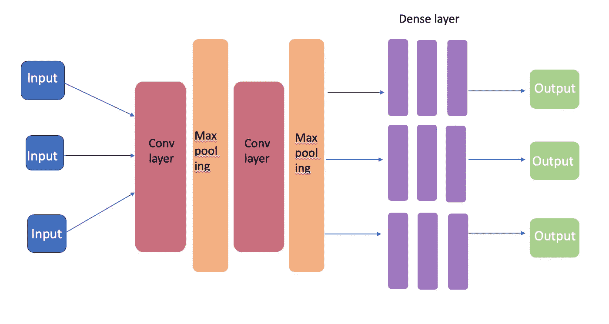

下次见…敬请期待…

**项目的所有代码都可以在这个**[**github**](https://github.com/reach2sayan/Bengali-Grapheme_DATA2040)**资源库中找到。**

向所有上传笔记本的了不起的人大声呼喊。你们给我们指引了正确的方向。

# 参考

1.  [https://cs.brown.edu/courses/info/data2040/](https://cs.brown.edu/courses/info/data2040/)
2.  [https://en.wikipedia.org/wiki/Bengali_language](https://en.wikipedia.org/wiki/Bengali_language)
3.  [https://en.wikipedia.org/wiki/Bangladesh](https://en.wikipedia.org/wiki/Bangladesh)
4.  【https://opencv.org/】
5.  [https://opencv-python-tutro als . readthedocs . io/en/latest/py _ tutorials/py _ photo/py _ non _ local _ means/py _ non _ local _ means . html](https://opencv-python-tutroals.readthedocs.io/en/latest/py_tutorials/py_photo/py_non_local_means/py_non_local_means.html)
6.  [https://opencv-python-tutro als . readthe docs . io/en/latest/py _ tutorials/py _ img proc/py _ color spaces/py _ color spaces . html](https://opencv-python-tutroals.readthedocs.io/en/latest/py_tutorials/py_imgproc/py_colorspaces/py_colorspaces.html)
7.  [https://opencv-python-tutro als . readthedocs . io/en/latest/py _ tutorials/py _ img proc/py _ thresholding/py _ thresholding . html？高亮=阈值](https://opencv-python-tutroals.readthedocs.io/en/latest/py_tutorials/py_imgproc/py_thresholding/py_thresholding.html?highlight=thresholding)
8.  [https://docs . opencv . org/trunk/D4/d73/tutorial _ py _ contours _ begin . html](https://docs.opencv.org/trunk/d4/d73/tutorial_py_contours_begin.html)
9.  [https://github.com/albumentations-team/albumentations](https://github.com/albumentations-team/albumentations)