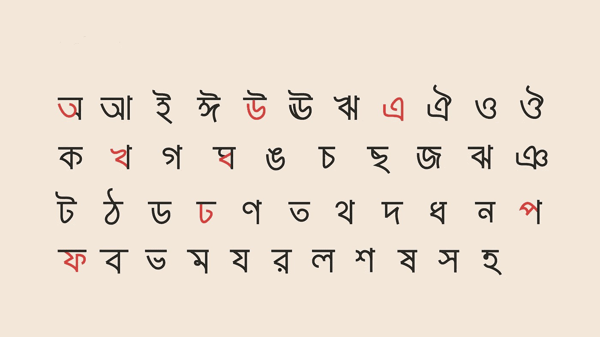
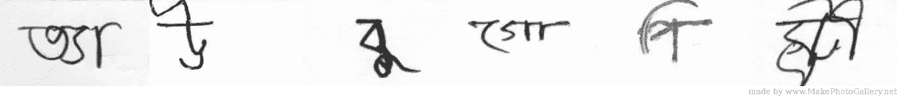
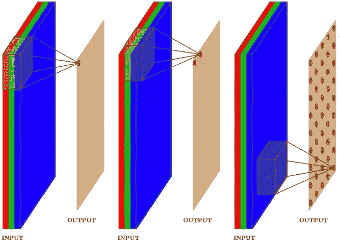
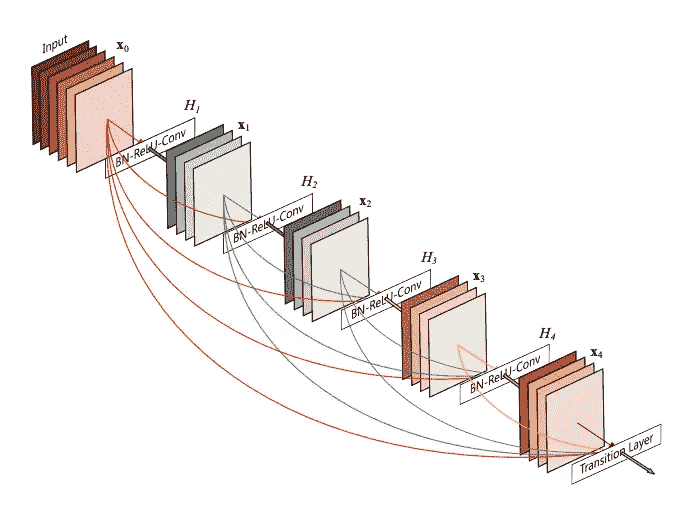
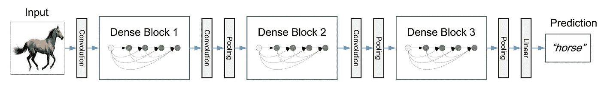
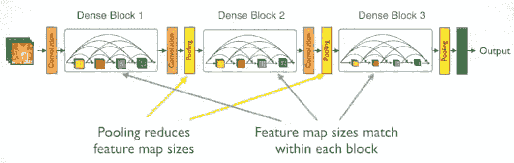
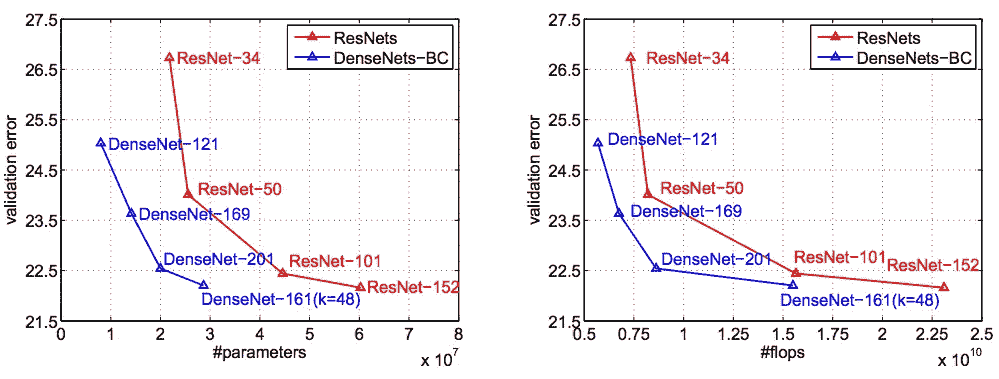
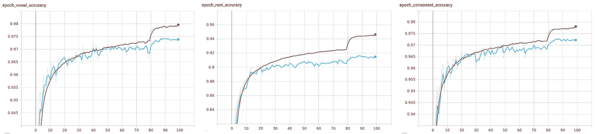
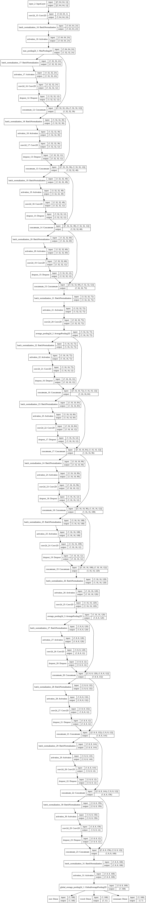

# 孟加拉文字识别系统—深度学习方式(2/n)

> 原文：<https://medium.com/analytics-vidhya/bangla-character-recognition-system-the-deep-learning-way-2-n-d5b16333d77b?source=collection_archive---------24----------------------->

## 用于手写孟加拉文字识别的卷积神经网络。

欢迎回来，这篇文章是我和 Christina 正在做的系列文章的第二部分，是我们在布朗大学数据科学倡议 MS 项目的课程项目的一部分。在第一篇文章中，我们讨论了数据集、不同类别以及不同目标的分布。

在本文中，我们将讨论我们在项目中使用的神经网络架构。但是在我们深入讨论之前，先简单回顾一下我们上节课结束的地方。

我们试图将孟加拉语手写字母分为 3 个目标——字素词根、元音发音符号和辅音发音符号。总共有 168 个不同的词根子类型、11 个元音音调符号子类型和 7 个辅音词根子类型。值得注意的是，在训练数据中，每种类型的表示都有很大的不平衡，特别是在字形根类中。训练数据由大小为 137x236 的手写字母的扫描图像组成，但其中大部分是空白。因此，我们对图像进行了裁剪、阈值处理和去噪，使其尺寸为 64x64，字母位于中心。现在有了用于训练的数据，让我们来看看架构。

处理前的样本图像

处理后的样本图像

# 什么是卷积神经网络(CNN)

我们假设你知道神经网络的基本概念是什么。有无数关于它们的营销描述，但是从数学的角度来看，这不是通过一系列仿射变换将输入向量映射到期望输出向量的一步一步的过程。该算法通过将已知的输入和输出传递给网络，然后要求计算机最小化某个函数(在 ML 术语中称为损失函数)，以计算出哪些映射在减少实际输出和预测输出之间的误差方面做得很好，从而决定这些算法是什么(没有人类交互，因此有“机器”学习一词)。我们以迭代的方式做了很长时间，我们得到了(希望如此！)我们的概化模型。在我们的例子中，输入向量是 4096 维向量，因为每个图像是 64x64 像素，每个像素的值是 0 或 1，这取决于它是白色像素还是黑色像素。在输出端，我们有 3 个维度 168、11 和 7，分别用于字素根、元音发音符号和辅音发音符号。

然而，虽然更普通的神经网络(也称为全连接(FC)网络)具有从每个输入到每个输出向量分量的连接，但特定的结构倾向于将每个图像作为一个整体来进行决策。这怎么会是个坏主意呢？好吧，让你自己确认一下，当你看一张猫的图片时，在我们判断它是不是一只猫时，猫相对于图片其他部分的位置并不重要。同样，用整体图像做决策听起来像是一种矫枉过正(并且在计算上无法实现)的做法。

> 当你看一张猫的图片时，在我们判断它是不是猫时，猫相对于图片其他部分的位置并不重要。

CNN 架构的一个例子

CNN 是 NN 的变体，其中我们试图保持我们的目标(猫/狗/元音/辅音)的前述空间不变性。受人类视觉皮层的启发，我们在图像上滑动一系列过滤器，每个过滤器从图像中提取特定的特征，而不依赖于该特征在整个图像中的绝对位置。更具体地说，想象这些过滤器中一个，选择长的水平笔划，而一些选择垂直笔划。我们也可以将这些过滤器堆叠起来，也就是说，我们只需选取大致的笔画，然后将其传递给后续的过滤器，这些过滤器会对这些笔画进行分类，是水平的还是垂直的。克里斯·奥拉有一篇精彩的文章，他对 CNN 做了更详细的解释。

# 联系紧密的 CNN 或者只是 DenseNet⁴ …

不幸的是，由于分类工作的复杂性，一个普通的 CNN 有时也不符合要求。回到笔画的例子，仅仅将它们分离出来没有多大帮助，因为一个独特的字母是许多不同形状的笔画的组合。缓解这一问题的一种方法是使每个过滤器具有识别笔画的能力，同时使其在进行处理时能够识别在先前层接收到的所有输入。这是一个可能的图像。

[真正密集的网络架构](/the-advantages-of-densenet/the-advantages-of-densenet-98de3019cdac)

如您所见，红线是前一层的连接，每个后续层都知道其前一层的输入。

由于内存和计算能力的硬件限制(我们将在后面看到，由于涉及的参数数量太多，这些需要大量内存)，我们无法在合理的时间框架内实现这一点，即使有谷歌或脸书的 GPU 和计算时间的装备，更不用说研究生的 PC 了。

在 2016 年年中， [Gao 和他的同事](https://arxiv.org/abs/1608.06993)提出了一种架构，在这种架构中，连接不是连接整个网络，而是在层块中完成(统称为密集块)，这些层通过单个卷积层和池化 layer⁵相互连接(原因将在下面解释)。最后，我们将卷积层的输出连接到密集输出层，后者现在只需根据卷积层的响应来推断输出。

来自[原创论文](https://arxiv.org/abs/1608.06993)的密集区块概念

## DenseNet 螺母和螺栓

单个致密层可以分成两个块:

*   卷积块:这是 DenseNet 的工作马。
    它的主要参数是一个增长率，它决定了每个卷积层中滤波器的数量。它被称为增长率，因为当我们连接输入时，每一层的输入都比增长率乘以前面层的数量要大。
*   过渡块:一旦我们处于密集块的输出，在它进入下一层之前，我们将它通过另一个卷积和池层。之所以这样做，是因为如果您注意到每个密集层的输出与原始输入具有相同的大小，但由于我们必须对下一个输入进行下采样，这是 CNN 架构的标准，因此我们将其通过(1x1)卷积层，然后进行平均合并，以实现所需的维度。

DenseNet 结构传播 out⁶

## 有用吗？

DenseNet 因其可与 ResNet 或 InceptionNet 等更复杂的架构相媲美的结果而备受瞩目，同时减少了参数数量，从而大幅缩短了训练时间。它还具有与 fancier 架构相似的优点，例如减轻消失/爆炸梯度问题，以及加强特征传播和重用。下面是与 ResNet 的对比。

ResNets 和 dense nets-BC(dense nets 的变体)的准确性比较

观察在相同精度水平下，参数#和触发器#比 ResNet 低 2–3 倍。

它的缺点是在训练时需要大量的内存，因为它必须跟踪密集块中的所有先前输入。

# 我们的密集网络

## 体系结构

回到手头的项目，这是我们的 DenseNet 版本(亲切地称为 SayanNet v4 :P)

> [https://ibb.co/HGtkwWs](https://ibb.co/HGtkwWs)(也显示在最后。它是巨大的。)

然而，基本结构如下:

*   输入图层-以 64x64x1 的格式输入图像(因为所有图像都是灰度图像)
*   (可选)增强层。
*   3 个密集块——每个块有 4 个卷积层，每个卷积层有 12 个滤波器。随后是平均池层(2x2，步长为 2x2)的过渡块，用于对输出尺寸进行下采样。
*   全局平均池图层-将最终卷积图层输出转换为单个矢量
*   3 个输出密集图层-针对每个目标。
*   卷积层之间的若干 Dropout⁷和批量归一化，以减少过拟合并确保信号强度。

我们总共有:
总参数:173730
可训练参数:170802
不可训练参数:2928

## 其他超参数

优化器—我们使用 Adam⁸优化器，初始学习率为 0.01

损失函数-由于每个值都是一个标注(没有数值意义)，我们使用稀疏分类 Cross-Entropy⁹作为所有输出的损失函数。

指标——虽然竞赛网页采用加权召回指标，但我们使用准确度⁰作为我们的训练指标

学习率—我们使用可变学习率，在所有 3 个输出损失上使用 TensorFlow 的本地回调“ReduceLROnPlateau”功能。我们从 0.01 的学习率开始，每次损失达到 0.0001 的最小值时，学习率降低 0.2 倍。

## 初步结果

正如之前和上一篇文章中提到的，由于我们的训练数据是不平衡的，我们使用 scikit-learning 的“train_test_split”函数对整个数据集进行类分层拆分，90%用于训练，10%用于验证。

我们用 32 的批量训练了总共 100 个时期的模型。

从左到右:元音准确性、词根准确性、辅音准确性(红色表示训练，蓝色表示验证)

## 下一步是什么…

由于我们仅使用具有任意参数的基础模型就取得了成功，下一步是调整模型的超参数，以获得更好的结果。另一件要研究的事情是在输出之前添加几个密集层后精度的变化。

在训练期间观察图像增强的效果以进一步减少过拟合和提高准确度也是有趣的。

在下一篇文章中，我们将详细讨论调整后的网络的结果，并尝试理解每一层/每一块是如何提取图像特征以达到最终结果的。

**项目的所有代码都可以在这个** [**github**](https://github.com/reach2sayan/Bengali-Grapheme_DATA2040) **资源库中找到。**

# 参考

1.  [https://news . MIT . edu/2017/explained-neural-networks-deep-learning-0414](https://news.mit.edu/2017/explained-neural-networks-deep-learning-0414)
2.  [https://towards data science . com/under-the-hood-of-neural-networks-part-1-fully-connected-5223 b7f 78528](https://towardsdatascience.com/under-the-hood-of-neural-networks-part-1-fully-connected-5223b7f78528)
3.  [https://towards data science . com/understanding-convolution-neural-networks-the-Eli 5-way-785330 cd1fb 7](https://towardsdatascience.com/understanding-convolution-neural-networks-the-eli5-way-785330cd1fb7)
4.  【https://towardsdatascience.com/densenet-2810936aeebb 
5.  [https://machine learning mastery . com/pooling-layers-for-convolutionary-neural-networks/](https://machinelearningmastery.com/pooling-layers-for-convolutional-neural-networks/)
6.  [https://towards data science . com/review-dense net-image-class ification-b 6631 A8 ef 803](https://towardsdatascience.com/review-densenet-image-classification-b6631a8ef803)
7.  [https://medium . com/@ amarbudhiraja/https-medium-com-amarbudhiraja-learning-less-to-learn-better-dropout-in-deep-machine-learning-74334 da 4 bfc 5](/@amarbudhiraja/https-medium-com-amarbudhiraja-learning-less-to-learn-better-dropout-in-deep-machine-learning-74334da4bfc5)
8.  [https://www . tensor flow . org/API _ docs/python/TF/keras/optimizer/Adam](https://www.tensorflow.org/api_docs/python/tf/keras/optimizers/Adam)
9.  [https://www . tensor flow . org/API _ docs/python/TF/keras/loss/spassecategoricalcrossentropy](https://www.tensorflow.org/api_docs/python/tf/keras/losses/SparseCategoricalCrossentropy)
10.  [https://www . tensor flow . org/API _ docs/python/TF/keras/metrics/Accuracy](https://www.tensorflow.org/api_docs/python/tf/keras/metrics/Accuracy)
11.  [https://www . tensor flow . org/API _ docs/python/TF/keras/callbacks/ReduceLROnPlateau](https://www.tensorflow.org/api_docs/python/tf/keras/callbacks/ReduceLROnPlateau)
12.  [https://sci kit-learn . org/stable/modules/generated/sk learn . model _ selection . train _ test _ split . html](https://scikit-learn.org/stable/modules/generated/sklearn.model_selection.train_test_split.html)

这是完整的模型。

