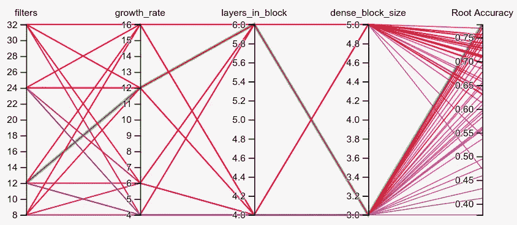
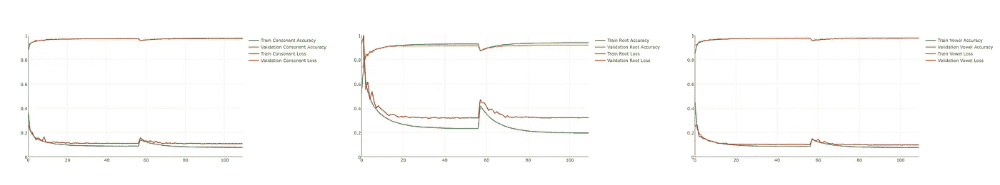
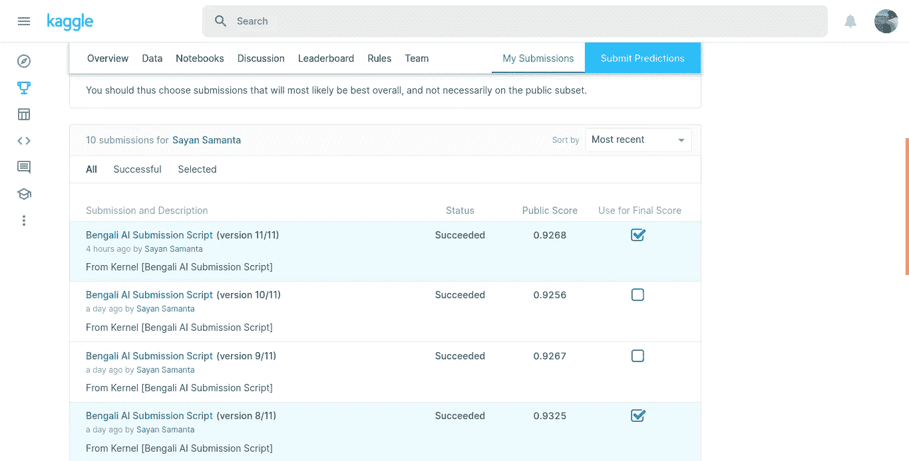
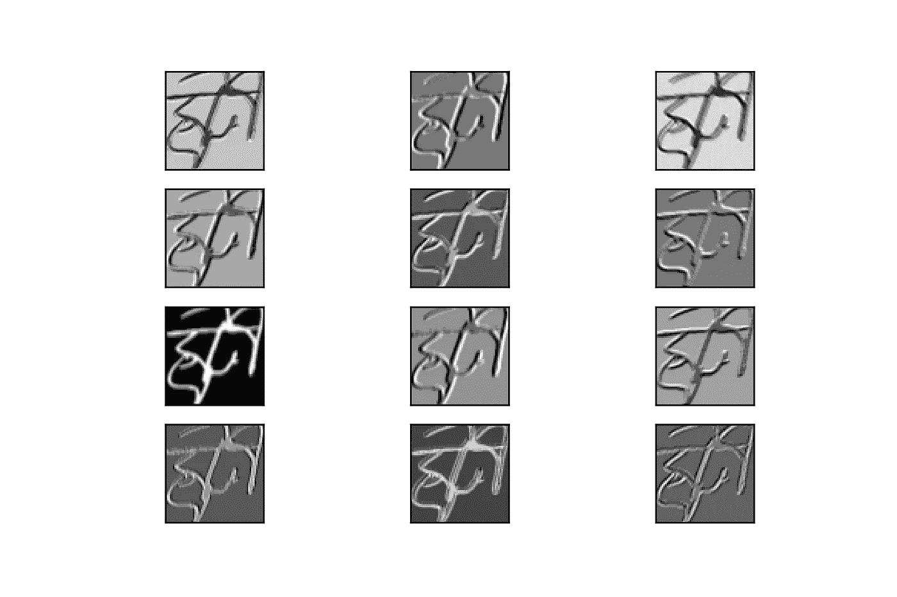
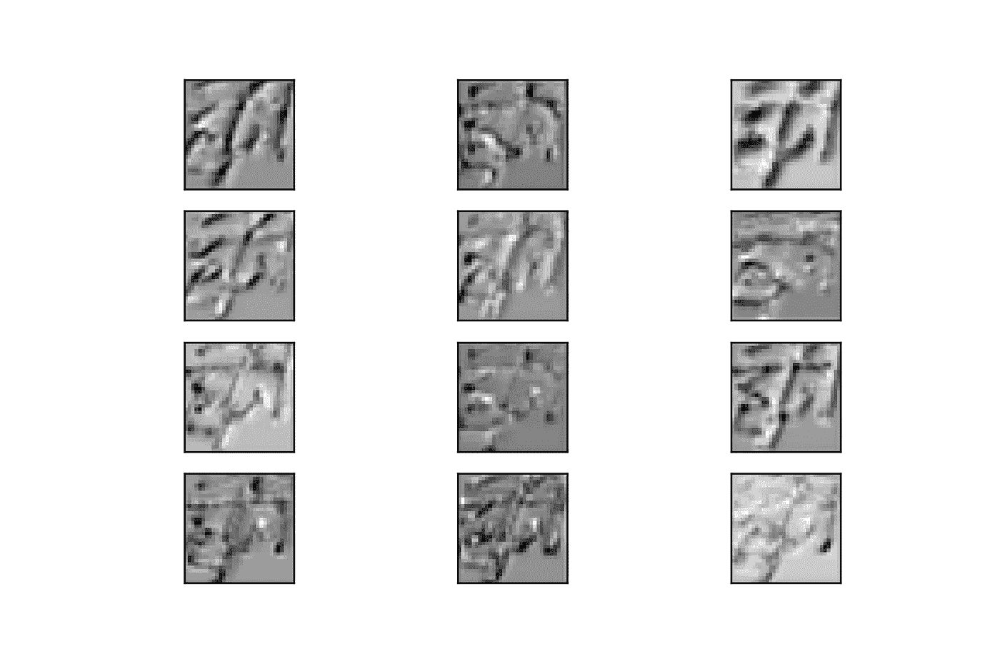
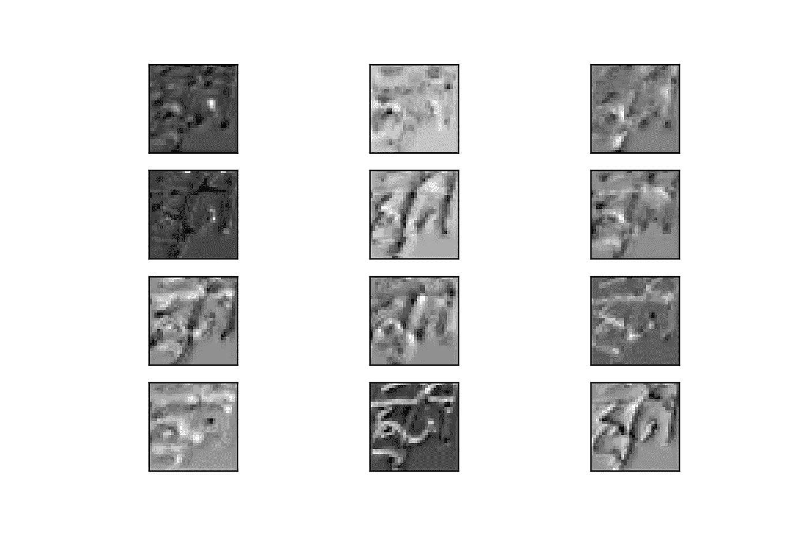
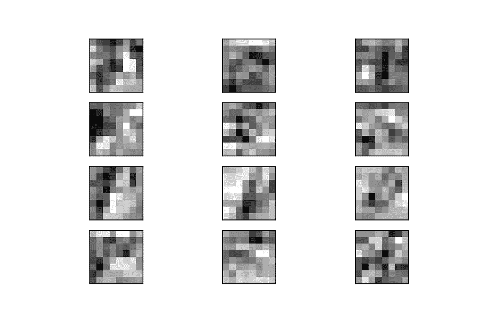
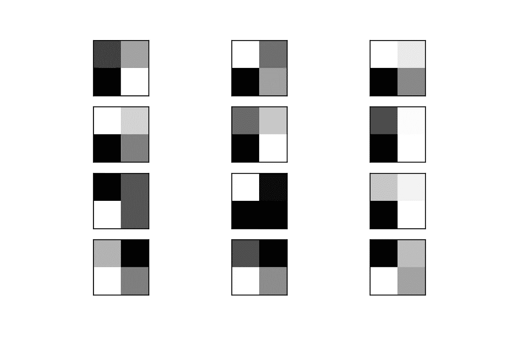

# 孟加拉文字识别系统—深度学习方式(3/n)

> 原文：<https://medium.com/analytics-vidhya/bangla-character-recognition-system-the-deep-learning-way-3-n-17cb1d140a5f?source=collection_archive---------21----------------------->

## 用于手写孟加拉文字识别的卷积神经网络

你好，这是这个系列的倒数第二篇文章，也可能是我作为第一作者的最后一篇文章。这个系列始于我和 Christina 在布朗大学数据科学倡议的深度学习实践课上开展的期中项目的一部分。前两部分的链接如下:

*   [孟加拉文字识别系统——深度学习方式(1/n)](/@sayansamanta/bangla-character-recognition-system-the-deep-learning-way-1-n-8671a33a7860)
*   [孟加拉文字识别系统——深度学习方式(2/n)](/@sayansamanta/bangla-character-recognition-system-the-deep-learning-way-2-n-d5b16333d77b)

手头的任务是 [Kaggle 竞赛](https://www.kaggle.com/c/bengaliai-cv19)，该竞赛涉及将孟加拉手写字符分为 3 个目标类别——字素词根、元音变音符号和辅音变音符号。

在第一篇文章中，我们讨论了数据集，列举了不同的类和类平衡。我们还讨论了图像预处理步骤，如去噪，阈值和裁剪。我们还谈到了可能的数据增强管道。

在第二篇文章中，我们讨论了卷积神经网络和 DenseNet 的一般概念，dense net 是一种基于卷积网络的特定架构，其中每一层都将前一层的输出作为输入，但在一定程度上也将前几层的输入作为输入(准确地说，是特定密集块内的所有前几层卷积层)。

在这篇文章中，我们将主要讨论我们的候选模型的微调(或者我称之为 SayanNet v4，以激发我的被动自恋:P)。随后我们将展示最终结果。我们将谈一谈关于特定图像的不同卷积层的输出。作为结束语，我们建议对模型进行不同的升级，以挤出最后一点准确性。让我们开始吧。

# 超参数调谐

我们选择使用 TensorBoards HParams dashboard 对一系列超参数进行全面搜索。由于项目交付期限和计算资源的限制，我们不得不保持搜索空间相当狭窄，但同时也有一些有趣的旋钮打开。

1.  过滤器的数量——我们保持每个密集块中过滤器的数量不变，但对数量进行了试验。这决定了密集模块输出端的滤波器数量。我们搜索了 8、12、24 和 32 个过滤器。
2.  生长率-我们还对生长率进行了搜索，确定了每个密集块中每个卷积层的过滤器数量。我们的搜索空间是 4、6、12 和 16 个过滤器。
3.  块中的图层-该参数设置每个密集块中卷积图层的数量。在我们的例子中，我们在单个块中尝试了 4 层**和 6 层**。
4.  密集块大小—这是我们模型中的密集块数量。我们的搜索在大小为 3 和 5 的的**块之间进行实验。**

使用 HParams 的主要原因之一是 TensorBoard 为分析提供了简洁的可视化。这是来自 64 个不同超参数组合的 64 个不同分数的结果。同样，由于计算和时间的限制，这些值用于完整的预处理数据集，但仅用于 10 个时期。

绿线表示超参数的最佳组合。为了我们项目的目的，我们决定

*   过滤器— 12
*   增长率— 12
*   区块 6 中的图层
*   密集块大小— 3(虽然 6 非常接近，但会涉及更多计算，因为它会增加 6 个卷积层)

从左到右:分别训练和验证辅音、根音和元音准确度和损失。

在顶部，你可以看到新的训练曲线。您可以忽略大约第 55 个时间步长处的轻微缺口。Colab 运行时重新启动，我们必须以更高的学习率恢复培训。

# Kaggle 条目

这里是进入卡格尔的最后入口。

每个分数都与我们在这里描述的模型稍有不同。预测大致相同。

如果与竞赛排行榜相比，分数不是很令人鼓舞。然而，我们没有时间进行任何数据扩充。也许，像 AlexNet 所做的那样，局部标准化可以提高准确性。我们也从流行的模型如 VGGnet、ResNet、InceptionNet 等来推测迁移学习。冻结预训练层将是一个有趣的检查(在下一篇文章中会有更多的介绍)。我们的超参数搜索只浏览了定义我们模型的大规模参数空间的表面。另外，谁知道呢，也许更多的计算，也许多模型平均预测可能是有用的。调整的选择是巨大的。

# 卷积网络解释

我们还绘制了从每个卷积层的不同过滤器看到的图像(স্ট্রী)的不同部分。

每个过滤器的图像卷积图。这表示第一个卷积块的滤波器

往下几层

再往下几层

更深层

接近结尾的层

正如你从图像中看到的，顶部的几层在不同风格的轮廓周围很好地斜切了图像，更深的层在轮廓周围也发现了更好的差异。前几层中的一个共同线索是网络学习从背景画布中提取书写部分。随着我们越来越深入，由于这些层会出现更普遍的模式，所以解释起来就变得困难了。但毫无疑问，某种形式的层次特征映射正在进行。

# 结尾注释

我们将在这里称之为这个项目的总结。虽然 Christina 会在她的博客上发布一个后记，我们将在那里讨论来自不同的更好的评分模型和前面提到的预训练网络的其他模型的性能。一旦完成，我会把链接贴在这里。

在成功的事情之间，有 10 件不同的事情没有成功，但最终的结果是所有这些尝试的高潮。学习曲线很陡(通过适当的调整:P)，而且非常有趣。感谢大家花时间阅读这份初出茅庐的尝试。向获奖者和排行榜上的每个人大声欢呼，这些人做得非常出色。下一个项目再见。

> আবারদেখাহবেএখনইশেষদেখানয়
> আবারদেখাহবেএখনইশেষকথানয়

চীয়ার্স!

সায়ন এবং ক্রিস্টিনা
( [萨彦](https://medium.com/u/9e9e4910bc48?source=post_page-----17cb1d140a5f--------------------------------)和[克里斯蒂娜](https://medium.com/u/45dbeb02fb04?source=post_page-----17cb1d140a5f--------------------------------))

**项目的所有代码都可以在这个**[**github**](https://github.com/reach2sayan/Bengali-Grapheme_DATA2040)**资源库中找到。**

# 参考

1.  [https://www . tensor flow . org/tensor board/hyperparameter _ tuning _ with _ hparams](https://www.tensorflow.org/tensorboard/hyperparameter_tuning_with_hparams)