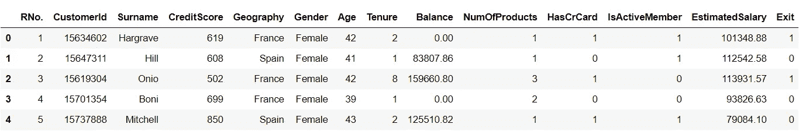
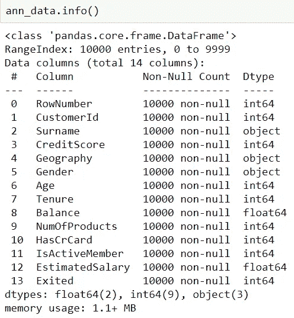
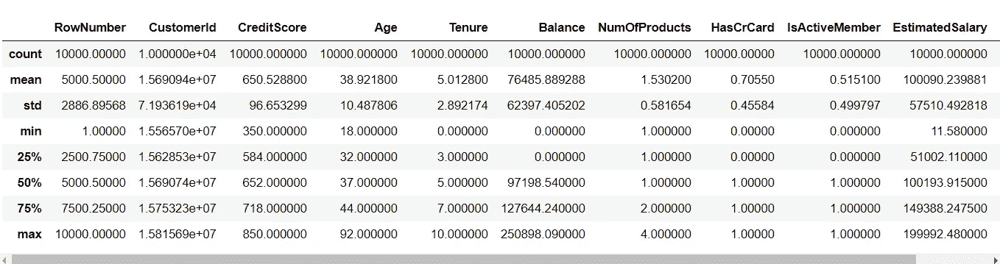
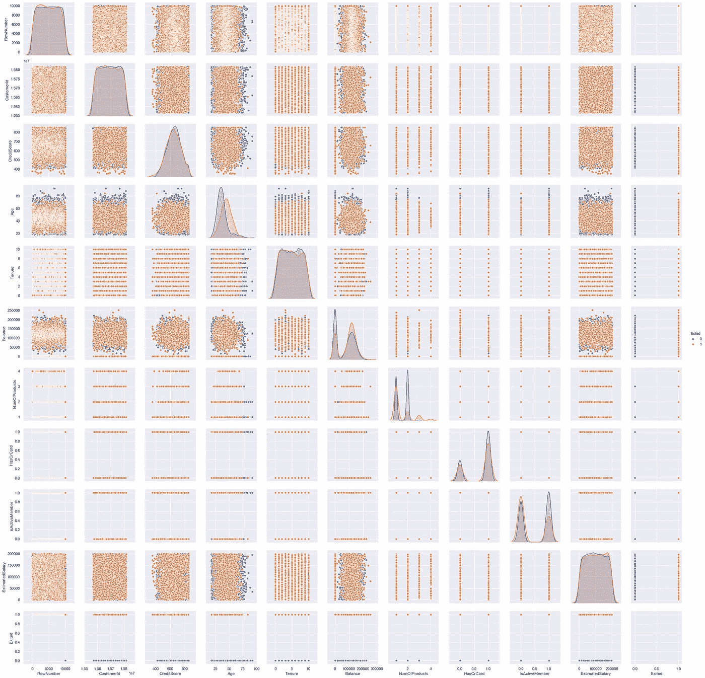
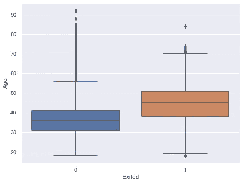
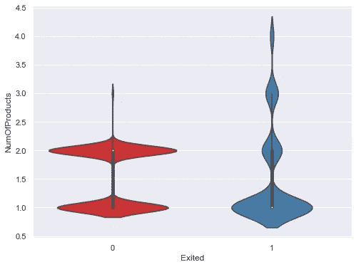
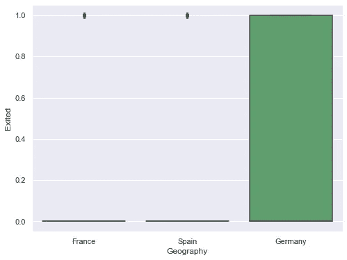
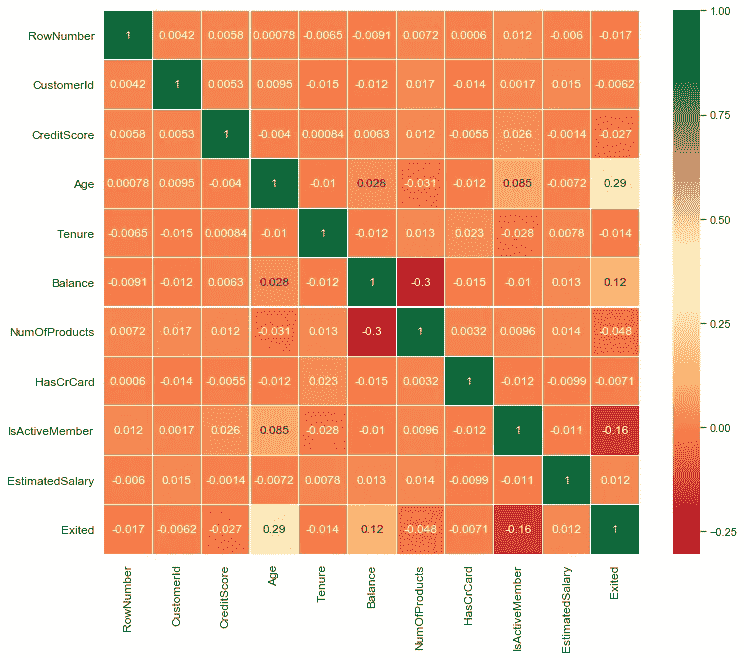
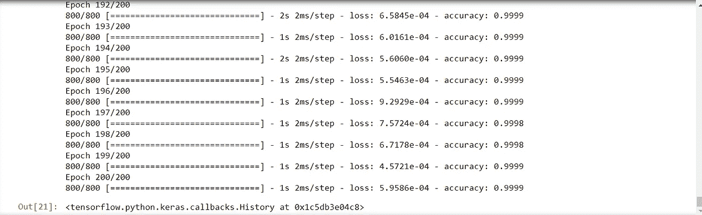
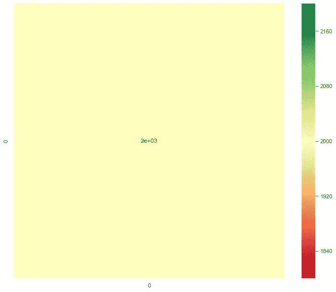

# 基于人工神经网络的银行客户分析

> 原文：<https://medium.com/analytics-vidhya/bank-customer-analysis-using-ann-6125f31de24d?source=collection_archive---------12----------------------->


图片来源:作者

## 预测将离开银行的客户

T 本博客的目的是设计一个**深度学习**模型，即一个**人工神经网络**模型，来预测银行 ***的客户是否会留在银行*** 或者他们是否会***离开*** 银行及其服务。

# 探索数据集

> 我们将使用的数据集是 **ChurnData.csv** 来执行统计测试和预测建模，该数据集包含位于*法*、*西*和*德*等国家的银行客户的详细信息。由**万行**和 **14 列**组成。
> 
> 我们的目标变量是一个名为 **Exit** 的列，它表示客户是否已经离开银行，即(0 或 1)。

```
#Impporting Libraries
**import pandas as pd
import numpy as np
import matplotlib.pyplot as plt
import seaborn as sns
import time**#Reading The Data
**ann_data = pd.read_csv("Churn_modelling.csv")
ann_data.head()**
```



我

# 探索性数据分析



```
**ann_data.describe()** #Statistical summary of dataset
```



# 使用 Seaborn & Matplotlib 进行可视化

## 1.配对图

```
**sns.pairplot(data = ann, hue = "Exited")** #pairplot
```



## 2.目标变量与特征:

**a) *目标变量 Vs 年龄:***

```
**sns.boxplot(x="Exited", y="Age", data=ann)** #boxplot
```



**b) *目标变量 Vs NumOfProducts:***

```
**sns.violinplot(x="Exited",y="NumOfProducts",data=ann,palette="Set1")**
```



c **) *目标变量 Vs 地理:***

```
**sns.boxplot(x="Geography", y="Exited", data=ann)** #Bargraph
```



## 3.相关图:热图

```
#Correlation between all variables using Heatmap **corr = ann.corr()
ax = sns.heatmap(corr,annot=True,cmap='RdYlGn',linewidths=0.1,annot_kws={'size':12})
bottom, top = ax.get_ylim()
ax.set_ylim(bottom + 0.5, top - 0.5)
fig=plt.gcf()
fig.set_size_inches(12,10)
plt.xticks(fontsize=12)
plt.yticks(fontsize=12)
plt.show()**
```



# 编码分类数据

> 使用 **pandas** 库的***get _ dummies()***函数将**分类**数据转换为**数字**格式，以便机器能够理解数据，并将其插入 **ANN 模型**进行训练和预测。

```
**ann1 = pd.get_dummies(ann)** #encoding the data
```

# 拆分数据

```
#Input and output variable
**X = ann1.iloc[:, 3:13].values
y = ann1.iloc[:, 13].values
X, y**#Spliting using scikitlearn
**from sklearn.model_selection import train_test_split
X_train, X_test, y_train, y_test = train_test_split(X, y, test_size = 0.2, random_state = 0)**
```

# 预处理(缩放数据)

```
**from sklearn.preprocessing import StandardScaler
sc = StandardScaler()
X_train = sc.fit_transform(X_train)
X_test = sc.transform(X_test)**
```

# 建立人工神经网络(ANN)

```
**import keras
from tensorflow.keras.models import Sequential
from tensorflow.keras.layers import Dense**# Initialising the ANN
**classifier = Sequential()**# Adding the input layer and the first hidden layer
**classifier.add(Dense(units = 6, kernel_initializer = 'uniform', activation = 'relu', input_dim = 10))**# Adding the second hidden layer
**classifier.add(Dense(units = 6, kernel_initializer = 'uniform', activation = 'relu'))**# Adding the output layer
**classifier.add(Dense(units = 1, kernel_initializer = 'uniform', activation = 'sigmoid'))**# Compiling the ANN
**classifier.compile(optimizer = 'adam', loss = 'binary_crossentropy', metrics = ['accuracy'])**# Fitting the ANN to the Training set
**classifier.fit(X_train, y_train, batch_size = 10, epochs = 200)**
```



```
# Predicting the Test set results
**y_pred = classifier.predict(X_test)
y_pred = (y_pred > 0.5)**
```

# 混淆矩阵(最终预测可视化)

```
# Building the Confusion Matrix using Heatmap for visualizing predictions
**from sklearn.metrics import confusion_matrix
from sklearn.metrics import precision_recall_fscore_support as score****cm = confusion_matrix(y_test, y_pred)****ax = sns.heatmap(cm,annot=True,cmap='RdYlGn',linewidths=0.1,annot_kws={'size':12})
bottom, top = ax.get_ylim()
ax.set_ylim(bottom + 0, top - 0)
fig=plt.gcf()
fig.set_size_inches(12,10)
plt.xticks(fontsize=12)
plt.yticks(fontsize=12)
plt.show()**
```



> **准确率:100%**

> **如你所见，混淆矩阵中没有错误分类的样本。因此，准确度得分= 0.1**

# 密码

[**点击此处**](https://github.com/Sk70249/Bank-Customer-Analysis-using-Artificial-Neural-Network) **:** 进行代码交互，访问我的[**Github Repositor**](https://github.com/Sk70249)**获取更多 suck 项目。**

# **感谢您的阅读**

**更多深度学习和神经网络相关的此类内容和知识 [***点击这里***](/@kalamanoj989)**