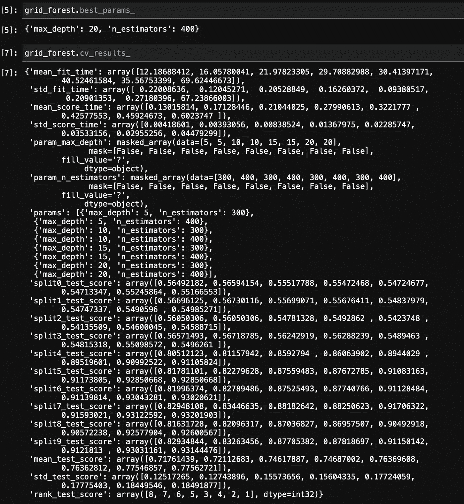
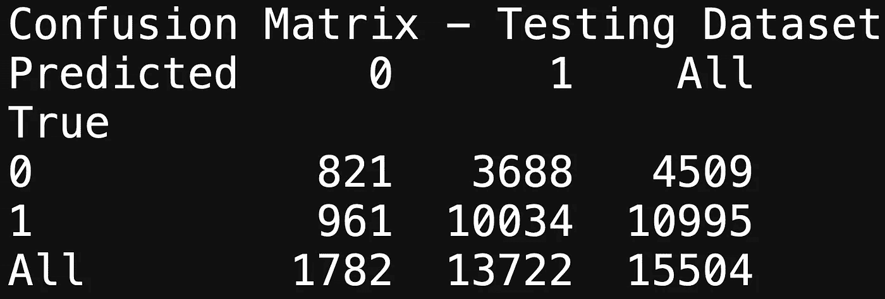
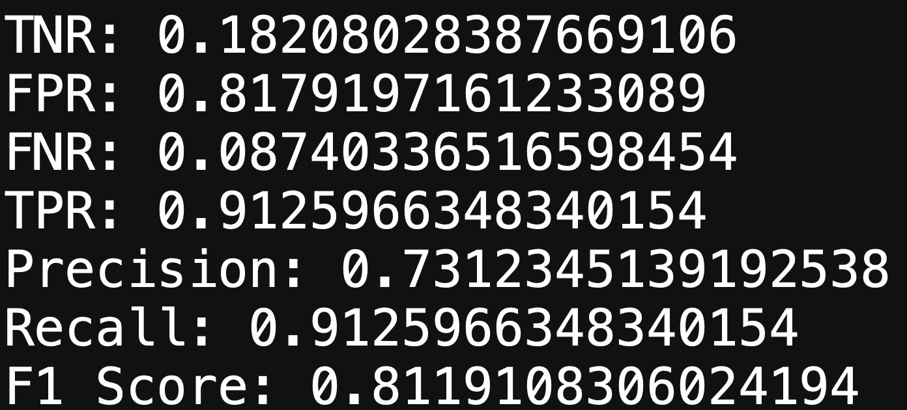
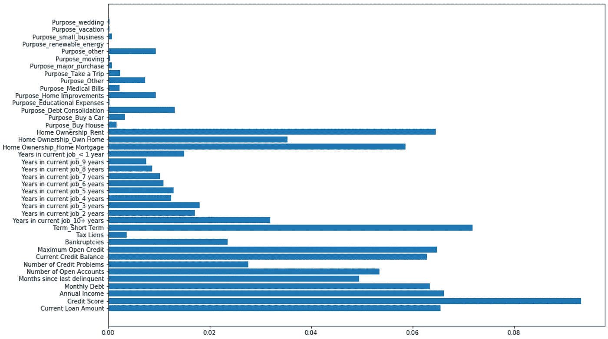
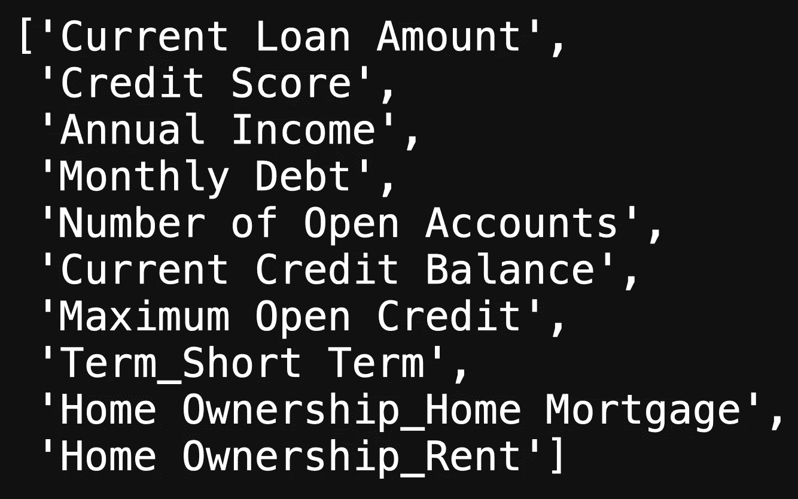
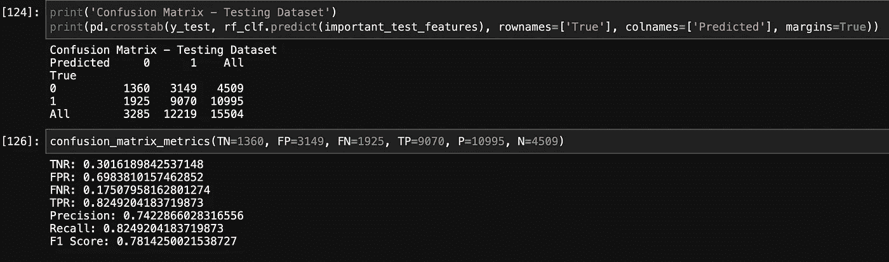

# 银行数据:分类第 1 部分

> 原文：<https://medium.com/analytics-vidhya/bank-data-classification-part-1-6b61506086cd?source=collection_archive---------17----------------------->


第 1 部分(共 4 部分)将是关于在银行数据中使用的 4 种不同机器学习算法的简短帖子。

## 随机森林


随机森林是一种集成方法，它对要素的随机子集进行采样，并使用引导聚合(Bagging)进行分类。装袋是一种取样技术，通过替换每棵树上的数据进行取样。然后，我们可以使用剩下的三分之一的袋外数据来测量每棵树的性能，实际上是在看不见的数据上测试每棵树来测量模型的性能。

```
from sklearn.ensemble import RandomForestClassifierrandom_forest = RandomForestClassifier(random_state=19, oob_score=True)# Random Forest grid search
param_forest = {"n_estimators":[300, 400], "max_depth":[5, 10, 15, 20]}
grid_forest = GridSearchCV(random_forest, param_grid=param_forest, cv=10)# Fitting training data to model
grid_forest.fit(X_train_new, y_train_new)
```

上面的代码显示了导入随机森林分类器、实例化、创建网格搜索的使用，其中将要调整的参数是“n_estimators”和“max_depth”，其中 n _ estimators 是在一个决策中将要分割的树的数量，max _ depth 是树的深度，意味着分割越多，树的密度越大。

拟合模型后，我们可以查看最佳参数和交叉验证结果:



这表明我们应该在测试数据上获得大约 70%的准确率。

```
display(grid_forest.score(X_train_new, y_train_new))
display(grid_forest.score(X_test, y_test))
```

上面的代码给出了可怕的结果，显示了巨大的偏差，不适合。

培训分数显示 93%的结果，而测试分数显示 70%。虽然这是一个可怕的准确度分数，但这不是我们完全关心的。

因为我们的因变量是二元的，我们关心人们有哪些特征可以全额偿还贷款，这有助于银行关注哪些特征需要强大才能提供贷款。这意味着最好使用混淆矩阵，这是分类机器学习模型的另一个性能指标。

## 混淆矩阵

为什么关注混淆矩阵而不是准确性或 AUC ROC 分数？这是因为我们有不平衡的数据。如果你还记得，我们使用 SMOTE 是因为我们的数据严重不平衡。SMOTE 用于我们的训练数据，所以我们收到偏差结果是有道理的。准确性告诉我们，我们的模型预测了正确类别中 93%的点，但它没有指定是哪一个。AUC ROC 也不是用于不平衡数据的好主意。

```
# Able to determine metrics for a confusion matrix
def confusion_matrix_metrics(TN:int, FP:int, FN:int, TP:int, P:int, N:int):
    print("TNR:", TN/N)
    print("FPR:", FP/N)
    print("FNR:", FN/P)
    print("TPR:", TP/P)
    print("Precision:", TP/(TP+FP))  # % of our positive predictions that we predicted correctly.
    print("Recall:", TP/(TP+FN))  # % of ground truth positives that we predicted correctly.
    print("F1 Score:", (2*TP)/((2*TP) + (FP + FN)))  # the harmonic mean of precision and recall and is a better measure than accuracprint('Confusion Matrix - Testing Dataset')
print(pd.crosstab(y_test, grid_forest.predict(X_test), rownames=['True'], colnames=['Predicted'], margins=True))
```



测试数据的混淆矩阵

上面的代码显示了一个计算 TPR、TNR、FNR、FPR、精度、召回和 F1 分数的函数。

这些分数将帮助我们确定模型如何对数据进行分类:



测试数据的混淆矩阵得分

上图向我们展示了该模型如何对正(1)点进行分类。

## 特征重要性

我们可以看到哪些功能对模型很重要:

```
# Graphing
fig, ax = plt.subplots(figsize=(15, 10))
ax.barh(width=rf_clf.feature_importances_, y=X_train_new.columns)
```



特征重要性

上面的代码提供了我们的机器学习模型的可视化，该模型决定哪些功能比其他功能更重要，分数越高，这些功能就越重要。从这一点上，我们可以了解到银行在决定贷款给某人时应该考虑哪些因素更重要。

上图显示了许多被随机森林模型归类为重要的特征。为了选择主要的重要特征，我们必须对我们想要的阈值给出我们最好的判断:

```
# Selecting the top features at a cap of 0.05
top_important_features = np.where(rf_clf.feature_importances_ > 0.05)
print(top_important_features)
print(len(top_important_features[0]))  # Number of features that qualify# Extracting the top feature column names
top_important_feature_names = [columns for columns in X_train_new.columns[top_important_features]]
top_important_feature_names
```



上面的代码显示，我们将阈值设置为大于 0.5，作为回报，上面的这些特性是最重要的。

## 进一步的步骤

我们还可以更进一步，我们可以利用这些特征，创建一个新的子集数据，仅将这些重要特征作为新的独立变量，然后通过我们的随机森林网格搜索来运行它们，查看交叉验证结果，然后通过混淆矩阵来运行它，以查看我们的模型在新的重要特征下的表现。

我已经完成了这些步骤，我将只展示最终的结果，因为要把它们放在这篇文章中需要做大量的工作。



测试数据的进一步步骤/混淆矩阵

上面的图像显示了我们的重要功能的结果。看起来在使用重要功能时，我们的 F1 得分较低。

## 为什么是随机森林？

因为这是结尾，我觉得这是表演塔伦蒂诺和解释开头的好时机。我使用随机森林模型，因为它们非常适合处理大型二进制数据。随机森林在防止过度拟合方面也很棒，我还可以向模型提供原始但经过纯化的数据，允许我在不进行特征缩放的情况下传递这些数据。