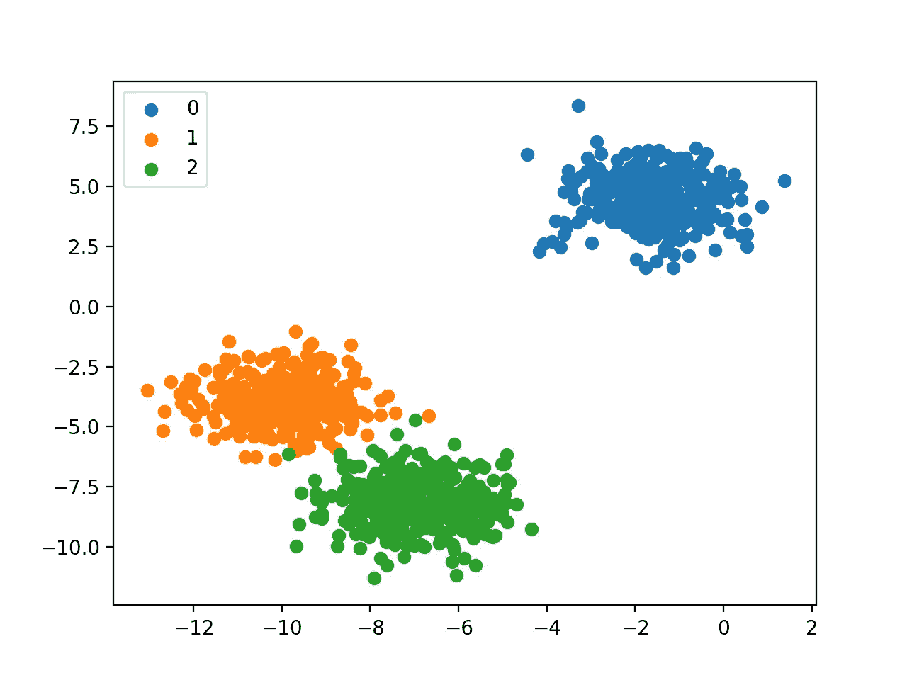
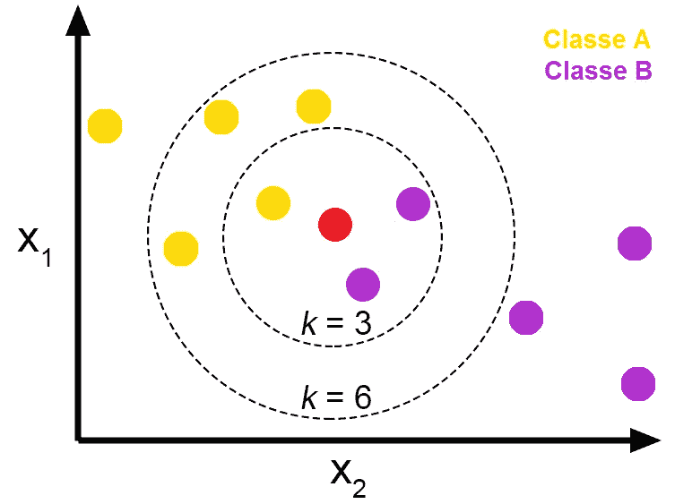
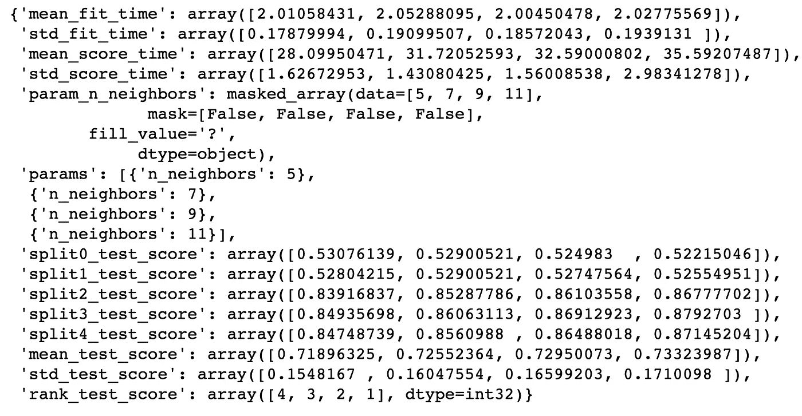
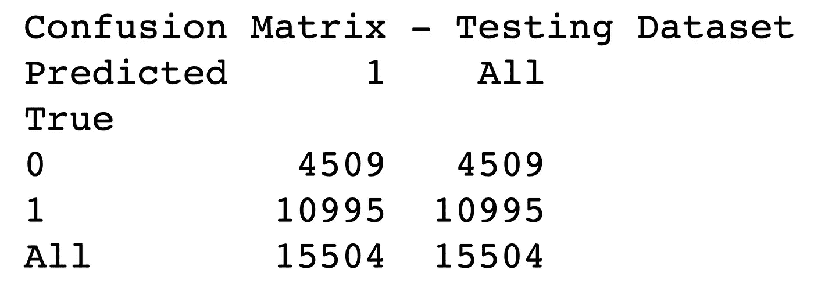

# 银行数据:分类第 2 部分

> 原文：<https://medium.com/analytics-vidhya/bank-data-classification-part-2-af9cfb38c18a?source=collection_archive---------19----------------------->



这是分类部分的第 2 部分，共 4 部分。

## k 个最近邻居



我决定对银行数据使用的第二个算法是 K 近邻算法。k 最近邻是一个分组分类器，可用于回归或分类，即利用数据点的距离来分类。如果一定数量的点非常接近，那么它们将属于同一类。

```
*# Instantiating KNN*
knn_clf = KNeighborsClassifier()*# Grid Search*
param_knn = {"n_neighbors": [5, 7, 9, 11]}
grid_knn = GridSearchCV(knn_clf, param_grid=param_knn)*# Fitting model*
grid_knn.fit(X_train_rescaled, y_train_new)grid_knn.cv_results_
```



我相信您已经注意到，与用于适应模型的训练集略有不同。对于 KNN，我们使用了重新调整的训练数据。我们使用要素缩放是因为 KNN 的一个假设是假设您的数据是缩放的。如果不进行缩放，在使用该算法时会出现问题，因为 KNN 的主要功能是距离。数字越大，它的重量就越大。

上面的代码和图像显示了使用超参数调整的结果。如果我们查看交叉验证结果，我们可以看到我们肯定会得到大约 71%的测试分数

## 混淆矩阵

```
*# Confusion Matrix*
print('Confusion Matrix - Testing Dataset')
print(pd.crosstab(y_test, grid_knn.predict(X_test), rownames=['True'], colnames=['Predicted'], margins=**True**))
```



上面的图像和代码显示了混淆矩阵的结果。KNN 收到了不好的结果，所以我不在乎继续下去。

## 为什么用 KNN？

优点:

1.  K-NN 非常直观简单 : K-NN 算法非常容易理解，也同样容易实现。为了对新数据点进行分类，K-NN 算法遍历整个数据集以找出 K 个最近邻。
2.  **K-NN 没有假设** : K-NN 是一种非参数算法，这意味着实现 K-NN 需要满足一些假设。像线性回归这样的参数模型在实现之前需要满足大量的数据假设，而 K-NN 则不是这种情况。
3.  **否** **训练步骤:** K-NN 不显式地构建任何模型，它只是基于从历史数据的学习来标记新的数据条目。新的数据条目将被标记为最近邻中的多数类。
4.  它不断地进化:这是一种基于实例的学习；k-NN 是一种基于记忆的方法。当我们收集新的训练数据时，分类器会立即适应。它允许算法在实时使用期间快速响应输入的变化。
5.  **对于多类问题非常容易实现:**大多数分类器算法对于二元问题很容易实现，对于多类问题需要努力实现，而 K-NN 无需任何额外的努力就可以调整到多类。
6.  **既可用于分类也可用于回归:**K-NN 最大的一个优点就是 K-NN 既可用于分类也可用于回归问题。
7.  **一个超参数:** K-NN 在选择第一个超参数时可能会花费一些时间，但在此之后，其余的参数会与之对齐。
8.  **多种距离标准可供选择:** K-NN 算法使用户在建立 K-NN 模型时可以灵活选择距离。

缺点:

1.  **K-NN 慢算法** : K-NN 可能非常容易实现，但随着数据集的增长，算法的效率或速度下降得非常快。
2.  **维数灾难:** KNN 在输入变量数量较少的情况下工作良好，但随着变量数量的增加，K-NN 算法很难预测新数据点的输出。
3.  **K-NN 需要同质特征**:如果您决定使用普通距离构建 K-NN，如欧几里德距离或曼哈顿距离，则特征具有相同的尺度是完全必要的，因为特征的绝对差异权重相同，即特征 1 中的给定距离对特征 2 来说必须是相同的。
4.  **最佳邻居数量**:K-NN 的最大问题之一是在对新数据条目进行分类时，选择要考虑的最佳邻居数量。
5.  **不平衡数据导致问题** : k-NN 对不平衡数据表现不佳。如果我们考虑两个类，A 和 B，并且大多数训练数据被标记为 A，那么模型最终将给予 A 很多偏好。这可能导致不太常见的 B 类被错误分类。
6.  **异常值敏感性:** K-NN 算法对异常值非常敏感，因为它只是基于距离标准选择邻居。
7.  **缺失值处理:** K-NN 天生没有处理缺失值问题的能力。