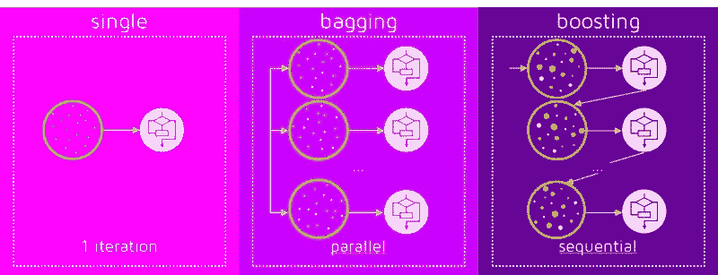
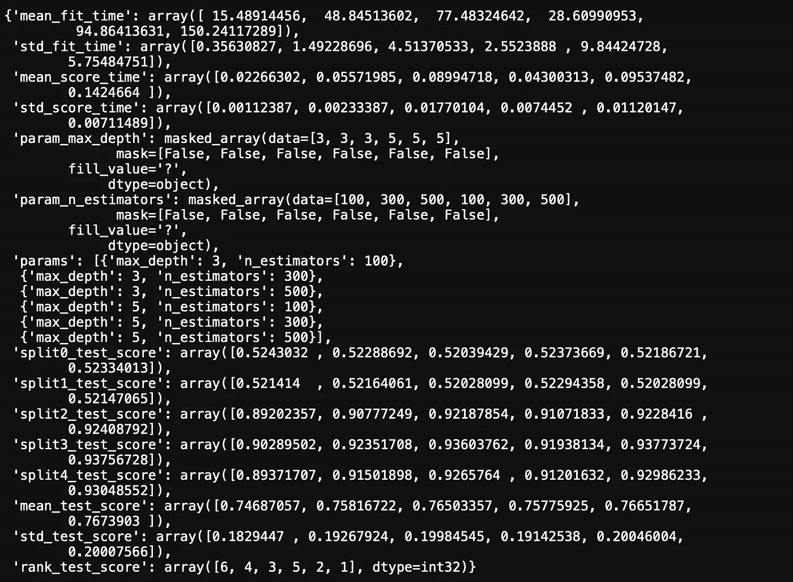
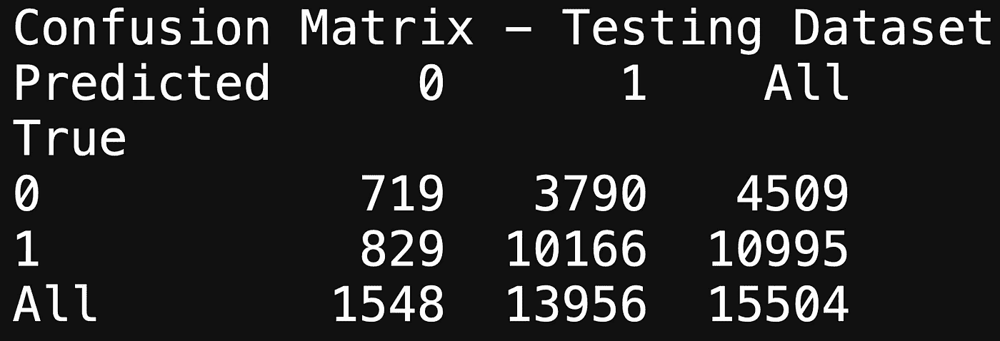
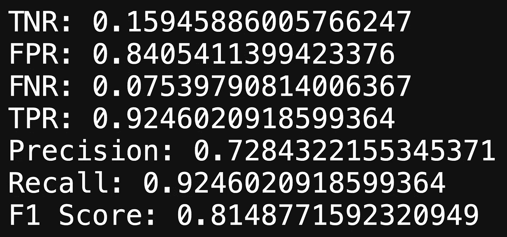
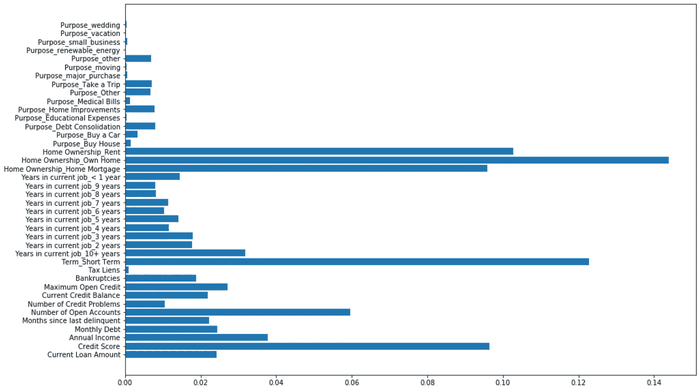
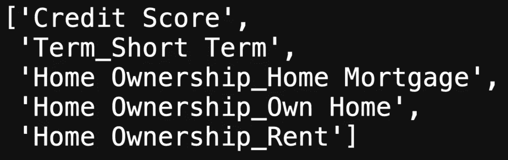
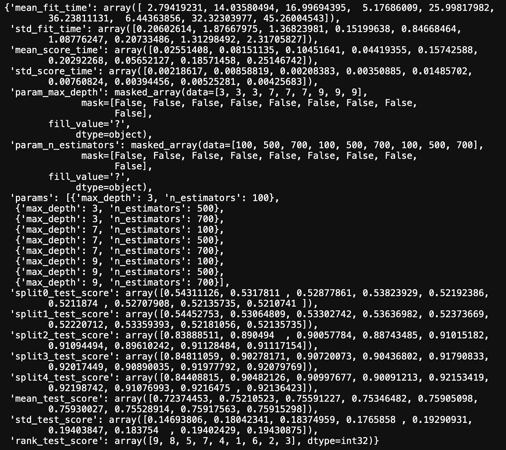
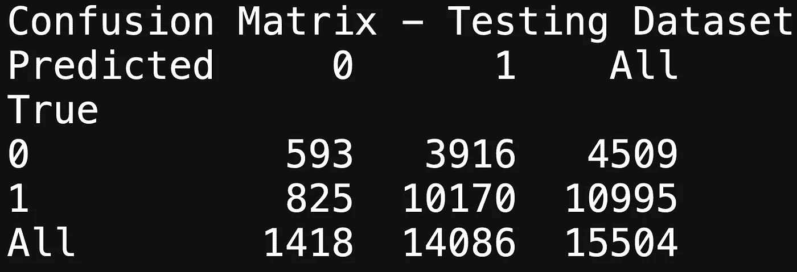
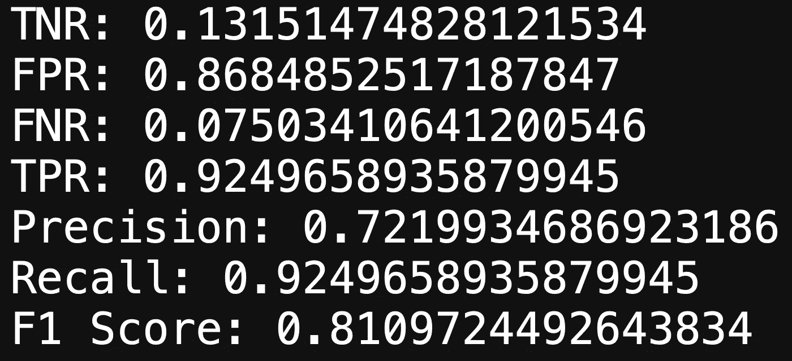

# 银行数据:分类第 3 部分

> 原文：<https://medium.com/analytics-vidhya/bank-data-classification-part-3-21aaa23c5ea4?source=collection_archive---------18----------------------->



这篇博客是 4 篇中的第 3 篇，我们将讨论助推。

## 梯度推进


梯度推进是一种用于分类和回归的机器学习技术，用于将弱学习者变成强学习者。

```
gb_clf = GradientBoostingClassifier()# Grid Search
param_gb = {"n_estimators":[100, 300, 500], "max_depth":[3, 5]}
grid_gb = GridSearchCV(gb_clf, param_grid=param_gb)grid_gb.fit(X_train_new, y_train_new)grid_gb.cv_results_
```



我们继续使用网格搜索，看看交叉验证的性能。看一下上面的结果，我们应该获得大约 76%的测试分数

## 混淆矩阵

```
*# Confusion Matrix*print('Confusion Matrix - Testing Dataset')print(pd.crosstab(y_test, grid_gb.predict(X_test), rownames**=**['True'], colnames**=**['Predicted'], margins**=True**))
```



```
confusion_matrix_metrics(TN=719, FP=3790, FN=829, TP=10166, P=10995, N=4509)
```



上面的混淆矩阵显示 F1 分数为 81%，其中回忆是主要因素。

## 特征重要性

```
# Graphing
fig, ax = plt.subplots(figsize=(15, 10))
ax.barh(width=gb_clf.feature_importances_, y=X_train_new.columns)
```



通过使用特征重要性，我们可以看到我们的梯度推进模型认为什么特征是最重要的。梯度增强和随机森林的主要区别在于，在决定哪些特征是重要的时，梯度增强更具体/清楚；没有细线，重要特征之间的区别一目了然。

## 重要特征上的梯度增强

我们将选择一个阈值，然后执行特征选择，以对我们的新特征执行梯度增强。

```
# Selecting the top features at a cap of 0.08
gb_important_features = np.where(gb_clf.feature_importances_ > 0.08)
print(gb_important_features)
print(len(gb_important_features[0]))  # Number of features that qualify# Extracting the top feature column names
gb_important_feature_names = [columns for columns in X_train_new.columns[gb_important_features]]
gb_important_feature_names
```



上面的代码显示了高于我们的阈值 0.08 的重要特性。这些是将要被选择和测试的特性。

```
# Creating new training and testing data with top features
gb_important_train_features = X_train_new[gb_important_feature_names]
gb_important_test_features = X_test[gb_important_feature_names]
```

上述代码仅包括数据帧中的选定特征。

现在，我们将使用网格搜索来浏览我们的训练数据，并查看结果:

```
param_gb = {"n_estimators":[100, 500, 700], "max_depth":[3, 7, 9]}# Grid search
grid_gb = GridSearchCV(gb_clf, param_grid=param_gb)grid_gb.fit(gb_important_train_features, y_train_new)grid_gb.cv_results_
```



交叉验证的结果显示，我们一定会得到 72%左右的分数。

## 重要特征的混淆矩阵

```
# Confusion Matrix
print('Confusion Matrix - Testing Dataset')
print(pd.crosstab(y_test, grid_gb.predict(gb_important_test_features), rownames=['True'], colnames=['Predicted'], margins=True))
```



```
confusion_matrix_metrics(TN=593, FP=3916, FN=825, TP=10170, P=10995, N=4509)
```



回过头来看，我们可以看到功能选择在我们的 F1 得分结果中几乎没有差异。