# 银行数据 EDA:循序渐进

> 原文：<https://medium.com/analytics-vidhya/bank-data-eda-step-by-step-67a61a7f1122?source=collection_archive---------8----------------------->


这些银行数据是从 [Kaggle](https://www.kaggle.com/zaurbegiev/my-dataset#credit_train.csv) 中检索的，将会有一个从 EDA(探索性数据分析)到机器学习算法如何处理数据集的分解。

## 步骤:

1.  变量和数据类型的标识
2.  分析基本指标
3.  非图形单变量分析
4.  图形单变量分析
5.  双变量分析
6.  相关分析

## 数据集:

将要使用的数据集来自 [Kaggle](https://www.kaggle.com/zaurbegiev/my-dataset#credit_train.csv) 。该数据集是一个银行贷款数据集，目标是能够检测某人是否会全额支付或冲销其贷款。

数据集由 100，000 行和 19 列组成。预测值(因变量)将是“贷款状态”，特征(自变量)将是剩余的列。

## 变量标识:

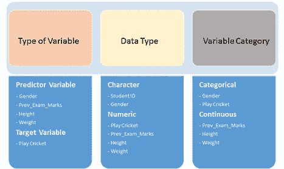

第一步是确定我们在数据集中处理什么类型的变量。

```
df.head()
```

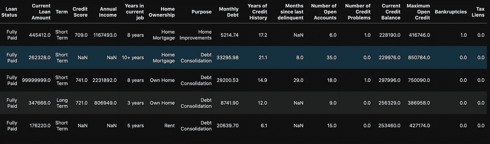

我们可以看到，在我们的数据集中有一些数字和字符串(对象)数据类型。但是可以肯定的是，你可以用:

```
df.info()  # Shows data types for each column
```

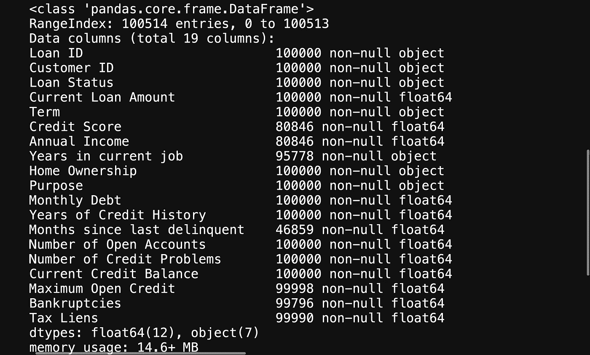

这将为您提供有关变量的进一步信息，帮助您找出需要更改的内容，以便帮助您的机器学习算法能够解释您的数据。

## 分析基本指标

这很简单，只需使用:

```
df.describe().T
```

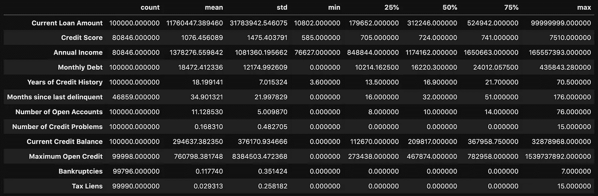

这允许您查看某些指标，例如:

1.  计数—该列中值的数量
2.  平均值。该列中的值
3.  STD(标准偏差)-您的值的分布情况
4.  最小值—该列中的最小值
5.  25% 50% 70%—百分位
6.  Max —该列中的最高值

从这里您可以确定您的值是什么样的，并且您可以检测是否有任何异常值。

从做。describe()方法，可以看到在当前贷款额、信用评分、年收入和最大开放信用中存在一些令人关注的异常值。

## 非图形单变量分析

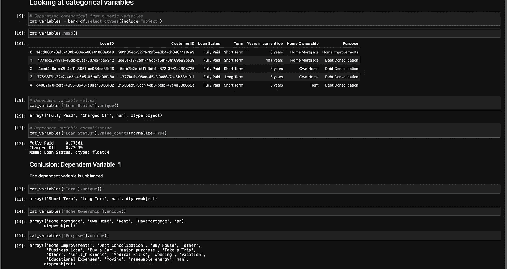

单变量分析是指查看列中的统计数据。

这个可以简单到做 df【专栏】。unique()或 df[列]。value_counts()。你试图从变量中获取尽可能多的信息。

您还想找到您的空值

```
df.isna().sum()
```

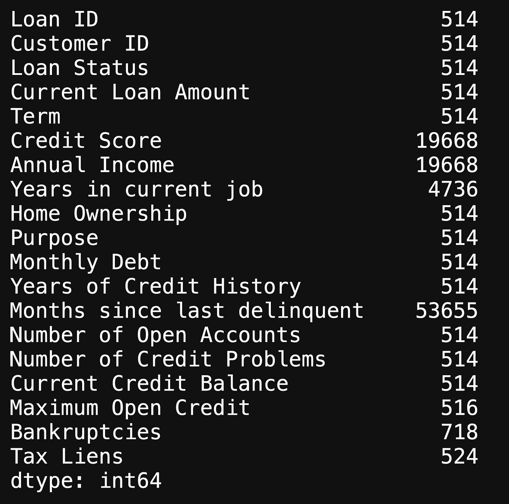

这将向您显示每一列中 null 值的数量，并且在我们的数据集中有大量的缺失值。在进行图形单变量分析时，我们将进一步研究缺失值。

## 图形单变量分析

这是我们用图表来看变量的时候。

我们可以使用条形图来查看缺失的值:

```
fig, ax = plt.subplots(figsize=(15, 5))x = df.isna().sum().index
y = df.isna().sum()
ax.bar(x=x, height=y)
ax.set_xticklabels(x, rotation = 45)
plt.tight_layout();
```

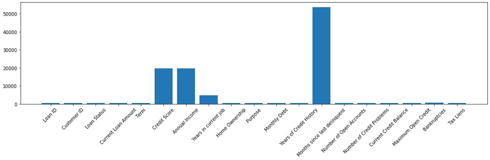

跳过缺失值，我们还可以使用直方图来查看特征的分布。

```
df["Years of Credit History"].hist(bins=200)
```

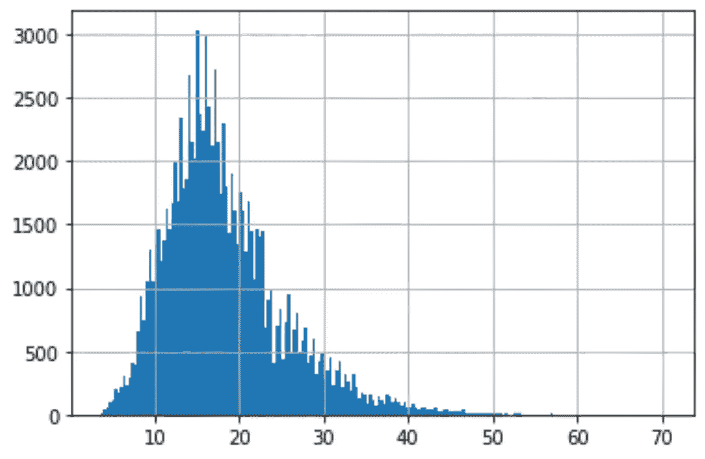

信用历史年直方图

从这个直方图中，您可以通过查看是左倾斜还是右倾斜来检测是否有异常值，我们看到的是轻微的右倾斜。

理想情况下，我们希望每个特征的直方图尽可能接近正态分布。

```
# Checking credit score
df["Credit Score"].hist(bins=30)
```

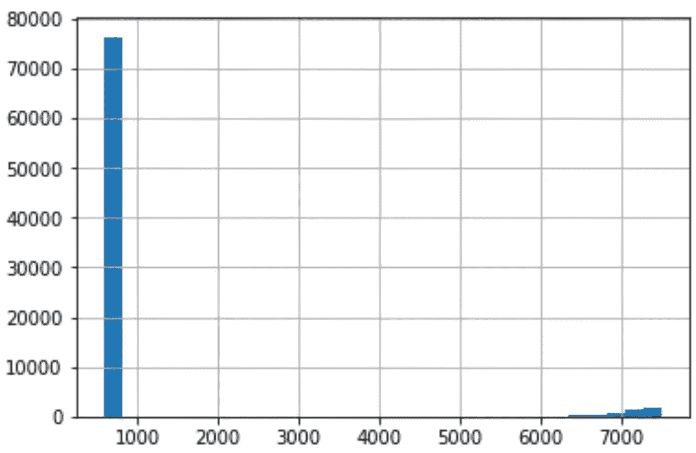

当我们对信用评分做同样的事情时，我们可以看到有一个巨大的右偏，剩下的数以千计。这是非常令人担忧的，因为对于我们的数据集，信用评分应该在 850 上限。

让我们仔细看看:

```
# Rows with a credit score greater than 850, U.S. highest credit score.
df.loc[df["Credit Score"] > 850]
```

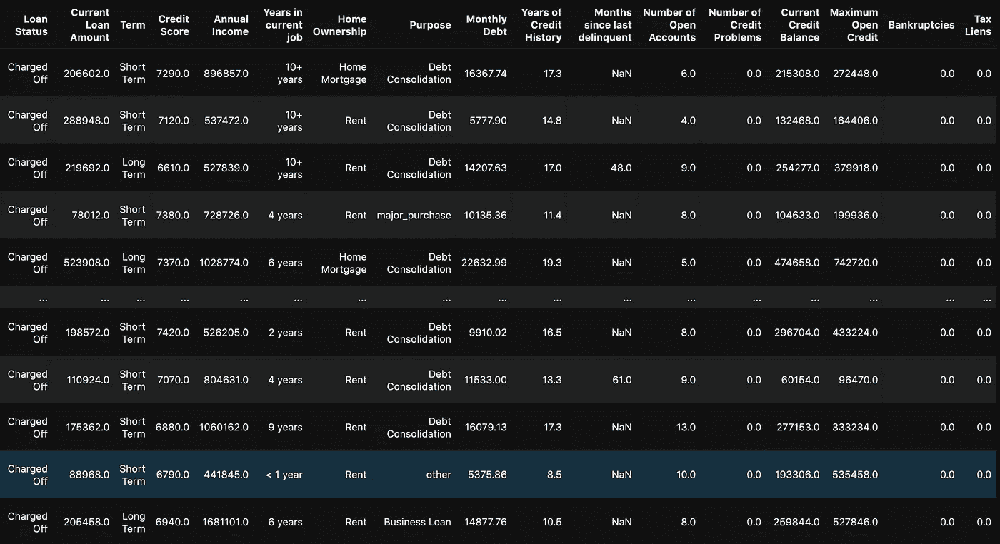

使用 loc 方法查看信用评分高于 850 的行

使用 loc 方法时，您可以看到信用评分大于 850 的所有行。我们可以看到这可能是人为错误，因为在值的末尾添加了 0。一旦我们开始处理数据，这将是一个简单的解决办法。

另一种检测异常值的方法是使用箱线图和散点图。

```
fig, ax = plt.subplots(4, 3)# Setting height and width of subplots
fig.set_figheight(15)
fig.set_figwidth(30)# Adding spacing between boxes
fig.tight_layout(h_pad=True, w_pad=True)sns.boxplot(bank_df["Number of Open Accounts"], ax=ax[0, 0])
sns.boxplot(bank_df["Current Loan Amount"], ax=ax[0, 1])
sns.boxplot(bank_df["Monthly Debt"], ax=ax[0, 2])
sns.boxplot(bank_df["Years of Credit History"], ax=ax[1, 0])
sns.boxplot(bank_df["Months since last delinquent"], ax=ax[1, 1])
sns.boxplot(bank_df["Number of Credit Problems"], ax=ax[1, 2])
sns.boxplot(bank_df["Current Credit Balance"], ax=ax[2, 0])
sns.boxplot(bank_df["Maximum Open Credit"], ax=ax[2, 1])
sns.boxplot(bank_df["Bankruptcies"], ax=ax[2, 2])
sns.boxplot(bank_df["Tax Liens"], ax=ax[3, 0])plt.show()
```

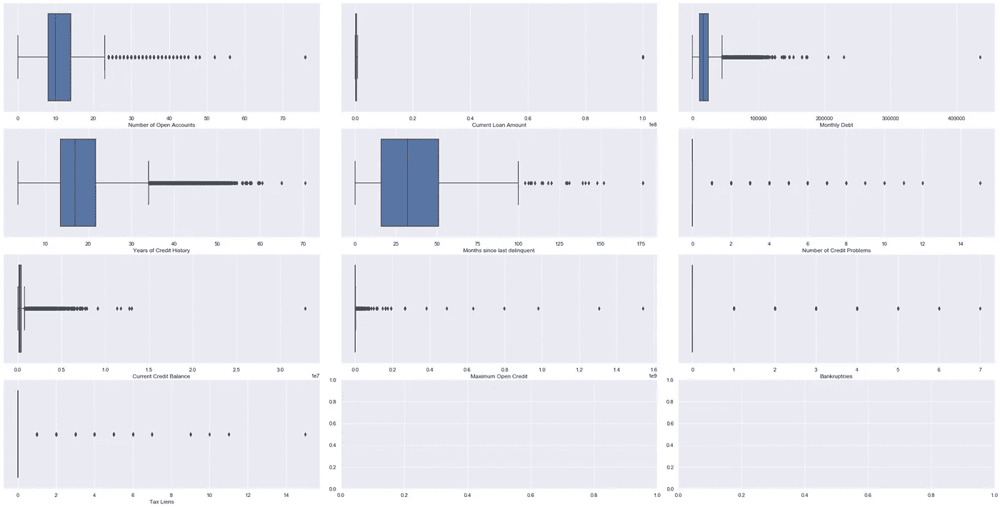

所有数字列的箱线图

```
fig, ax = plt.subplots(4, 3)# Setting height and width of subplots
fig.set_figheight(15)
fig.set_figwidth(30)# Adding spacing between boxes
fig.tight_layout(h_pad=True, w_pad=True)sns.scatterplot(data=bank_df["Number of Open Accounts"], ax=ax[0, 0])
sns.scatterplot(data=bank_df["Current Loan Amount"], ax=ax[0, 1])
sns.scatterplot(data=bank_df["Monthly Debt"], ax=ax[0, 2])
sns.scatterplot(data=bank_df["Years of Credit History"], ax=ax[1, 0])
sns.scatterplot(data=bank_df["Months since last delinquent"], ax=ax[1, 1])
sns.scatterplot(data=bank_df["Number of Credit Problems"], ax=ax[1, 2])
sns.scatterplot(data=bank_df["Current Credit Balance"], ax=ax[2, 0])
sns.scatterplot(data=bank_df["Maximum Open Credit"], ax=ax[2, 1])
sns.scatterplot(data=bank_df["Bankruptcies"], ax=ax[2, 2])
sns.scatterplot(data=bank_df["Tax Liens"], ax=ax[3, 0])plt.show()
```

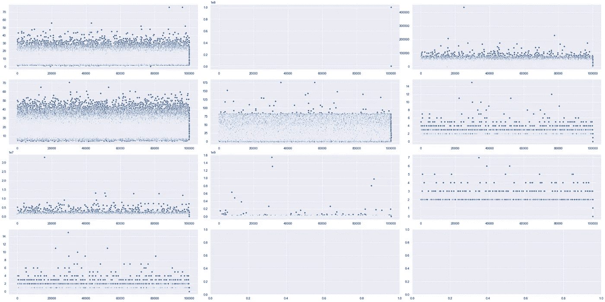

数字数据的散点图

## 相关分析

相关性是指你想检测一个变量对另一个变量的反应。您不想要的是多重共线性，为此，您可以使用:

```
# Looking at mulitcollinearity
sns.heatmap(df.corr())
```

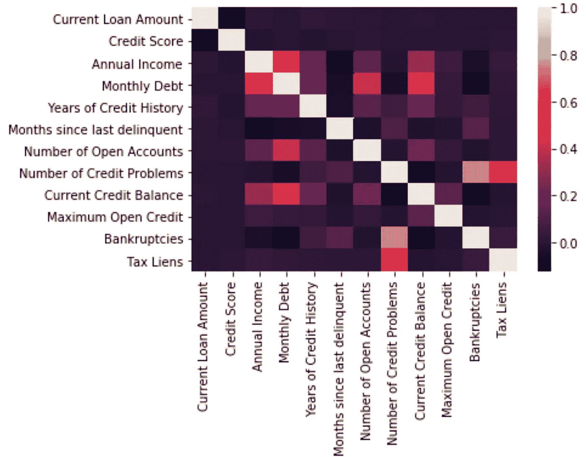