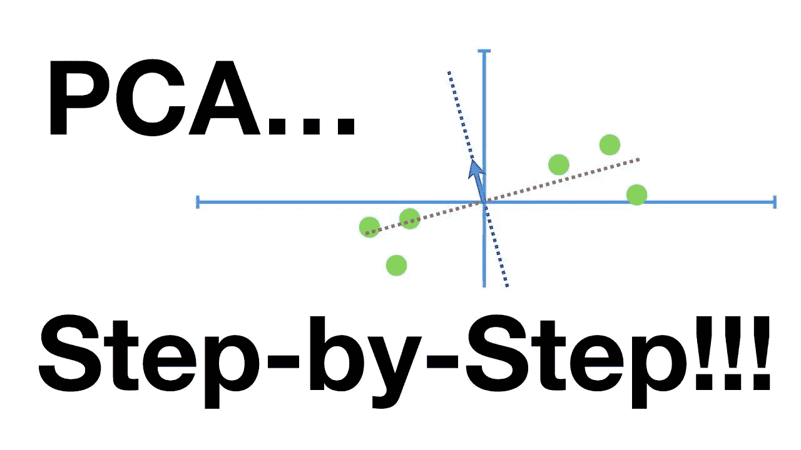
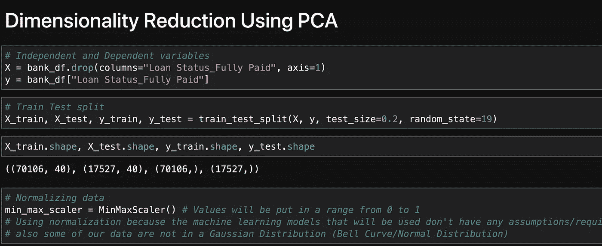
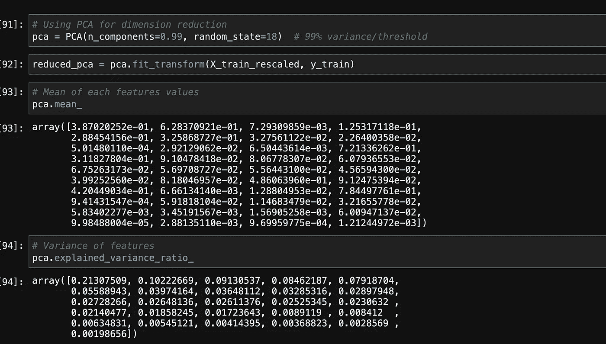
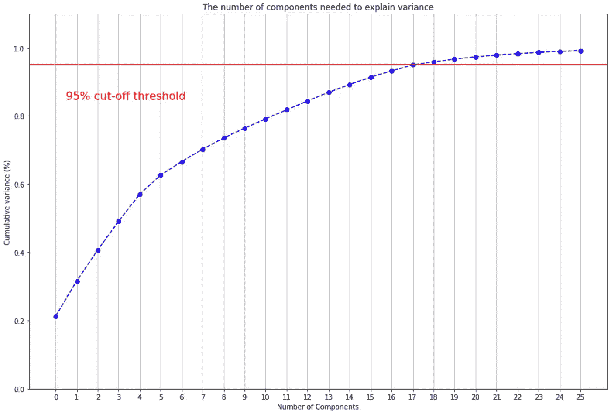

# 银行数据:PCA

> 原文：<https://medium.com/analytics-vidhya/bank-data-pca-eb9e3c5204a3?source=collection_archive---------14----------------------->



将用于本示例的数据集位于 [Kaggle](https://www.kaggle.com/zaurbegiev/my-dataset#credit_train.csv) 上。这个讨论将是关于在银行数据上使用主成分分析的过程。

## 什么是 PCA？

PCA，即主成分分析，是一种使用正交变换将一组相关变量转换为一组不相关变量的统计程序。

PCA 是一种主要用于探索性数据分析、EDA 和机器学习预测建模的工具。你也可以使用主成分分析进行降维，这也被称为特征提取。当希望通过减少数据集中的要素数量来简化数据集时，这将非常有用。您可能希望这样做来降低模型的计算复杂性，从而使模型运行得更快。

## 第一步:缩放

在执行 PCA 之前，一定要记住缩放数据。缩放数据非常重要，因为变量的值越高，它就越重要。



上图显示，我们的因变量是贷款状态，正在执行训练测试分割，我们使用 MinMaxScaler 来缩放数据。

我们使用 MinMaxScaler 而不是标准 Scaler，因为我们的数据不是高斯分布，以便正确使用标准 Scaler。我们也不会使用任何假设数据呈高斯分布的机器学习模型。这让我们不用转换数据，少了一个额外的步骤。

## 第二步:PCA

数据缩放后，我们可以继续执行 PCA。我们可以使用 sklearn 的 PCA 类，拟合我们的训练数据。



```
pca.explained_variance_ratio_
```

上面的例子将显示我们的机器学习模型认为对我们的因变量最重要的值。方差越大，该特征越重要。

我们还可以用图表显示我们的结果，以查看我们想要保留的特性。

```
fig, ax = plt.subplots()# Setting width and height
fig.set_figheight(10)
fig.set_figwidth(15)# x and y values
xi = np.arange(0, 26, step=1)
y = np.cumsum(pca.explained_variance_ratio_)plt.ylim(0.0, 1.1)
plt.plot(xi, y, marker='o', linestyle='--', color='b')plt.xlabel('Number of Components')
plt.xticks(np.arange(0, 26, step=1)) # change from 0-based array index to 1-based human-readable label
plt.ylabel('Cumulative variance (%)')
plt.title('The number of components needed to explain variance')plt.axhline(y=0.95, color='r', linestyle='-')
plt.text(0.5, 0.85, '95% cut-off threshold', color = 'red', fontsize=16)ax.grid(axis='x')
plt.show()
```

