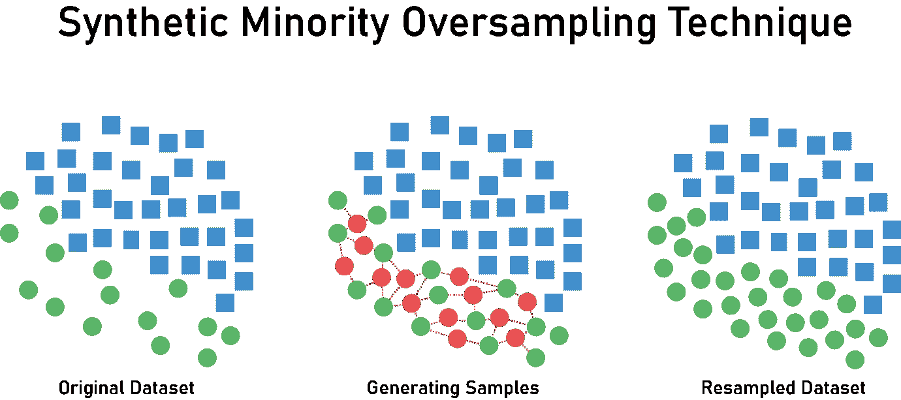
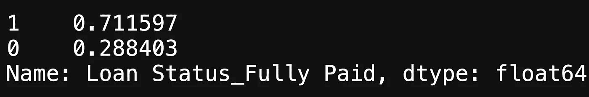
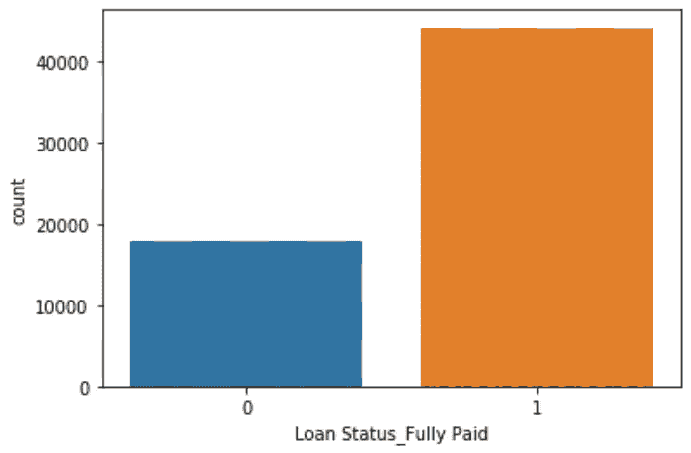
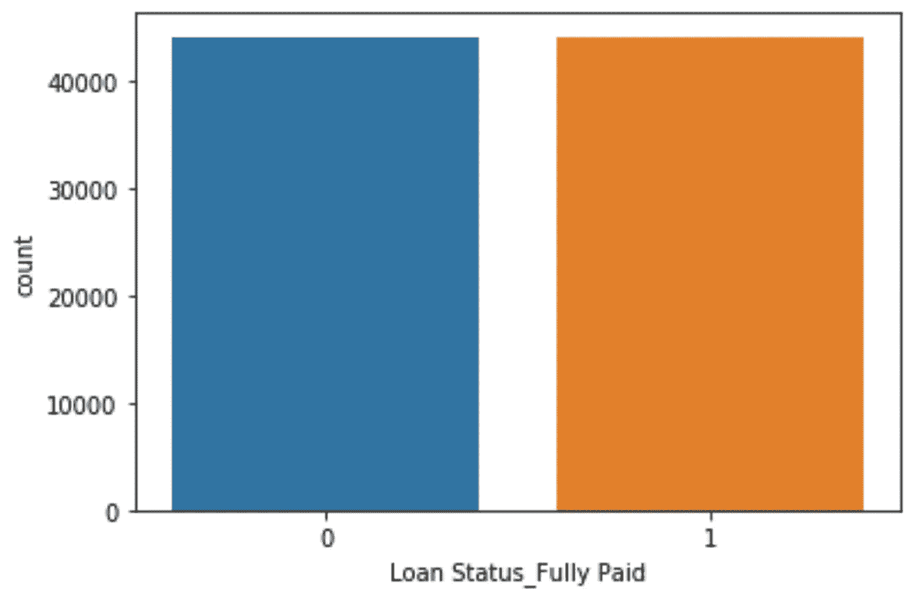

# 银行数据:SMOTE

> 原文：<https://medium.com/analytics-vidhya/bank-data-smote-b5cb01a5e0a2?source=collection_archive---------14----------------------->



这将是我们在接下来的几篇博文中深入分类之前的一篇短文。

如果我们回顾银行业数据，我们会发现因变量严重失衡。我们可以通过使用下面的代码来检查值计数，我们还可以使用 Seaborn 的计数图来获得一个可视化的表示。

```
# Dependent variable is imbalanced
y_train.value_counts(normalize=True)sns.countplot(y_train)
```



上面的图片告诉我们，一个类中的值比另一个类中的值多。这可能会给以后使用的机器学习模型带来麻烦；不平衡的数据会导致高偏差问题，产生更多的 1 型和/或 2 型错误。

## 重击

SMOTE，合成少数过采样技术，将允许我们适当地平衡我们的数据，以帮助未来的机器学习算法。

```
# Imbalance data
from imblearn.over_sampling import SMOTE# Intantiating Synthetic Minority Over Sampling Technique to balance target variable
sm = SMOTE(random_state=19)X_train_new, y_train_new = sm.fit_sample(X_train, y_train)sns.countplot(y_train_new)
```

上面的代码向我们展示了如何将训练数据与 SMOTE 对象 sm 相匹配。使用 Seaborn 的计数图将向我们显示因变量的新值计数。



看起来我们在这两个课程上有相同的分数。