# 银行存款认购预测

> 原文：<https://medium.com/analytics-vidhya/bank-deposit-subscription-predictions-66ded028e9a0?source=collection_archive---------27----------------------->

## 不同机器学习模型在银行营销策略预测中的比较

# **概述**

在过去几年中，各行业的金融科技投资大幅增加，尤其是银行，通过对其活动进行数字化，甚至在了解客户需求方面，对这一前沿技术产生了兴趣。对客户需求的深入了解有助于做出正确的决策，从而增加收入。通过比较各种机器学习技术，根据银行的用户参与度进行分析和预测，可以准确地确定银行营销策略的成功率和这些决策的实施。

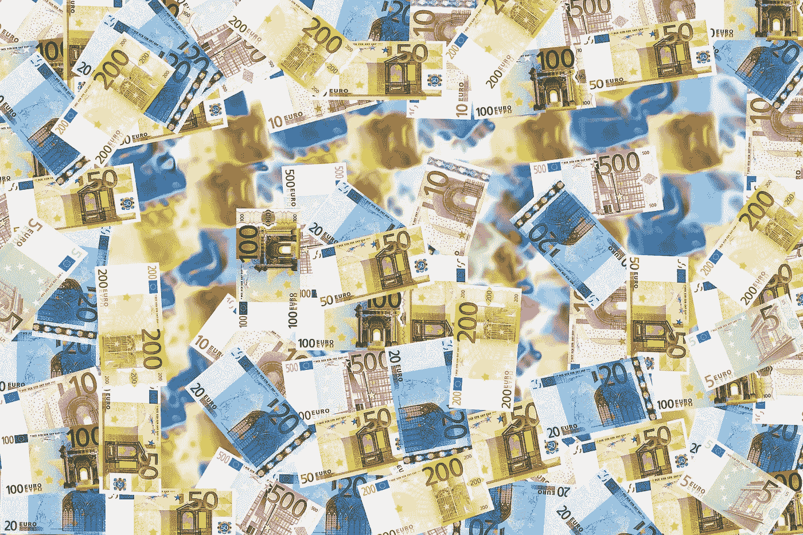

**目标**

建立 ML 模型的目的是预测客户是否会认购定期存款，并将重点放在对这些客户的营销工作上。另一方面，分析银行最近开展的营销活动并确定模式将有助于得出结论，以便在未来改进进一步的营销活动。对于整个项目工作，看看我的 [Github 库](https://github.com/Bessy-Mukaria/Bank-Deposit-Subscription-Prediction.git)。

## 数据信息

在这个项目中，我们将使用从 [UCI 机器学习数据集](http://archive.ics.uci.edu/ml/datasets/Bank+Marketing)存储库中下载的现有银行营销数据集(“Bank-additional-full.csv”)。

**装载包装**

**加载数据集**

## 数据理解

对数据的理解有助于更好地实施最佳的机器学习算法来部署解决数据问题。为此，我们可以使用 describe()函数来获取数据摘要。

## 检查缺少的值

我们将使用下面的类来检查数据集中缺失的值。

似乎我们的数据没有缺失值。现在让我们来看看任何异常值的数值变量的分布。

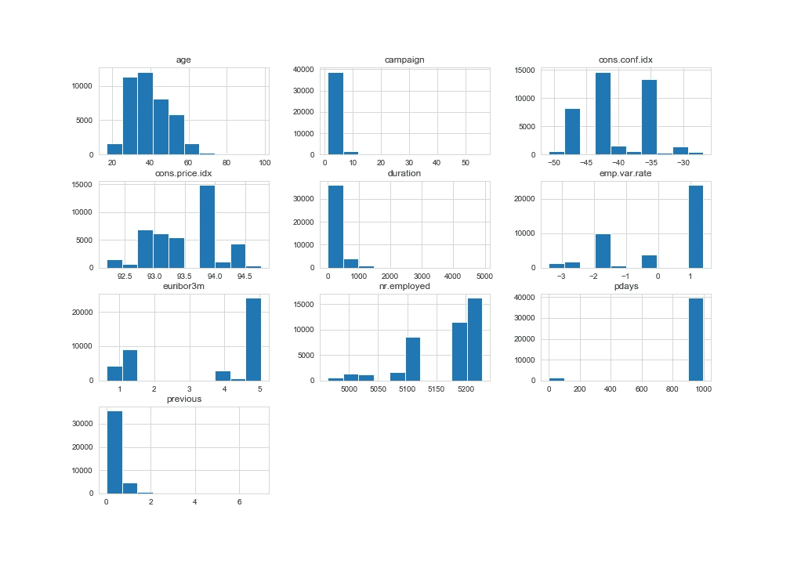

数字变量的分布

在上图中，可以假设年龄、活动、cons.conf.idx 等几个属性可以被视为异常值，因为它们比外部围栏的观察值更极端。

**变量的分布和可视化。**

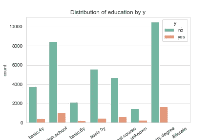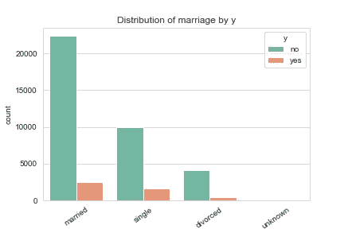

如上图所示，受过高等教育的客户选择了定期存款，而所有文盲都没有选择定期存款。同样值得注意的是，已婚人士定期存款，而离婚人士在银行存款最少。

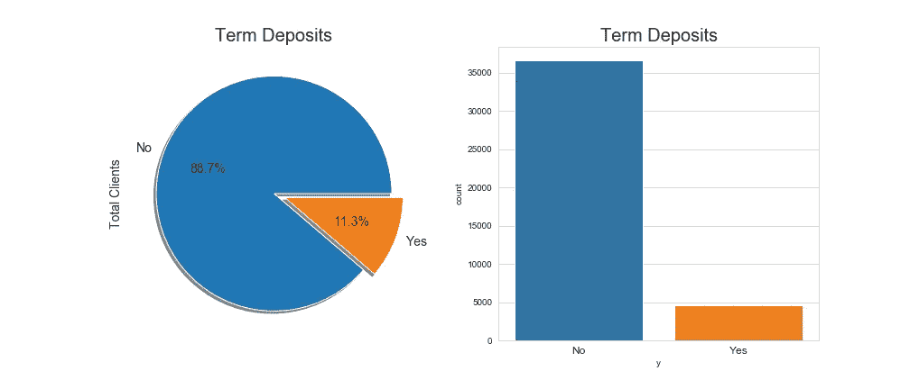

y(定期存款认购)的分配

从上述结果来看，大多数客户没有认购定期存款，占 88.7%，而 11.3%的客户接受了认购要约。我们试图预测的这种阶层比例的显著差异导致了不平衡的数据。

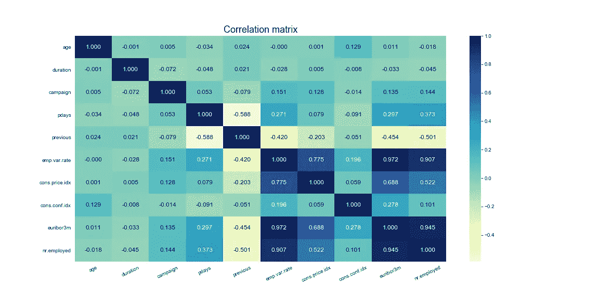

相关矩阵

**建模的数据预处理。**

因为持续时间属性高度影响输出目标(例如，如果持续时间=0，则 y =‘否’)。然而，在执行呼叫之前，持续时间是未知的。还有，结束通话后 y 显然是已知的。因此，该输入应仅用于基准目的，如果目的是获得现实的预测模型，则应将其丢弃。另外，为了确保编码后列数更少，我们将在教育和工作变量中加入一些属性。以下函数执行准备建模中的预处理。

**数据类型的转换**

对于分类特征选择，我们将获得虚拟变量，并用二进制编码对目标变量“y”进行编码。

当输入变量在建模之前被仔细转换或缩放时，许多机器学习模型表现得更好。因此，我们将通过缩放数据来转换我们的数据，以提高 ML 模型的性能。

**剔除异常值**

离群值可能会扭曲统计测量和数据分布，提供底层数据和关系的误导性表示。在建模之前从训练数据中移除异常值可以更好地拟合数据，从而获得更有技巧的预测。因此，我们需要摆脱离群值。

**处理班级失衡**

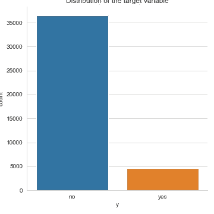

y(定期存款认购)的分配

与没有订阅的客户相比，更多的客户没有订阅。这是阶级不平衡的一个例子。当数据集具有代表性不足的数据时(在这种情况下，类是)，类分布开始偏斜。为了解决这个问题，我们将使用随机过采样方法，该方法从训练数据集中的少数类中复制示例。

**数据转换(降维)**

为了提高模型的性能，我们需要使用一种称为 PCA 的降维技术将数据的维度从 58 列减少到 10 列。主成分分析执行数据到低维空间的线性映射，使得低维表示中数据的方差最大化。

现在，我们的数据已经完全处理完毕，可以构建 ML 算法了

**模型构建**

在我们的例子中，我们将考虑三种模型；逻辑回归、XGBoost 分类和多层感知器。

**交叉验证的概念**

有两种类型；k 倍和分层 k 倍交叉验证。k 倍交叉验证过程包括将训练数据集分成 k 倍。分层 k-fold cv 是改进的 k-fold 交叉验证，训练测试分裂可用于保持数据集中的类别分布。在评估我们的三个模型时，我们将考虑 10 个方面。

下面是用于执行交叉验证并返回模型准确度分数、混淆矩阵和分类报告的帮助函数。

**结果**

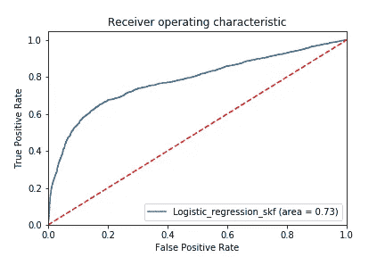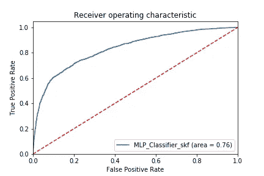

与采用分层 k 倍交叉验证的得分为 0.85 的其他模型相比，我们性能最好的模型是 XGBoost 分类器。

**模型评估**

虽然 XGBoost 的最终模型准确性相当，但快速查看 ROC 曲线，另一个模型指标表明使用分层 K-fold 交叉验证略有改善。

因此，我们可以确认分层 k 重交叉验证比 k 重交叉验证执行得更好，因为它保留了数据中的类别不平衡。此外，我们可以注意到，由于我们已经处理了班级不平衡，交叉验证的分数没有太大的差异

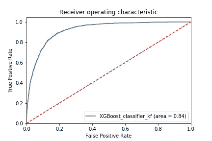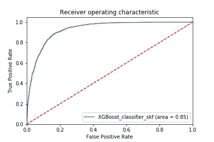

k 倍与分层

**超参数调谐:RandomizedSearchCV**

上述模型使用由 LogisticRegression、XGBoostClasssifier 和 MLPClassifier 模块确定的默认参数运行。我们可以通过调整模型的超参数来改进模型吗？

为了实现这一点，我们定义了希望在模型中测试的参数，并使用 RandomizedSearchCV 选择了最佳模型。为此，我们可以考虑我们的“最佳”模型，即 XGBoostClassifier。

这是 XGBoost 的最佳参数:

XGBClassifier(base_score=0.5，booster='gbtree '，colsample_bylevel=1，
colsample_bynode=1，colsample_bytree=0.6，gamma=0.5，
learning_rate=0，max_delta_step=0，max_depth=5，
min_child_weight=10，missing=None，n_estimators=100，n_jobs=1，
nthread=None，objective='binary:logistic '，random

**最终模型的结论:XGBoostClassifier**

XGBoost 模型分类报告和混淆矩阵:

```
Accuracy scores of the model: 0.85

 Classification report of the model
--------------------------------------
              precision    recall  f1-score   support

           0       0.83      0.88      0.85      3654
           1       0.87      0.82      0.84      3655

    accuracy                           0.85      7309
   macro avg       0.85      0.85      0.85      7309
weighted avg       0.85      0.85      0.85      7309Confusion Matrix of the model
--------------------------------------
[[3209  445]
 [ 656 2999]]
```

与其他模型相比，XGBoost 模型对于多数类和少数类都表现得更好，精度、召回指标和 f1 值都在 0.8 以上。因此，这是预测银行让客户认购定期存款的市场策略的最佳方法。

**参考文献**

[随机化搜索 CV](https://scikit-learn.org/stable/modules/generated/sklearn.model_selection.RandomizedSearchCV.html)

[超参数调谐](https://www.analyticsvidhya.com/blog/2016/03/complete-guide-parameter-tuning-xgboost-with-codes-python/)

[交叉验证](/datadriveninvestor/k-fold-cross-validation-6b8518070833)

[随机过采样](https://machinelearningmastery.com/random-oversampling-and-undersampling-for-imbalanced-classification/)

[降维](https://www.analyticsvidhya.com/blog/2018/08/dimensionality-reduction-techniques-python/)

感谢您的阅读！！我把这些放在一起作为第三批[10academy.org](http://10academy.org)培训的一部分。