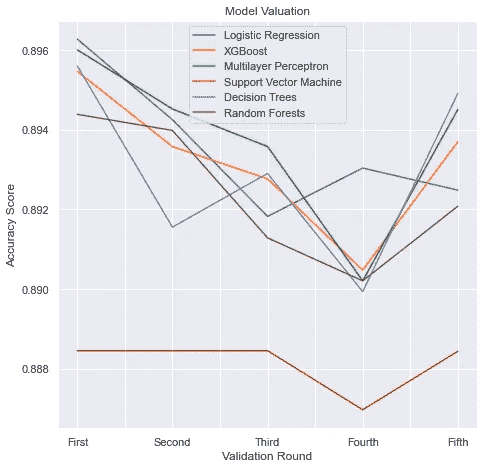

# 银行机构定期存款预测模型

> 原文：<https://medium.com/analytics-vidhya/bank-institution-term-deposit-predictive-model-14af2bbba70e?source=collection_archive---------23----------------------->

# 介绍

一家银行的投资和投资组合部门希望识别出有可能认购其定期存款的客户。

# 目标

这项活动旨在找到一个机器学习模型，该模型可以预测哪些未来客户会订阅他们的定期存款。这将提高世行活动的效率和有效性。

该银行将确定哪些客户会认购他们的定期存款，并利用这些信息向他们进行营销。这就是所谓的目标营销。

这将有助于他们更好地管理资源，避免浪费。

# 数据

这些数据集是从 UCI ML 网站下载的，人们可以从同一个网站上阅读更多关于这些数据的细节。

# 数据预处理

## 编码分类变量

为了准确处理数据，分类变量需要编码成数值。这可以使用不同类型的编码器来完成。

在本练习中，标签编码器用于将分类变量转换为数字变量。它用 0 和 n_classes-1 之间的值对分类变量进行编码。N_classes 是类别的数量。

```
*# Replacing categorical values with numerical values*
label_encoder = LabelEncoder()
all_columns = list(data_bank_additional_full.columns)
**for** x **in** all_columns:
  **if** type(data_bank_additional_full[x][0]) == str:
    **try**:
      data_bank_additional_full[x] = label_encoder.fit_transform(data_bank_additional_full[x])
    **except**:
      **continue**
```

## 处理异常值

众所周知，离群值会扭曲数据。离群值会影响机器学习算法的训练过程，从而导致准确性的损失。这可能导致模型不准确。

为了得到一个准确的模型，离群值通过用趋势的中心度量来代替它们而被去除。在本活动中，使用的衡量标准是“平均”。

```
all_columns = list(data_bank_additional_full.iloc[:,:20].columns)
**for** x **in** all_columns:
  **try**:
    data_bank_additional_full[x] = np.where(data_bank_additional_full[x] > data_bank_additional_full[x].quantile(0.975), data_bank_additional_full[x].quantile(0.50), data_bank_additional_full[x])
    data_bank_additional_full[x] = np.where(data_bank_additional_full[x] < data_bank_additional_full[x].quantile(0.025), data_bank_additional_full[x].quantile(0.50), data_bank_additional_full[x])
  **except** **TypeError**:
    **continue**
```

## 缩放所有数字列

具有不同大小、单位和范围的变量的数据集影响机器学习算法的训练过程。这是因为机器学习中使用的大多数算法在其计算中使用两个数据点之间的欧几里德距离。这给出了不同的结果。

标准化使变量具有共同的大小、单位和范围。有许多标准化数据的方法。在本练习中，使用了 StandardScaler()。它通过移除平均值并缩放至单位方差来标准化特征。

```
scaler = StandardScaler()
scaled_df = scaler.fit_transform(data_bank_additional_full.iloc[:,:20])
data_bank_additional_fullish = pd.DataFrame(scaled_df,columns = all_columns)
data_bank_additional_fullish['y'] = data_bank_additional_full['y']
data_bank_additional_full = data_bank_additional_fullish
```

## 降维技术

这些技术可以评估每一列的信息量，并删除那些信息量不足的列。在这项活动中，t 分布随机邻居嵌入，自动编码器和主成分分析分别探讨比较，以找到最好的降维技术使用。

**TSNE**

基于数据点之间的非线性局部关系，t 分布随机近邻嵌入(TSNE)降低了降维。它试图最小化联合概率之间的 Kullback-Leibler 散度

**自动编码器**

Autoencoder 是一种无监督的人工神经网络，使用反向传播算法进行训练，将输入向量复制到输出层。它的过程开始将原始数据压缩成短码，使用编码器忽略噪声。随后是一种算法，该算法使用解码器对短码进行解压缩，以生成尽可能接近原始输入的数据。

**PCA**

主成分分析(PCA)是一种统计过程，它将原始数据的数字列垂直转换为一组新的主成分。这是一种线性降维技术。

人们可以利用它从高维空间中提取信息。它保留数据差异较大的基本列，删除差异较小的非基本列。

## 选择降维技术

选择的降维技术是自动编码器。Autoencoder 输出可以更好地将信息压缩到低维潜在空间，利用其模拟复杂非线性函数的能力。从自动编码器得到的数据集比其他技术给出了更高的精度。

使用 t 分布随机邻域嵌入，原本有 21 个要素的数据集的维数会减少。这可以从所使用的机器学习模型的准确性降低中看出来。它是三种技术中精确度最低的。

使用主成分分析时，在应用主成分分析的结果数据集时，模型的准确性低于使用自动编码器时的准确性。

# 数据模型

要选择模型，交叉验证选择最好的机器学习模型。使用的交叉验证技术是分层 K-fold 和 K-fold。

**分层 K 折叠**是选择的交叉验证技术。使用分层 K- Fold，因为它生成包含相同类别分布或尽可能接近的测试集。它保留了数据集排序中的顺序依赖关系。分层 K 倍有一个小范围的交叉验证准确性得分。

使用的评估指标有:

*   **AUC 得分** 1 代表完美的分类器，0.5 代表无价值的分类器。
*   **F1 得分**是为预测测试的数据量。
*   **精度**是子集精度。为样本预测的标签集必须与 y_true 中对应的标签集完全匹配。
*   **精度得分**表示模型预测的精度水平。
*   **召回**是模型可以预测结果的数量。

对于上述内容，类助手将包含代码:

```
**class** **helper**:
  **def** __init__(self):
    print ("Helper object created")
  **def** confusion(self, y_pred):
    cnf_matrix = metrics.confusion_matrix(y_test, y_pred)
    class_names=[0,1] *# name  of classes*
    fig, ax = plt.subplots()
    tick_marks = np.arange(len(class_names))
    plt.xticks(tick_marks, class_names)
    plt.yticks(tick_marks, class_names)

    *# create heatmap*
    sns.heatmap(pd.DataFrame(cnf_matrix), annot=**True**, cmap=colour_palette ,fmt='g')
    ax.xaxis.set_label_position("top")
    plt.tight_layout()
    plt.title('Confusion matrix', y=1.1)
    plt.ylabel('Actual label')
    plt.xlabel('Predicted label')

  **def** roc_plot(self,model):
    y_pred_proba = model.predict_proba(X_test)[::,1]
    fpr, tpr, _ = metrics.roc_curve(y_test,  y_pred_proba)
    auc = metrics.roc_auc_score(y_test, y_pred_proba)
    plt.plot(fpr,tpr,label="data 1, auc="+str(auc))
    print("auc="+str(auc))
    plt.legend(loc=4)
    plt.show()

  **def** s_kfold(self,model):
    skfold = StratifiedKFold(n_splits=5, shuffle=**True**, random_state=1)

    scores = cross_val_score(model, X_train, y_train, cv=skfold,scoring='accuracy')
    print('**\n**Cross-Validation Accuracy Scores', scores)

    scores = pd.Series(scores)
    print('**\n**The minimum Cross-Validation Accuracy is  **%.4f** ' % scores.min())
    print('**\n**The mean Cross-Validation Accuracy is  **%.4f** ' % scores.mean())
    print('**\n**The maximum Cross-Validation Accuracy is  **%.4f** ' % scores.max())

  **def** kfold(self,model):
    kfold = KFold(n_splits=5, shuffle=**True**, random_state=1)

    scores = cross_val_score(model, X_train, y_train, cv=kfold,scoring='accuracy')
    print('**\n**Cross-Validation Accuracy Scores', scores)

    scores = pd.Series(scores)
    print('**\n**The minimum Cross-Validation Accuracy is  **%.4f** ' % scores.min())
    print('**\n**The mean Cross-Validation Accuracy is  **%.4f** ' % scores.mean())
    print('**\n**The maximum Cross-Validation Accuracy is  **%.4f** ' % scores.max())

  **def** calc_metrics(self,y_pred):
    print("**\n**F1 Score: **%.4f** " % metrics.f1_score(y_test, y_pred))
    print("**\n**Accuracy: **%.4f** " % metrics.accuracy_score(y_test, y_pred))
    print("**\n**Precision: **%.4f** " % metrics.precision_score(y_test, y_pred))
    print("**\n**Recall: **%.4f** " % metrics.recall_score(y_test, y_pred))
```

## 逻辑回归模型

逻辑回归是一种预测二元类的统计方法。结果或目标变量只是两个可能的类。

```
*# instantiate the model (using the default parameters)*
logistic_regressor = LogisticRegression()

*# fit the model with data*
logistic_regressor = logistic_regressor.fit(X_train,y_train)

*# predict*
y_pred = logistic_regressor.predict(X_test)
```

最小交叉验证准确度为 0.8916。

平均交叉验证准确度为 0.8941。

最大交叉验证准确度为 0.8955。

该病例的 AUC 得分为 0.7894。F1 的分数是 0.2632。精度为 0.8844。精度为 0.6028。召回率为 0.1683

## XGBoost

Boosting 是一种顺序技术，它结合了一组弱学习器并提高了预测精度。正确预测的结果权重较低，错误分类的结果权重较高。

```
*# instantiate the model (using the default parameters)*
xgboost_classifier = XGBClassifier()

*# fit the model with data*
xgboost_classifier = xgboost_classifier.fit(X_train,y_train)

*# predict*
y_pred = xgboost_classifier.predict(X_test)#XGBoost Tree
xgb.plot_tree(xgboost_classifier,num_trees=0) 
plt.rcParams['figure.figsize'] = [50, 10] 
plt.show()
```

最小交叉验证准确度为 0.8917。

平均交叉验证准确度为 0.8942。

最大交叉验证准确度为 0.8953。

该病例的 AUC 得分为 0.7927。F1 的分数是 0.2621。精度为 0.8852。精度为 0.6176。召回率为 0.1663。

## 多层感知器

多层感知器收集从用于接收信号的输入层建立的感知器。它有一个输出层，负责关于输入的决策或预测。多层感知器具有任意数量的隐藏层，代表机器学习算法的真实计算能力。

```
*# create mutli-layer perceptron classifier*
perceptron_classifier = MLPClassifier()

*# train*
perceptron_classifier = perceptron_classifier.fit(X, y)

*# make predictions*
y_pred = perceptron_classifier.predict(X_test)
```

最小交叉验证准确度为 0.8917。

平均交叉验证准确度为 0.8941。

最大交叉验证准确度为 0.8949。

该病例的 AUC 得分为 0.7102。F1 的分数是 0.3166。精度为 0.5419。精度为 0.1937。召回率为 0.8653。

## 支持向量机

支持向量机处理非线性输入空间。它对两组分类问题使用分类算法。

它被用于各种应用，例如人脸检测、入侵检测、电子邮件、新闻文章和网页的分类、基因的分类和手写识别。

```
*#Create a svm Classifier*
support_vector_classifier = svm.SVC(kernel='linear', probability=**True**)

*#Train the model using the training sets*
support_vector_classifier = support_vector_classifier.fit(X_train, y_train)

*#Predict the response for test dataset*
y_pred = support_vector_classifier.predict(X_test)
```

最小交叉验证准确度为 0.8849。

平均交叉验证准确度为 0.8872。

最大交叉验证准确度为 0.8885

该病例的 AUC 得分为 0.7462。F1 的分数是 0.0000。精度为 0.8774。精度为 0.0000。召回 0.0000。

## 决策树

决策树类似于流程图树结构，具有内部节点、分支和叶节点。内部节点表示特征。分支代表一个决策规则。每个叶节点代表结果。根节点是最高的。

决策树学习根据属性值进行划分。它使用递归分区对树进行分区。

决策树有助于决策。决策树的可视化就像一个流程图。这使得理解和解释变得容易，因为它模仿了人类水平的思维。

```
*# Create Decision Tree classifer object*
decision_tree_classifer = DecisionTreeClassifier(max_depth=5)

*# Train Decision Tree Classifer*
decision_tree_classifer = decision_tree_classifer.fit(X_train,y_train)

*#Predict the response for test dataset*
y_pred = decision_tree_classifer.predict(X_test)#Decision Tree
dot_data = StringIO()
export_graphviz(decision_tree_classifer, out_file=dot_data, filled=**True**, rounded=**True**, special_characters=**True**,feature_names = X.columns,class_names=['0','1'])
graph = pydotplus.graph_from_dot_data(dot_data.getvalue())  
graph.write_png('Term Deposits.png')
Image(graph.create_png()) 
```

最小交叉验证准确度为 0.8918。

平均交叉验证准确度为 0.8936。

最大交叉验证准确度为 0.8947。

该病例的 AUC 得分为 0.7891。F1 的分数是 0.2609。精度为 0.8844。精度为 0.6043。召回率为 0.1663。

## 随机森林

随机森林由树组成。树木越多，森林就越健壮。这些树是随机选择的数据样本上的决策树。这是从每棵树得到一个预测，并使用投票选择最佳解决方案。

```
*# create classifier object* 
random_forest_classifier = RandomForestClassifier() 

*# fit the classifier with x and y data* 
random_forest_classifier = random_forest_classifier.fit(X_train,y_train)

*#Predict the response for test dataset*
y_pred = random_forest_classifier.predict(X_test)
```

最小交叉验证准确度为 0.8913。

平均交叉验证准确度为 0.8935。

最大交叉验证准确度为 0.8947。

该病例的 AUC 得分为 0.7883。F1 的分数是 0.2646。精度为 0.8840。精度为 0.5931。召回率为 0.1703。

# 结论

选择该模型的依据是该模型的准确性、可解释性、复杂性和可扩展性。

最好的模型应该是 **XGBoost** 。

平均交叉验证准确度为 0.8942。

XGBoost 的 AUC 得分为 0.7927。这比所有其他 AUC 分数更接近于 1。F1 的分数是 0.2621。精度为 0.8852。精度为 0.6176。召回率为 0.1663。

下一个最好的模型是**逻辑回归**和**多层感知器**的结合。

**逻辑回归**

平均交叉验证准确度为 0.8941

逻辑回归的 AUC 得分为 0.7894。F1 的分数是 0.2632。精度为 0.8844。精度为 0.6028。召回率为 0.1683。

**多层感知器**

平均交叉验证准确度为 0.8941。

多层感知器的 AUC 分数是 0.7102。F1 的分数是 0.3166。精度为 0.5419。精度为 0.1937。召回率为 0.8653。



交叉验证准确性

链接到带有项目的 git 存储库—[https://github . com/mwi-kali/Bank-Institution-Term-Deposit-Predictive-Model](https://github.com/mwi-kali/Bank-Institution-Term-Deposit-Predictive-Model)

我把这些放在一起作为第三批[10academy.org](http://10academy.org/)培训的一部分。

# 参考

[纳夫拉尼，a，2018。Python 中的决策树分类。[在线] DataCamp 社区。](https://www.datacamp.com/community/tutorials/svm-classification-scikit-learn-python)

[纳夫拉尼，a，2019。支持向量机与 Scikit-Learn。[在线] DataCamp 社区。](https://www.datacamp.com/community/tutorials/svm-classification-scikit-learn-python?utm_source=adwords_ppc&utm_campaignid=1455363063&utm_adgroupid=65083631748&utm_device=c&utm_keyword=&utm_matchtype=b&utm_network=g&utm_adpostion=&utm_creative=278443377086&utm_targetid=aud-299261629574:dsa-429603003980&utm_loc_interest_ms=&utm_loc_physical_ms=9076857&gclid=CjwKCAjwyo36BRAXEiwA24CwGa2OoIYBqmBWZL_KcePBXotc_Ky7MN5xnyT0eF-U0DcAQfgaQ9RS1RoCx0IQAvD_BwE)

纳夫拉尼，2020 年。理解 Python 中的逻辑回归。[在线] DataCamp 社区。

[帕塔克，硕士，2020。在 Python 中使用 Xgboost。[在线] DataCamp 社区。](https://www.datacamp.com/community/tutorials/xgboost-in-python?utm_source=adwords_ppc&utm_campaignid=1455363063&utm_adgroupid=65083631748&utm_device=c&utm_keyword=&utm_matchtype=b&utm_network=g&utm_adpostion=&utm_creative=332602034364&utm_targetid=aud-299261629574:dsa-429603003980&utm_loc_interest_ms=&utm_loc_physical_ms=9076857&gclid=CjwKCAjwyo36BRAXEiwA24CwGU0BzB6TeKG_Ns2Kv7MskUTbIAHkS3ZgfZan1mfSXTqwA9os59WGnxoCiuUQAvD_BwE)

【Pythonprogramminglanguage.com】T4。2020.多层感知器——学习 Python。

[Quantdare。2020.用神经网络⋆量化器 Autoencoder 检测异常值。](https://quantdare.com/outliers-detection-with-autoencoder-neural-network/)

[Scikit-learn.org。2020.Sklearn。分解。PCA—sci kit—学习 0.23.2 文档。](https://scikit-learn.org/stable/modules/generated/sklearn.decomposition.PCA.html)

[Scikit-learn.org。2020.Sklearn。预处理。standard scaler—sci kit—学习 0.23.2 文档。](https://scikit-learn.org/stable/modules/generated/sklearn.preprocessing.StandardScaler.html)