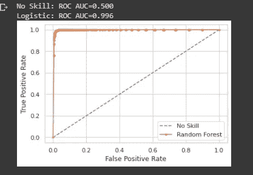

# 银行定期存款营销策略

> 原文：<https://medium.com/analytics-vidhya/bank-term-deposit-marketing-strategy-b9684e46c7cc?source=collection_archive---------13----------------------->

**预测谁是营销活动的最佳目标客户的数据科学方法**。


增加银行收入。

# 项目介绍

F 银行等金融机构通过借贷产生收入。贷款从客户的利息中产生利润，但也涉及一定程度的风险，这就是为什么机器学习算法在预测有资格获得贷款的客户时会很方便。金融机构产生收入的另一种形式是向银行借款或吸引公众储蓄，这比贷款风险要小一些。借贷的工作原理是这样的:银行将客户的长期存款投资于其他带来更好回报的领域，其中一部分支付给客户。然而，当客户进行定期存款时，公司比储蓄账户获得更好的回报，因为客户或客户被剥夺了在到期前存取资金的权利，除非客户准备补偿银行。

由于这个原因，银行之间存在着说服客户在他们的银行进行定期存款的激烈竞争，并且由于这种营销活动，银行花费了大量的金钱来接触客户、预期的订户和非预期的订户，因为银行不知道谁是谁不是。随着数据科学和机器学习的进步以及数据的可用性，银行正在适应数据驱动的决策，这将有助于降低营销成本，从而增加银行的收入。

在这个项目中，我们应用机器学习算法来建立数据集的预测模型，以便为营销活动团队提供必要的建议。**目标是预测客户是否会认购定期存款。**

# 数据集描述

项目的数据集从“ [**UCI ML**](http://archive.ics.uci.edu/ml/datasets/Bank+Marketing) **”网站下载。**该数据与一家葡萄牙银行机构的直接营销活动相关。营销活动以电话为基础。通常，如果产品(银行定期存款)被认购(“是”)或不被认购(“否”)，需要与同一客户进行多次联系。关于数据集和属性信息的更多描述可以在 **这里找到 [**。**](http://archive.ics.uci.edu/ml/datasets/Bank+Marketing)**

# 目标

***业务目标:*** 通过识别将订阅定期存款的客户，从而将营销工作引向他们，从而减少营销资源。

***分析目标:*** 拟合可能的模型集，预测哪一组客户最适合指导他们的营销活动。我们通过训练和测试数据集分析了五种不同的机器学习算法的性能。这将有助于葡萄牙银行的营销活动团队制定其电话营销定期存款计划的策略。

项目这一阶段的目标是:

1.数据预处理

2.模型建立和预测

3.性能比较和选择最佳模型

4.算法的局限性

5.总结和结论

# 1.数据预处理

收益算法对某些数据类型有亲和力，它们在这些数据类型上表现得非常好。众所周知，它们会给出带有未缩放或未标准化特征的鲁莽预测。

简而言之，预处理是指在将数据输入算法之前对其进行转换。在 python 中，scikit-learn 库在 sklearn.preprocessing 下具有预构建的功能，我们将在建模之前使用这些功能来转换数据。

首先，加载我们将使用的库。

下面的代码解释了应用于我们的数据的预处理，每个代码的简短描述与代码一起编写。

```
#importing data
data=pd.read_csv('bank-additional-full.csv',sep=";")#Viewing the shape our dataset
print("The data has {} rows with {} features/columns".format(data.shape[0], data.shape[1])) #ENCODING CATEGORICAL VARIABLES using OneHotEncoder# create an object of the OneHotEncoderOHE = ce.OneHotEncoder(cols=['job', 'marital', 'education', 'default','housing', 'loan','contact','month','day_of_week','poutcome'],use_cat_names=True)# encode the categorical variablespred1_data = OHE.fit_transform(data)#SCALING NUMERICAL DATA using robust scaler
# retrieve just the numeric input valuesnum_cols = ['emp.var.rate',"pdays","age", 'cons.price.idx','cons.conf.idx', 'euribor3m', 'nr.employed']# perform a robust scaler transform of the datasettrans = RobustScaler()pred1_data[num_cols] = trans.fit_transform(pred1_data[num_cols])#DIMENSIONALITY REDUCTION using PCApca = PCA(n_components=5) #We will choose five componentspca_result = pca.fit_transform(X)plt.plot(range(5), pca.explained_variance_ratio_)plt.plot(range(5), np.cumsum(pca.explained_variance_ratio_))plt.title("Component-wise and Cumulative Explained Variance")#CLASS BALANCING by oversampling
ran=RandomOverSampler()
X_ran,y_ran= ran.fit_resample(train_X,train_Y)
print('The new data contains {} rows '.format(X_ran.shape[0]))
#plot_2d_space(X_ran,y_ran,X,y,'over-sampled')
```

# 2.模型建立和预测

在将数据输入模型之前，我们需要将数据集分为训练数据集和测试数据集。我们将使用 sklearn 火车测试拆分。

```
from sklearn.model_selection import train_test_split,cross_val_score#Splitting the data
X_train,X_test,y_train,y_test = train_test_split(X,y,test_size = 0.2,random_state=1)# returning the shape of our split data
print(X_train.shape)
print(y_train.shape)
print(X_test.shape)
print(y_test.shape)
```

**2.1 逻辑回归**

逻辑回归是一种统计模型，其基本形式是使用逻辑函数来模拟二元相关变量(客户是否会认购定期存款{ '是'或'否' })。

下面是训练模型的代码，也是使用不同的度量评估模型的代码。

```
# create an object of the LinearRegression Model model_LR = LogisticRegression()# fit the model with the training data model_LR.fit(X_train, y_train)
# making the predictions predict_test  = model_LR.predict(X_test)
# Getting the **confusion matrix** confusion_matrix = confusion_matrix(y_test, predict_test)
# getting the **classification report**

  report = classification_report(y_test, predict_test)#**ROC Curve** for the modelns_probs = [0 for _ in range(len(y_test))]# predict probabilitieslr_probs = model_LR.predict_proba(X_test)# keep probabilities for the positive outcome onlylr_probs = lr_probs[:, 1]# calculate scoresns_auc = roc_auc_score(y_test, ns_probs)lr_auc = roc_auc_score(y_test, lr_probs)# summarize scoresprint('No Skill: ROC AUC=%.3f' % (ns_auc))print('Logistic: ROC AUC=%.3f' % (lr_auc))# calculate roc curvesns_fpr, ns_tpr, _ = roc_curve(y_test, ns_probs)lr_fpr, lr_tpr, _ = roc_curve(y_test, lr_probs)# plot the roc curve for the modelpyplot.plot(ns_fpr, ns_tpr, linestyle='--', label='No Skill')pyplot.plot(lr_fpr, lr_tpr, marker='.', label='Logistic')# axis labelspyplot.xlabel('False Positive Rate')pyplot.ylabel('True Positive Rate')# show the legendpyplot.legend()# show the plotpyplot.show()
```

**2.2 XGBoost 分类器**

XGBoost 是梯度增强决策树的一种实现，旨在提高速度和性能，是占主导地位的竞争机器学习。

下面是 XGBoost 的实现代码和模型评估。

```
# create an object of the XGBoost Model
model = XGBClassifier()# fit model with training data
model.fit(X_train, y_train)# make predictions for test data
y_pred = model.predict(X_test)# evaluate predictions
accuracy = accuracy_score(y_test, y_pred)
print("**Accuracy**: %.2f%%" % (accuracy * 100.0))#getting the **XGBoost classification report**
xgb_report = classification_report(y_test, y_pred)
print(xgb_report)#**ROC Curve for XGBoost model**ns_probs = [0 for _ in range(len(y_test))]# predict probabilities
lr_probs = model.predict_proba(X_test)# keep probabilities for the positive outcome only
lr_probs = lr_probs[:, 1]# calculate scores
ns_auc = roc_auc_score(y_test, ns_probs)
lr_auc = roc_auc_score(y_test, lr_probs)# summarize scores
print('No Skill: ROC AUC=%.3f' % (ns_auc))
print('Logistic: ROC AUC=%.3f' % (lr_auc))# calculate roc curves
ns_fpr, ns_tpr, _ = roc_curve(y_test, ns_probs)
lr_fpr, lr_tpr, _ = roc_curve(y_test, lr_probs)# plot the roc curve for the model
pyplot.plot(ns_fpr, ns_tpr, linestyle='--', label='No Skill')
pyplot.plot(lr_fpr, lr_tpr, marker='.', label='Logistic')# axis labels
pyplot.xlabel('False Positive Rate')
pyplot.ylabel('True Positive Rate')# show the legend
pyplot.legend()# show the plot
pyplot.show()
```

**2.3 多层感知器**

**多层感知器**是一个逻辑回归器，它不是将输入输入逻辑回归，而是插入一个中间层，称为隐藏层，它具有非线性激活函数(通常是 tanh 或 sigmoid)

下面是实现模型和评估的代码。

```
from sklearn.neural_network import MLPClassifier#create an object of the Multilayer Perceptron Classifier Model
 mlp = MLPClassifier(hidden_layer_sizes=(8,8,8), activation='relu',    solver='adam', max_iter=500)# fit neural network  model with training data
mlp.fit(X_train,y_train)# Predicting
predict_test = mlp.predict(X_test)#Evaluating the Neural Network model
 print(confusion_matrix(y_train,predict_train))
 print(classification_report(y_train,predict_train))# ROC Curve of the Neural Network model
ns_probs = [0 for _ in range(len(y_test))]# predict probabilities
lr_probs = mlp.predict_proba(X_test)# keep probabilities for the positive outcome only
lr_probs = lr_probs[:, 1]# calculate scores
ns_auc = roc_auc_score(y_test, ns_probs)
lr_auc = roc_auc_score(y_test, lr_probs)# summarize scores
print('No Skill: ROC AUC=%.3f' % (ns_auc))
print('Logistic: ROC AUC=%.3f' % (lr_auc))# calculate roc curves
ns_fpr, ns_tpr, _ = roc_curve(y_test, ns_probs)
lr_fpr, lr_tpr, _ = roc_curve(y_test, lr_probs)# plot the roc curve for the model
pyplot.plot(ns_fpr, ns_tpr, linestyle='--', label='No Skill')
pyplot.plot(lr_fpr, lr_tpr, marker='.', label='Logistic')# axis labels
pyplot.xlabel('False Positive Rate')
pyplot.ylabel('True Positive Rate')# show the legend
pyplot.legend()# show the plot
pyplot.show()
```

**2.4 随机森林**

随机森林或随机决策森林是一种用于分类、回归和其他任务的集成学习方法，它通过在训练时构建大量决策树并输出作为各个树的类(分类)或均值预测(回归)的模式的类来操作。

下面是实现该模型的代码。

```
#Create a Gaussian Classifier
clf=RandomForestClassifier(n_estimators=100)#Train the model using the training sets
clf.fit(X_train,y_train)
RF_pred=clf.predict(X_test)# Model Accuracy, how often is the classifier correct?print("Accuracy:",metrics.accuracy_score(y_test, RF_pred))#ROC Curve 
ns_probs = [0 for _ in range(len(y_test))]# predict probabilities
lr_probs = clf.predict_proba(X_test)# keep probabilities for the positive outcome only
lr_probs = lr_probs[:, 1]# calculate scores
ns_auc = roc_auc_score(y_test, ns_probs)
lr_auc = roc_auc_score(y_test, lr_probs)# summarize scores
print('No Skill: ROC AUC=%.3f' % (ns_auc))
print('Logistic: ROC AUC=%.3f' % (lr_auc))# calculate roc curves
ns_fpr, ns_tpr, _ = roc_curve(y_test, ns_probs)
lr_fpr, lr_tpr, _ = roc_curve(y_test, lr_probs)# plot the roc curve for the model
pyplot.plot(ns_fpr, ns_tpr, linestyle='--', label='No Skill')
pyplot.plot(lr_fpr, lr_tpr, marker='.', label='Logistic')# axis labels
pyplot.xlabel('False Positive Rate')
pyplot.ylabel('True Positive Rate')# show the legend
pyplot.legend()# show the plot
pyplot.show()
```

**2.5 决策树**

决策树分类器通过构建决策树来创建分类模型。树中的每个节点指定一个属性测试，从该节点开始的每个分支对应于该属性的一个可能值。

下面是代码实现部分。

```
from scipy.stats import randintmax_depth_value = [3, None]
max_features_value =  randint(1, 4)
min_samples_leaf_value = randint(1, 4)
criterion_value = ["gini", "entropy"]param_grid = dict(max_depth = max_depth_value,
max_features = max_features_value,
min_samples_leaf = min_samples_leaf_value,criterion =criterion_value)#Create a decision tree Classifier and make predictionsmodel_CART = DecisionTreeClassifier()
CART_RandSearch =RandomSearch(X_train,y_train,model_CART,param_grid)
Prediction_CART = CART_RandSearch.BestModelPridict(X_test)
print("Accuracy:",metrics.accuracy_score(y_test, Prediction_CART))#Getting a report of the modelDC_report = classification_report(y_test, Prediction_CART)
print(DC_report)
```

# 3.性能比较和选择最佳模型

正如我们已经看到的，我们建立的五个模型在预测客户是否会同意银行的定期存款方面有自己的准确性。正如预期的那样，在三种分类算法之间，在准确度和 F1_score 方面存在一些变化。

**算法准确率百分比**

1.  逻辑回归模型:71%
2.  XGBoost 分类器:73.79%
3.  多层感知器:71.45%
4.  随机森林:96.79%
5.  决策树分类器:94.3%

根据准确率，数据集最可靠的模型似乎是**随机森林模型**，只有 96.79%。

下面是我们的获奖模型，随机森林分类器的 ROC 曲线。



随机分类器模型的 ROC 曲线

# 4.算法的优点和局限性

逻辑回归的优点是易于解释，它指导模型逻辑概率，并为结果提供一个置信区间。然而，逻辑算法的主要缺点是它存在多重共线性，因此，解释变量必须是线性无关的。

逻辑回归方法在上述模型中的一些局限性如下

1.  该模型有一些在模型中有意义的未知预测值。这些变量实际上并不携带任何有用的信息，但它们的重要性可能会影响模型的可预测性。

# 5.总结和结论

从进行的研究来看，在使用机器学习算法来决定银行的营销活动方面，结果令人印象深刻，令人信服。几乎所有的属性都对预测模型的构建有很大的贡献。在用于对数据建模的五种分类方法中，**随机森林模型**产生了最好的准确度，只有 96.79%。该模型简单且易于实现。

如果客户的信息(如教育、住房贷款、个人贷款、通话持续时间、在此活动中执行的联系次数、以前的结果等)可用，银行营销经理可以通过使用该模型来识别潜在客户。这将有助于减少银行的成本，避免致电不太可能认购定期存款的客户。他们可以使用这种模式开展更成功的电话营销活动。

> [***找到整个项目的链接，了解更多信息。***](https://github.com/Davidelvis/BankClientTermDeposit_Prediction)

# 6.参考

UCI 机器学习知识库，*银行营销数据集*在线查看于

[*https://archive.ics.uci.edu/ml/datasets/Bank+Marketing*](https://archive.ics.uci.edu/ml/datasets/Bank+Marketing)

[多层感知器](https://scikit-learn.org/stable/modules/generated/sklearn.neural_network.MLPClassifier.html)

[Xgboost](https://xgboost.readthedocs.io/en/latest/python/python_api.html)