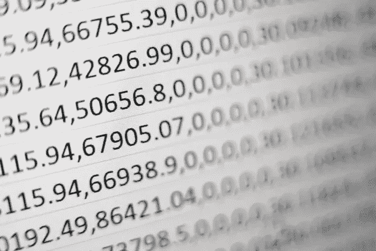

# Base 36 —为什么以及如何重要？

> 原文：<https://medium.com/analytics-vidhya/base-36-why-how-its-important-a7b084b02548?source=collection_archive---------5----------------------->

我们大多数人都熟悉二进制、八进制、十进制、十六进制的计数系统。今天我们来学习一下 36 进制，以及它为什么如此酷。

米卡·鲍梅斯特在 [Unsplash](https://unsplash.com/s/photos/number?utm_source=unsplash&utm_medium=referral&utm_content=creditCopyText) 上的照片

**什么是基数 36？**

二进制由值 0 和 1 组成
十进制:0 到 9
八进制:0 到 7
十六进制:0 到 9 和 A 到 F
基数 36:(十六进制)0 到 9 和 A 到 Z