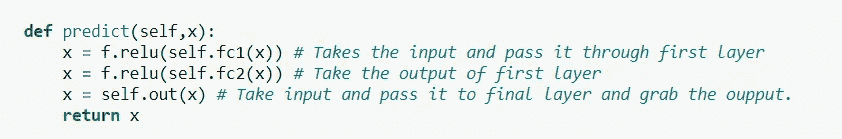
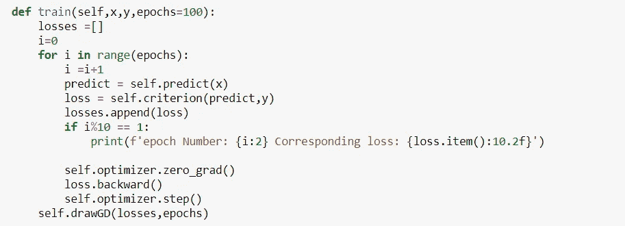
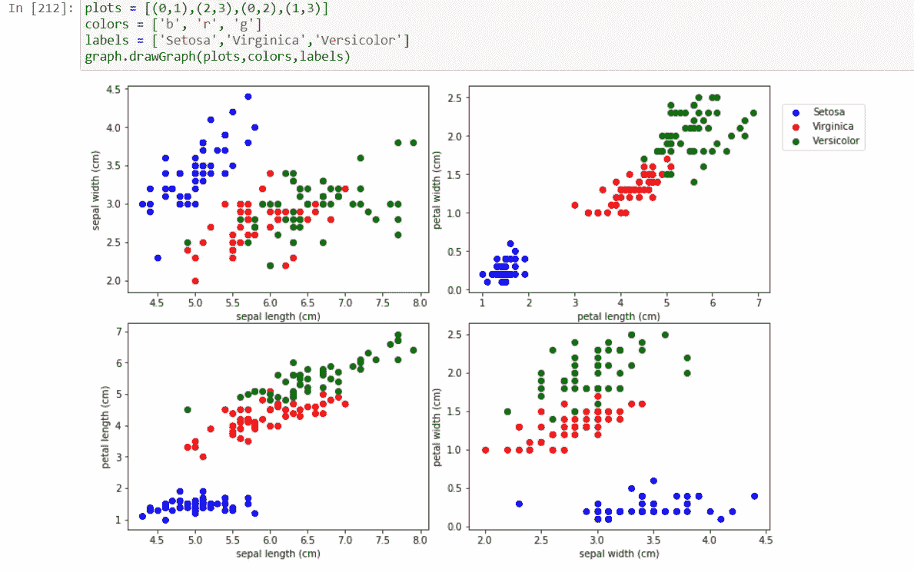
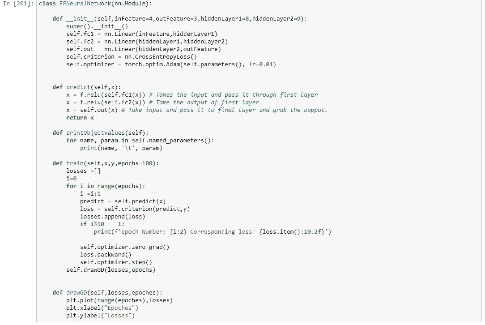
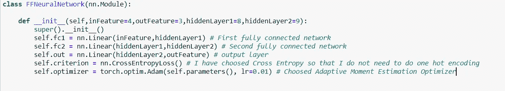
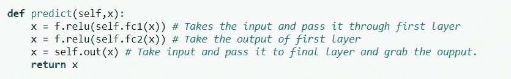
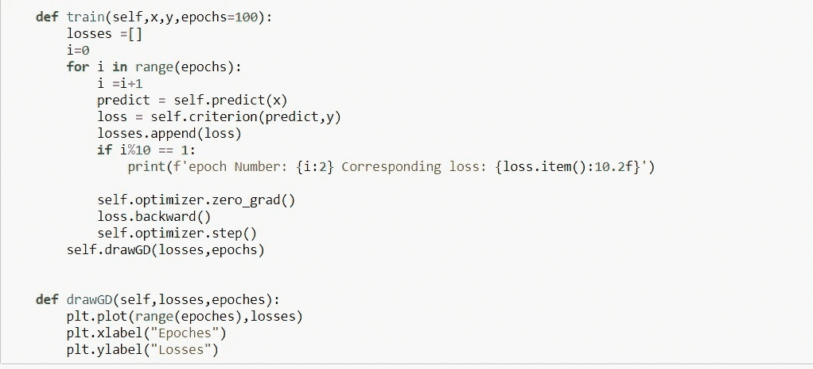
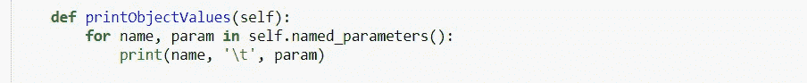
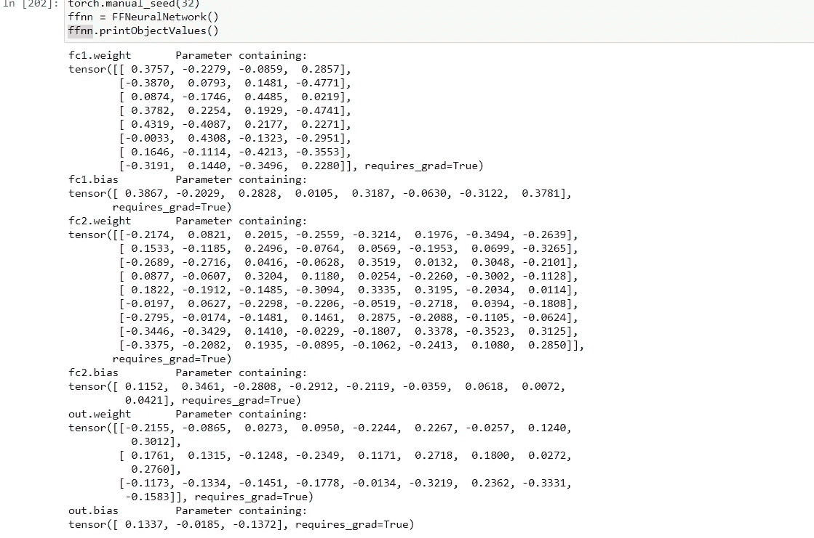
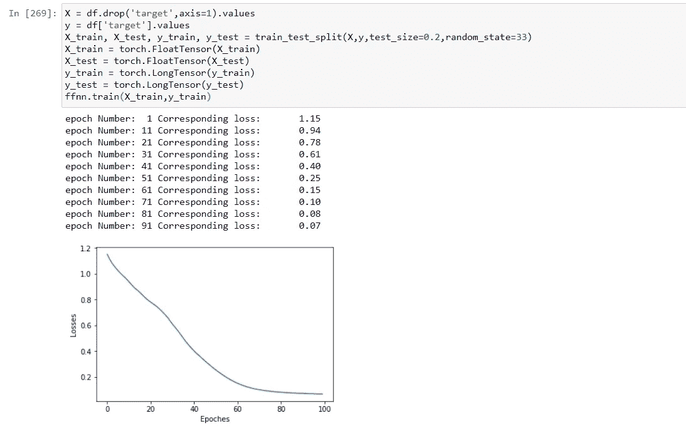

# 使用 PyTorch 的基本神经网络

> 原文：<https://medium.com/analytics-vidhya/basic-ann-using-pytorch-d4443f1c936c?source=collection_archive---------14----------------------->

PyTorch 作为一个框架有很多可以提供的，用最少的代码行我们可以实现很多。你可以建立任何你喜欢的神经网络。如果你知道前向传播和后向传播背后的理论，你可以理解从头开始写它将是一个相当的体验。但肯定不是用 PyTorch，只需几行代码就可以了。

对于正向传播[我将详细介绍并解释]

用于反向传播

让我们从机器学习的 hello world 示例开始，即虹膜数据集。数据可以从下面的链接下载。

 [## 鸢尾属物种

### 在这个经典数据集中，将鸢尾属植物分为三个种类

www.kaggle.com](https://www.kaggle.com/uciml/iris) 

作为第一步，我们将借助 matplotlib 以图形格式分析数据。我已经提到了用于绘制图形的代码。

从图表中可以很容易地将它与其他两个类别区分开来。

绘制图形的代码可以从这里下载

 [## nirmal 1067/pytorchesamples

### Permalink GitHub 是 5000 多万开发人员的家园，他们一起工作来托管和审查代码、管理项目以及…

github.com](https://github.com/nirmal1067/PyTorchExamples/blob/master/DrawInputDataGraph) 

下面是神经网络的代码。我将系统地详细介绍它。

代码可以在下面的链接中查看。

 [## nirmal 1067/pytorchesamples

### 在 GitHub 上创建一个帐户，为 nirmal 1067/pytorchesamples 的开发做出贡献。

github.com](https://github.com/nirmal1067/PyTorchExamples/blob/master/FFNeuralNetwork.py) 

首先定义类扩展神经网络。模块。在构造函数中，我传递输入特征的数量，在 iris 的情况下可能的输出是 3，hiddenlayer1 中的神经元数量和 hiddenlayer2 中的神经元数量。你可以在 hiddenlayer 中选择不同数量的神经元。通常，该参数是基于超参数优化来选择的。我选择了 ADAM 优化器和交叉熵作为损失函数。请检查下面的代码，它不言自明，一切都是由 PyTorch 提供的。

在前向传播中，我只是使用 Relu 作为激活函数，将一层的输出传递到另一层，直到它到达输出层，这是预测值。由于 PyTorch，看起来很简单。

在训练方法中，我使用内置特性进行反向传播。默认情况下，这里使用的历元数是 100。这就是神奇发生的地方向后()利用微分链法则求梯度。step()方法根据学习率调整神经元的权重，记住学习率 0.01 已经用于初始化构造函数中的优化器。zero_grad()将在每次迭代中停止复合。drawGD 方法简单地绘制了 epoch 与 loss 的关系。如果你想知道你的模型损失相对于每个时期是如何改善的，这是很有帮助的。

为了打印模型的偏差和权重，使用下面的方法。

当您最初调用此方法时，它显示默认值。如下图所示，

现在是使用数据训练模型的时候了。如下图所示，我首先使用 pandas 加载数据，然后执行数据清理以区分输入和输出[请参考代码中的注释]。然后，我使用 scikitlearn 的测试训练分割方法分割数据，并为其提供我们模型的训练方法。因为我们已经通过了训练方法。它封装了反向传播并绘制了损耗与时间关系图。

完整的代码在下面的链接。

 [## nirmal 1067/pytorchesamples

### 在 GitHub 上创建一个帐户，为 nirmal 1067/pytorchesamples 的开发做出贡献。

github.com](https://github.com/nirmal1067/PyTorchExamples)