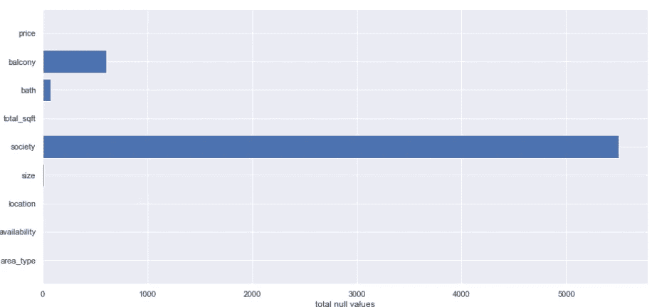

# 班加罗尔房价预测的线性回归

> 原文：<https://medium.com/analytics-vidhya/basic-application-of-linear-regression-on-bangalore-house-price-prediction-18a128a49c96?source=collection_archive---------4----------------------->


机器学习中的线性回归(y = mx+c)是用来寻找直线的最佳斜率(m)和截距(c)的基本算法之一，它试图以最小的误差拟合所有的数据点。

在这篇博客中，我尝试使用 sklearn 库对班加罗尔房价预测数据应用线性回归算法，并进行一些可视化。

```
**import** **pandas** **as** **pd**
**import** **seaborn** **as** **sns**
**import** **matplotlib.pyplot** **as** **plt**
**import** **numpy** **as** **np**
**import** **re****import** **warnings**pd.set_option('max.columns',**None**)
warnings.filterwarnings("ignore")
sns.set()data = pd.read_csv('Predicting-House-Prices-In-Bengaluru-Train-Data.csv')
print(data.shape)
data.head()
```


> **数据可视化**

```
data['area_type'].value_counts()
```


```
plt.figure(figsize=(15,7))
plt.bar(data['area_type'].value_counts().index,data['area_type'].value_counts().values)
plt.show()
```


```
plt.figure(figsize=(15,7)) 
sns.distplot(data[‘price’]) 
plt.show()
```


我们可以观察到价格值向左倾斜，并且大多小于 500

```
plt.figure(figsize=(15,7))
sns.boxplot(data=data,x=data['area_type'],y=data['price'])
plt.show()
```


```
sub_data = data[data['area_type'] == 'Plot  Area']plt.figure(figsize=(15,7))
sns.boxplot(data=sub_data,x=sub_data['balcony'],y=sub_data['price'])
plt.show()
```


```
plt.figure(figsize=(15,7)) sns.boxplot(data=sub_data,x=sub_data[‘bath’],y=sub_data[‘price’]) plt.show()
```


> **处理缺失值**

```
data.isnull().sum()
```


```
plt.figure(figsize=(15,7))
plt.barh(data.isnull().sum().index,width=data.isnull().sum().values)
plt.xlabel('total null values')
plt.show()
```



```
data['balcony'].replace({0.0:1,1.0:2,2.0:3,3.0:4},inplace=**True**)
data['balcony'].unique()data.fillna(0,inplace=**True**)
data.isnull().sum()
```


> 处理分类值

```
data.head()
```


```
cat_columns = [‘area_type’,’availability’,’location’,’size’,’society’,’bath’,’balcony’] 
**for** col **in** data.columns: 
   **if** col **in** cat_columns: 
      data[col] = data[col].astype(‘category’) 
      data[col] = data[col].cat.codes
```


> **数据清理**

```
data['total_sqft'] = data['total_sqft'].apply(**lambda** x: x.split(' - ')[1] **if** (len(x.split(' - ')))>1 **else** x.split(' - ')[0]) data['total_sqft'] = data['total_sqft'].apply(**lambda** x: re.findall(r'\d+',x)[0]) data['total_sqft'] = data['total_sqft'].astype(np.float64)
```

> **列车测试分割**

```
**from** **sklearn.model_selection** **import** train_test_split
train,test = train_test_split(data,test_size = 0.2,shuffle = **True**,random_state = 41)

y_train = train['price'] x_train = train.drop('price',axis = 1)  y_test = test['price'] x_test = test.drop('price',axis = 1)
```

> **线性回归模型**

```
**from** **sklearn.linear_model** **import** LinearRegression,SGDRegressor 
**from** **sklearn.metrics** **import** mean_squared_error

model = LinearRegression() 
model.fit(x_train,y_train)
prediction = model.predict(x_test)
np.sqrt(mean_squared_error(y_test,prediction))
##answer - 108.26plt.figure(figsize=(15,7))
sns.distplot(y_test,color= 'r')
sns.distplot(prediction)
plt.show()
```


红色-真值，蓝色-预测值

```
model.coef_,model.intercept_*# Plot between first hundred "total area in sqft" and actual output*
plt.plot(x_test['total_sqft'][:100],x_test['total_sqft'][:100]*model.coef_[5]+model.intercept_)
plt.scatter(x_test['total_sqft'][:100],y_test[:100])
```

