# 任何机器学习/深度学习项目的基本架构

> 原文：<https://medium.com/analytics-vidhya/basic-architecture-of-any-machine-learning-deep-learning-project-21e687250f22?source=collection_archive---------9----------------------->

## 深度学习的祈祷:第二部分

## 机器学习/深度学习项目管道介绍


深度学习封面图片的祈祷

为了更好地理解深度学习，我们应该熟悉一些概念，如张量、张量运算、梯度下降、微分等等。我们将逐一分解这些概念。但在进入这些概念之前，让我们快速刷新一下任何深度学习/机器学习项目的总体架构。这也被称为机器学习/深度学习项目的管道。

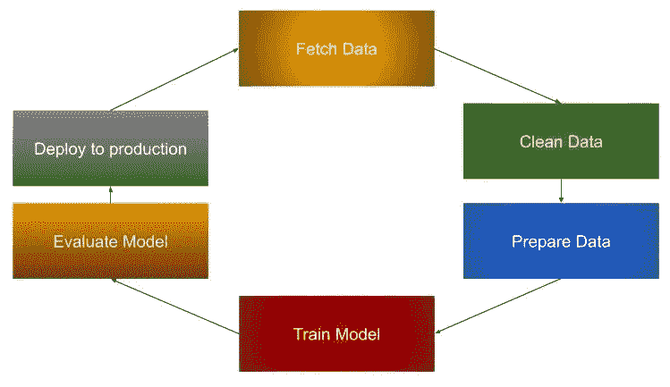

机器学习|深度学习管道

## 取数据

获取数据仅仅意味着收集所需的数据。要收集的数据类型取决于我们参与的项目。例如，如果我们正在处理一家公司的销售预测，那么我们收集与该公司相关的历史销售数据，在这种情况下，数据将主要是文本数据。另一方面，如果你试图做一些图像分类，那么数据将是图像。

## 清理/准备数据—数据预处理

数据预处理是将原始数据转换为某种其他表示形式的过程，以便数据科学家和分析师可以通过机器学习/深度学习算法来运行它，以揭示见解或做出预测。

现在让我们快速探索一下数据预处理的步骤。

**处理空值**

在现实世界的数据中，会有一些由于各种原因导致数据缺失的情况。这可能是由于数据损坏、数据无效或无法加载数据等原因造成的。处理这种丢失的值是一个重要的挑战，因为机器学习模型的质量取决于我们如何处理这些损坏的数据。

有各种方法来处理这个问题。最简单的方法是删除包含空值的行。

*用于演示该示例的数据集取自*[*【geeksforgeeks.org】*](https://www.geeksforgeeks.org/ml-handling-missing-values/)

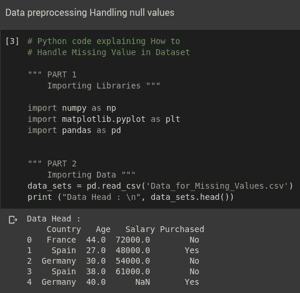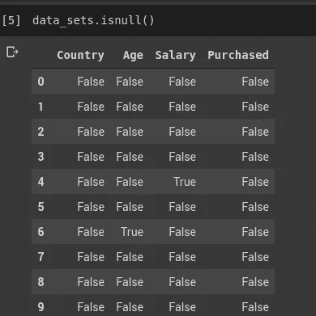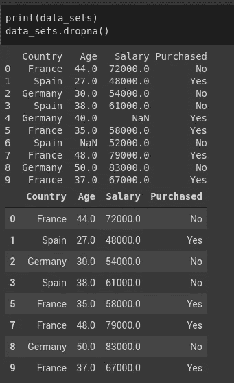

**图 1** :导入数据| **图 2** : isnull() —返回一个布尔矩阵，如果值为 NaN，则返回 True，否则返回 False | **图 3** : dropna() —删除所有包含空值的行

图 3 —我们使用 dropna()删除空值行。

我们还可以使用带有各种参数的 dropna()来删除包含空值的列，删除列和行，或者删除特定的阈值，等等。更多信息请参考链接: [dropna()用法](https://www.geeksforgeeks.org/python-pandas-dataframe-dropna/#:~:targetText=Pandas%20dropna()%20method%20allows,Null%20values%20in%20different%20ways.&targetText=Parameters%3A,or%20'columns'%20for%20String.)

删除空值似乎很容易，但这不是最佳选择，因为删除行和列会导致重要信息的丢失。所以处理这个问题的另一种方法是用一些方法来替代丢失的值。这个替代缺失值的过程称为**插补。**

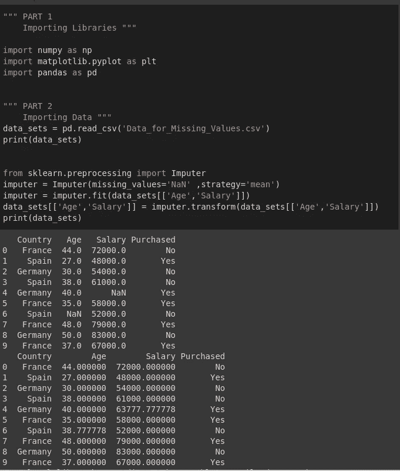

**图 4:** 估算器用法|缺失值由列值的平均值替代。

## 标准化

标准化是重新调整一个或多个属性的过程，使平均值为 0，标准差为 1。

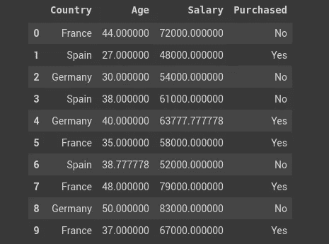

**图 5**

在图 5 中，让我们考虑列*年龄*和 S *薪水*因为它们不在同一个刻度上，并且*薪水*总是大于年龄**，机器学习算法给予*薪水*更多的重要性。这可能会产生问题，因为年龄也是一个重要因素**。因此，为了解决这个问题，我们使用标准化。

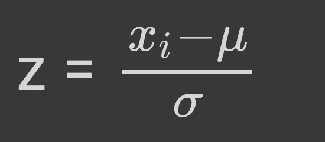

**图 6:** 标准化公式

为了标准化变量，我们计算变量的平均值和标准差。然后，对于变量的每个观察值，我们减去平均值并除以标准差。

```
from sklearn.preprocessing import StandardScalerfrom sklearn.model_selection import train_test_split
import pandas as pddata_sets = pd.read_csv(‘Data.csv’)data_sets = data_sets.valuesstd = StandardScaler()
X = data_sets[:, 0:3]
y = data_sets[:, 3:]X_train, X_test, y_train, y_test = train_test_split(X, y, test_size=0.33, random_state=42)X_train[:,1:3] = std.fit_transform(X_train[:,1:3])
X_test[:,1:3] = std.transform(X_test[:,1:3])print(X_train)
print()
print(X_test)
```

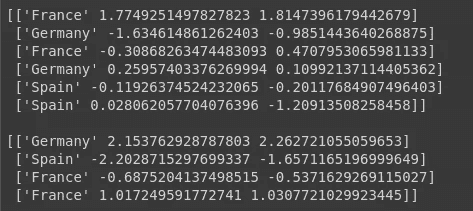

**图 7** :上述代码片段的输出

> **注**
> 
> **来源:**[https://datascience.stackexchange.com/](https://datascience.stackexchange.com/questions/12321/difference-between-fit-and-fit-transform-in-scikit-learn-models#:~:targetText=In%20summary%2C%20fit%20performs%20the,in%20one%20possibly%20optimized%20step.)
> 
> **scikit _ learn 模型中 fit 和 fit_transform 的区别？**
> 
> 为了使数据居中(使其具有零平均值和单位标准误差)，您减去平均值，然后将结果除以标准偏差。
> 
> 你可以在训练数据集上这样做。但是之后你必须将同样的转换应用到你的测试集(例如，在交叉验证中)，或者在预测之前应用到新获得的例子。但是您必须使用用于对训练集进行居中的相同的两个参数μμ和σσ(值)。
> 
> 因此，每个 sklearn 的变换`*fit()*`只是计算参数(例如在[标准缩放器](http://scikit-learn.org/stable/modules/generated/sklearn.preprocessing.StandardScaler.html)的情况下的μμ和σσ)并将它们保存为内部对象状态。之后，您可以调用它的`*transform()*`方法来将转换应用到一组特定的例子中。`*fit_transform()*`将这两个步骤结合起来，用于训练集 xx 上参数的初始拟合，但它也返回一个变换后的 x′x′。在内部，它只是对相同的数据先调用`*fit()*`，然后调用`*transform()*`。

## 一键编码

一种热编码是将分类变量转换成一种形式的过程，这种形式可以提供给 ML 算法，以便在预测中做得更好。

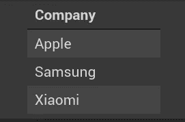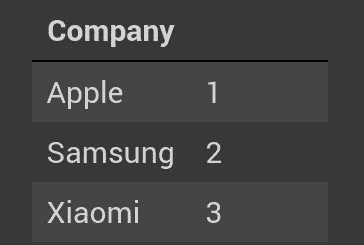

**图 8 |图 9**

图 8 —假设我们的数据集包含一列 *Company。*在该列中，列出了不同公司的名称，这是分类数据。我们的机器学习算法不理解这些类型的分类数据。因此，解决这个问题的一个方法是将公司名称编码成如图 9 所示的值。但是这种编码方式产生了另一个问题。考虑上述情况，**由于*小米*是用更高的值编码的，这意味着机器学习算法给予该类别**更大的重要性。这个问题的解决方案是一个热编码。

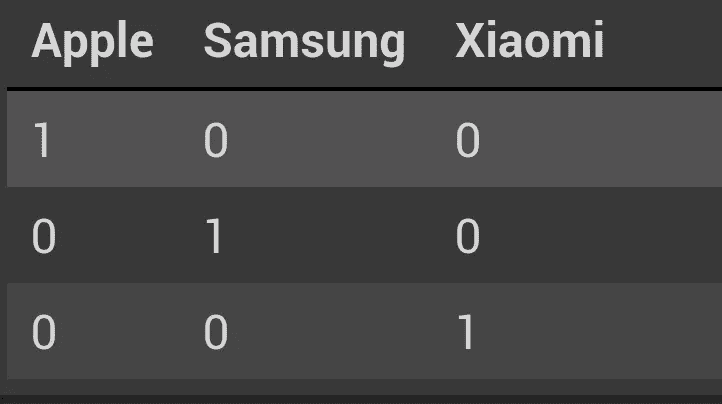

**图 10:** 一个热编码表示

如图 10 所示，我们将每个类别值转换成列，每当需要该类别时，我们给值 1，如果不需要，给值 0。我们将在另一篇文章中讨论这样做的实际方法。

## 培训模型/评估模型/部署模型

训练模型是将获得的数据应用于机器学习/深度学习算法并从中生成推理的过程。一旦我们训练了模型，这些模型将被评估，以确保我们的模型正确地学习了东西。最后，如果模型按预期执行，那么我们就部署模型。

让我们结束这篇文章。在本文的下一部分，我们将更多地讨论深度学习的基本构建模块。

## 参考

1.  [什么是机器学习的数据准备？](https://www.datarobot.com/wiki/data-preparation/)
2.  [Python 中机器学习的数据预处理](https://www.geeksforgeeks.org/data-preprocessing-machine-learning-python/)
3.  [处理缺失值](https://www.geeksforgeeks.org/ml-handling-missing-values/)
4.  [python-熊猫-数据框-dropna](https://www.geeksforgeeks.org/python-pandas-dataframe-dropna/#:~:targetText=Pandas%20dropna()%20method%20allows,Null%20values%20in%20different%20ways.&targetText=Parameters%3A,or%20'columns'%20for%20String.)
5.  [sci kit-Learn 中的一个热门编码](https://www.ritchieng.com/machinelearning-one-hot-encoding/)
6.  [OneHotEncoder-Sklearn](https://scikit-learn.org/stable/modules/generated/sklearn.preprocessing.OneHotEncoder.html)
7.  [在 python 中对数据集进行 ml-one-hot-encoding](https://www.geeksforgeeks.org/ml-one-hot-encoding-of-datasets-in-python/)