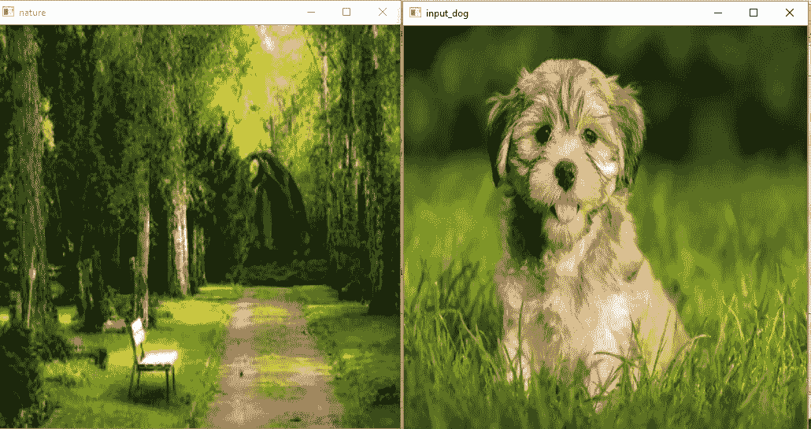

# 使用 OPEN-CV 对图像进行基本运算、算术运算和位运算—第 4 部分

> 原文：<https://medium.com/analytics-vidhya/basic-arithmetic-and-bitwise-operations-on-images-with-open-cv-part-4-87d04e2a42c?source=collection_archive---------11----------------------->

[克里斯·盖奇](https://medium.com/u/67d9cdce33af?source=post_page-----87d04e2a42c--------------------------------) [毕达哥拉斯](https://medium.com/u/c74166e439e0?source=post_page-----87d04e2a42c--------------------------------) [Opencv Funs](https://medium.com/u/b96707e2650f?source=post_page-----87d04e2a42c--------------------------------)


打开 CV 第 4 部分

对于第 3 部分，点击[此处](/@vishwasu2001/handling-mouse-events-in-open-cv-part-3-3dfdd59ab2f6)。

在这个博客中，我们将了解一些算术和位运算。所以让我们开始—

首先，我们将看到如何在打开的简历中添加两张图片

```
img1=cv2.imread(**'input_dog.jpg'**)
img2=cv2.imread(**'nature.jpg'**)
```



nature.jpg 和 input_dog.jpg

在上面的代码中，我们用 **cv2.imread()** 方法读取图像。

```
img1=cv2.resize(img1,(512,512))
img2=cv2.resize(img2,(512,512))
```

之后，我们调整图像的大小(用 **cv2.resize()** 第一个参数是你要调整大小的图像，第二个参数是大小),因为在 open cv 中你只能添加两个相似大小的图像。

```
dst=cv2.add(img1,img2)
cv2.imshow(**'dest'**,dst)
```

然后我们用 **cv2.add()添加图像。**

添加后的结果图像是-


输出图像

你也可以通过 **cv2.addWeighted()** 给每张图片增加一些权重，比如你想显示第一张图片多于第二张图片。参见下面的代码—

```
dst1=cv2.addWeighted(img1,0.5,img2,0.5,0)
```

上述代码背后的公式是—

> dst 1 = img 1 * 0.5+img 2 * 0.5+c
> dst 1 =结果图像
> img1 * 0.5 = img1 * img1 权重
> img2 * 0.5 = img2 * img2 权重

在上面的代码中，参数是第一图像、第一图像权重、第二图像、第二图像权重和标量权重(c)。

```
cv2.imshow(**'dest1'**,dst1)
cv2.waitKey(0)
cv2.destroyAllWindows()
```

你知道这个代码，我在前面的部分已经解释过了。

加权图像的结果是—


加权图像

所以，现在看看一些位运算—

对于这些操作，我们将在 numpy 的帮助下制作一些图像。

```
img1=np.zeros((250,500,3),np.uint8)
img1=cv2.rectangle(img1,(200,0),(300,100),(255,255,255),-1)
img2=np.zeros((250,500,3),np.uint8)
img2=cv2.rectangle(img2,(250,0),(500,500),(255,255,255),-1)
```

在上面的代码中，我们正在制作 img1 numpy 零数组，这意味着这将生成黑色图像，然后我们在图像上制作白色矩形，我不会解释关于 **cv2.rectangle()** 的内容，因为在前面的部分中我已经做过了。就像这样，我们制作了两张看起来像这样的图片—


形象

所以我们将对这两幅图像执行所有的位运算。

1.  我们将在这里看到**和操作员**

```
des=cv2.bitwise_and(img1,img2)
cv2.imshow(**'img1'**,img1)
cv2.imshow(**'img2'**,img2)
cv2.imshow(**'des'**,des)
```

**cv2.bitwise_and()** 方法的工作方式类似于逻辑运算符 and。你自己把 img1，img2，des 图像和这个和真值表匹配一下就可以理解了—
这里 0 是黑，1 是白—


经营者

输出(des 图像)是—


des 图像(按位 AND 的结果)

2. **OR 运算符—**

```
bitwise_or=cv2.bitwise_or(img1,img2)

cv2.imshow(**'**bitwise_or**'**,bitwise_or)
```

请运行代码，并尝试理解与图像和上述或真值表。因此，当两个图像中的哪个区域是黑色时，它将与黑色相同(参见真值表，其中 0+0=0)。这是所有运营商背后的理念。所以从现在起，我将只向您展示一个包含所有操作符的代码。
OR 运算符结果在此——


或操作员结果图像

```
bitwise_xor=cv2.bitwise_xor(img1,img2)
bitwise_not=cv2.bitwise_not(img1,img2)

cv2.imshow(**'bitwise_xor'**,bitwise_xor)
cv2.imshow(**'bitwise_not'**,bitwise_not)
```

以上代码用于异或和非运算。

这个博客到此为止。

我希望你喜欢它。

谢谢你。