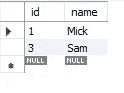

# 基本的常见 MySQL 查询

> 原文：<https://medium.com/analytics-vidhya/basic-common-mysql-query-faf93b5ed2d1?source=collection_archive---------24----------------------->

MySQL 是一个开源的关系数据库管理系统。让我们看看使用 MySQL 的优势和一些常用的查询。

**MySQL 的优势**

1.  开放源码
2.  高性能
3.  低成本
4.  跨平台兼容性
5.  可用性
6.  可量测性
7.  可靠性
8.  易于使用和维护

让我们看看一些常用的查询。

1.  显示数据库；

显示所有数据库名称

2.用 HR；

*“HR”是数据库名称，使用此查询您选择想要使用的数据库；*

3.显示表格；

显示选定数据库中的表名

4.立即选择()；

*返回日期和时间，格式为“yyyy-mm-dd hh:mm:ss”。*

日期时间

5.评论

*在 MySQL 中有三种方式可以评论*

*#这是评论 1*

*——这是注释 2*

*/*这是注释 3*/*

6.创建数据库 new _ db

*“new _ BD”是数据库名称。将使用此查询创建的。*

7.删除数据库 new _ db

*“新数据库”将被删除。*

8.创建表 new_tab(column1，column2 等。,)

创建表格 new_tab(
id INT，
name VARCHAR(50)
)

*表格名称为“new_tab ”,列 id 为数字，名称为字符串*

9.desc new _ tab；

*形容桌子。“new_tab”是表名。*

表格描述

10.更改表格

*改变现有的表格细节。目前我们的表接受空值，它不会自动增加值。*

*使用修改功能*添加自动增量

ALTER TABLE new_tab
修改列 id INT AUTO_INCREMENT 主键；

现在让我们来看看改变表格后的描述。

用主键改变了表

*现在，该表不接受空值，随着您不断插入数据，列“id”将自动递增。*

11.翻桌

删除表 new _ tab

它将从数据库中删除该表。

12.插入

插入到 new_tab(name)值(" John ")；

*该查询将姓名插入为“John ”, id 默认为 1。因为 id 被赋值为 AUTO_INCREMENT 所以我们不需要在 insert 语句中提及。*

插入语句

13.更新

更新 new_tab
SET name="Mick "其中 id = 1；

*该查询更新表中的数据。它检查 id 为 1 的位置，并将姓名“John”替换为“Mick”。现在，id 号 1 的名称将是“Mick”。*

更新语句

14.选择指令

*要从表中获取数据需要使用 select 语句。你有多种方法来使用它。*

SELECT * FROM new _ tab

SELECT * FROM new_tab

*它返回表中的所有列。*

从 new_tab 中选择名称；

从 new_tab 中选择名称

它只返回名字。如果您只需要从表中获取特定的列，请使用带逗号的列名(例如:Select id，name from new _ tab).

15.删除

*从 id 等于 2 的表中删除数据。*

从 id=2 的 new_tab 中删除；

*它将删除第 2 行，只剩下 2 行可用。*

删除了 id 为 2 的行