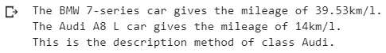

# Python 中面向对象编程的基本概念

> 原文：<https://medium.com/analytics-vidhya/basic-concepts-of-object-oriented-programming-in-python-512068e469e?source=collection_archive---------19----------------------->

# 介绍

在学习面向对象编程的时候，我决定深入研究它的历史，结果发现它非常吸引人。术语“面向对象编程”(OOP)是由 Alan Kay 在 1966 年左右创造的，当时他还在读研究生。名为 **Simula** 的语言是第一种具有面向对象编程特征的编程语言。它是 1967 年为制作[模拟程序](https://en.wikipedia.org/wiki/Computer_simulation)而开发的，其中最重要的信息被称为对象。


虽然 OOPs 从 20 世纪 60 年代早期就出现在市场上，但是直到 20 世纪 90 年代 OOPs 才因为 C++而开始增长。此后，这种编程技术被包括 Python 在内的各种编程语言所采用。今天，它的应用几乎遍及每个领域，如实时系统、人工智能、专家系统、客户机-服务器系统、面向对象的数据库等等。

因此，在本文中，我将解释 Python 中面向对象编程的基本概念。在继续之前，了解 Python 是很重要的。

你可以使用下面提到的**免费课程**学习 Python

*   [*Python 简介*](https://courses.analyticsvidhya.com/courses/introduction-to-data-science??utm_source=blog&utm_medium=object_oriented_programming)

# 什么是面向对象编程？

面向对象的编程(OOP)，就是创建“对象”。对象是一组相互关联的变量和函数。这些变量通常被称为对象的属性，而函数被称为对象的行为。这些对象为程序提供了更好、更清晰的结构。

例如，汽车可以是一个对象。如果我们把汽车看作一个物体，那么它的属性就是——颜色、型号、价格、品牌等等。它的行为/功能是加速、减速、换挡。

另一个例子——如果我们把一只狗看作一个物体，那么它的属性将是——它的颜色、品种、名字、体重等等。并且他的行为/功能将是行走、吠叫、玩耍等。

面向对象编程之所以出名，是因为它在编程中实现了现实世界中的实体，如对象、隐藏、继承等。它使可视化更容易，因为它接近真实世界的场景。

# 面向对象编程(OOP)与面向过程编程(POP)

OOP 和过程化编程的基本区别是

*   举例来说，看待流行音乐的一种方式就是你制作柠檬水的方式。制作柠檬水的程序包括-首先根据需要取水，然后向水中加入糖，然后向混合物中加入柠檬汁，最后混合整个溶液。你的柠檬水已经准备好了。同样，POP 也需要一定的步骤过程。程序性程序由函数组成。这意味着在 POP 方法中，程序被划分成不同的功能，这些功能是针对不同的任务的。这些功能按特定的顺序排列，程序的控制按顺序进行。而面向对象的程序是由对象组成的。面向对象的方法将程序分成对象。这些对象是捆绑了真实世界对象的属性和行为的实体。
*   POP 只适合小任务。因为随着程序长度的增加，代码的复杂度也在增加。最终它变成了一个功能网络。此外，调试也变得很困难。 *OOP 借助更清晰、更不复杂的结构解决了这个问题。它允许以继承的形式重用代码。*
*   另一件重要的事情是，在面向过程的编程中，所有的函数都可以访问所有的数据，这意味着缺乏安全性。假设您想要保护凭证或任何其他重要信息的安全。那么程序性的方法就不能给你这种安全感。*对于这个 OOP 来说，它有一个神奇的功能可以帮助你，那就是* ***封装*** *，它允许我们隐藏数据。不要担心，我将在本文的后半部分详细介绍这一点以及面向对象编程的其他概念。现在，只要理解 OOP 支持安全性，而 POP 不能。*
*   像 C、Pascal 和 BASIC 这样的编程语言使用过程化方法，而 Java、Python、JavaScript、PHP、Scala 和 C++是提供面向对象方法的主要语言。

# 主要 Python OOPs 概念-

在这一节中，我们将深入探讨 OOP 的基本概念。我们将讨论以下主题-

1.  班级
2.  目标
3.  方法
4.  遗产
5.  包装
6.  多态性
7.  数据抽象

# 1.什么是课？

这个问题的直接答案是——类是对象的集合。与原始数据结构不同，类是用户定义的数据结构。它们使代码更易于管理。

下面我们来看看如何定义一个类——

```
class class_name: class body
```

我们定义了一个类，在 class_name 和分号后面有一个关键字“class”。而我们在使用缩进作为它的主体之后，再考虑你在这个下面写的所有东西。为了更容易理解，我们来看一个例子。

考虑汽车陈列室的情况。您希望存储每辆汽车的详细信息。让我们首先定义一个类-

```
class Car: pass
```

就是这样！

注意:我用 pass 语句代替了它的主体，因为主要目的是展示如何定义一个类，而不是它应该包含什么。

在详细介绍之前，首先，了解对象和实例化。

# 2.对象和对象实例化

当我们定义一个类时，只创建对象的描述或蓝图。在我们创建它的**对象**之前，没有内存分配。**反对者** **实例**包含真实的数据或信息。

实例化只不过是创建一个类的新对象/实例。让我们创建上面定义的类的对象-

```
obj1 = Car()
```

完成了！**注意**您可以根据自己的选择更改对象名称。

尝试打印此对象-

```
print(obj1)
```


因为我们的类是空的，所以它返回存储对象的地址，即 0x7fc5e677b6d8

你还需要在前进之前了解班主任。

## 类构造函数

到现在为止，我们有一个空的类 car，是时候用 Car 的属性填充我们的类了。类别建构函式的工作是在建立类别的物件时，将值指派给类别的资料成员。

汽车可以有各种属性，如名称、颜色、型号、品牌名称、发动机功率、重量、价格等。为了便于理解，我们只选择几个。

```
class Car:
    def __init__(self, name, color):
        self.name = name
        self.color = color
```

因此，汽车或任何其他对象的属性必须在我们称为 **__init__( )** 的方法中。这个 __init__()方法也被称为**构造函数方法**。每当构造一个类的对象时，我们就调用一个构造函数方法。

现在来说说 __init__()方法的参数。所以这个方法的第一个参数必须是 self。那么只有剩下的参数才会出现。

构造函数方法中的两条语句是-

1.  **self.name = name**
2.  **self.color = color**

这将创建新的属性，即**名称**和**颜色**，然后给它们分配各自的参数值。“self”关键字表示该类的实例。通过使用“self”关键字，我们可以访问该类的属性和方法。它在方法定义和变量初始化中很有用。每当我们定义一个方法的时候,“自我”就会被明确地使用。

注意:您也可以在这个 __init__()方法之外创建属性。但是这些属性对整个类都是通用的，你必须给它们赋值。

假设您展厅中的所有汽车都是轿车，您可以通过在 __init__()之外创建一个属性来将 car_type 的值固定为轿车，而不是反复指定它。

```
class Car:
    car_type = "Sedan"                 #class attribute def __init__(self, name, color):
        self.name = name               #instance attribute   
        self.color = color             #instance attribute
```

这里，**实例属性指的是**构造函数方法内部的属性，即 self.name 和 self.color，**类属性指的是**构造函数方法外部的属性，即 car_type。

# 3.类方法

到目前为止，我们已经添加了汽车的属性。现在是时候添加一些行为了。方法是我们用来描述对象行为的函数。它们也是在类内部定义的。看看下面的代码-

```
class Car:   
    car_type = "Sedan" 

    def __init__(self, name, mileage):
        self.name = name 
        self.mileage = mileage 

    def description(self):                 
        return f"The {self.name} car gives the mileage of {self.mileage}km/l"

    def max_speed(self, speed):
        return f"The {self.name} runs at the maximum speed of {speed}km/hr"
```

在类内部定义的方法，而不是构造函数方法，被称为**实例**方法。而且，我们这里有两个实例方法——**描述**()和 **max_speed** ()。让我们单独谈谈它们-

*   **描述**()——这个方法返回一个字符串，其中包含汽车的描述，比如名称和里程。此方法没有附加参数。此方法使用实例属性。
*   **max _ speed**()——这个方法有一个额外的参数，返回一个显示汽车名称及其速度的字符串。

注意，附加参数 speed 没有使用“self”关键字。因为 speed 不是一个实例变量，所以我们不使用 self 关键字作为它的前缀。让我们为上面描述的类创建一个对象。

```
obj2 = Car("Honda City",24.1)print(obj2.description()) print(obj2.max_speed(150))
```


我们所做的是创建一个 car 类的对象并传递所需的参数。为了访问实例方法，我们使用 object_name.method_name()。

方法 **description()** 没有任何额外的参数，所以我们在调用它时没有传递任何参数。

方法 **max_speed()** 有一个额外的参数，所以我们在调用它时传递了一个参数。

注意:需要记住的三件重要事情是-

1.  您可以创建任意数量的类对象。
2.  如果该方法需要 n 个参数，而您没有传递相同数量的参数，则会发生错误。
3.  参数的顺序很重要。

让我们一个一个来看

1.  **创建一个类的多个对象**

```
class Car:
    def __init__(self, name, mileage):
        self.name = name 
        self.mileage = mileage 

    def max_speed(self, speed):
        return f"The {self.name} runs at the maximum speed of {speed}km/hr" Honda = Car("Honda City",21.4)
print(Honda.max_speed(150))

Skoda = Car("Skoda Octavia",13)
print(Skoda.max_speed(210))
```


2.传递错误数量的参数。

```
class Car:

    def __init__(self, name, mileage):
        self.name = name 
        self.mileage = mileageHonda = Car("Honda City")print(Honda)
```


因为我们没有提供第二个参数，所以我们得到了这个错误。

3.**论据的顺序**

```
class Car:

    def __init__(self, name, mileage):
        self.name = name 
        self.mileage = mileage 

    def description(self):                
        return f"The {self.name} car gives the mileage of {self.mileage}km/l"Honda = Car(24.1,"Honda City")print(Honda.description())
```


搞砸了！注意我们改变了参数的顺序。

现在，有四个面向对象编程的基本概念——**继承**、**封装**、**多态**和**数据抽象**。为了理解 OOPs，了解所有这些非常重要。到目前为止，我们已经介绍了哎呀的基本知识，让我们深入探讨一下。

# **Python 类中的继承**

继承是一个类继承另一个类的属性和方法的过程。其属性和方法被继承的类称为父类。从父类继承属性的类是子类。

有趣的是，除了继承的属性和方法，子类还可以有自己的属性和方法。

如何继承父类？使用以下语法:

```
class parent_class:
body of parent class

class child_class( parent_class):
body of child class
```

让我们来看看实现情况-

```
class Car:                                           **#parent class**

    def __init__(self, name, mileage):
        self.name = name 
        self.mileage = mileage 

    def description(self):                
        return f"The {self.name} car gives the mileage of {self.mileage}km/l"

class BMW(Car):                                     ** #child class**
    pass

class Audi(Car):                                    ** #child class**
    def audi_desc(self):
        return "This is the description method of class Audi."obj1 = BMW("BMW 7-series",39.53)
print(obj1.description()) obj2 = Audi("Audi A8 L",14)
print(obj2.description())
print(obj2.audi_desc())
```



我们创建了两个子类，即“BMW”和“Audi ”,它们继承了父类“Car”的方法和属性。我们没有在 BMW 类中提供额外的功能和方法。而 Audi 类中的另一个方法。

注意父类的实例方法描述()是如何被子类的对象在 obj1.description()和 obj2.description()的帮助下访问的。另外，使用 obj2.audi_desc()也可以访问类 Audi 的单独方法。

# 包装

正如我在文章开始部分提到的，封装是一种确保安全性的方法。基本上，它将数据隐藏起来，不让外人访问。例如，如果一个组织想要保护一个对象/信息不被客户或任何未授权的人访问，那么封装就是确保这一点的方法。

您可以通过在名称前使用单个下划线(_)来声明受保护的方法或属性。如- **自我。_name 或 def _ method()**；这两行告诉我们属性和方法是受保护的，不应该在类和子类的访问之外使用，但是可以由类方法和对象访问。

虽然 Python 使用' _ '只是作为一种编码约定，但它告诉我们应该在类的范围内使用这些属性/方法。但是您仍然可以像往常一样访问被定义为受保护的变量和方法。

现在，为了防止从类的范围之外访问属性/方法，可以使用“**私有成员**”。为了将属性/方法声明为私有成员，请在前缀中使用双下划线(__)。如- **自我。__name 或 def _ _ method()**；这两行都表明属性和方法是私有的，不能从类外部访问。

```
class car:

    def __init__(self, name, mileage):
        self._name = name                    **#protected variable**
        self.mileage = mileage 

    def description(self):                
        return f"The {self._name} car gives the mileage of                  {self.mileage}km/l"obj = car("BMW 7-series",39.53)

#accessing protected variable via class method 
print(obj.description())

#accessing protected variable directly from outside
print(obj._name)
print(obj.mileage)
```


请注意我们是如何正确无误地访问受保护变量的。很明显，对变量的访问仍然是公开的。让我们看看封装是如何工作的

```
class Car:

    def __init__(self, name, mileage):
        self.__name = name                    ** #private variable**        
        self.mileage = mileage 

    def description(self):                
        return f"The {self.__name} car gives the mileage of {self.mileage}km/l"obj = Car("BMW 7-series",39.53)

#accessing private variable via class method 
print(obj.description())

#accessing private variable directly from outside
print(obj.mileage)
print(obj.__name)
```


当我们尝试使用 description()方法访问私有变量时，没有遇到错误。但是当我们试图直接在类外访问私有变量时，Python 给出了一个错误:car 对象没有属性' __name '。

您仍然可以使用其损坏的名称直接访问该属性。 **Name mangling** 是我们用来从外部访问类成员的一种机制。Python 解释器将任何带有“__var”的标识符重写为“_ClassName__var”。使用它你也可以从外部访问类成员。

```
class Car:

    def __init__(self, name, mileage):
        self.__name = name                **     #private variable**        
        self.mileage = mileage 

    def description(self):                
        return f"The {self.__name} car gives the mileage of {self.mileage}km/l"obj = Car("BMW 7-series",39.53)

#accessing private variable via class method 
print(obj.description())

#accessing private variable directly from outside
print(obj.mileage)
print(obj._Car__name)      #mangled name
```


请注意，mangling 规则的设计主要是为了避免事故。但是仍然可以访问或修改被认为是私有的变量。这在特殊情况下甚至很有用，比如在调试器中。

# 多态性

这是一个希腊单词。如果我们打破术语多态性，我们得到“多”-许多和“变体”-形式。所以多态性意味着有许多形式。在面向对象程序设计中，它指的是具有相同名称但具有不同功能的函数。

```
class Audi:
  def description(self):
    print("This the description function of class AUDI.")

class BMW:
  def description(self):
    print("This the description function of class BMW.")audi = Audi()
bmw = BMW()
for car in (audi,bmw):
 car.description()
```


当使用对象*奥迪*调用函数时，调用类*奥迪*的函数，当使用对象*宝马*调用函数时，调用类*宝马*的函数。

# 数据抽象

我们使用抽象来隐藏函数的内部细节或实现，只显示它的功能。这类似于你不知道后台机制就知道怎么开车。或者你知道如何用开关开灯或关灯，但你不知道插座后面发生了什么。

任何至少有一个抽象函数的类都是抽象类。为了首先创建一个抽象类，您需要从 [abc](https://www.google.com/url?sa=t&rct=j&q=&esrc=s&source=web&cd=&cad=rja&uact=8&ved=2ahUKEwjrtMSbwsXrAhVIzzgGHVMwDlkQFjAAegQIAxAB&url=https%3A%2F%2Fdocs.python.org%2F3%2Flibrary%2Fabc.html&usg=AOvVaw0Tb8GVbHgscdgGVAJbUvLR) 模块导入 ABC 类。这允许您在其中创建抽象方法。ABC 代表抽象基类。

```
from abc import ABC

class abs_class(ABC):
    Body of the class
```

**重要的是**–你不能用抽象方法为抽象类创建一个对象。比如说-

```
from abc import ABC, abstractmethodclass Car(ABC):
    def __init__(self,name):
        self.name = name  @abstractmethod
    def price(self,x):
        passobj = Car("Honda City")
```


现在的问题是我们如何准确地使用这种抽象。答案是通过使用继承。

```
from abc import ABC, abstractmethodclass Car(ABC):
    def __init__(self,name):
        self.name = name def description(self):
        print("This the description function of class car.") @abstractmethod
    def price(self,x):
        pass
class new(Car):
    def price(self,x):
        print(f"The {self.name}'s price is {x} lakhs.")obj = new("Honda City")obj.description()
obj.price(25)
```


Car 是从 **abc** 模块的 **ABC** 类继承而来的抽象类。

注意，我在抽象类中有一个抽象方法(price())和一个具体方法(description())。这是因为抽象类可以包含这两种类型的函数，而普通类不能。

从这个抽象类继承的另一个类是 *new()* 。这个方法给出了抽象方法(price())的定义，这就是我们使用抽象函数的方式。

在用户从 *new()* 类创建对象并调用 price()方法后， *new()* 类中 price 方法的定义开始生效。这些定义对用户是隐藏的。抽象方法只是提供一个声明。子类需要提供定义。

但是当对 new()类的对象，即 **obj** 调用 description()方法时，汽车的 description()方法被调用，因为它不是一个抽象方法。

# 结束注释

总之，在本文中，我介绍了 Python 中面向对象编程的基本概念。现在，你们必须对 OOPs 到底是什么及其组成部分有所了解。

这里有一些文章，你可以阅读，以了解更多关于 Python 的知识-

*   [Python 风格指南|如何写出整洁而令人印象深刻的 Python 代码](https://www.analyticsvidhya.com/blog/2020/07/python-style-guide/?utm_source=blog&utm_medium=object_oriented_programming)
*   [关于 Python 中的数据结构，你应该知道的一切](https://www.analyticsvidhya.com/blog/2020/06/data-structures-python/?utm_source=blog&utm_medium=object_oriented_programming)

我希望你已经理解了这些文章中解释的概念。如果你有任何疑问，请在下面的评论中告诉我。

*原载于 2020 年 8 月 31 日 https://www.analyticsvidhya.com*[](https://www.analyticsvidhya.com/blog/2020/09/object-oriented-programming/)**。**