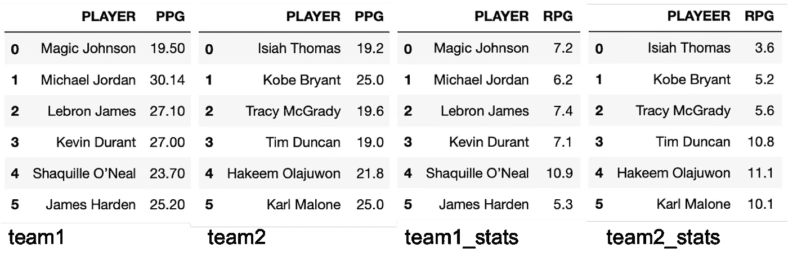
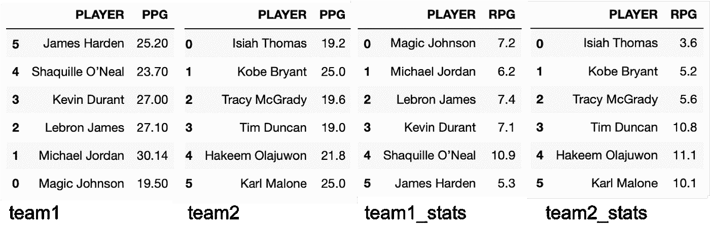
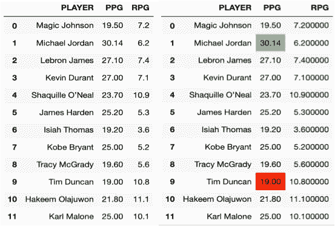
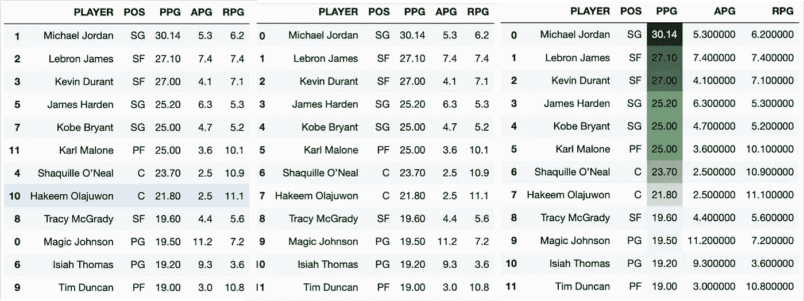
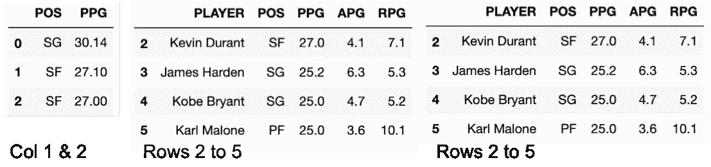
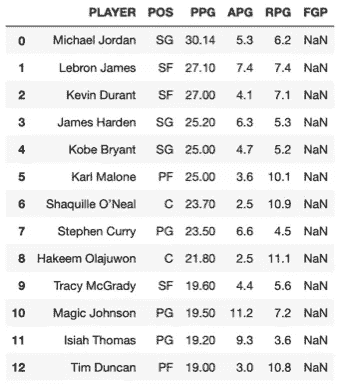
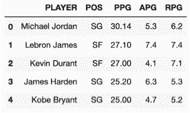
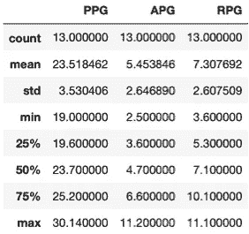
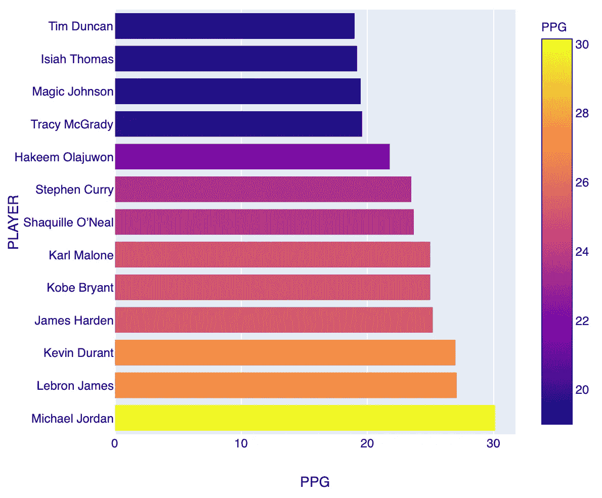

# 使用 Pandas 进行基本的数据帧操作

> 原文：<https://medium.com/analytics-vidhya/basic-dataframe-manipulation-using-pandas-221e12db08b6?source=collection_archive---------7----------------------->


在过去的几个月里，我一直在写一些博客，内容是我在 Flatiron 必须做的项目，这些项目是我正在进行的数据科学训练营的要求的一部分。现在我已经快结束这个项目了，但我仍然错过了一些博客。一个是关于我们的顶点项目的必修课，第二个是我决定写一些我真正喜欢的用 Python 处理熊猫数据帧的东西。

如果您碰巧不知道这两个是什么(Pandas 和 dataframes)， [Pandas](https://pandas.pydata.org) (Python 数据分析库)是构建在 Python 之上的最流行的开源数据分析和操作工具/库；和数据帧是具有潜在不同类型的列的二维标记数据结构。你可以把它想象成一个简单的电子表格或 SQL 表，它通常是最常用的熊猫对象。

这个博客绝不是一个教程，而只是总结了到目前为止我发现的一些最有用的操作数据框架的功能，为了让我向你们展示它们，我认为从头开始会很好，从头开始意味着创建我自己的数据框架。

就数据集而言，我不会下载/加载任何数据，而是会根据 NBA 篮球运动员的姓名、位置和一些最简单的统计数据(如 PPG(场均得分)、APG(场均助攻)和 RPG(场均篮板))创建自己的数据集，所以没有什么太花哨的东西，我会将此作为嵌入 Gists 的练习，这样我就不必重新键入所有代码，只需浏览一遍即可。

如果你要尝试做这个练习，你需要从进口熊猫开始:

```
import pandas as pd
```

现在让我们**创建数据帧**。正如您在下面的嵌入式代码中所看到的，您所要做的就是为您的数据帧指定一个名称，在我的例子中，我称它为 team1，然后您调用函数 pd。DataFrame()并添加一个类似于我创建的字典，它有两个*键*(“球员”&“PPG”)和他们各自的*值*，分别是球员姓名和他们在 PPG 职业生涯平均水平的列表。然后，您可以调用新的 dataframe，方法是在不同的行上键入它的名称，您应该会看到如图 1 所示的 4 个数据帧中的任何一个。



图一。用公共列“PLAYER”创建的 4 个数据帧

正如你所看到的，我创建了 4 个不同的数据帧，目的是将它们放在一起，并以一个包含所有信息的独特数据帧结束。

如果您查看图 1 右侧的“team2_stats”数据帧，您会注意到有一个需要纠正的错别字:“PLAYEER”。下面的简单代码展示了函数**。在使用的数据帧(team2_stats)和输入字典的空格({})后重命名()**，其中*键*对应错误的列名(PLAYEER)，而*值*对应正确的列名(PLAYER):

现在，让我们稍微处理一下这些数据帧，假设出于某种原因，我想要**反转 team1 中的所有行**。我需要做的就是调用 dataframe (team1)并使用**。loc[]** 用于通过标签或布尔数组访问一组行或列的函数。可以想象，“-1”表示相反的顺序，表示从最后一个值开始，而“-2”表示最后一个减 1 的附加列，依此类推。的功能。 **head(6)** 将调用 dataframe 的前 6 行，如果留空，默认为 5 行。



图二。4 显示反转 team1 和更正 team2_stats 中的列名的结果的数据帧

图 2 显示了对 team1 做了小修改的 4 个数据帧。仔细看，是有问题的。因为我颠倒了列，所以索引号(左边的数字)也颠倒了，与其余的数据帧不匹配。我将使用**修复这个问题。reset_index()** 函数，同时我将再次使用*****反转所有列**的顺序。loc[]** 函数(参见下面的嵌入式代码)。记住，这样做没有特别的原因，只是为了熟悉这些函数的作用。*

*这些都是对 1 个数据帧的简单操作，现在让我们尝试将 4 个数据帧放入 1 个数据帧中。请注意(图 2 ),我特意创建了一个 team1 和一个 team1_stats，以及一个 team2 和一个 team2_stats。想法是**。合并()** team1 和 team1_stats，team2 和 team2_stats，然后使用**。append()** 函数将一个垂直地加到另一个上，这样我们最终会列出所有的玩家以及他们各自的 PPG 和 RPG(图 3)。下面是实现这一点的代码，您会注意到，出于实用的原因，我创建了临时的 TEAM_1 和 TEAM_2 数据帧，然后将它们附加到最后的 TEAM 数据帧(图 3 左侧)*

*我经常使用的一个有用的工作流程是在特定的列中突出显示 **min( )** 和 **max()** 值。在这种情况下，我为 PPG 做了这件事(图 3 中右边的数据帧)。你可以想象，在查看统计数据时，这非常方便，你可以通过修改下面代码中的 **format_dict** 来同时处理任何颜色或不同的列。*

**

*图 3。左图:合并和追加数据帧的结果。右图:突出显示 PPG 列的最大值和最小值的相同数据帧*

*现在有了单个数据帧，我们可以按列或行添加更多数据。让我们首先添加几个新的列，对应于球员的位置(POS)和每场比赛的助攻(APG)。如果你看下面的代码，我是通过生成列表来完成的。唯一的条件是这些列表(POS 和 APG)必须以正确的匹配顺序排列，这意味着每个新条目必须与其所属的玩家(行)相匹配。例如，POS 列表中的第一个值“PG”应该与 APG 列表中的“11.20”值相匹配(参见下面的代码)，并且这两个值都应该属于数据帧中的第一个玩家(图 3 中的 Magic Johnson)。一旦您确定列表中的所有值都匹配，那么下一步就是在数据框中定义一个新列，如 **TEAM['POS']** ，并为其分配一个值，该值将是两个列表中的一个，在本例中为:POS 或 APG(代码如下)。我们可以对任意多的列表这样做，然后我们可以通过键入 **TEAM.head()** 再次调用我们的 dataframe。记得那个**。head()** 如果留空，函数将打印出前 5 行。*

*任何添加的新列都将放在最右边的列之后，在我们的例子中是 RPG 列。这看起来不太好，因为每个玩家的位置应该在任何统计值之前。因此，我们需要对它们进行重组。要做到这一点，我们需要做的就是调用我们的 dataframe 团队，并按照所需的顺序编写列 namess，如下面的代码单元格所示:*

```
*TEAM = TEAM[['PLAYER', 'POS', 'PPG', 'APG', 'RPG']]*
```

*任何一个篮球迷都知道，这些都是有史以来最好的球员，这解释了为什么这些数据如此之好。所以我们现在能做的是根据他们的 PPG(场均得分)按降序排列。为此，我们将使用**。sort_values()** 函数。我们需要指定控制排序的值的源/列，在本例中是 PPG ( **by=['PPG']** )，然后是顺序( **ascending=False** )。如果你想按升序排序，你只需要将**假**改为**真**(升序=真)(代码如下):*

*现在，因为我们进行了排序，我们又一次弄乱了索引，如图 4 中左边的数据帧所示，所以我需要再次重置它。代码和前面一样(见前面的要点)。您可以在一行中完成所有这些，但是我发现这样解释更容易。*

*假设现在我还想突出显示控制行的排列方式的列，那么我们回到先前定义的“style.format ”,并将其重新分配给名为 TEAM 的新数据帧(代码见上面的要点)(结果见图 4 中的右边数据帧)。*

**

*图 4。左图:PPG 排序的数据帧。中间:索引重置的数据帧。右图:突出显示 PPG 列的数据框。*

*此时，我们有了一个清晰的数据框架，突出显示了负责排序的列。我们现在可以试着切开它。但是什么是切片呢？它基本上是从你的数据帧中提取一部分，如果你愿意的话，这可以通过条件来完成，例如提取每隔一项(行或列)。在我看来，这是更快查看数据的最有用的功能之一，对于大型数据集非常有用。*

*上面要点中的代码将产生如图 5 所示的数据帧*

**

*图 5。不同切片的输出数据帧。*

*到目前为止，我们已经在球队数据框架中添加了几列，所以现在让我们添加一个新行，代表“斯蒂芬·库里”中的另一个著名球员。这一步我不会描述它，因为下面的要点基本上是用我在每一行代码前添加的注释来指导你。你会注意到，我已经垂直移动了新播放器，以尊重我之前对 PPG 的排序。或者，您也可以重新运行排序，避免这一步。*

*现在，在背景上，我添加了一个额外的列，我称之为“FPG”，代表投篮命中率，但它充满了**缺失值(NaN)** 。这是故意的，这样我们可以删除一列，因为当我从头开始创建团队数据框架时，其中没有**缺失值**。如果你想做同样的练习，你需要一个名为 Numpy 的额外的库，其代码如图 6 所示。*

```
*NaN = np.nan
TEAM["FGP"] = NaN
TEAM*
```

**

*图 6。Dataframe 已更新，添加了斯蒂芬·库里行(9)和 FGP 列，只有缺失值(NaN)。*

*如果您正在处理的数据帧相当大，比如有数千甚至数百万行和许多列，您显然无法像本例中那样看到所有的**缺失值**，并且很可能您需要看到或发现它们来清理您的数据，特别是如果您正在运行任何机器学习(ML)算法。在这种情况下，在我做出任何决定之前，我会先运行下面的命令行:*

```
*dataframe.isna().sum()*
```

*输出是您的列的列表，其中包含了它们各自缺失值的总和。在我们的例子中，它看起来像这样:*

```
*PLAYER     0
POS        0
PPG        0
APG        0
RPG        0
FGP       13
dtype: int64*
```

*这告诉我，在“FGP”列中，我有 13 个丢失的值要处理，因为它是 100%的列，所以我可以放心地删除它。*

*删除列和/或行的方法有很多种，但我将只列出我通常使用的方法:*

*   *df = df.drop('列名'，1)*
*   *df.drop('COLUMN NAME '，axis=1，inplace=True)，删除列，而不必在开始时重新分配数据帧，因为 inplace=True*
*   *df = df.drop(df.columns[[1，2，4]]，axis=1)，数字对应于列号*
*   *df.drop(['Col_A '，' Col_B '，' Col_C']，axis=1)，同时删除多个列。*

*因为 TEAM 是一个简单的小型数据框架，所以我将使用第一个数据框架，它对我来说是最容易记住的:*

```
*TEAM = TEAM.drop('FGP', 1)
TEAM.head()*
```

**

*图 7。最终数据帧*

*到目前为止，我们已经完成了相当多的简单操作，但是仍然有几个函数我想添加到这个列表中，因为我发现它们非常有用。第一个是**分析数据帧**，为此您需要导入一个名为“pandas_profiling”的附加库(代码如下)。Pandas Profiling 是另一个开源 Python 模块，它使用一行简单的代码(下面代码的第二行)快速进行探索性数据分析。我没有在这个数据集上使用它，因为我是从零开始创建的，所以没有真正的意义，但在正常情况下，这是我用来了解我需要做的 EDA(探索性数据分析)的第一个函数，所以总体来说它节省了我一些时间。输出相当大，这也解释了为什么我没有在博客中添加一个例子。*

```
*import pandas_profiling
pandas_profiling.ProfileReport(dataframe)*
```

*第二个功能是**。describe()** ，用于生成数据帧的描述性统计数据(代码如下)。使用此功能，您将获得计数、平均值、标准偏差、最小值和最大值等统计数据，这对您的数据预处理和 EDA 非常有用(图 8)。*

```
*TEAM.describe()*
```

**

*图 8。团队数据框架的描述性统计输出*

*这就是我在我的每一个项目中发现的非常有用的东西的总结，我也记录了下来，并在这个 [GitHub](https://github.com/JaHerbas/Working_with_dataframes) 上不断更新，在这里你会发现比我在这里描述的更复杂的函数，以及一些不同库的绘图示例。*

*在我关闭博客之前，我将利用这些数据创建球队数据框架，并留给你一个非常基本和简单的绘图，其中球员是根据他们的 PPG 绘制的，并由他们的位置进行颜色编码(图 9)。*

**

*图 9。NBA 球员按 PPG 排序，按位置用颜色编码*

*感谢你阅读我的博客，希望你喜欢。任何问题/反馈请随时通过我的 [linkedIn](http://www.linkedin.com/in/jaherbas-geophysicist) 联系我。*