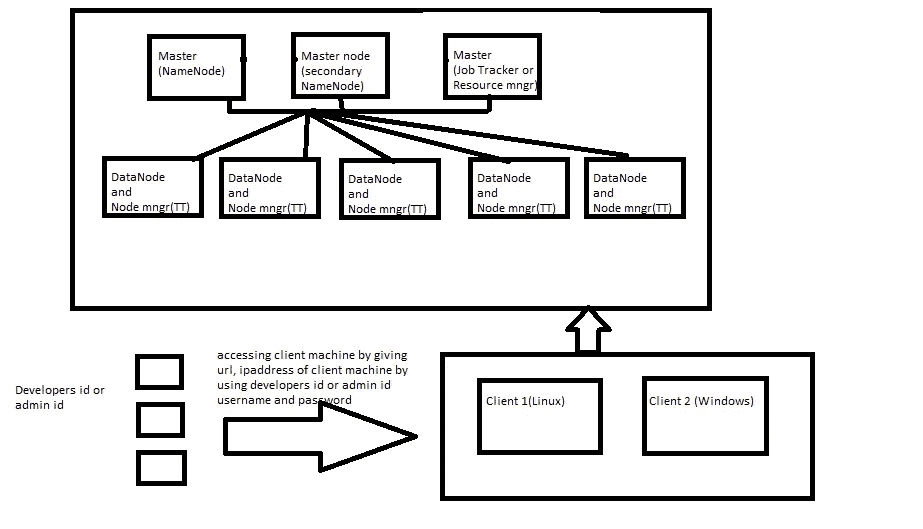
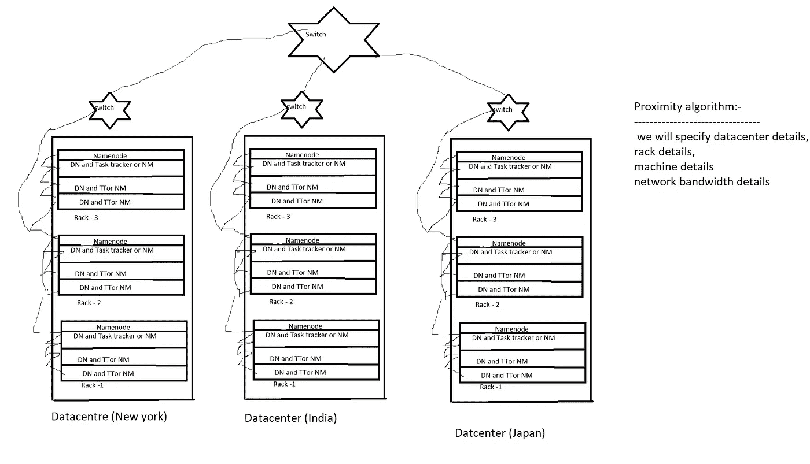
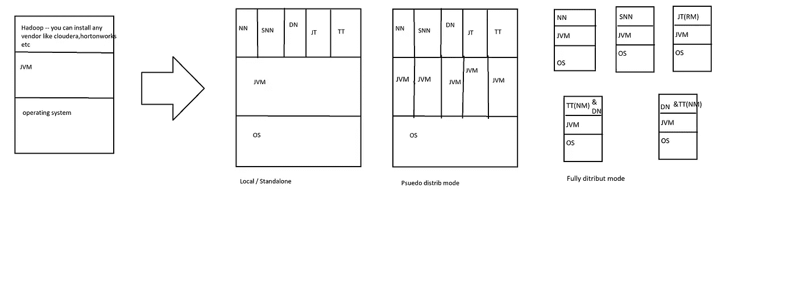

# 基本细节，了解你是否想成为 Hadoop 管理员，或者了解集群是如何配置的。

> 原文：<https://medium.com/analytics-vidhya/basic-details-to-know-if-you-want-to-become-a-hadoop-administrator-or-to-know-how-the-cluster-is-f01a53b12a60?source=collection_archive---------36----------------------->

Hadoop—它是一个开源(没有许可成本)的基于 Java 的框架，由 Apache 开发，用于处理传统框架无法处理的大数据。

一些供应商已经开发了基于 Hadoop 的应用，他们是
1。Cloudera
2。Hortonworks:现在 cloudera 和 hortonworks 合并
3。MapR
4。IBM - biginsights
5。微软— HDInsights
6。AWS — EMR

—对于所有这些供应商来说，hadoop 都是后端。

*******************************************************************

1.大数据开发者— (hadoop 开发+ spark + kafka+ nosql)
2。hadoop 管理员(cloudera 或 hortonworks 或 ibm 或 mapr) —需要深入了解任何供应商的知识

* * * * * * * * * * * * * * * * * * * * * * * * * * * * * * * * * * * * * * * * * * *
需要了解的事情(教学大纲)
→1 .什么是 Hadoop 和 bigdata？
→2.hadoop 特性？
→3 .架构？
→4 .安装(安装前、安装后)
→ 5 .用户管理和组管理(决定哪个用户将具有更改集群配置(DBA id)的访问权限)
→6.hadoop 生态系统和 hadoop 框架安装(将仅安装在客户端机器上)—框架(pig、hive、mysql、hive metastore as mysql、flume、sqoop)
→7。HDFS 命令

= = = = = = = = = = = = = = = = = = = = = = = = = = = = = = = = = = = = =

**1。Hadoop 定义** —如前所述，Hadoop 是一个用于以分布式方式并行存储和处理数据的框架。
大数据定义—无法使用 rdbms 等传统方法存储和处理的海量数据
大数据的问题:-
→存储—没有存储无限数据的技术(因此出现了 HDFS)
→处理—没有高效处理无限数据的技术(因此出现了 map reduce)

**2。Hadoop 特性:-**
= = = = = = = = = = = = = = = = = = = = = = = = = = = = = = = = = =
1 .性价比高:-
→对于 RDBMS(oracle)-它是许可的(即需要每年更新)
oracle 需要专门的硬件(它不能在普通硬件上运行，如果我们使用普通硬件，启动时间会更长。因此硬件成本很高)
→对于 Hadoop —开源，无许可成本，不需要专用硬件(我们将使用商用硬件)

硬件成本:-
pc <商品硬件<服务器硬件—(如果我们用 IBM，微软他们会给一些认证的硬件)
2。大型节点群集
→oracle 群集—我们最多可以有 256 台机器，对于 terradata，我们最多可以有 512 台机器
→Hadoop 没有任何限制，我们可以向群集添加 n 台机器。
3。并行处理
→使用 map reduce 框架我们可以通过将数据分成更小的文件，并行处理每个文件，然后组合输出来处理数据。
4。分布式数据:-
→数据不是存储在单台机器上，而是被分割成块并复制到集群中的不同机器上。
5。自动故障切换管理:-
—复制—默认情况下为 3(每个数据块 3 个副本)
—例如(300 mb /128 mb = 3 个数据块)复制—3 * 3 = 9 然后我们需要 9 个数据块来容纳 300 mb 文件
—我们可以手动更改复制因子。
6。数据位置优化:-
(笔记本中的图表)
→将应用程序移动到数据位置，而不是将数据移动到应用服务器位置(不应移动数 gb 的数据，而是将查询或我们的逻辑移动到数据位置并检索我们的数据)
7 .异构集群:-
→不强制要求所有机器都具有相同的操作系统和相同的硬件。在 hadoop 中，我们可以为每台机器(从机或主机)配备任何操作系统和任何硬件，而在 oracle 中，我们需要使用一些特定的硬件
8。可伸缩性:-
→在 hadoop 集群中添加机器时无需进入维护模式(在 RDBMS 中，我们需要进入维护模式)，因此在此期间可能会有业务影响。
= = = = = = = = = = = = = = = = = = = = = = = = = = = = = = = = = = = = = = = =
**3。架构:-**
→有 5 个守护进程 NameNode，SecondaryNameNode，Job Tracker(或资源管理器)，DataNode，Task Tracker(节点管理器)。
→注意:-强烈建议在单独计算机上安装主后台程序。
→在 hadoop1.x 之前，只有一个 namenode，如果它出现故障，则整个集群将停止运行，这被称为单点故障(spof)，但在 hadoop2.x 中，apache 引入了高可用性、主动和被动 namenode(即，如果主动 namenode 出现故障，则被动 namenode 将变为主动，但只有一个名称节点将处于主动状态，其他名称节点将处于非活动状态，但主动和被动 name node 之间应该有数据同步)
→建议在同一台计算机中同时使用 DataNode 和 TaskTracker(Node Mngr)

Hadoop 集群配置:-

→在图表数据中心(放置机器的位置)、机架详情(机架是机器的集合)、集群详情(集群是机器的集合)

邻近算法:-
→名称节点根据数据中心详细信息、机架详细信息、机器详细信息和网络带宽，通过使用邻近算法，给出写入或读取数据的块详细信息

→通过该算法有效地存储和读取数据
* * * * * * * * * * * * * * * * * * * * * * * * * * * * * * * * * * *
**4。hadoop 安装模式的类型:**
1 .本地/独立模式—设置在单个机器上，所有守护进程(5)在单个 JVM 上运行参考图
(用于开发和调试目的，而非测试)—它使用本地文件系统
2。psudo 分发模式—在单台机器上设置，所有守护程序(5)在 5 个独立的 JVM 上运行参考图
(用于开发和测试目的，而非生产)—它使用 HDFS
3。完全分发模式—所有守护程序在单独的机器上运行，强烈建议在
单独的机器上使用主守护程序，同时在同一台机器上使用 dn 和 TT/NM—它使用 HDFS
注意:—默认情况下，Hadoop 安装将采用本地/独立模式

* * * * * * * * * * * * * * * * * * * * * * * * * * * * * * * * * * * * * * * * * * * * * * * * * * * * * * * * * * *
对于任何模式的安装，它都有三个步骤
**1 .预安装:-**
— ———————————
→操作系统(linux):-我们需要基于 linux 的操作系统(centos 7)(从 centos 7 网站下载——最小 iso(仅包含所需软件)或 dvd iso(还包含更多第三方软件))
→虚拟化:-我们需要虚拟化工具(oracle 虚拟化盒或 VMWare 虚拟化)
→java 安装:--Java 版本应大于或等于 Java 8
→我们可以使用 linux 客户端连接 centos 7 机器(Putty 或 mremoteng)而不是频繁地使用 VM ware
→ssh:--这是一种用于从一台机器连接到另一台机器的协议。
→为什么是无密码的 ssh？在 hadoop 中，我们将使用无密码 ssh，以便在主节点和从节点之间频繁通信。如果我们使用 ssh，那么每次都需要输入密码，为了验证密码，需要花时间进行通信。得到结果可能会有影响，于是无密码 ssh 在 hadoop 中应运而生。

**2。安装**
———
→我们下载 hadoop tar 文件
→提取 tar 文件
→重命名
→设置 HADOOP_HOME 和 PATH 变量
→验证 Hadoop
**3 .后安装**
—————
→我们需要从本地转换到 psudo 模式或者完全分发模式(如果我们安装 hadoop， 本地分发模式是默认)
→我们指定 HDFS 文件系统(因为在本地分发模式下使用本地文件系统)
→在 HADOOP_HOME/config/hadoop 中配置文件
1 . core-site . XML—sudo nano coresite . XML—>设置名称节点机器位置搜索 in Google(in<value>HDFS://ipadr:9000</value>)—localhost(因为是本地分发模式)【T26 nn 和 dn 数据位置
-*可选创建新目录以命名 nde 和 datanode
3 . mapred-site . XML-我们指定 Mr type-yarn type
4 . yarn-site . XML-设置资源管理器和节点管理器机器 IP addrs(HDFS-format NameNode)-在格式化 nn 之后，我们可以说 hadoop 已成功安装
5 .主文件等
-在 psudo 中，我们仅配置 1、2、3、4，但处于完全分布式模式 文件
→我们启动和停止守护进程
-start-all . sh→启动所有守护进程
-stop-all.sh →停止所有守护进程
-start-dfs.sh →启动 hdfs 守护进程(namenode，datanode，snn)
-start-yarn.sh →停止 yarn 守护进程(资源 mngr(JT)，节点 mngr(TT))
→验证守护进程是否正在运行
-jps

在 apache hadoop 安装中，我们单独安装 hadoop 及其框架，如 pig、soop、hive、flume。

如果你想了解更多关于 Hadoop 及其架构的知识。请访问此链接，它将为您提供详细信息。

[关于 hadoop 集群配置的一些面试问题](https://www.edureka.co/blog/interview-questions/hadoop-interview-questions-hadoop-cluster/)

如果你想聊天，请随时通过 Gmail-msdilli1997@gmail.com 与我联系(我会制作安装视频或给出完整的步骤)