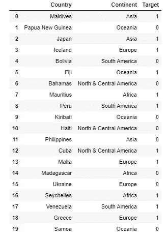
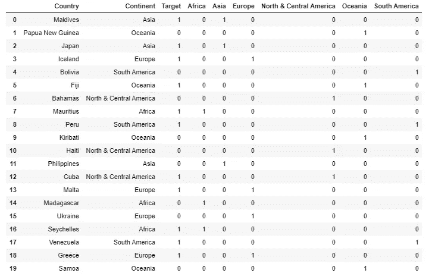
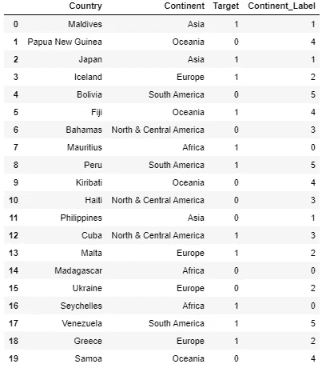
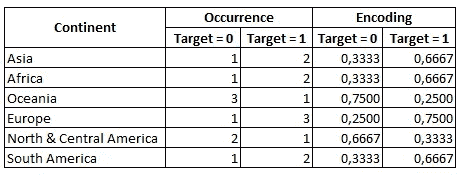
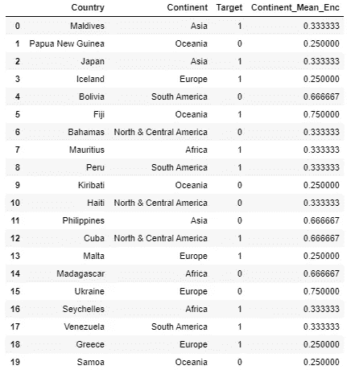

# 机器学习中分类数据的基本编码

> 原文：<https://medium.com/analytics-vidhya/basic-encoding-for-categorical-data-in-machine-learning-8276aa078efc?source=collection_archive---------14----------------------->

paweczerwi ski 在 [Unsplash](https://unsplash.com?utm_source=medium&utm_medium=referral) 上的照片

在机器学习中处理数据时，我们可能会遇到各种类型的数据，无论是字符串、数字还是日期。必须将字符串数据预处理成数字形式，以便对其进行训练。有时候对于一些字符串数据，我们可以直接识别为分类数据。

什么是分类数据？它只是简单地用组或标签表示的数据。例如，在国家变量中，有“德国”、“南非”或“秘鲁”。或者人类案例中的“男性”对“女性”。

分类数据有两种类型:名义数据和序数数据。名义变量类似于前面给出的例子，如国家或性别，其中没有为每种类型分配顺序。对于序数，每个值代表一个特定的级别。比如，学历有小学、初中、高中、本科、硕士等层次。

那么，我们如何编码这样的分类数据呢？以下是机器学习中广泛使用的方法

# 一键编码

让我们用这个简单的例子来说明

分类编码图解

如果使用 one-hot 编码对洲列进行编码，将会有额外的列表示每个洲，如下所示:

大陆列的一键编码

这些新列是二元的，告诉每个样品它是否属于特定的类别。例如，由于秘鲁位于南美洲，因此秘鲁的“南美洲”列将被分配 1，而其他新列将被分配 0。

# 标签编码

在标签编码中，每个类别的分类数据将以整数表示。对于顺序数据类型，级别应按顺序表示(例如:1 表示最低，5 表示最高)。如果使用标签编码器进行编码，大陆列将如下图所示。

大陆列的标签编码

# 平均编码

应用均值编码会将变量与输出相关联。要进行编码，我们必须执行以下步骤:

1.  对于每个类别，计算输出出现的次数。在本例中，按目标列对大陆变量进行分组。
2.  将每个输出和类别的出现次数除以类别的总出现次数。然后平均值就是编码。例如，亚洲有 1 个目标= 0 的样本和 2 个目标= 1 的样本。然后，对于以亚洲为洲的样本，如果目标为 0，则用 1/3 编码洲，如果目标为 1，则用 2/3 编码洲。

如何创建均值编码

大陆列的平均编码

# 结论

为了确定哪种方法最适合应用，必须考虑将编码方法应用于自己的数据集的经验，因为每个数据集都有自己的特征。我的另一个建议是，研究其他编码方法，探索数据集。