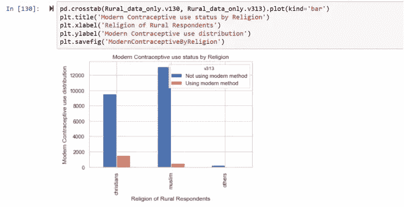
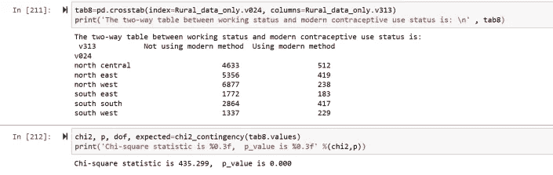
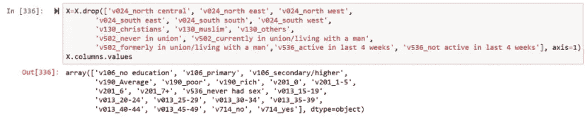
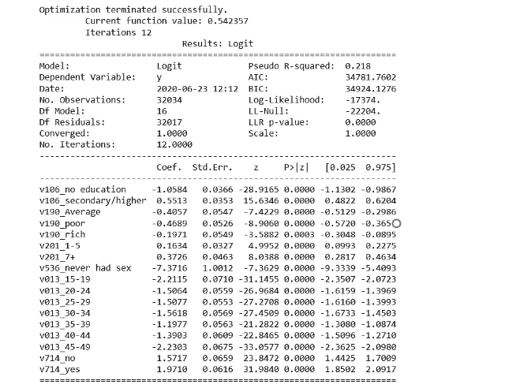
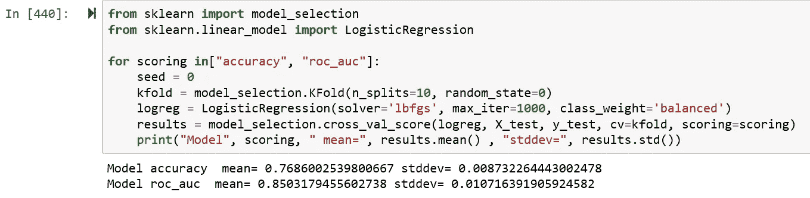

# 机器学习预测的一个基本示例:预测尼日利亚农村的避孕药具使用情况

> 原文：<https://medium.com/analytics-vidhya/basic-example-of-a-machine-learning-model-prediction-predicting-modern-contraceptive-use-in-rural-c5e35e8aa877?source=collection_archive---------12----------------------->


Arif Riyanto 在 [Unsplash](https://unsplash.com?utm_source=medium&utm_medium=referral) 上拍摄的照片

在本文中，我们使用尼日利亚人口和健康调查的真实示例数据来开发一个机器学习模型，该模型将使用逻辑回归分类模型来预测尼日利亚农村地区的现代避孕药具使用情况。

本文将包含以下几个部分:

> **分析概述及数据来源**
> 
> **将数据加载到 python 中**
> 
> **数据和特性描述**
> 
> **从整个数据框架中挑选出农村受访者样本**
> 
> **单变量(单特征)探索性数据分析**
> 
> **特征工程**
> 
> **双变量(两个特征)探索性数据分析和关联性检验**
> 
> **检查缺失值的特征**
> 
> **虚拟编码特征**
> 
> **类别不平衡校正和训练/测试数据分割**
> 
> **用于建模的特征选择**
> 
> **数据建模**
> 
> **车型性能评估**
> 
> **模型特征重要性**
> 
> **k 倍交叉验证**
> 
> **保存模型以备将来使用**

## 分析和数据源概述

这篇文章将利用最新的免费二手数据来源的人口和健康调查(DHS)为尼日利亚，所谓的 NDHS 2018。它是在 2018 年进行的，因此得名。DHS 是在发展中国家进行的一项具有全国代表性的调查。如需从 DHS 计划获取任何国家级免费数据，请访问 [**DHS 计划**](https://dhsprogram.com/data/dataset_admin/login_main.cfm?CFID=6656492&CFTOKEN=ce6ca5b288d60002-2AFF6515-C723-702A-D46EDCBB32A8BDBD) ，注册并申请。

在这个分析中，我们将利用 python 库来实现研究的不同部分。具体来说，我们将使用:

**a . Pandas**——将我们的数据集读入 python 并进行操作，以便进行分析；

**b. Matplotlib 和 Seaborn**——进行所有可视化；

c. Numpy 和 Scipy——执行所有科学、数学和统计计算；

f. Sklearn —提供建模所需的算法；

**g. Eli5** —确定模型中特征的重要性顺序；和

**h. Joblib** —保存模型以备将来使用和部署。

这一分析的总体目标是开发一个二元逻辑模型，通过观察尼日利亚农村地区的育龄妇女(15-49 岁)的社会人口特征和近似特征，即年龄、工作状况、婚姻状况、宗教、居住地区、产次、教育程度、财富指数和性活跃程度，确定该妇女目前是否使用现代避孕方法。

二元逻辑模型，顾名思义，是一种机器学习分类模型，适用于预测只有两个响应类别的分类目标特征，其中一个响应类别在数字上编码为 1，另一个编码为 0。在任何时候，预测 1 或 0 的结果将由一组识别、选择和合格的预测器特征来确定。在选择预测特征时，必须以领域知识为指导。

## 将数据加载到 python

正如 DHS 项目所提供的，NDHS 2018 年奥运会的数据集有不同的格式。csv，。sav，。dta，。xls 等)。在这个分析中，我们将使用。dta (STATA 扩展)格式。

首先，我们将首先导入该分析所需的所有 python 库。注意:我们使用来自 anaconda 的 jupyter 笔记本作为本次分析的集成开发环境(IDE)。

接下来，我们将把 NDHS 数据集导入熊猫。

```
path=r"B:\NGIR7ADT\NGIR7AFL.dta"
DHS=pd.read_stata(path)
Variables_needed=['v024', 'v130', 'v502', 'v025', 'v106', 'v190', 'v201', 'v313', 'v536', 'v013', 'v714']
Total_Sample=DHS[Variables_needed]
```


图 1

总样本是 41821(全部受访者的数据)，从 NDHS 数据集导入到 pandas 进行分析的总特征是 11。(注:NDHS 2018 数据集共有 5394 个特征/变量)。

熊猫数据框架中 NDHS 2018 数据集的数据结构如下所示:


图 2

## 数据和功能描述

下表显示了将在此分析中使用的特性/变量及其特征:


**此分析中使用的特性列表**

**从属或目标特征/变量**

在此分析中，特征 v313 是从属或目标特征。它有回应类别:无方法、现代方法、传统方法和民俗方法。由于我们将在此分析中使用逻辑回归模型，它将被特征工程重新编码，从四个响应类别特征重新编码为两个。


图 3

我们将把这四个响应类别分为编码为 1 的**“使用现代避孕药”和编码为 0 的**“不使用现代避孕药”。****

**预测器特性**

在该分析中，预测值或独立特征是 v024、v106、v130、v190、v013、v201、v714、v502、v536。特征 v025 将用于选择农村样本，并从数据帧中删除城市样本。将 v025 用于该功能后，我们将从数据框的功能列表中删除它。

## 从整个数据框架中选择农村受访者样本

为了从整个数据(41，821)中获得所需的农村受访者样本，我们将使用 v025 特征。以下是 v025 特性的响应类别和频率分布:


图 4

我们将从数据集中删除城市受访者的数据。因此只有农村受访者的数据会出现在数据框架中。

```
Rural_data_only=Total_Sample.drop(Total_Sample[Total_Sample['v025']=='urban'].index)
```


图 5

我们还可以检查 Rural_data_only 要素信息，以查看 v025 要素是否仍在要素中。


图 6

## 单变量(单一特征)探索性数据分析(EDA)

在本节中，我们将尝试使用频率分布、百分比分布和可视化来理解单变量(单个特征)的特征分布。

我们将首先尝试理解我们的目标功能，即 v313。评估频率和百分比分布可以指导和建议任何所需的特性工程。


图 7


图 8

如上所示，正如前面所讨论的，我们的预测特征有四个响应类别，我们需要将这个类别分成两个，以便可以满足逻辑回归模型的使用条件。我们将在这里解决这个问题。

此外，我们观察到使用现代方法的农村妇女比例仅为 8%；这意味着现代避孕药具使用者与非避孕药具使用者的比例约为 1:9。这表明存在不平衡分类问题。我们将在班级不平衡修正部分解决这个问题。

以下是对其余特征的单变量探索性分析:


图 9


图 10


图 11


图 12


图 13


图 14


图 15


图 16


图 17

基于上面的单变量探索性分析和领域知识，我们需要重新编码一些特性的响应类别。我们将在特征工程部分做这件事。

## 特征工程

在本节中，我们将根据单变量探索性分析，对一些特征的反应类别进行重新编码和分组。在进行双变量探索性分析之前，这是很重要的。

我们需要对以下特征的反应类别进行分组:避孕药具使用(v313)、宗教(v130)、教育(v106)、财富指数(v190)、产次(v201)、性活跃程度(v536)，也就是说，对于这些选定的特征中的每一个，我们需要将它们的一些反应类别折叠起来。

作为一个例子，对于宗教(130 节)，我们可以把“其他基督徒”和“天主教徒”归为“基督徒”一类。此外，我们会将“传统主义者”和“其他人”合并成一个类别作为“其他人”，这样，宗教特性(130 节)现在将有三个响应类别，即:穆斯林、基督徒和其他人。

以下是所需的每个功能的工程设计:

```
Independent_recode_v130 =  {"v130":

                            {"other christian": 'christians',  
                             "catholic": 'christian',  
                             "other": 'others',  
                             "traditionalist": 'others',  
                             "islam": 'muslim'}
                           }Rural_data_only.replace(Independent_recode_v130, inplace=True)Rural_data_only['v130'].value_counts(normalize=True) * 100
```


图 18


图 19


图 20


图 21


图 22

```
Independent_v201 = {
                "v201": {0: '0',  1: '1-5',  2: '1-5',  3:'1-5',  
                         4: '1-5', 5: '1-5', 6: '6', 7: '7+',  
                         8: '7+',  9: '7+',  10: '7+',  11: '7+',  
                         12: '7+',  13: '7+',  14: '7+',  15: '7+',  
                         16: '7+', 17: '7+'}
                    }
Rural_data_only.replace(Independent_v201, inplace=True)
Rural_data_only['v201'].value_counts(normalize=True) * 100
```


图 23

## 双变量(两个特征)探索性数据分析(EDA)和关联性检验

现在，我们将通过数据可视化在每个预测特征和从属或目标特征之间进行双变量探索性分析，以了解每个独立特征的反应类别中从属特征的分布模式。

**婚姻状况和现代避孕药具使用情况**


图 24

从上面的分析来看，已婚(以前或现在)的受访者似乎比未婚者使用现代避孕方法。这表明婚姻状况可以很好地预测现代避孕药的使用。两个特征之间关联的卡方统计检验表明相同(χ2 = 33.657，p 值= 0.000)

```
tab1=pd.crosstab(index=Rural_data_only.v502, columns=Rural_data_only.v313)
print('The two-way table between marital status and modern contraceptive use status is: \n' , tab1)chi2, p, dof, expected=chi2_contingency(tab1.values)
print('Chi-square statistic is %0.3f,  p_value is %0.3f' %(chi2,p))
```


图 25

**宗教和现代避孕药的使用**



图 26

从上面的分析来看，似乎基督徒回答者使用现代避孕药具，比穆斯林多三倍，这可能意味着宗教可能是现代避孕药具使用的一个强有力的预测因素。统计检验也显示了同样的结果——χ2 = 795.017，p 值= 0.000


**财富指数和现代避孕药具的使用**


图 27

根据上述分析，富人(数据集中的富人和普通受访者)与穷人受访者之间的比较表明，前者比后者更多地使用现代避孕方法。卡方统计检验也显示了同样的结果——χ2 = 374.002，p 值= 0.000。


图 28

**工作状态和现代避孕方法的使用**


图 29

根据上述分析，目前有工作的受访者似乎比没有工作的受访者更多地使用现代避孕药具。这可能意味着工作状态可能是现代避孕药使用的一个重要预测因素。这是关联的卡方检验— χ2 = 186.850，P 值= 0.000


图 30

**年龄和现代避孕方法的使用**


图 31

从上述分析来看，随着年龄的增长，现代避孕药具的使用似乎有所增加。这似乎在 25-39 岁的受访者群体中达到顶峰，然后开始下降。这表明年龄可能是现代避孕药使用的一个重要预测因素。相关的卡方统计检验也显示了相同的结果(χ2 = 365.577，p 值= 0.000)，如下所示


图 32

**胎次(曾经生育的孩子数量)和现代避孕方法的使用**


图 33

根据上述分析，似乎从未生育过的受访者不使用现代避孕药具，而生育过 1 至 5 次的受访者更多地使用现代避孕药具，生育过 6 次或 6 次以上的受访者使用现代避孕药具的比例明显低于生育过 1 至 5 次的受访者。这表明，产次可能是现代避孕药具使用的一个重要预测指标。关联的卡方检验也表明了这一点——χ2 = 177.454，P 值= 0.000，如下所示


图 34

**性活跃和现代避孕方法的使用**


图 35

从上述分析中可以看出，只有曾经有过性行为的受访者才是现代避孕药具的主要使用者。此外，那些最近活跃的人比那些最近不活跃的人使用更多的避孕药具。这表明性活跃与现代避孕药具的使用密切相关。卡方统计还表明，性活跃程度和现代避孕药具的使用之间存在关联。


图 36

**居住地区和现代避孕药具使用情况**


图 37



图 38

## 检查要素是否有缺失值


图 39

Rural_data_only 数据框架中的所有要素都没有任何缺失值

## 特征的虚拟编码

机器学习监督模型仅依赖数字数据，否则它们将无法正常运行。这意味着，如果我们用当前的分类特征来填充模型，我们的模型可能无法运行。为了确保此分析中的模型运行，我们需要将我们的分类特征转换为虚拟特征。这包括将每个特性的每个响应类别转换为一个新列(特性),并赋予值 1 0r 0。现在，我们将从数据框中的 10 个特征中的每一个创建一个虚拟特征。

```
Create_dummies=pd.get_dummies(Rural_data_only)
Create_dummies.columns.values
Concat_Rural_data_only=pd.concat([Rural_data_only, Create_dummies], sort=False)
Concat_Rural_data_only.columns.values
```


图 40

请注意，原始分类要素以及新创建的虚拟要素仍在 Rural_data_only 数据中。我们需要删除原始特征(因为它们是分类的和非数字的)，这样我们就只有虚拟特征(因为它们是数字的)

```
Concat_Rural_data_only=Concat_Rural_data_only.drop(['v130', 'v502', 'v024', 'v106', 'v190', 'v201', 'v536', 'v013', 'v714', 'v313', 'v313_Not using modern method'], axis=1)Concat_Rural_data_only.fillna
Concat_Rural_data_only = Concat_Rural_data_only.dropna()
Concat_Rural_data_only.dtypes
Concat_Rural_data_only=Concat_Rural_data_only.astype(int)
Concat_Rural_data_only.dtypes
Concat_Rural_data_only.columns.values
```


图 41

在虚拟编码之后，我们将独立或预测特征的列表表示为 X，而目标或相关特征的列表表示为 y:

```
X=Concat_Rural_data_only.drop('v313_Using modern method',axis=1)
y=Concat_Rural_data_only['v313_Using modern method']
y=y.to_frame()
```


图 42

## 类别不平衡校正和训练/测试数据分割

回想一下，我们的从属特征有一个不平衡的分类问题，即使用现代避孕药具的受访者比例明显低于不使用的受访者。我们将在建模前解决这种不平衡。标准建模要求，当进行比较时，从属特征的响应类别的比例必须接近相等(45:55)，如果不相等(50:50)。我们将使用 SMOTE(合成少数过采样技术)算法来解决这个问题。SMOTE 将有助于平衡这两个等级。

此外，请注意，我们已经将数据分成了训练和测试数据集；训练数据集占全部数据的 70%，测试数据占 30%。我们将使用训练数据来训练我们的模型，并使用测试数据来测试已训练的模型，以进行准确性和精确度评估。

```
os = SMOTE(random_state=0, ratio='auto')
X_train, X_test, y_train, y_test = train_test_split(X, y, test_size=0.3, random_state=0)
columns = X_train.columns
X_train.columns.values
y_train.columns.values
os_data_X,os_data_y=os.fit_sample(X_train,y_train.values.ravel())
os_data_X = pd.DataFrame(data=os_data_X,columns=columns )
os_data_y= pd.DataFrame(data=os_data_y,columns=['y'])print("length of oversampled data is ",len(os_data_X))
print("Number of non modern contraceptive users in oversampled data",len(os_data_y[os_data_y['y']==0]))
print("Number of modern contraceptive users in the oversampled data",len(os_data_y[os_data_y['y']==1]))
print("Proportion of non modern contraceptive users data in oversampled data is ",len(os_data_y[os_data_y['y']==0])/len(os_data_X))
print("Proportion of modern contraceptive users data in oversampled data is ",len(os_data_y[os_data_y['y']==1])/len(os_data_X))
```


图 43

从上面的输出可以看出，从属特征响应类别现在达到了平衡。此外，SMOTE 算法仅在训练数据上执行。这是为了确保测试数据中没有观测值被用于创建合成观测值，因为这会对模型预测准确度和精度产生负面影响。

## 建模的特征选择

在这一部分中，我们将检查并选择最适合用于预测模型的特征。我们将使用递归特征消除(RFE)技术。RFE 采用模拟重复模型预测过程来识别和指出我们的建模中应包含的合适和不合适的特征。它将合适的特征表示为**真或 1** ，而被识别为不合适的特征表示为**假或> 1 值。**

注意:特征数组中特征的顺序与其在布尔和数字列表中的 RFE 分数相同。例如，从下面的代码输出中，功能“v024_north central”是功能列表中的第一个(从顶部开始)，并在布尔和编号列表中取值“False”和“6”。此外，特征“v714_no”是特征列表中倒数第二个特征，它在布尔和数字列表中的位置相同。它在布尔和数字列表上接受“真”和“1”值。

```
from sklearn.feature_selection import RFE
from sklearn.linear_model import LogisticRegression
logreg = LogisticRegression(solver='lbfgs', max_iter=1000, class_weight='balanced')
rfe = RFE(logreg, 20)
rfe = rfe.fit(os_data_X, os_data_y.values.ravel())
print(rfe.support_)
print(rfe.ranking_)
X.columns.values
```


图 44

基于 RFE 评估，我们将从建模中排除布尔列表上具有“假”值以及数字列表上大于一(> 1)值的特征。只有布尔值为“真”且数值为“1”的要素才会包含在模型预测中。

下图中带有布尔值和数值的特征汇总:


图 45

基于这些标准，将在模型预测实现中排除的独立特征是:

```
X=X.drop(**['v024_north central', 'v024_north east', 'v024_north west','v024_south east', 'v024_south south', 'v024_south west', 'v130_christians', 'v130_muslim', 'v130_others','v502_never in union', 'v502_currently in union/living with a man','v502_formerly in union/living with a man','v536_active in last 4 weeks', 'v536_not active in last 4 weeks']**, axis=1)X.columns.values
X=X.columns
```



图 46

## 数据建模

现在我们有了 X 和 y 的值。我们会用训练数据来填充我们的逻辑回归模型:

```
X=os_data_X[X]
y=os_data_y['y']import statsmodels.api as sm
logit_model=sm.Logit(y,X)
result=logit_model.fit()
print(result.summary2())
```

建模的结果如下所示:


图 47

从上表中可以看出，特征 v106_primary、v201_0 和 v201_6 的 p 值大于 0.05，因此不是现代避孕药使用的重要预测因素(它们被认为不重要，因为它们的“p>|z|”大于 0.05)。因此，它们将作为预测器从模型中移除。此外，在这一点上，我们的模型使用我们的测试数据的预测精度是 79%。这可以从下面看出:

```
from sklearn.linear_model import LogisticRegression
from sklearn import metrics
X_train, X_test, y_train, y_test = train_test_split(X, y, test_size=0.3, random_state=0)
logreg = LogisticRegression(solver='lbfgs', max_iter=1000, class_weight='balanced')
logreg.fit(X_train, y_train)y_pred = logreg.predict(X_test)
print('Accuracy of logistic regression classifier on test set: {:.2f}'.format(logreg.score(X_test, y_test)))
```


图 48

接下来，我们将从 X 中删除 3 个特征，并再次运行模型，然后检查准确性和精确度。

```
X=['v106_no education', 'v106_secondary/higher',
       'v190_Average', 'v190_poor', 'v190_rich', 'v201_1-5',
       'v201_7+', 'v536_never had sex', 'v013_15-19',
       'v013_20-24', 'v013_25-29', 'v013_30-34', 'v013_35-39',
       'v013_40-44', 'v013_45-49', 'v714_no', 'v714_yes']
```



图 49

所有包含的特征都是显著的(具有 p 值< 0.05) in the new model. The prediction accuracy of this model is now 77%


Figure 50

## Model performance evaluation

**混淆矩阵**

我们可以评估混淆矩阵来查看正确和错误预测的分布

```
from sklearn.metrics import confusion_matrix
confusion_matrix = confusion_matrix(y_test, y_pred)
print(confusion_matrix)
```


图 51

**混淆矩阵的左对角线(3425，3948)上的元素是由模型正确预测的元素:**

第一行和第一列的第一个元素(3425-模型预测的使用现代避孕方法和正在使用的人数)以及第二行和第二列的元素(3948-模型预测的不使用现代避孕方法和正在使用的人数)由模型正确预测。总的来说，它们构成了模型 77%的准确预测。

**混淆矩阵右对角线(1330，908)上的元素是那些预测错误的:**

第一行第二列的第二个元素(1330-模型预测为使用现代避孕药但没有使用的人数)和第二行第一列的元素(908-模型预测为没有使用现代避孕药但正在使用的人数)被模型错误地预测。总体而言，它们构成了该模型 23%的不准确预测。

**接收机工作特性曲线**

此外，我们将使用受试者工作特征曲线(ROC)来评估我们的模型的可靠性和强度，以准确预测。一个模型的好的 ROC 曲线是在平面的左上侧，即一个好的分类器模型具有远离左侧红色虚线的 ROC 曲线(蓝线)。

```
from sklearn.metrics import classification_report
print(classification_report(y_test, y_pred))
from sklearn.metrics import roc_auc_score
from sklearn.metrics import roc_curve
logit_roc_auc = roc_auc_score(y_test, logreg.predict(X_test))
fpr, tpr, thresholds = roc_curve(y_test, logreg.predict_proba(X_test)[:,1])
plt.figure()
plt.plot(fpr, tpr, label='Logistic Regression (area = %0.2f)' % logit_roc_auc)
plt.plot([0, 1], [0, 1],'r--')
plt.xlim([0.0, 1.0])
plt.ylim([0.0, 1.05])
plt.xlabel('False Positive Rate')
plt.ylabel('True Positive Rate')
plt.title('Receiver operating characteristic')
plt.legend(loc="lower right")
plt.savefig('Log_ROC')
plt.show()
```


图 52

ROC 的结果如下所示:


图 53

从上面可以看出，物流回归曲线(蓝色曲线)在 ROC 曲线的左上方。精确度和 f1 分数也凸显了我们车型的性能和优势。目前使用现代避孕药的 f1 值为 78%,目前未使用的为 75%。整体平均为 77%。我们的模型预测目前使用现代避孕方法的精确度为 75%,预测目前不使用任何方法的精确度为 79%,总平均值为 77%。

## 模型特征重要性

因为我们现在已经有了一系列特征，这些特征是现代避孕药具使用的重要预测因素；重要的是要评估每个重要的特征水平，以预测模型中其他人使用现代避孕药具的重要性。

我们将使用 eli5 库来评估特性的重要性，使用它的排列重要性技术。

```
perm = PermutationImportance(logreg, random_state=0).fit(X_test, y_test)
eli5.show_weights(perm, feature_names = X_test.columns.tolist())
```


图 54

从表格来看，重要性的顺序是从上到下。

请注意，每一行中的第一个数字表示在模型中删除和重新排列特征时模型性能的降低程度。第二个数字是当特征在模型中被重组时模型性能的变化水平的度量。可以看出，如果混洗，贫穷(v190_poor)对模型性能具有最大的效应值可变性，并且对模型性能也具有最高的效应值。

可以说‘v190 _ poor’是预测现代避孕药使用的最重要特征。这意味着将受访者评定为贫困或其他是他们使用现代避孕药具的最强有力的决定因素。

## k 倍交叉验证

仅依赖模型的一次性精度值不是标准做法。训练模型和评估精度的过程最好重复几次。此后，取重复测量的平均值和标准差作为模型的最终精度值。这可以通过使用 k 倍交叉验证的概念来实现。

```
from sklearn import model_selection
from sklearn.linear_model import LogisticRegressionfor scoring in["accuracy", "roc_auc"]:
    seed = 0
    kfold = model_selection.KFold(n_splits=10, random_state=0)
    logreg = LogisticRegression(solver='lbfgs', max_iter=1000, class_weight='balanced')
    results = model_selection.cross_val_score(logreg, X_test, y_test, cv=kfold, scoring=scoring)
    print("Model", scoring, " mean=", results.mean() , "stddev=", results.std())
```



图 55

从 k 倍交叉验证来看，模型的平均准确率为 77%，标准差为 0.9。

## 保存模型以备将来使用

我们现在将保存模型，以备将来使用和部署

```
from sklearn.externals import joblib 

# Save the model as a pickle file 
joblib.dump(logreg, 'ModernContraceptiveUsePredictorModel.pkl')
```


图 56

用于此分析的 Jupyter 笔记本可在[此处](https://github.com/ayobamiakiode/FirstProject/blob/master/Contraceptive_use_in_rural_Nigeria.ipynb)获得

**这就对了。**希望这对您有用？请放下你的评论，在 LinkedIn 上关注我，地址是 [Ayobami Akiode LinkedIn](https://www.linkedin.com/in/ayobami-akiode-38528839/)