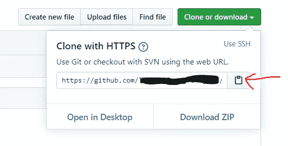

# 你必须知道的基本 Git 命令。

> 原文：<https://medium.com/analytics-vidhya/basic-git-commands-you-must-know-80eaa81b3301?source=collection_archive---------34----------------------->

*Git 基础知识*


照片由[丹尼·梅内塞斯](https://www.pexels.com/@danny-meneses-340146?utm_content=attributionCopyText&utm_medium=referral&utm_source=pexels)从[派克斯](https://www.pexels.com/photo/photo-of-turned-on-laptop-computer-943096/?utm_content=attributionCopyText&utm_medium=referral&utm_source=pexels)拍摄

在当今，git 是一个我们经常听到的名字。作为一个技术人员，如果对 git 一点概念都没有，那将是一个很大的欠缺。所以让我们来了解一些最常用的 git 命令。首先，让我们了解一下 git 是什么。

**什么是 git？**

Git 是一个简单的开源分布式版本控制系统。它旨在协调开发人员之间的工作，并跟踪源代码中的变化。Git 提倡协作编码。git 的一些目标是提高速度、增强数据完整性、提供分布支持和促进非线性工作流。

**什么是版本控制，为什么如此重要？**

版本控制系统是一种软件工具，它被设计成由一组人随着时间的推移来管理源代码。这个系统的一个非常特别和重要的特点是，它跟踪源代码中的每一个修改。因此，在出现错误或问题时，开发人员可以回滚更改，或者可以与以前的版本进行比较并轻松修复它们。这在软件开发领域非常重要和有用，因为这将对开发人员的干扰降到了最低。版本控制系统的主要好处是，每个文件的完整长期变更历史的可用性、分支和合并能力以及可追溯性。

[](https://github.com/) [## 一起打造更好的软件

### GitHub 汇集了世界上最大的开发人员社区来发现、共享和构建更好的软件。来自…

github.com](https://github.com/) 

**基本 git 命令**

1.  **git 初始化**

这将在当前目录中创建一个本地 git 存储库。参见下面的示例。

首先，转到您想要创建新项目的目录，打开命令行并指定所需目录的路径。运行命令 *git init* 。这将在当前目录中创建一个本地 git 存储库。

```
**git init**
```

或者您可以同时创建一个项目文件夹和一个本地 git 存储库，如下所示。

```
**git init <Project_folder_name>**
```

**2。git remote add origin<host-or-remote URL>**

这将本地存储库连接到远程服务器存储库。为此，您只需给出服务器存储库的链接。您可以在 GitHub 中获得如下的存储库链接。

转到所需的存储库并复制以下 URL。



然后键入***git remote add origin copiedURL _ here。***

```
**git remote add origin <remote_repository_url>**
#git remote add origin [https://github.com/*OWNER/REPOSITORY*.git](https://github.com/OWNER/REPOSITORY.git)
```

**3。git remote -v**

该命令将向您显示所有已连接的存储库及其 URL 的列表。

```
**git remote -v**
```

**4。git 远程 rm <名称>**

这将从本地存储库中删除远程存储库连接。

首先，使用命令 **git remote -v.** 检查连接的存储库

```
**git remote -v** origin  https://github.com/*OWNER/REPOSITORY*.git (fetch)
 origin  https://github.com/*OWNER/REPOSITORY*.git (push)
 destination  https://github.com/*FORKER/REPOSITORY*.git (fetch)
 destination  https://github.com/*FORKER/REPOSITORY*.git (push)
```

***git 远程 rm 目的地后，***

```
**git remote rm destination**#Check whether it is removed **git remote -v**

origin  https://github.com/*OWNER/REPOSITORY*.git (fetch)
origin  https://github.com/*OWNER/REPOSITORY*.git (push)
```

**5。git 克隆<远程存储库 URL 或本地存储库路径>**

这用于将存储库复制到本地机器。存储库可以是远程的，也可以是本地的。

```
#clone a remote repository
**git clone** **https://github.com/*OWNER/REPOSITORY*.git**
OR#clone a local repository
**git clone local/path/Repository**
```

**6。git 添加**

这将把工作目录中的新文件或更改添加到本地存储库的临时区域。它告诉我们希望在下一次提交时更新一个特定的文件。在您提交它们之前，这不会影响存储库。

```
**git add <file>**
```

上面的命令会将这个文件中的更改添加到临时区域。

```
**git add <directory>**
```

以上将把整个目录中的更改添加到临时区域。

```
**git add .**
```

以上将把本地存储库的所有未登台的变更添加到登台区。

**7。git commit–m "此处提交的消息"**

这将保存所有被添加到暂存区域的变更的快照(使用 ***git add*** 命令)到 git 存储库中。这将只保存本地存储库中的更改，不会影响远程存储库。

```
**git commit -m “commit message”**
```

8。git 状态

这将显示已更改文件的列表，包括要添加用于暂存的已填充文件和尚未提交的文件。

```
**git status**
```

在添加要转移的文件或提交之前，您可以使用此命令检查已更改文件的状态。

**分支**

9。git 检验

这将帮助您在存储库中创建新的分支，并在它们之间导航。

```
**git checkout -b <branch-name>**
```

这将创建一个新的分支，并将自动切换到该分支。这意味着，现在你在这个新创建的分支机构工作。

```
**git checkout <branch-name>**
```

使用此命令，您只需键入要导航到的分支名称，就可以导航到任何其他分支。

**10。git 分支**

```
**git branch**
```

这将列出存储库中存在的所有分支。这也会用不同的颜色显示你正在处理的分支。

您可以简单地用下面的命令删除一个分支。

```
**git branch –d <branch-name>**
```

11.git 推送

使用这个命令，我们可以将本地提交发送到远程存储库的已定义分支。

```
**git push origin <branch-name>**
```

如果我们想将本地提交发送到*主*分支，那么用*主替换 branch_name。*您可以将更改发送到任何想要的分支，只需将*主*替换为想要的分支名称。

```
**git push origin master**#push into the branch branch1 as follows
**git push origin branch1**
```

12.git 拉

这将获取远程存储库中的所有更改，并将其合并到本地工作目录中。

```
**git pull**
```

13.git 差异

使用 git diff，我们可以列出所有针对远程存储库的文件或分支的未合并的变更。

```
#List down all the unmerged changes in all branches
**git diff**#List conflicts aginst the filename
**git diff --base <filename>**#List changes/conflicts between two branches 
**git diff <sourcebranch> <targetbranch>**
```

14.git 合并

使用这个命令，我们可以将一个分支的内容集成到活动分支中。

```
**git merge <branch-name>**
```

如果您在主分支中，使用上面的命令，您将给定的分支合并到主分支中。作为一个好的实践，永远记住用 *git diff* 命令检查冲突，并在合并它们之前解决冲突。

15.git 配置

这个命令用来告诉 git 我们是谁。这样，我们可以设置特定于用户的配置，如用户名、电子邮件。

```
#Configure your global email adress.
**git config --global user.email youremail@example.com**#Configure your global user name.
**git config --global user.name "Your_User_Name"**
```

使用上面的命令，您可以设置一个全局电子邮件地址和一个全局用户名，供所有提交使用。全局标志表示您将对所有存储库使用该电子邮件和用户名。

如果您想在不同的存储库中使用不同的电子邮件或用户名，您可以使用本地标志。

```
#Configure your local email adress.
**git config --local user.email youremail@example.com**#Configure your local user name.
**git config --local user.name "Your_User_Name"**
```

**Git 标签**

16.git 日志

我们可以使用这个命令获得工作分支的提交 id。提交 ID 是变更集 Id 的前导字符，最多 10 个。这是独特的。提交 ID 在添加标签时很有用。

```
**git log**
```

17.git 标签

通过使用 git 标签，您可以标记一个特殊的变更集，比如一个新版本。

```
**git tag 1.0.0 <commitID>**
```

我们可以使用以下命令将所有标签发送到远程存储库。

```
**git push --tags origin**
```

18.git 重置

这用于撤销对本地存储库所做的本地更改。这只是简单的回滚。

首先，我们可以使用 git log 命令找到提交日志，然后使用提交 id 回滚，如下所示。

```
**git reset <commit_id>**
```

或者你可以通过如下给出一个相对值来重置。

```
**git reset current~2** #This will rollback the last two commits.
```

以下命令将回滚所有未提交的更改，并将本地存储库恢复到上次提交的状态。

```
**git reset --hard HEAD**
#overwrites any local changes you haven't committed
**git reset --soft HEAD**
#reset the pointer in the repository
**git reset --mixed HEAD**
#reset the pointer and the staging area
```

19.git 还原

这也与 git reset 命令相同。但是有一点小小的不同。当 revert 命令运行时，它会删除未提交的更改，同时在链的末尾添加一个 commit 以“取消”更改。

```
**git revert HEAD**
```

20.git 贮藏

这将暂时保存当前未提交的更改。以便用户可以保存更改并在以后提交。

```
**git stash** 
```

21.git show

这将显示关于 git 对象的信息。

```
**git show**
```

22.git 目录文件

这将提供存储库对象的内容或类型和大小信息。

```
**git cat-file**
```

23.git gc

这将清理不必要的文件并优化本地存储库。这将删除不再属于任何分支的对象。

```
**git gc**
```

这些是一些常用的基本命令。但是还有更多的事情需要了解。希望这将有助于你今天 git 工作的快速指导。

祝你好运，编码快乐！！！！！