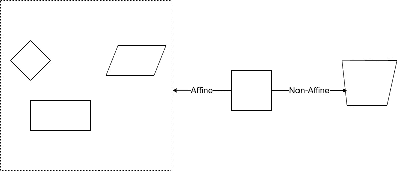
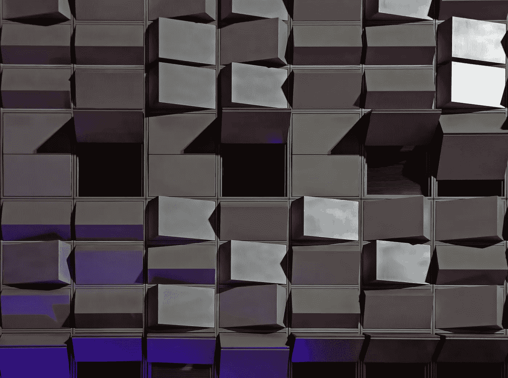
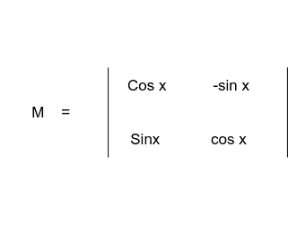
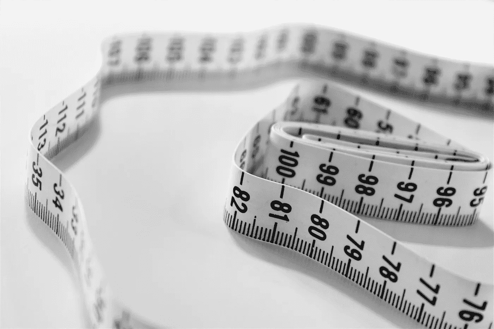

# 图像预处理的基本思想

> 原文：<https://medium.com/analytics-vidhya/basic-ideas-about-image-preprocessing-244fdb72765d?source=collection_archive---------11----------------------->

下面列出了我们计划在这个博客中涵盖的内容

1.  转换
2.  旋转
3.  缩放比例
4.  图像金字塔
5.  种植
6.  盘旋和模糊
7.  磨刀
8.  阈值化和二值化
9.  边缘检测和图像梯度

## 转换



变换是对图像的扭曲。我们可以用这些变换来做什么，我们用它们来校正从拍摄图像的角度产生的失真或透视问题。

有两种众所周知的变换，一种是仿射变换，另一种是非仿射变换。

**仿射与非仿射**

仿射变换包括缩放、旋转和平移。重要的因素是，如果原始图像中的线是平行的，那么在变换之后，线也将是平行的。我在简单的话中所说的行与行之间的排比也在转换后得到保持。

在非仿射变换中，将不会保持并行性。非仿射变换不会保留平行度、长度和角度。但是，它保留了共线性和关联。

## 旋转



由 [Ricardo Gomez Angel](https://unsplash.com/@ripato?utm_source=unsplash&utm_medium=referral&utm_content=creditCopyText) 在 [Unsplash](https://unsplash.com/s/photos/rotation?utm_source=unsplash&utm_medium=referral&utm_content=creditCopyText) 拍摄的照片

轮换，你知道的。旋转图像很容易。我们可以围绕一个点旋转，这个点通常是图像的中心。我们如何使用 OpenCV 进行旋转将在下面看到

对于旋转，我们有下面给出的 M 矩阵



x-旋转的角度

该角度从从中心画出的水平线开始逆时针测量。

OpenCV 允许您使用名为 getRotationMatrix2D 的函数同时缩放和旋转。

getRotationMatrix2D 函数的参数是我们需要旋转的点(在我们的例子中是中心点)、旋转角度(逆时针 90°)和比例(1)因子。

```
iamge = cv2imread(iamge_path)
height, width = iamge.shape[:2]#Center point is (width/2, height/2)rotatation_matrix = cv2.getRotationMatrix2D((width/2, height/2),90,1)rotated_image = cv2.warpAffine(image, rotation_matrix, (width,height))
cv2.imshow('Rotated Image', rotated_iamge)
cv2.waitKey(0)
cv2.destroyAllWindows()
```

## 调整大小或缩放



照片由 [Siora 摄影](https://unsplash.com/@siora18?utm_source=unsplash&utm_medium=referral&utm_content=creditCopyText)在 [Unsplash](https://unsplash.com/s/photos/scale?utm_source=unsplash&utm_medium=referral&utm_content=creditCopyText) 上拍摄

这很简单，但在这里，我们需要关心的一件事是插值。什么是插值？简单地说，它是一种在已知数据点的离散集合范围内构建新数据点的方法。基本上，当我们调整大小时，意味着我们在扩展点或像素。当我们从大到小或从小到大调整图像大小时，我们如何找到像素之间的间隙？我们做插值来填充像素的空隙。

OpenCV 有许多类型的插值。

cv2。INTER_AREA →适合缩小或缩减采样
cv2。INTER _ NEAREST→fast
cv2。INTER_LINEAR →适合缩放或上采样(默认)
cv2。INTER_CUBIC →更好的
cv2。INTER_LANCZOS4 →最佳

```
image = cv2.imread(image_path)
image_scaled_default = cv2.resize(image, None, fx=0.75, fy =0.75)
cv2.imshow('Scaling Default', image_scaled_default)img_scaled_cubic = cv2.resize(image, None,fx =2, fy=2, interpolation = cv2.INTERCUBIC)
cv2.imshow('Scaling Cubic Interpolation', img_scaled_cubic)img_scaled = cv2.resize(image, (800,600), interpolation = cv2.INTER_AREA)
cv2.imshow("scaling - exact size", img_scaled)cv2.waitKey(0)
cv2.destroyAllWindows()
```

cv2.resize 函数可以用来调整图像的大小。我们可以像前两个缩放示例一样，使用原始图像的比率(fx，fy)来缩放图像。

我们可以像上一个例子一样设置精确的尺寸来缩放图像。

## 种植

在 OpenCV 中裁剪非常容易。在 openCV 中，图像被表示为 Numpy 数组。所以我们可以用它来裁剪图像。当我们知道需要裁剪的确切的四个坐标时，我们可以使用 Numpy 数组方法

```
cropped = image[x1:x2, y1:y2]
```

这里 x1 和 x2 是行坐标，y1 和 y2 是列坐标。

## 卷积(*)和模糊

卷积是对两个函数执行的数学运算，产生第三个函数，该函数通常是其他原始函数之一的修改版本

输出图像=图像*函数(内核大小)

在计算机视觉中，我们使用内核来指定我们在图像上运行操作函数的大小。

卷积基本上是一次一个像素地操作。因此，当卷积在一个像素上操作时，它将考虑包含在内核中的像素周围。卷积查看内核像素的值，然后一次操作每个像素。

模糊是一种操作，其中我们对区域(内核)内的像素进行平均。

cv2.filter2D 是 OpenCV 中基本的模糊方法

我们定义了一个 3×3 的内核，如下所示

```
 | 1 1 1 |
kernel = 1/9 *| 1 1 1 |
              | 1 1 1 |
```

我们乘以 1/9 来标准化，否则我们将增加强度。当我们除以 9 时，总和将是 1。

```
img = cv2.imread(image_path)
kernel = np.ones((3,3), np.float32)/9blurred_img = cv2.filter(img, -1, kernel) 
```

当我们增加内核大小时，模糊程度会很高。

OpenCV 中也有其他模糊功能，如方块模糊和高斯模糊。

箱式过滤器是一种平均过滤器。这将获取盒子下面的像素并替换中心元素。所以盒子的大小需要一个奇数和正数。下面是在 opencv 中使用盒子过滤器的方法

```
blur_img = cv2.blur(img, (3,3))
```

medianBlur 是另一种模糊滤镜，它采用中值而不是平均值。

```
median = cv2.medianBlur(img,5)
```

双边滤波器在去除噪声的同时保持边缘清晰非常有效。它还需要一个空间中的高斯滤波器，但是又多了一个高斯滤波器，它是像素差的函数。像素差函数确保只有那些与中心像素具有相似亮度的像素才被考虑模糊。所以它保留了边缘，因为边缘处的像素将具有大的亮度变化。

```
bilateral_img = cv2.bilateralFilter(img, 9, 75, 75)
```

高斯模糊滤波器是另一种使用高斯矩阵的滤波器。高斯矩阵具有不同的权重，而不是相同的数字。高斯核在中心具有峰值，并向角落减慢。

```
guassian_img = cv2.GuassianBlur(img, (7,7),0)
```

图像去噪-非局部-意味着去噪滤波器不同于上述滤波器。这个滤镜其实源于计算摄影方法。需要一些时间来运行。

```
flitered_img = cv2.fastNlMeanDenoisingColored(image, None, 6,6,7,21)
```

## 磨刀

锐化是模糊的反义词。它强化或强调图像中的边缘。

```
sharpening_kernel = np.array([[-1,-1,-1],
                              [-1,9,-1],
                              [-1,-1,-1]
                              ])
sharped_img = cv2.filter2D(img, -1,sharpening_kerne)
```

我们的核和等于 1，所以我们不需要再次归一化。

## 阈值化和二值化

阈值处理是将图像转换成二进制形式的行为。所有阈值类型都适用于灰度图像。

```
cv2.threshold(image, Threshold value, Max value, Threshold type)ret, thresh = cv2.threshold(image, 127,255,cv2.THRESH_BINARY)
```

当我们使用上述函数值时，127 以下的值将变为 0，其他值将变为 255

```
ret, thresh = cv2.threshold(image, 127,255,cv2.THRESH_BINARY_INV)
```

当我们使用上面的函数值时，127 以下的是 255，其他的是零。

```
ret, thresh = cv2.threshold(image, 127,255,cv2.THRESH_TRUNC)
```

当我们使用上述函数时，大于 127 的值在 127 处被截断(255 参数未使用)

```
ret, thresh = cv2.threshold(image, 127,255,cv2.THRESH_TOZERO)
```

当调用上述函数时，127 以下的值变为 0，127 以上的值不变。

```
ret, thresh = cv2.threshold(image, 127,255,cv2.THRESH_TOZERO_INV)
```

使用上述函数时，127 以下不变，127 以上变为 0。

```
thresh = cv2.adaptiveThreshold(image, 255, cv2.ADAPTIVE_THRESH_MEAN_C, cv2.THRESH_BINARY,3,5)
```

在上面的函数中，我们使用了一个自适应阈值。

```
thresh_vl, thresh_img = cv2.threshold(image, 0,255,cv2.THRESH_BINARY+cv2.THRESH_OTSU)
```

简单阈值或全局阈值要求我们提供阈值。自适应阈值方法消除了这种不确定性。

```
cv2.adaptiveThreshold(image, Max Value, Adaptive Type, Thresold Type, Block size, Constant that is subtracted from mean)
```

这里，块大小应该是奇数。

自适应阈值类型

1.ADAPTIVE_THRESH_MEAN_C →基于像素邻域的平均值
2。ADAPTIVE_THRESH_GAUSSIAN_C →高斯核下邻域像素的加权和
3。THRESH_OTSU → Clever 算法假设图像的灰度直方图中有两个峰值，然后试图找到一个最佳值来分离这些峰值以找到 t

## 边缘检测

边缘不仅是图像的边界，图像中的突变也可能是边缘。

边缘可以被定义为图像中的突然变化，它们可以编码和像素一样多的信息。

OpenCV 有三种主要的边缘检测算法

1.  Sobel →强调垂直或水平边缘
2.  拉普拉斯→获得所有方向
3.  Canny →由于错误率低、边缘清晰和检测准确，因此是最佳选择。

Canny 算法是一种优秀的边缘检测算法。它是由约翰·F·坎尼在 1986 年开发的

Canny 边缘检测的步骤

1.  应用高斯模糊
2.  查找图像的强度梯度
3.  应用非最大抑制(删除不是边缘的像素)
4.  滞后-应用阈值(如果像素在上阈值和下阈值范围内，则将其视为边缘)

```
sobel_x = cv2.Sobel(img, cv2.CV_64F, 0,1,ksize =5)
sobel_y = cv2.Sobel(img, cv2.CV_64F, 1,0,ksize =5)
```

Sobel 可以分别检测水平和垂直边缘。

Canny 边缘检测只需要两个阈值来检测边缘。任何大于 thresh_high 的梯度值都被认为是边缘。任何低于 threshold_low 值的值都不会被视为边缘。基于它们的强度是如何连接的，阈值之间的值被分类为边缘或非边缘。

```
edges_detection = cv2.Canny(img,thresh_low, thresh_high)
```