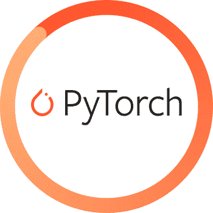

# PyTorch | PyTorch 系列| Snehit Vaddi 的基本但重要的功能

> 原文：<https://medium.com/analytics-vidhya/basic-important-functions-of-pytorch-pytorch-series-week-1-snehit-vaddi-8dc8aee5b5a5?source=collection_archive---------23----------------------->

**简介**

PyTorch 是一个 Python 库，有助于构建**深度学习模型。它是由脸书引进的。PyTorch 用于许多应用，如自然语言处理、计算机视觉、无人驾驶汽车等。**

PyTorch 的基本构件是**张量**。简单地说，张量是一组数字。在 NumPy 库中，这些矩阵被称为 nd-array。在 PyTorch 中，1d-张量是向量，2d-张量是矩阵，3d-张量是立方体，4d-张量是立方体向量。

**py torch 的基本功能:**

1.  ***张量的创建和切片-***

将 PyTorch 模块导入为" ***【导入火炬】*** *"。*为了创建一个 n 维张量，我们使用 torch 模块 ie 的张量函数，****【torch . tensor(【元素】)。****

****注:****py torch 中，张量应该像 3，3 一样对称。如果元素的形状不同，编译器会引发序列异常。**

*   *张量只能用数字初始化。它不能包含任何字符串或字符。*

*   *张量中的所有元素都是齐次的。如果有不同类型的元素，编译器本身将向上转换这些元素。*
*   ****torch.rand((m，n))*** 函数用于创建一个 m×n 的张量，在区间[0，-1]内填充随机数，即遵循标准正态偏差。*

***2*。张量——NumPy 桥(NumPy 数组到张量，反之亦然)-****

*   ****torch . from _ numpy()***函数用于将 n 维 NumPy 数组转换成 n 维张量。*

*   *同理，***tensor . numpy()***用于将一个 n 维张量转换为 NumPy 数组。*

****3。张量上的数学运算-****

*   ***PyTorch** 模块提供了许多函数来执行不同的数学/矩阵运算。*

*   *在 PyTorch 中，可以使用 3 种不同的方法计算矩阵乘法。*

*   *在矩阵乘法中，如果 A 的列数不等于 b 的行数，乘法就会失败。*

***4。使用 PyTorch 的渐变***

*在 PyTorch 中，用' ***初始化的变量要求 _grad= True'*** 指定变量将经历微分。*

*在给出的例子中，我们用 ***初始化***【x’***，要求 _grad*** 。一个方程' ***y*** '关于 x .在下一步中，函数的导数使用一个 ***backward()*** 方法。最后一步是求***‘x’***wrt’***y***’的偏导数。*

***5。优化器***

*PyTorch 提供了许多内置的优化器。像 SGD，Adam，AdamW，Adamax，Rprop 等。*

*Pytorch 中的 Optim 模块预先编写了构建神经网络时使用的优化器的代码。*

***导入上传到**[**jovian . ml**](https://www.jovian.ml/)**-***

*Jovian.ml 是在云中共享、协作和运行我们的笔记本的最佳平台。要使用 jovian.ml，pip 安装 jovian 包，导入 jovian，然后提交您的笔记本。*

***结论:***

*在这篇文章中，我们已经讨论了张量的创建、张量切片、张量-数值桥、张量的数学运算、梯度和 Optim 模块。在接下来的几周，我将深入研究逻辑回归、神经网络等高级主题。*

***参考:***

*威风凛凛的笔记本:[https://jovian.ml/v-snehith999/pytorch-week1-blog](https://jovian.ml/v-snehith999/pytorch-week1-blog)*

* [## 张量简介-Java point

### 张量是 Pytorch 的关键组成部分。我们可以说 PyTorch 完全基于张量。在数学中，一个…

www.javatpoint.com](https://www.javatpoint.com/pytorch-tensors)  [## PyTorch 初学者友好指南以及它如何从头开始工作

### 概述什么是 PyTorch？如何从零开始入门？我们将在 PyTorch 的这篇文章中涵盖所有这些内容…

www.analyticsvidhya.com](https://www.analyticsvidhya.com/blog/2019/09/introduction-to-pytorch-from-scratch/) 

**作者:**🤠

***——斯内希特·瓦迪***

我是一个机器学习爱好者。我教机器如何看、听和学习。

**领英:**[**https://www.linkedin.com/in/snehit-vaddi-73a814158/**](https://www.linkedin.com/in/snehit-vaddi-73a814158/)

**Github:**[https://github.com/snehitvaddi](https://github.com/snehitvaddi)*