# Numpy 的基本介绍

> 原文：<https://medium.com/analytics-vidhya/basic-introduction-to-numpy-8308c2778e43?source=collection_archive---------28----------------------->

照片由[法比奥](https://unsplash.com/@fabioha?utm_source=medium&utm_medium=referral)在 [Unsplash](https://unsplash.com?utm_source=medium&utm_medium=referral) 上拍摄

根据*维基百科*的说法，NumPy 是 Python 编程语言的一个库，增加了对大型多维数组和矩阵的支持，以及对这些数组进行操作的大量高级数学函数。

作为 Python 的库，它可以比默认的 Python 库更快地执行算法。不要浪费太多时间，让我们深入了解 Numpy 的基础知识，这对数据科学领域有所帮助。我们将在*数字*中检查每一个重要的案例

**情况 1:内存分配**

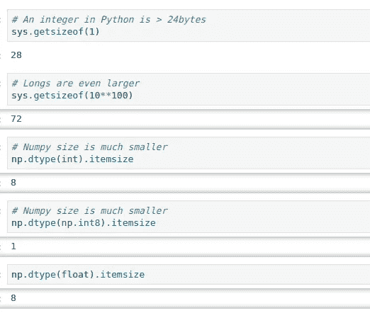

图一

在*图 1 中，默认 python 库中的****getsizeof***和 Numpy 库中的***itemsize****用于查找程序中使用的数据类型的大小。这里，***sys . getsizeof(int)***有一个 **28 字节**的内存和同类型( ***np.type(int)。Numpy 中的 itemsize)*** 的大小为 **8 字节。**所以，在 Numpy 中可以更快的完成**和*的大量处理。(图二)****

*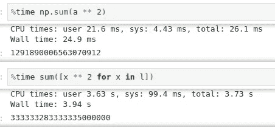*

*图 2*

*在图 2 中， ***Numpy 在这里花费了 24.9 毫秒*** 相比之下，默认的 ***Python 在这里花费了 3.94 秒****

***情况 2:基本 Numpy 数组***

*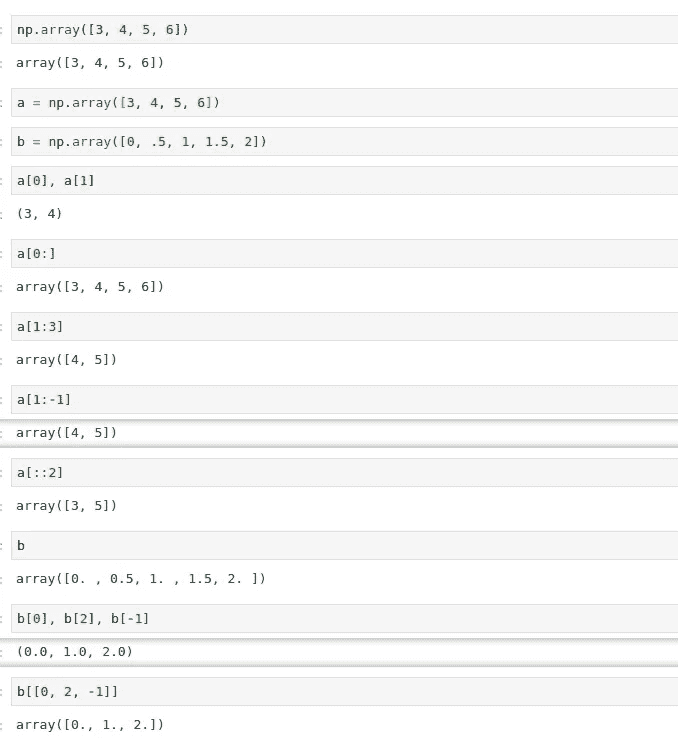*

*图 3*

1.  ****NP . array([…………])-*-**用于将数字/小数/字符传入 ***列表(有序序列+可变)*** 后续可以玩。*
2.  ****NP . a【index _ position】***——用于通过数组名***a(此处)中的***index _ position***直接访问链表中存储的项。****

***注:**python 中的 index_position 从 ***0 基索引开始。****

*3.***NP . a[starting _ index:ending+1 _ index:jump)***-用于从列表中的 ***starting_index(包含)*** 和 ***ending_index(排除)*** 开始，通过 ***跳转*** 来切片访问列表中存储的项目。*

***注意**3 . a)**跳转 如果没有被**写入*默认为 1。******

*3.b)如果 ***没有写下标，默认假定为其默认位置，即 starting_index = 0，ending_index=-1，jump=1****

*4. ***b[0]，b[2]，b[-1]在 numpy 中被视为与 b[[0，2，-1]]*** 相同。*

***案例 3:数组类型及其转换***

*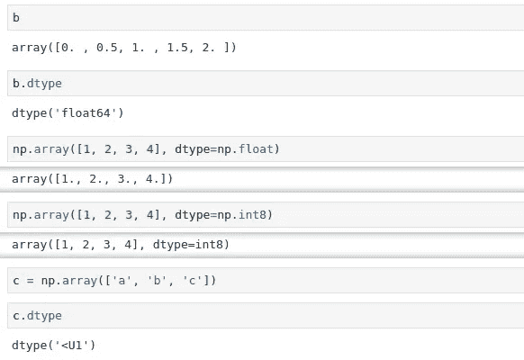*

*图 4*

1.  ****b.dtype*** :用于查找 Python 中任意一项的**数据类型**。*
2.  ****dtype = NP . float&dtype = NP . int 8*-**用于将**数据类型**从一种格式转换为另一种格式。*

***案例 4:尺寸和形状***

*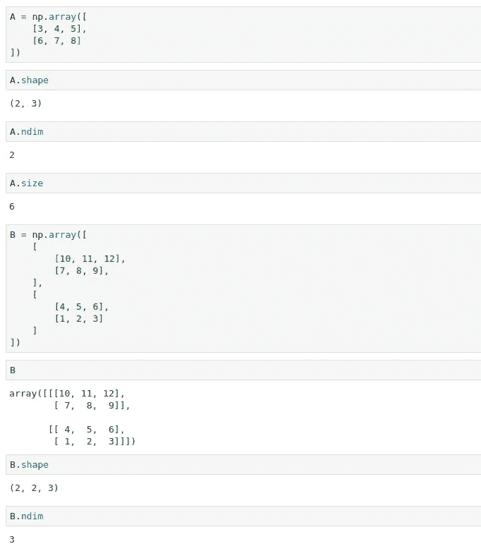*

*图 5*

1.  ****np.array([……。], [……..])***-用来在里面存放一个多维数组。*
2.  ****A . Shape***——这里用于名为 **A** 的数组，查找 Numpy 中数组的形状。*
3.  ****A . ndim***——这里用于名为 **A** 的数组，求数组的维数(1D/2D/3D)。*
4.  ****A . size***——此处用于对名为 **A** 的数组求数组的大小。*

*这里，B 表示 3D 阵列，因为它的第一个下标表示 l1*b1，其他下标表示 l2*b2。*

***案例 5:矩阵的索引和切片***

*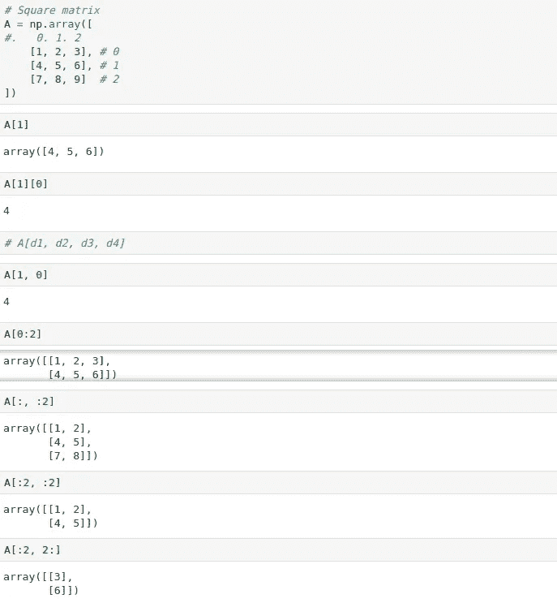*

*图 6*

*所有的切片和索引仍然与我们在**案例 2** 中学到的一样*

1.  ****A[1][0]或 A[1，0]***-用于访问第 1 个列表的第 0 个元素。*
2.  ****A[:2，2:] -*** 用于访问第 0-2–1 个列表的倒数第 2 个元素。*

*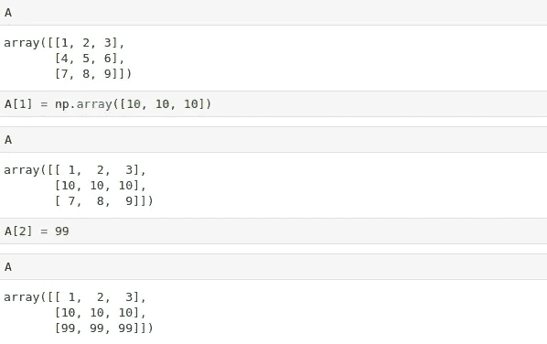*

*图 7*

*由于列表的 ***列表是可变的*** ，所以它们可以在任何时间点改变它们的值，如图 7 所示。*

***案例 6:一些统计功能***

*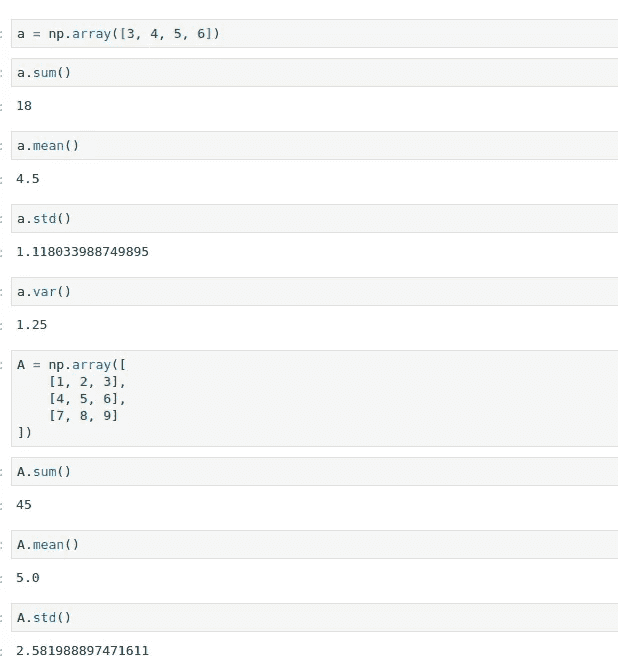*

*图 8*

1.  ****a . sum()***-它用来求数组 **a** 中元素的和*
2.  ****a . mean()***——用于求数组 **a** 中元素的平均值/平均值。*
3.  ****a . STD()***——用于求数组 **a** 中元素的标准差。*
4.  ****a . var()***——用于求数组 **a** 中元素的方差。*

*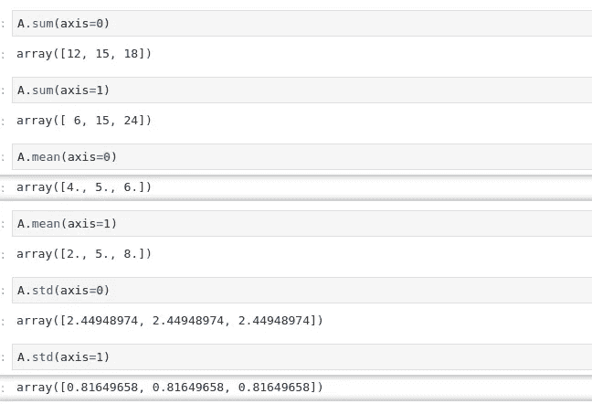*

*图 9*

*默认情况下，不传递任何属性，则包括所有行和列。轴=0 表示沿 Y 轴完成的公式，轴=1 表示沿 X 轴完成的公式。*

***情况 7:向量化操作***

*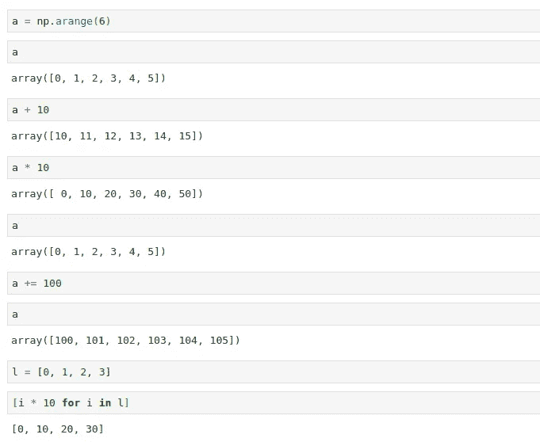*

*图 10*

*在图 10 中，*

1.  *给数组 a 加 10，给 a 中的每个元素加 10，但是 ***不会改变*** 数组 **a** 中存储的元素的初始值。*
2.  *加 a = a+10 或 a+=10 ***改变*** 元素的原始值存储在数组 **a** 中。*
3.  *我们可以**添加 2 个数组**(例如:a+b) *这里没有显示。**

***情况 8:屏蔽/布尔数组***

*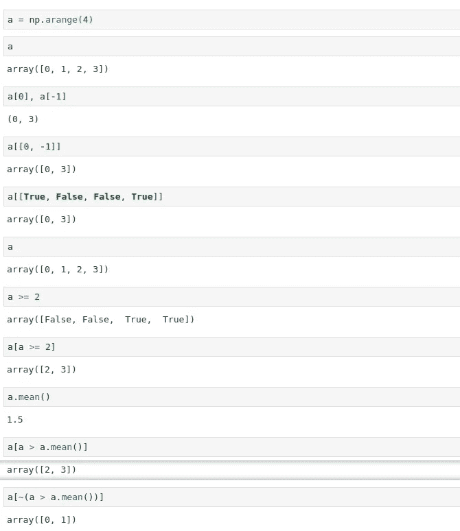*

*图 11*

*我们可以借助布尔表达式找到我们想要的元素。*

*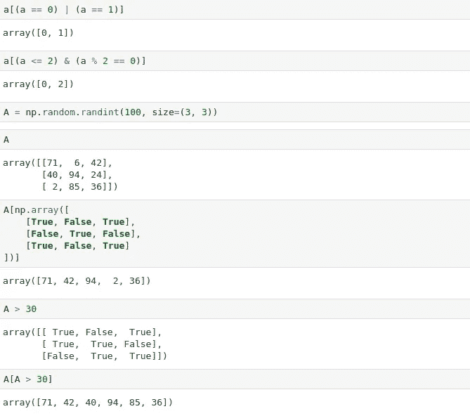*

*图 12*

*案例 9:基础线性代数*

*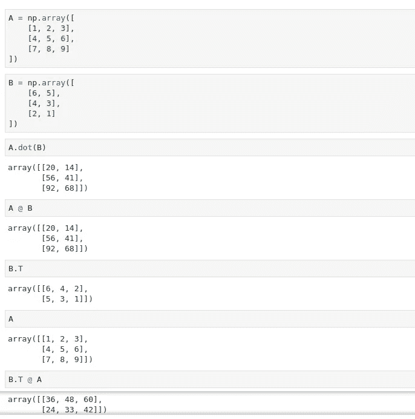*

*图 13*

1.  ****A.dot(B)或 A @ B***——用来求 A 和 B 的点积。*
2.  ****B . T***——用于求矩阵 B 的转置。*

***注**:数据字段一般不使用叉积。*

***案例 10:随机排列功能***

*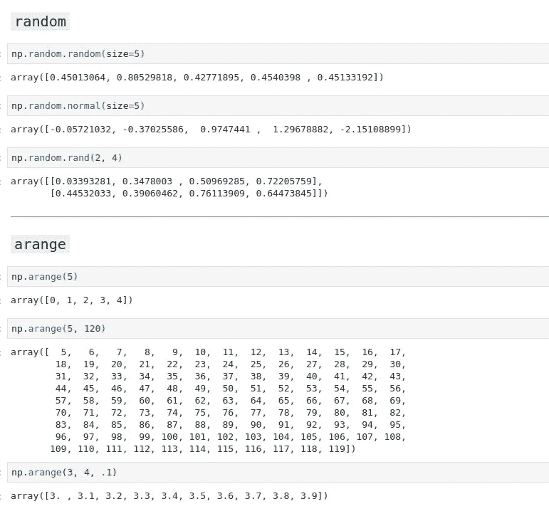*

*图 14*

1.  ****NP . random . random(size =…)***-用于创建指定形状的数组，并用随机值填充。*
2.  ****NP . random . Normal(size =…)***-它用于创建一个指定形状的数组，并用随机值填充它，这些随机值实际上是正态(高斯)分布的一部分。*
3.  ****NP . rand . rand(a，b)***——用来创建一个指定矩阵的数组****a****行****b****列*，并用随机值填充。**
4.  *****NP . arange(Initial _ index，Final_index，jump)***-用于创建一个数组，数组的起始索引，结束索引，跳转。**

****其他一些有用的功能****

**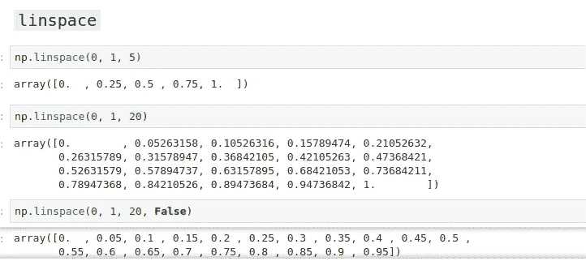**

**图 15**

**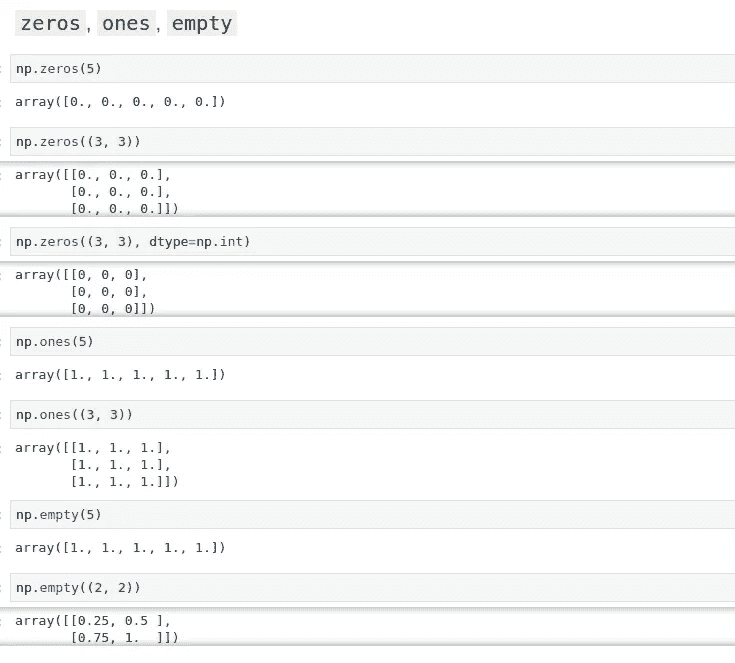**

**图 16**

**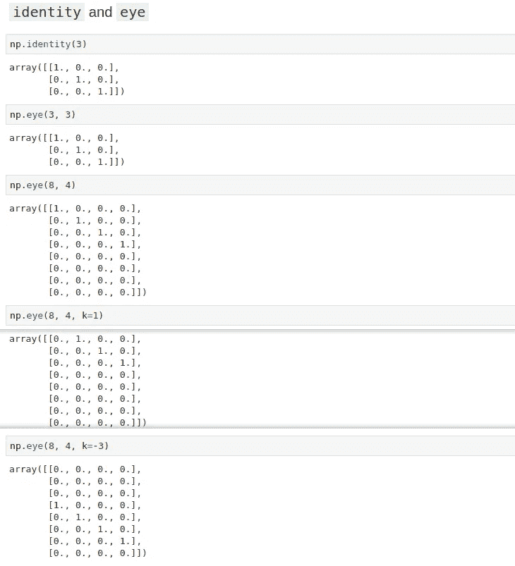**

**图 17**

> **这些信息足够任何人开始使用 Numpy 了。**

**要查阅这份材料，可以参考[https://drive . Google . com/file/d/12 jjql 5 GX 3 dr 3 pkx 04 ovgnhvrnymlhmct/view？usp =共享](https://drive.google.com/file/d/1-634utfevhhaSujKFZnQwLr7pOKCu2Wp/view?usp=sharing)**