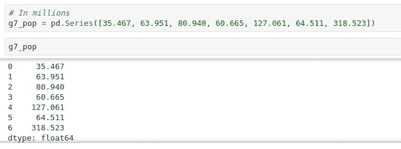
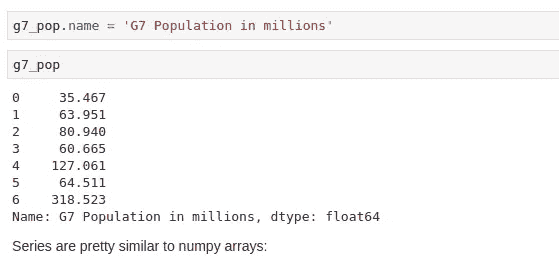
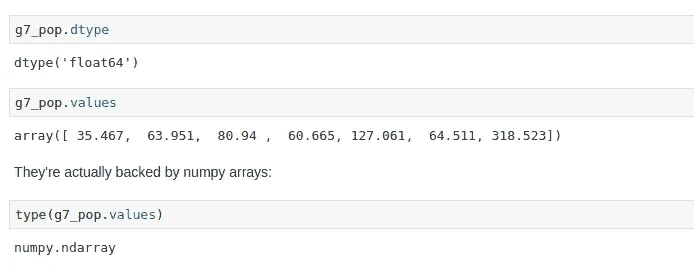
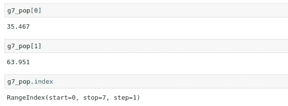
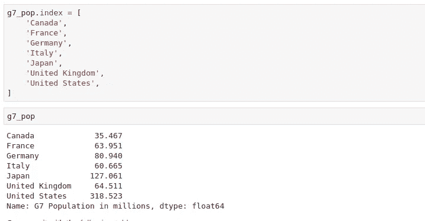
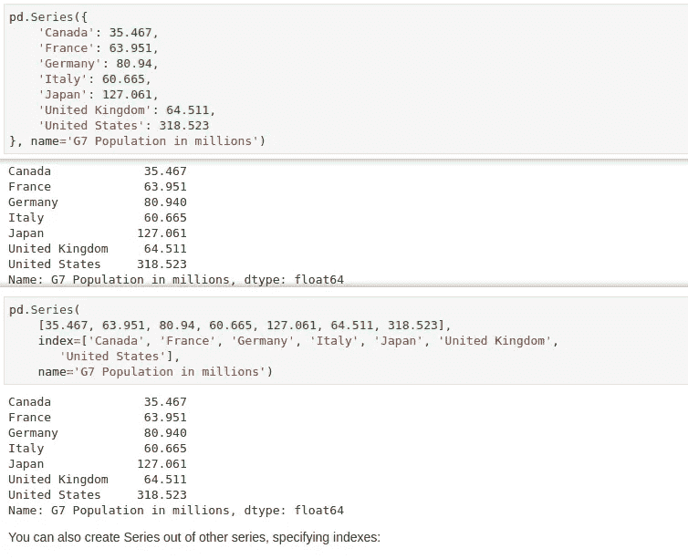
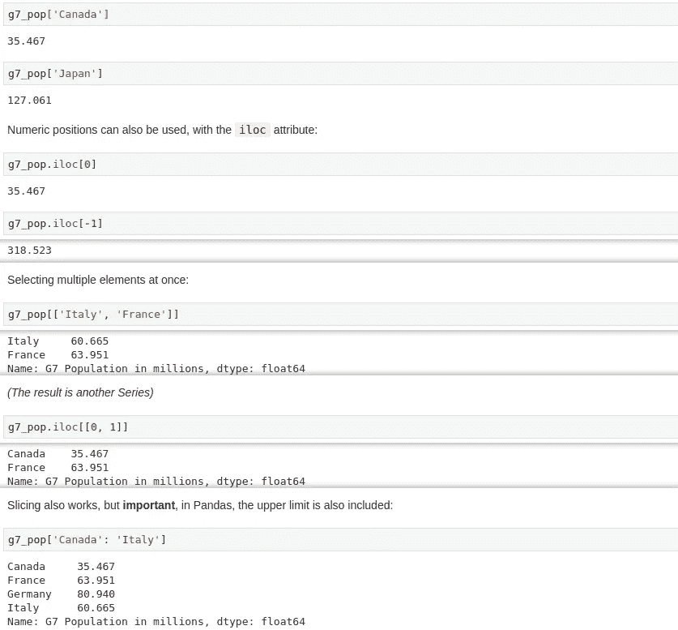
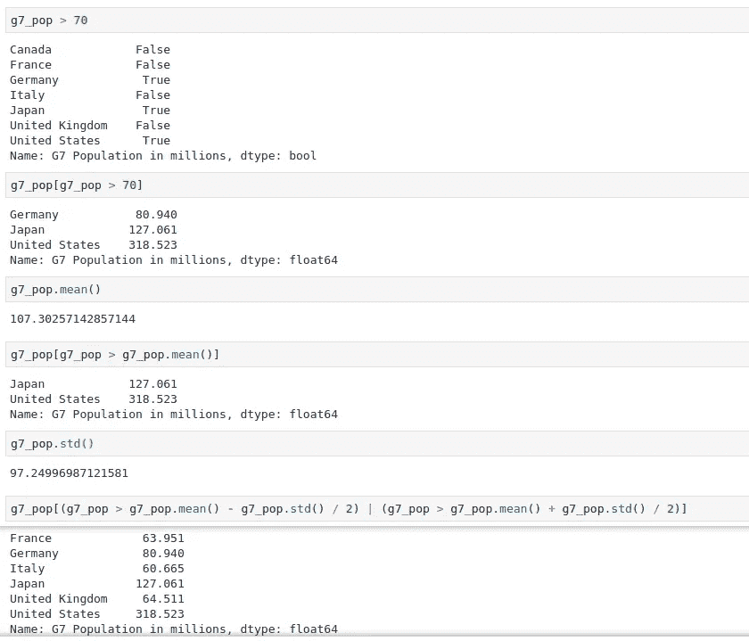
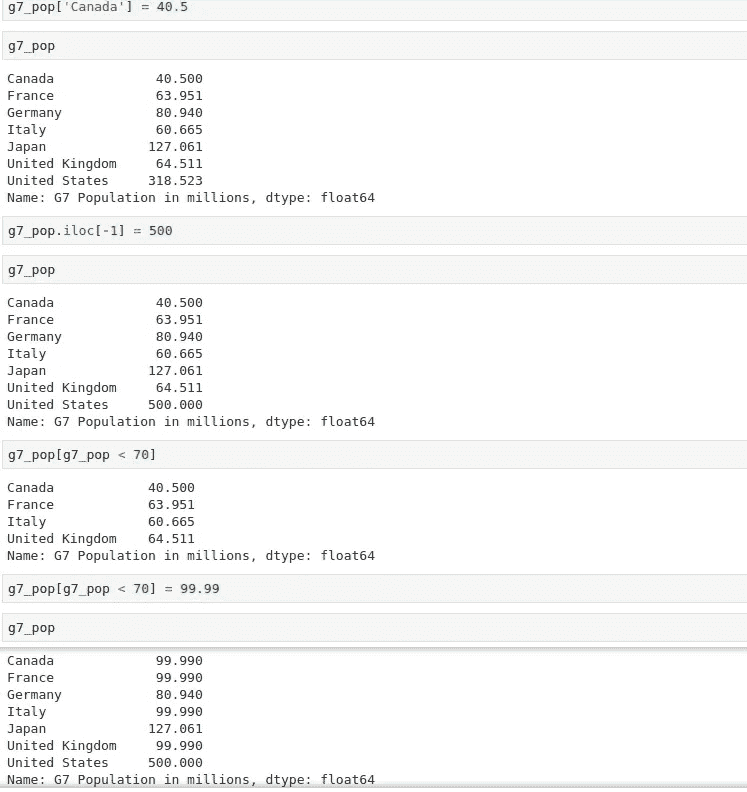

# 熊猫基本介绍:熊猫系列(上)

> 原文：<https://medium.com/analytics-vidhya/basic-introduction-to-pandas-pandas-series-part-1-ee08073b109?source=collection_archive---------34----------------------->

马库斯·斯皮斯克在 [Unsplash](https://unsplash.com?utm_source=medium&utm_medium=referral) 上的照片

> **Pandas** 是一个为 **Python** 编程语言编写的软件库，用于数据操作和分析。特别是，它提供了数据结构和操作来操作数字表和时间序列。让我们深入了解熊猫的基本知识。

**案例 1:熊猫系列基础**

图一

首先要像上面那样把一些数据写入熊猫系列。Python List 和 Pandas Series 的区别在于，Pandas Series Index 可以被修改，可以通过其名称调用，如图 5 所示，并将数据存储在 ***g7_pop 变量中。***

图 2

1.  ***【G7 _ pop . name***-在上面的系列中，我们可以为我们添加了数据的行添加一些细节。

图 3

2 ***。G7 _ pop . dtype***——它找到我们想要知道的行的数据类型。

3.***G7 _ pop . values-***它为我们想要知道的任何一行找到值。

4.***type(G7 _ pop . values)——***它查找任意行的类型。

图 4

5.***【G7 _ pop[index_num]***-查找存储在 index _ num 中的值。

6.***【G7 _ pop . index】***-查找该行的总索引明细。

图 5

我们可以把索引号赋给一些值，通过这些值我们可以用索引来引用它。

图 6

我们也可以通过以下方式创建系列。串联法如图 6 所示。

**情况 2:步进和切片**

图 7

在图 6 中，我们将索引号改为索引值，我们可以通过 index_value 直接访问任何列来引用它

1.  ***【G7 _ pop【index_value】***-按其 index _ value 打印该列的值。
2.  ***【G7 _ pop . iloc【index_number】***-按其 Index _ number 打印该列的值。这里，iloc 代表**整数位置**
3.  ***【G7 _ pop . loc【index_value】***-打印该列的 Index _ value 值。这里，loc 代表**位置。**
4.  ***【G7 _ pop[initial:final:jump]***-打印包含 starting_value 到 final_value 的切片值和跳转。默认情况下，跳转设置为 1(如果没有提到)。

**案例三:布尔函数与数学运算。**

图 8

1.  ***g7_pop>70***——返回 G7 _ pop 中存储的值 ***真或假*** 。
2.  ***G7 _ pop【G7 _ pop>70】***-It***返回大括号内满足条件的值*** 。
3.  ***G7 _ pop . mean()&G7 _ pop . STD()-***返回平均值和标准偏差值

图 9

我们也可以通过 g7_pop.iloc[..] =数值。

在下一部分，我们将有一些关于熊猫数据帧和阅读 CSV 文件的介绍。

> 你可以在这里查阅这个项目中使用的数据，
> 
> [https://drive . Google . com/file/d/1 D2 ea 417 uxk 9 ryk 6 _ TV 4 WB 5 uakaen 0 ssh/view？usp =分享](https://drive.google.com/file/d/1D2Ea417uXk9ryK6_TV4Wb5uakaEn0SSH/view?usp=sharing)