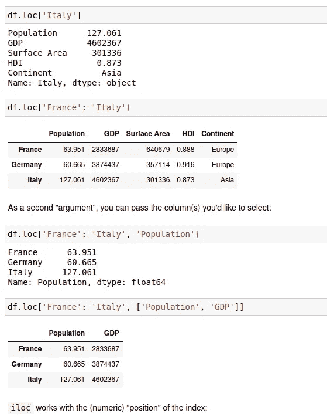
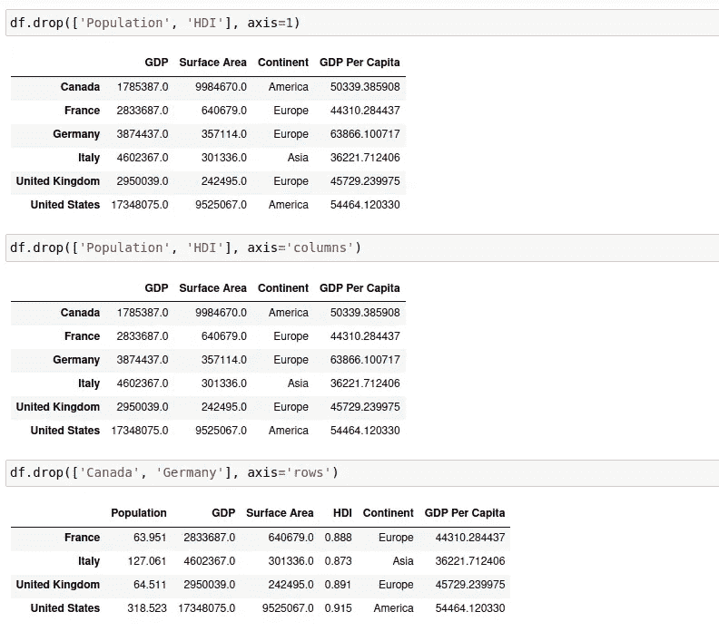

# 熊猫基本介绍:熊猫系列(下)

> 原文：<https://medium.com/analytics-vidhya/basic-introduction-to-pandas-pandas-series-part-2-492c887aeb94?source=collection_archive---------20----------------------->

沙哈达特·拉赫曼在 [Unsplash](https://unsplash.com?utm_source=medium&utm_medium=referral) 上拍摄的照片

> *如前一篇* ***所述，Pandas*** *是一个为****Python****编程语言编写的软件库，用于数据操作和分析。特别是，它提供了数据结构和操作来操作数字表和时间序列。让我们深入了解熊猫的基本知识。*
> 
> 如果你还没有看过之前的帖子，请点击下面的[https://medium . com/@ abhishek _ iiit/basic-introduction-to-pandas-pandas-series-part-1-ee 08073 b 109](/@abhishek_iiit/basic-introduction-to-pandas-pandas-series-part-1-ee08073b109)

我们将使用如下所示的数据帧，但在此之前，我们尝试通过以下命令导入*熊猫*和 *Numpy* :

***导入熊猫为 np
导入熊猫为 pd***

图一

我们将首先尝试实现 basics 命令，让您熟悉 NUMPY。由于默认的索引是数字，我们可以通过如下所示的名称来改变索引号，该表由 **df** 调用

图 2

**案例 1:熊猫要修改的一些基本操作**

1.  ***. df . columns***-列出表格中使用的列名(图 3)
2.  ***df.index -*** 列出表格中使用的行名(图 3)
3.  ***df . info***-列出表格的基本信息(图 3)

图 3

1.  ***df . size***-提供表格的总块(图 4)
2.  ***df . shape***-为表格提供形状(行*列)(图 4)
3.  ***df . describe()***-描述变量名表中的值。
4.  ***df . dtype***-列出列名中使用的类型(图 4)

图 4

**案例 2:索引、选择和切片**

图 5

1.  ***. df . loc[' index_name ']***-仅列出表格中特定的 index _ name 数据。
2.  ***df . loc[' index _ value ']*-**仅列出表格中特定的 index_number 数据。
3.  ***df['列名']* -** 仅列出表格中特定的列数据。
4.  ***df['列名']。toframe()* -** 只列出表格中特定列的数据到新做的表格中。

图 6

5. ***df.loc['索引值 _1 ':'索引值 _2']* -** 列出表格中从索引值 _1 到(索引值 _2 -1)的数据。

6.***df . loc[' index_value_1 ':' index _ value _ 2 '，['column_value_1 '，' column _ value _ 2 ']]*-**列出列值 1 和列值 2 中从 index _ value _ 1 到(index_value_2 -1)的数据。

图 7

***7。df.iloc[row_number1，row_number2，…]* -** 列出表格中任何特定行的数据。

8.***df . iloc[row_number1:row _ number 2，column_number]* -** 列出表格中任意特定列从 row _ number 1 到 row _ number 2–1 的数据。

**案例 3:条件选择(布尔数组)**

图 8

1.  ***df.loc[df['列名'] >值] —*** *通过比较值返回任一* **真/假** *。*
2.  ***df . loc[df[' column _ name ']>70，['column_1 '，' column_2']] -*** 通过比较特定列的值返回 True/False。

**情况 4:掉落砖块**

图 9

1.  ***df . drop([' row _ name '])-***从整个表格中移除/删除该行。
2.  ***df . drop(columns =[' column _ name '])-***从整个表格中移除/删除该列。
3.  ***df.drop(['row_name'])，axis = 0 -*** 从整个表格中删除/丢弃行，axis 设置为 0 表示沿 x 轴。

图 10

4.***df . drop([' column _ name 1 '，' column_name2']，axis=1) -*** 从整个表格中移除/删除列，并将轴设置为 1 沿 y 轴移动。

我们可以用它们各自的名称替换轴，比如行表示*轴=0，列*表示*轴=1*

**案例 5:统计操作**

图 11

给出了上表(图 11 ),我们将对上表进行一些统计操作。

图 12

1.  ***variable _ name = df[' column _ name ']-***它将列值存储到变量名中。
2.  ***【variable _ name . min()***-返回变量名表中的最小值。
3.  ***【variable _ name . max()***-返回变量名表中的最大值。
4.  ***variable _ name . sum()***-从变量名表中返回总和。
5.  ***variable _ name . mean()***-从变量名表中返回平均值。
6.  ***【variable _ name . STD()***-从变量名表中返回标准偏差。
7.  ***variable _ name . describe()***-描述变量名表。
8.  ***【variable _ name . quantile(decimal _ value)***-返回变量名表中总值的 25%。

您可以执行类似于图 12 中提到的操作

**案例 6:添加新列**

图 13

如图 13 所示，我们可以向现有的表中添加一个新列。

还有一些例子可以参考，但本文讨论的是最重要的一个。

> *您可以在这里查阅本项目使用的数据，*
> 
> [https://drive . Google . com/file/d/1 QA 3 xxbwcjsf 9 crtnqduiafie _ qk 47 nb/view？usp =共享](https://drive.google.com/file/d/1qa3XXbWcWjSF9crTnQdUiafIe_qK47nB/view?usp=sharing)