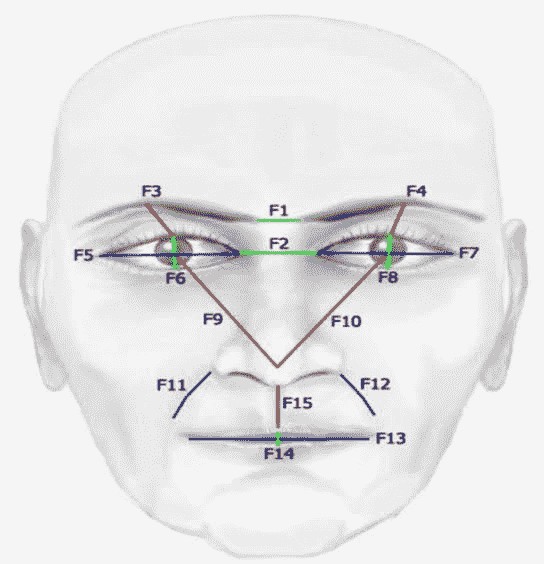
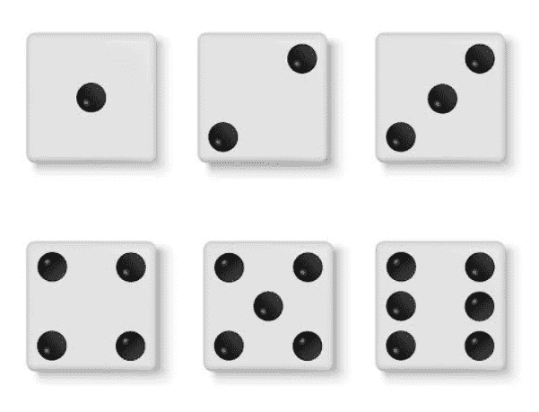
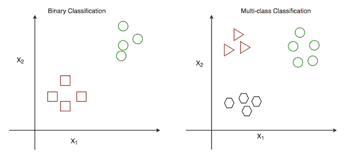
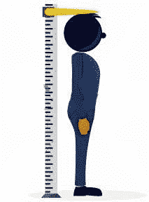

# 监督学习中分类与回归的基本直觉

> 原文：<https://medium.com/analytics-vidhya/basic-intuition-on-classification-vs-regression-in-supervised-learning-c50a2fc89de7?source=collection_archive---------8----------------------->

现在，我将把最重要的概念游戏放在监督学习中。即

1.  分类
2.  回归

> 分类和回归是机器学习中经常遇到的两个主要预测问题

因此，在这篇博客中，我们将通过一个合适的例子来了解这些概念的定义。

在了解这个概念之前，我们需要理解这些术语，类标签或输出，输入特征

模型函数 Y=f(X)

这里，Y =输出或类标签，X =输入要素

上面的等式是试图将输入特征映射到相应输出的模型的一般框架。

类别标签/输出变量:

类别标签是输出值。它是给定输入变量的结果或答案。所以基于这个术语类标签一个分类概念的起源。在回归中我们称之为输出变量。

输入功能:

机器学习中的术语特征，是被观察现象的特征的一种个体可测量的性质。例如，我们需要识别一个男性或女性的输出，这里的输入被给定为眉毛、鼻子、胡须、头发长度这些我们称之为特征。

人脸的输入特征

# 分类:

分类这个词本身表明一个物体属于一个特定的类别。如果模型的输出变量在区间内是有限的，则称之为分类问题。这个问题中的输出是一组离散的值。换句话说，我们可以称之为分类输出形式。

离散值这个术语我们在概率中都听说过，它说输出将是有限的一组值，例如，一个骰子，它的每边都有六个值{1，2，3，4，5，6}，每次投掷的输出都在 1 到 6 的范围内。

有六个面的骰子

基于类别组，它被分成两种类型，

1.  二元分类
2.  多类分类

二元分类:

在二进制分类中，输出变量只属于两组类别。例如，当我们掷硬币时，每次掷硬币的结果都是正面或反面。

扔硬币

多类分类:

在多类分类中，输出变量属于两组以上的类，例如一个骰子有六组输出。

现在我们可以用图形的方式看到分类的类型，

在图中，其中 x1 和 x2 表示特征的维数，它包含作为输入的两个特征维数和二分类中的两个类输出以及多类分类中的三个类输出。

# 回归:

回归是将一个不同的输出转换成连续的真实值的过程。换句话说我们可以说，输出呈现在真实值或连续值中。

连续值，我们在概率中听过这个术语，它说输出是无限的一组值。例如，测量一群人的身高，其中身高将在任何范围内，它不能像只有六个输出的骰子问题那样固定身高值。

测量人的身高

所以在现实世界的预测问题中，输出以分类或回归的形式给我们，基于此我们需要选择正确的机器学习模型。