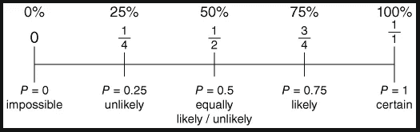
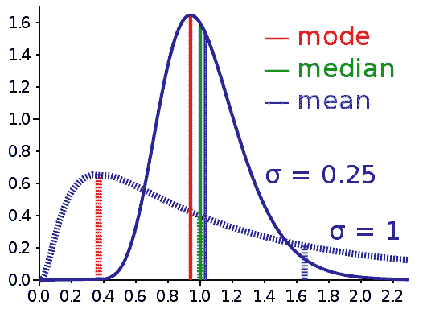
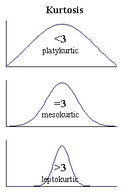
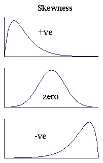

# 数据科学基础数学

> 原文：<https://medium.com/analytics-vidhya/basic-mathematics-for-data-science-256cda4dd54f?source=collection_archive---------5----------------------->

卢克-切瑟 - [unsplash](https://unsplash.com) 拍摄的照片

> 纯粹思想的最高形式在数学中——柏拉图

# 动机

就像我们中的一些人，甚至我😔在我学习的最初几天，我苦于缺乏指导📊数据科学。尽管我在本科时已经学过了必修的数学，但在另一家公司工作的四年里，它变得无关紧要了，这让我远离了复杂数学的日常应用。

在第一周的课程后不久，我明白我需要温习我的数学概念，于是我就温习了。但是，让我告诉你一些“这很难”，但是嘿！没有奋斗的权利，什么是成功🤗。

我花了整整两周的时间才回到教学大纲的轨道上。在课堂上，我意识到许多学生面临着同样的问题。因此，下面的故事是在阐述追求数据科学所需的数学知识。

# 可能性

它是对事件发生可能性的一种度量。在一个给定的点上，根据具体情况，只能有一种结果的概率接近“0”或“1”(在一个数字线上)。

概率是一个非常古老的概念，它在现代工程和商业中被广泛用于制造能够像人一样思考的智能系统。它主要有助于在特定情况下做出决定，或者有助于预测未来。

概率在日常生活中的广泛应用非常广泛，但如此固定，以至于我们有时并不欣赏它。生活就是选择，这是处理人类情感的事情。但是，为了让现代机器做出正确的决定，它必须计算所有不同决定的结果，并选择最合适的。

例如，让我们想象一个投掷的无偏硬币，正面和反面的概率相等。所以这种事件的概率是 1/2，其中分子是期望的结果，分母是结果的总数。

学习概率的一些流行资源有:

[概率——麻省理工学院的不确定性和数据科学](http://Probability - The Science of Uncertainty and Data)

[哈佛大学数据科学:概率](https://www.edx.org/course/data-science-probability-2)

[假人概率小抄](https://www.dummies.com/education/math/probability/probability-for-dummies-cheat-sheet/)

# 统计数字

It 是涉及收集、计划、公布、解释、分析和呈现数据的方法。

上述方法在真实世界场景中以连续的方式执行。然而，统计学最常用于科学、工业和公共问题的解决。

它处理每个阶段的数据，包括根据学习和研究计划收集数据的计划。

数据分析中使用了两种主要的统计方法:

1.  **描述性统计**是对给定数据集进行抽象的简短叙述，它可以是对整个群体的描述，也可以是一个群体的样本。

> 描述性统计进一步分为
> 
> **集中趋势的度量**包括均值、中值和众数。

> **可变性的度量**包括方差、标准差、最小值&最大值变量，以及**峰度**(通常指异常值，它只与图中的尾部有关，而不是峰值)和**偏斜度**。

2) **推断统计学**使用来自一个群体的随机数据样本来描述该群体并对其做出假设。

两种形式的推断统计:

> **估计参数**从您的示例数据中提取统计数据，并使用它来陈述和总结总体均值。
> 
> **假设检验**用样本数据来解释研究提案。例如，您可能有兴趣了解一种新的糖尿病药物在市场上的有效性能，或者有校车的学校是否表现更好。

学习统计的一些流行资源有:

麻省理工学院[统计学基础](https://www.edx.org/course/fundamentals-of-statistics-3)

[哈佛大学的数据科学:推理和建模](https://www.edx.org/course/data-science-inference-and-modeling)

[统计学导论:抽样调查和统计推断工具](https://www.edx.org/course/introductory-statistics-sample-survey-and-instruments-for-statistical-inference)

[Udemy 的数据科学统计和商业分析](https://www.udemy.com/course/statistics-for-data-science-and-business-analysis/)

> 最终，概率和统计是任何数据科学问题的基础。如果你不是数学专业的，这些概念可能看起来有点直观，但如果你已经知道这些概念，那么这只是将你的理论知识应用到实践中。由于学习数据科学并不例外，所以在进行第一次实验之前，您可能需要一些时间来渗透所有必需的概念。

查看新故事:

 [## 机器学习算法非常需要的数学

### 纯数学，就其本身而言，是逻辑思想的诗歌。——阿尔伯特·爱因斯坦

medium.com](/@kollakishan/much-needed-mathematics-for-machine-learning-algorithms-e3188e072c1e) 

*感谢阅读！随便写个回应。*😊