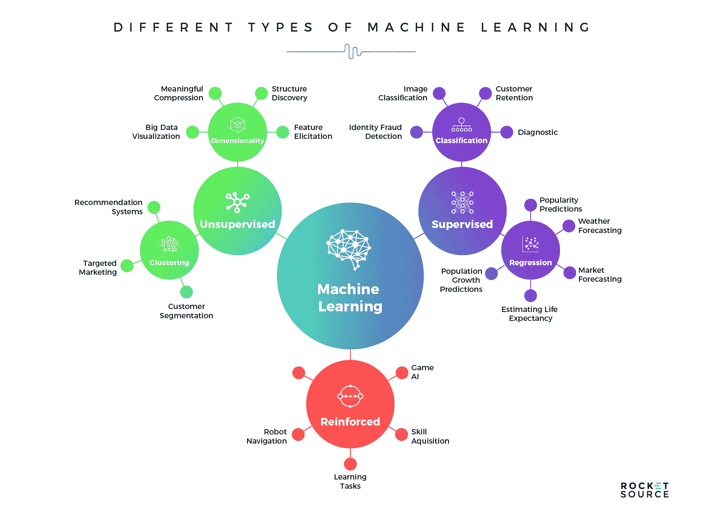

# ML 模型利弊

> 原文：<https://medium.com/analytics-vidhya/basic-ml-models-pros-cons-code-demos-66412eb98b6f?source=collection_archive---------5----------------------->

## 基础机器学习模型的快速复习，包括代码演示。

图片由 [RocketSource](https://www.rocketsource.co/blog/machine-learning-models/)

随着机器学习算法的数量不断增长，有一个参考点来温习一些基本模型是很好的，无论是面试还是快速复习。我想提供一些最常见的**模型专家和** …