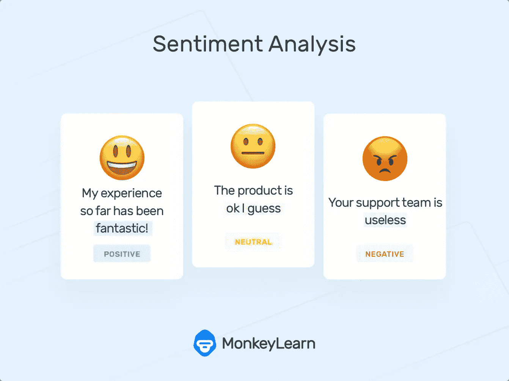

# 基本的 OCR 和情感分析 web 应用程序

> 原文：<https://medium.com/analytics-vidhya/basic-ocr-and-sentiment-analysis-web-app-eda969d7c344?source=collection_archive---------14----------------------->

## 使用 PyTesseract 和机器学习的光学字符识别和情感分析。

情感分析

在这个基本应用程序中，我们从本地机器获取输入图像，并从图像中提取文本，然后预测提取的文本是积极的还是消极的还是中性的。它包含两种方法-