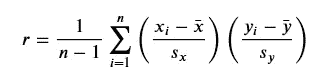

# 相关性基础和使用 Pandas 和 SciPy 计算相关性。

> 原文：<https://medium.com/analytics-vidhya/basic-of-correlations-and-using-pandas-and-scipy-for-calculating-correlations-2d16c2bd6af0?source=collection_archive---------4----------------------->

大家好，

今天我将解释 python 中的相关性和使用的基础。我认为在处理简单和多元线性回归时，了解相关性的概念是很重要的。

**相关性**是衡量两个变量相互关联程度的指标。最常见的相关性度量是**皮尔逊相关系数**，对于两组配对数据 *𝑥𝑖* 和 *𝑦𝑖* ，其定义为



相关公式

这里 *𝑟* 是 1 到-1 之间的数，*𝑟*t46】0 表示正相关( *𝑥* 和 *𝑦* 一起增加， *𝑟* < 0 表示负相关( *𝑥* 增加， *𝑦* 减少)。当| *𝑟* |=1 时，存在完美的*线性*关系，而如果*𝑟*= 0 则不存在*线性*关系( *𝑟* 可能无法捕捉非线性关系)。实际上， *𝑟* 永远不会正好为 0，所以量值小的 *𝑟* 就是“不相关”的同义词。| *𝑟* |=1 确实会发生，通常是当两个变量有效地描述同一现象时(例如，以米为单位的高度与以厘米为单位的高度，或者杂货账单和销售税)。

现在使用波士顿房价数据集。-波士顿房价数据集作为“玩具”数据集包含在 **sklearn** 中(用于试验统计和机器学习方法)。它包括对波士顿各个地区的房价进行调查的结果，还包括一些变量，如某个地区的犯罪率、房主的年龄以及其他变量。虽然许多应用程序侧重于根据这些变量预测房价，但我只对这些变量之间的相关性感兴趣(也许这将在后面提出一个模型)。

下面我加载数据集并从中创建一只熊猫`DataFrame`。

```
from sklearn.datasets import load_boston
import pandas as pd
from pandas import DataFrame
import matplotlib.pyplot as plt
%matplotlib inlineboston = load_boston()
print(boston.DESCR)
boston.data
boston.feature_names
boston.target
# adding all the features to data frame
temp = DataFrame(boston.data,columns=pd.Index(boston.feature_names))
boston = temp.join(DataFrame(boston.target, columns=["PRICE"]))
boston # final data in dataframe formate
```

**两个变量之间的相关性**

如果我们想要两个变量之间的相关性，比如说，本地犯罪率(CRIM)和房价(price ),我们可以使用 NumPy 的`corrcoef()`函数

```
from numpy import corrcoefboston.CRIM.as_matrix()    # As a NumPy arraycorrcoef(boston.CRIM.as_matrix(), boston.PRICE.as_matrix())output:
array([[ 1\.        , -0.38583169],        
      [-0.38583169,  1\.        ]])
```

非对角线条目中的数字对应于两个变量之间的相关性。在这种情况下，存在一种负相关关系，这是有道理的(更多的犯罪与更低的价格相关联)，但这种相关性只是适度的。

**计算相关矩阵**

当我们有几个变量时，我们可能想看看它们之间有什么相关性。我们可以计算一个**相关矩阵**，它包括数据集中不同变量之间的相关性。

当载入一个熊猫`DataFrame`时，我们可以用`corr()`的方法得到相关矩阵。

```
boston.corr()
```


bostan.corr()的输出

虽然这有很多数据，但不容易阅读。让我们用热图来形象化地展示这种相关性。

```
import seaborn as sns    # Allows for easy plotting of heatmapssns.heatmap(boston.corr(), annot=True)
plt.show()
```


变量间相关性热图。

热图揭示了一些有趣的模式。我们可以看到

*   房价与该地区住宅的平均房间数(RM)之间有很强的正相关关系
*   住房价格和低收入人口比例之间存在强烈的负相关关系
*   放射状高速公路(RAD)的可达性与财产税(TAX)之间存在很强的正相关关系
*   波士顿氮氧化物浓度(NOX)与到主要就业区的距离成负相关
*   查尔斯河变量(CHAS)和任何其他变量之间没有关系

**相关性统计检验**

现在我们将了解相关性的统计检验。假设我们想要额外的保证两个变量是相关的。我们可以进行一个统计测试


相关性假设检验。

(其中 *𝜌* 是总体或“真实”相关性。)SciPy 中提供了该测试。

```
from scipy.stats import pearsonr# Test to see if crime rate and house prices are correlated
pearsonr(boston.CRIM, boston.PRICE)OUTPUT:
(-0.38583168988399053, 2.0835501108141935e-19)
```

返回的元组中的第一个数字是计算的样本相关系数 *𝑟* ，第二个数字是测试的 p 值。在这种情况下，存在任何非零相关性的证据是强有力的。也就是说，仅仅因为我们可以得出相关性不为零的结论，并不意味着相关性是有意义的。

这就是相关性。

我希望你真的喜欢这篇文章——请在下面留下你的反馈和建议。

感谢阅读。