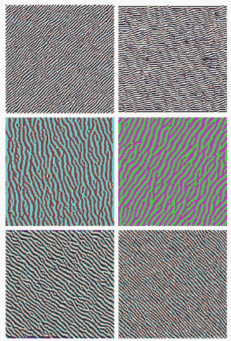
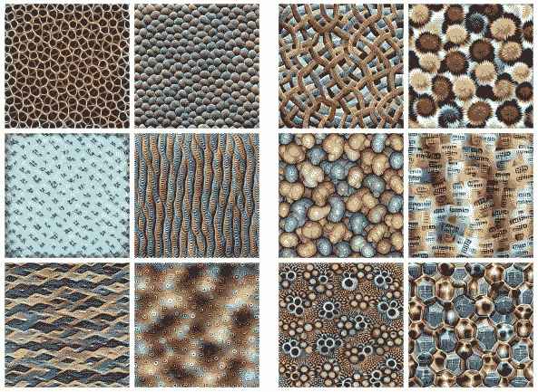
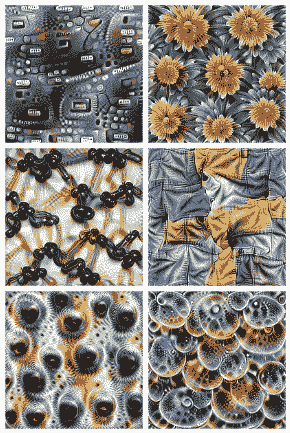
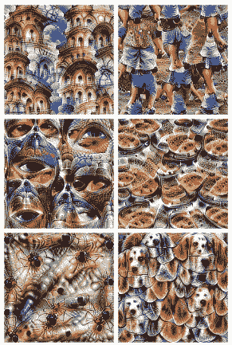
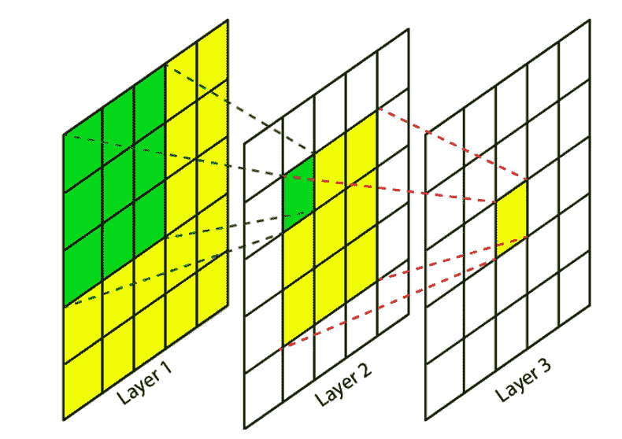
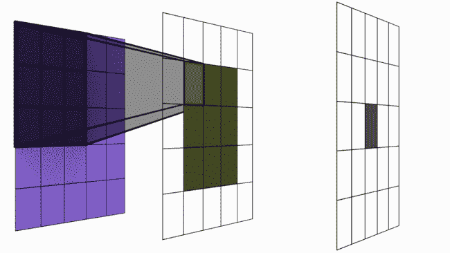

# 视觉深度神经网络基础—第一部分

> 原文：<https://medium.com/analytics-vidhya/basic-of-deep-neural-networks-in-vision-part-1-c735dc86d66f?source=collection_archive---------9----------------------->

这个博客是对深度神经网络基础的介绍。有一种人工智能的嗡嗡声，你想知道它们是如何工作的吗？我将在视觉中深入报道 AI 的一切，所以让我们从基础开始，这个博客将会给你一个关于 DNN 的内核、通道和训练的直觉……

[来源](http://gph.is/1yLdu6J)

# 所以让我们开始吧…

深度神经网络(DNN)的基本组件是内核和通道。在开始之前，我将解释人工智能和视觉的过程。

# 该过程(简述)

在视觉中，输入数据是图像，图像被馈送到神经网络。最初的几个核充当过滤器来识别图像的基本构建块，即边缘和梯度。

[边缘和渐变](https://distill.pub/2017/feature-visualization/)

后面的几个内核过滤纹理和图案，

[纹理和图案](https://distill.pub/2017/feature-visualization/)

然后内核过滤对象的部分，

[物体的部件](https://distill.pub/2017/feature-visualization/)

然后他们过滤物体

[对象](https://distill.pub/2017/feature-visualization/)

您在上面看到的图像是特征图，即作为过滤操作的输出而产生的通道。在上面的图像右下角有一张狗的特征图，因此如果有狗出现在图像中:这个频道会确认它。所以让我们理解什么是通道和内核。

# 频道

每个频道都是一个特定信息的容器，容器是用来装东西的对象。让我们以电视为例:

[电视频道](https://techcrunch.com/2019/04/10/t-mobile-officially-unveils-its-home-tv-service-tvision-home/)

在这里，你在图像中看到的每个频道都播放特定信息的节目。你永远无法期待卡通电视网的新闻或 CNN 的动画/卡通。在这里，每个频道都是一个存储数小时视频和信息的容器。

因此在 DNN，这些代表包含地图特征的容器。因此，从“过程”中的图像，我们看到了边缘和梯度的通道，纹理和图案，物体和物体的部分。

# 核心

3x3 内核

内核是为我们提取特征的家伙。内核也可以被称为过滤器或特征提取器。它的任务是获取输入并从中提取特征，并将它们存储在称为通道的特征图中。这里，层 1 是输入层，层 1 中的每个方块是图像中的一个像素，是一个神经元。绿色网格是在输入通道上运行的内核，即滤除边缘和梯度的图像。第一层内核的输出存储在第二层。在第 2 层，再次运行一个新内核，其输出将存储在第 3 层。

所以你可能想知道这些内核值应该是什么，才能过滤出想要的对象。我将简要介绍培训内容(深入第 2 部分)。

## **内核初始化**

内核值是从一组随机数中随机分配的。我们不能让内核值为 0 或 1 或任何值，除了从零开始训练的随机值。原因如下:

内核是过滤器，它对输入图像进行处理，并给出通道作为输出。如果所有的值都是 0，所有的卷积运算(在第 2 部分中讨论)都将是 0。让我们以过滤茶叶为例:全 0 表示过滤器没有开口来过滤茶叶中的茶叶。因此，当我们通过过滤器倒茶时，我们将一无所获。

如果我们用 1 初始化所有的内核值，我们将得到相同的内核，给出相同的通道作为输出。内核的任务应该是分离，如果我们有相同的过滤器，它将产生相同的结果。举个例子:如果用来分离茶叶和茶叶的过滤器是打开的(没有网)，它会把同样的未过滤的茶叶还回去。

# 感受野

这是 DNN 关于视觉的最重要的概念之一。

感受野概念

在上面的图像中，在 5x5 的图像上使用了 3x3 的内核，得到 3x3 的通道，然后再次在其上使用 3x3 的内核，得到 1x1 的输出。为了达到 5x5 的全局感受野，使用了两个 3x3。绿色像素知道浅紫色像素中发生的情况，因此它的全局感受野是 5×5，而局部感受野是 3×3，因为它只看到黄色像素中发生的情况，但间接知道紫色像素中发生的情况。

它可以被定义为 DNN 正在观看的输入图像的区域。为复杂数据集提供良好结果所需的最小感受野至少是图像的大小。DNN 应该有所有像素值的信息，所以采取适当的决定。

例如:我们可能想要检测苍蝇，它们的尺寸非常小，可以在帧中的任何地方，因此 DNN 应该能够扫描整个图像来寻找苍蝇。

## 使用 3x3 到达所有感受野

如上所述，使用 5×5 或两个 3×3 的核可以达到 5×5 的整体感受野。在现实世界中，图像的尺寸会很大，从 50×50 到 1024×1024 或更大，因此不会单独使用卷积层，我们将使用 max pooling 和其他层来帮助达到所需的感受野。

# 内核大小

内核可以有各种大小，即在图像中，我们有任何所需大小的 2D 或 3D 内核:5x5 或 100x100。它可以是任何东西。但是最好是 3x3 的内核大小，而不是任何其他的内核大小。以下原因是:

1.  使用 3x3 在大粒上到达衍生感受野。它极大地减少了参数，例如:一个 5x5 内核将有 25 个神经元(在一个图像中，每个像素都是一个神经元)，因此要查看所有像素并做出决定，如果我们直接应用 5x5，它将有 25 个参数，这些参数是神经元的权重，如果我们应用两个 3x3，则总参数计数将是 9+9 =18。一旦我们在复杂的图像上使用更大的网络，差别将会很大。
2.  奇数核允许更容易地使用像三角形这样的形状，这在偶数核中是困难的。
3.  GPU 设计用于更快地执行 3x3，因此处理时间更快。

# *训练(简写)*

*所有 DNNs 都在训练中使用反向传播。假设过滤器是为了从图像中识别狗，因此最初内核是随机初始化的。所以他们将不能识别狗，因此对于所有错误的结果，我们计算损失并根据损失更新神经元的权重。然后，使用这些更新的权重来完成相同的任务，并且重复该过程，直到达到特定的精度或者已经用完了次数(总训练循环)。深入将在后面的部分。*

# *参考*

1.  *[蒸馏酒吧](https://distill.pub/2017/feature-visualization/)*

*如果你喜欢这篇文章，请鼓掌。如果你有疑问，可以在这里评论。*