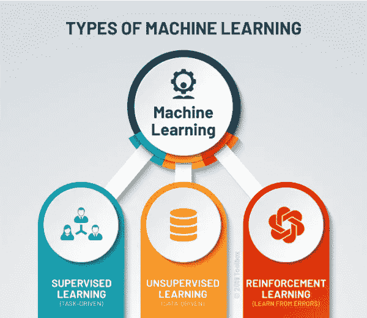
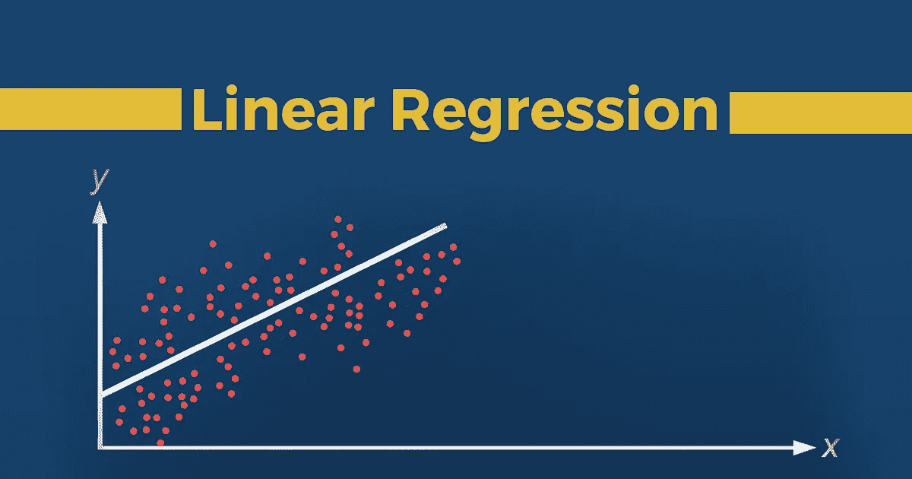
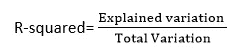

# 线性回归基础

> 原文：<https://medium.com/analytics-vidhya/basic-of-linear-regression-c1bc754398?source=collection_archive---------12----------------------->

图片由 Blippar 提供

在机器学习中，有各种模型和技术来解决与多个领域相关的现实世界问题，每个模型或我们可以说算法对每个数据都有不同的表现。

数据是数据科学领域的一个关键词，所有的游戏都与数据有关，以及如何从数据中获得更多的洞察力来解决业务问题或增强业务。

所以，在机器学习中有三种学习类型:

Potentiaco 提供的图像

线性回归属于监督学习，所以我们应该多讨论一点监督学习。

**监督式学习**顾名思义表示有监督人作为老师在场。基本上，监督学习是一种学习，在这种学习中，我们使用标记良好的数据来教授或训练机器，这意味着一些数据已经标记了正确的答案。之后，为机器提供一组新的示例(数据)，以便监督学习算法分析训练数据(训练示例集)并从标记数据中产生正确的结果。

现在回到**线性回归**，顾名思义这是一个线性模型。线性回归试图通过将线性方程拟合到观察到的数据来模拟两个变量之间的关系。一个变量被认为是解释变量，另一个被认为是因变量。

例如，建模者可能希望使用线性回归模型将个体的体重与其身高相关联。

> **线性回归的类型**

线性回归可以进一步分为两种类型的算法:

*   **简单线性回归:**
    如果用单个自变量来预测一个数值因变量的值，那么这样的线性回归算法称为简单线性回归。
*   **多元线性回归:**
    如果用一个以上的自变量来预测一个数值因变量的值，那么这样的线性回归算法称为多元线性回归。

> **从线性回归开始的基本假设**

*   **线性**:x(独立特征)和 y(非独立特征)的均值之间应该是线性关系。
*   **正态性**:对于 x 和 y 的任意固定值，正态分布
*   **独立性**:观察相互独立
*   **要素之间的多重共线性很小或没有**:由于多重共线性，可能很难找到预测值和目标变量之间的真实关系

> **优点:**

*   对于线性可分数据很管用意思是，在欧氏几何中，**线性可分性**是两组点的一个性质。…如果平面上至少有一条线，所有的蓝点在这条线的一边，所有的红点在另一边，那么这两个集合就是**线性可分的**。
*   易于实施和培训的模型
*   它可以使用降维、交叉验证和正则化来处理过拟合

> **缺点:**

*   有时需要大量的特征工程，如果我们的数据不是正态分布的，那么我们必须使用变换、对数函数使其呈正态分布
*   如果独立特征是正相关的，那么它可能会影响性能，这被称为多重共线性问题，为了避免这种情况，我们必须再次进行特征工程。

*多重共线性:假设我们的数据集包含 100 个要素，并且 40 个要素彼此正相关(大于 0.9)，这称为多重共线性。*

*   由于最佳拟合线之外的任何异常值都可能发生变化，因此容易受到噪声的影响。
*   它对缺失值很敏感，我们必须通过特征工程来处理它(用平均值、众数或丢弃空值来替换缺失值)。

> **重点:**

在线性回归中，遵循特征缩放很重要，因为这里有一个梯度下降的概念，其中我们必须最小化损失函数并达到全局最小值。因此，对于这个特征，缩放是必需的，这也用于 ANN 和 CNN。

> 特征缩放可以通过归一化和标准化(最小最大缩放器、标准缩放器)来完成

> **指标:**

回归模型的*质量*是其预测与实际值的匹配程度，但是我们实际上如何评估质量呢？幸运的是，聪明的统计学家已经开发了**误差度量**来判断模型的质量，并使我们能够将回归与其他具有不同参数的回归进行比较。这些指标是对我们数据质量的简短而有用的总结。

*   绝对平均误差
*   均方误差
*   平均绝对百分比误差
*   平均百分比误差

> **型号性能:**

拟合优度决定了回归线与观察值集的拟合程度。从各种模型中找出最佳模型的过程称为**优化**。这可以通过以下方法实现:

**1。r 平方方法:**

*   r 平方是一种确定拟合优度的统计方法。
*   它在 0-100%的范围内测量因变量和自变量之间的关系强度。
*   R 平方的高值决定了预测值和实际值之间的差异较小，因此代表了一个好的模型。
*   多元回归又称为**决定系数、**或**多重决定系数**。
*   它可以通过下面的公式计算:

图片由谷歌提供

> **拟合线性回归:**

1.  从 sklearn.linear_model **导入**线性回归
2.  回归量=线性回归()
3.  regressor.fit(x_train，y_train)

> **预测:**

1.  y _ pred = regressor . predict(x _ test)
2.  x _ pred = regressor . predict(x _ train)

> **用途:**

该模型可用于各种平台，其中数据是线性可分的，并且本质上是连续的，如下:

*   房价预测。
*   趋势评估
*   做出估计
*   预测等。

> ***如需进一步查询，您可以在我的***[**LinkedIn**](https://www.linkedin.com/in/mayank-yogi-806ba9156/)**或** [**GitHub**](https://github.com/MayankkYogi) 上联系我