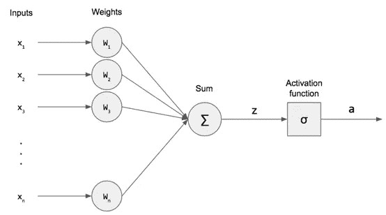
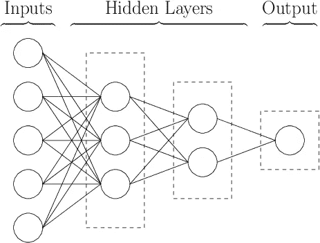
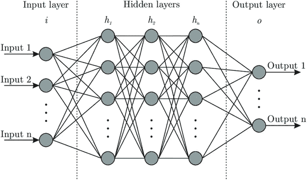
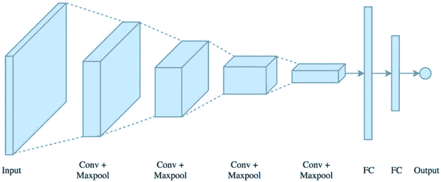
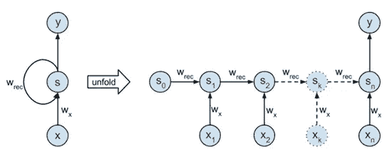

# 神经网络基础

> 原文：<https://medium.com/analytics-vidhya/basic-of-neural-network-956b8f190f3a?source=collection_archive---------20----------------------->

当你看到这个图像时，你很容易把它理解为“神经网络”。看起来很简单对吧。你毫不费力就做到了。但是，如果我告诉你创建一个程序，让计算机可以阅读这个图像。现在你想知道如何去做，这并不像你想象的那么简单。在机器的帮助下，我们自己容易做的事情突然变得极其困难。那么我们是如何做到这一点的呢？基本上，我们的大脑通过我们的眼睛接受输入，然后在后台进行一些计算，然后给我们输出。所有这些都是无意识发生的。这就是我们人类大脑神经网络的工作方式。这就是我们的人工神经网络(也简称为神经网络)发挥作用的地方。所以我们创造了人工神经网络来模仿人类大脑的神经网络。它需要大量的训练数据，然后试图开发一个系统，可以从这些训练数据中学习，推断规则和模式，然后预测输出。因此，在本文中，我们将了解这些神经网络是什么，并了解它们如何工作。

# **人工神经元**

为了理解神经网络，让我们从理解其最基本的单元即人工神经元开始。人工神经元。是生物神经元的数学模型。在业界，人们通常称之为神经元而不是人工神经元，因为这样很简单。让我们看看基本上人工神经元是做什么的。它接受输入，然后用它们做一些数学计算，然后产生输出。

人工神经元。有 4 个组件

1.输入

2.重量和偏差

3.求和函数

4.激活功能

让我们通过下图来理解这一点

这里的情况是，我们将输入 x1、x2、…、xn 与权重 w1、w2、…、wn 相乘，然后以偏差 b 对所有这些加权输入求和，即 Z = ∑ (wi * xi ) + b。然后，求和函数 Z 进入激活函数，产生输出，即 a= σ(Z)。这个“a”就是输出。现在让我们深入细节，以便更清楚地理解它

**输入:**这些 xi 只不过是我们的输入参数，我们试图根据这些参数来预测输出值。

**重量和偏差:**你们可能想知道 wi 和 b 是从哪里来的，为什么我们要使用它们。正如你所看到的，我们使用不同的参数来预测我们的输出，但每个参数的重要性是不一样的。有些更重要，有些不太重要。这就是我们用 wi 乘以 xi 的原因。现在的问题是，我们从哪里获得这些 wi 和 b 的值。所以我们要做的是首先随机分配 wi 和 b 的值。然后让模型根据训练数据进行训练，并自行学习 wi 和 b 的值。所有这些都将在后台进行，因此不必担心。

**求和函数:**它将对所有输入参数 xi 进行加权求和，并将其传递给激活函数。

**激活函数:**你们可能会想，在 wi 和 b 的帮助下，我们已经得到了 xi 和输出之间的关系，那么我们为什么要使用这个激活函数。这个问题的答案是我们到目前为止得到的是一个线性关系。但是它有其局限性。它无法理解复杂的关系。这就是我们的激活功能发挥作用的地方。激活函数增加了这种关系的非线性，有助于我们理解这些复杂的关系。激活函数的实例有 Sigmoid 函数、tanh 函数、ReLU 函数和 SoftMax 函数等。

# **神经网络**

现在让我们来谈谈神经网络。神经网络什么也不是，而是一系列连接在一起的人工神经元。下面给出了简单的神经网络

神经网络分为 3 层

1.  **输入层:**这是神经网络的起点。这是所有参数的输入在隐藏层中被获取和传递的地方
2.  **隐藏层:**输入层的输出成为隐藏层的输入。这里所有的计算和数字运算(数学运算，寻找模式等。)会发生。神经网络中可能有不止一个隐藏层
3.  **输出层:**从隐藏层获取输入，并生成所需的输出。

有许多类型的神经网络，其中一些正处于开发阶段，但有 3 种神经网络是普遍使用的。以下是这些神经网络的一些结构。

1.  **标准神经网络**

**2。** **卷积神经网络**

**3。** **递归神经网络**

如果你不能理解这些结构，那么现在就不要担心。我们将在以后的文章中详细研究它们。

现在让我们看看神经网络的一些实时应用。

这就是神经网络的基础。我希望你已经了解了这些神经网络的基本概念。在接下来的文章中，我将详细介绍不同类型的神经网络，并逐一解释这些网络。希望你喜欢。如果你有任何疑问或建议，请在评论区告诉我。谢谢你