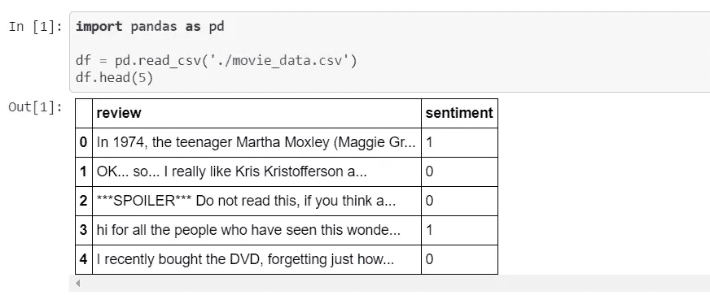
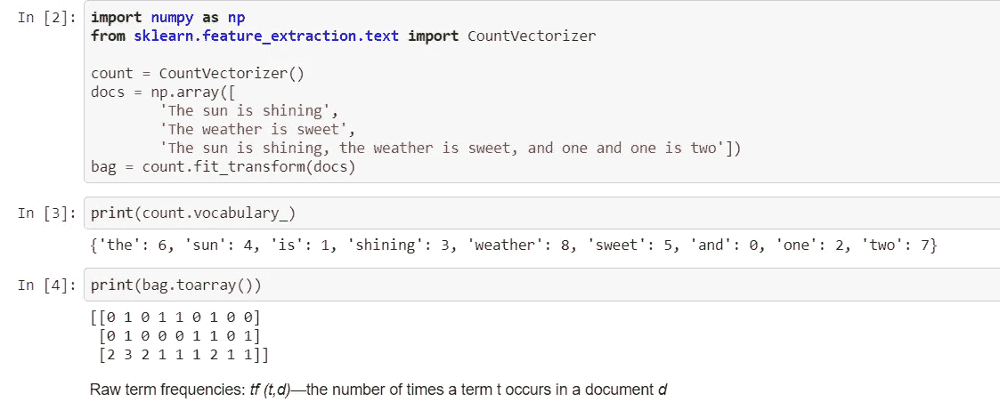
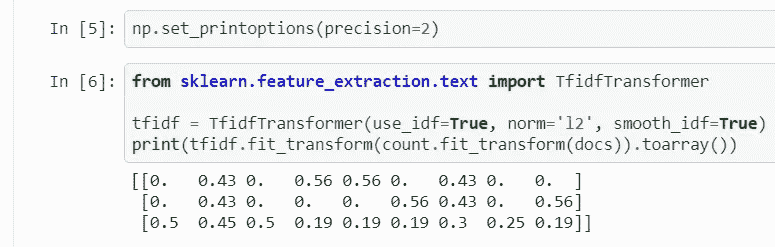
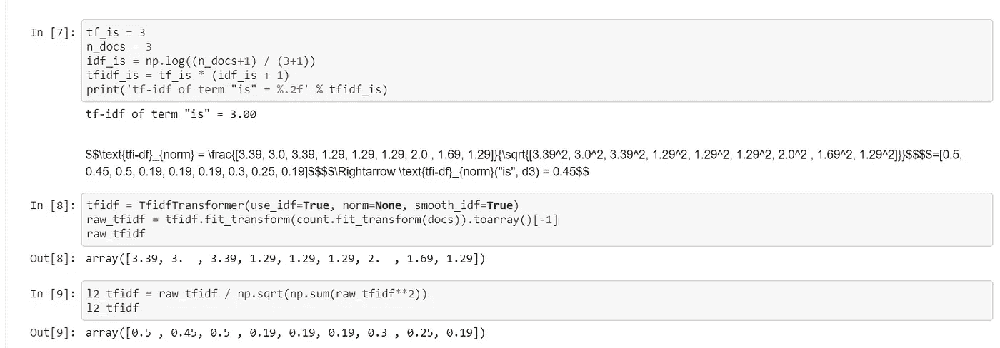
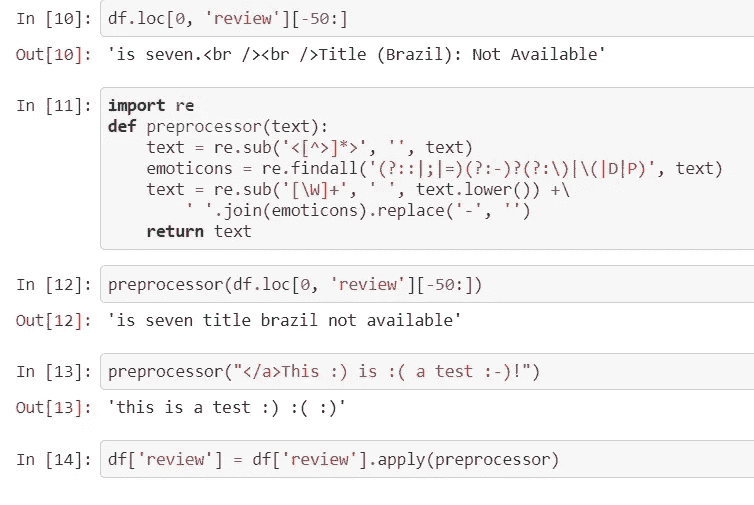
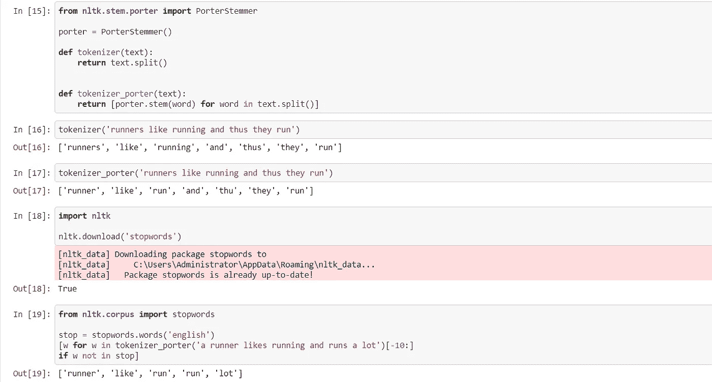
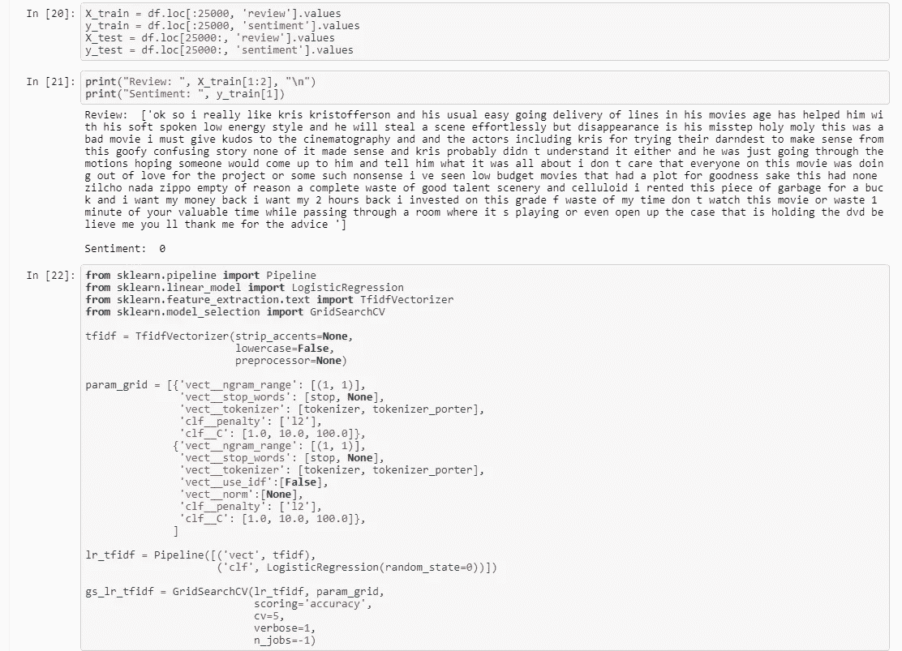
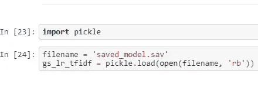
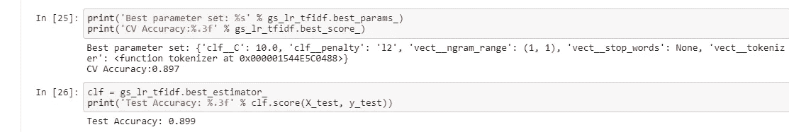

# 自然语言处理基础项目

> 原文：<https://medium.com/analytics-vidhya/basic-project-on-nlp-natural-language-processing-5c3d2184e81e?source=collection_archive---------31----------------------->

使用 Scikit 进行情感分析的分步指南-了解 IMDB 数据

正如维基百科所说:

> **情感分析**(又称**意见挖掘**或**情感 AI** )是指利用[自然语言处理](https://en.wikipedia.org/wiki/Natural_language_processing)、[文本分析](https://en.wikipedia.org/wiki/Text_analytics)，对情感状态和主观信息进行系统的识别、提取、量化和研究。

[情感分析](https://www.kdnuggets.com/2018/03/5-things-sentiment-analysis-classification.html)

这是我的一个项目“使用 Scikit-learn 对 IMDB 数据进行情感分析”,这是我从 Coursera 的一门课程中学到的，我认为它可能会帮助你了解如何将这些复杂的术语很好地结合在一起，并尝试一些使用相同技术的新事物。

# 目标:

1.  使用 [scikit-learn](https://scikit-learn.org/) 构建并使用逻辑回归分类器。
2.  清理和预处理文本数据。
3.  用 nltk(自然语言工具包)进行特征提取。
4.  调整模型超参数并评估模型准确性。

# 任务 1:导入数据

*   数据集介绍和问题概述。
*   看到一个演示的最终产品，你将建立在这个项目结束。

# 任务 2:将文档转换成特征向量

*   使用自然语言处理和信息检索中的词袋模型来表示文本数据。
*   构建词袋模型的词汇，将提供的样本句子转化为稀疏特征向量。

> **CountVectorizer** 提供了一种简单的方法，既可以标记一组文本文档，构建已知单词的词汇表，还可以使用该词汇表对新文档进行编码。

# 任务 3:术语频率-逆文档频率

*   在信息检索和文本挖掘中，我们经常观察在我们的文档语料库中出现的单词。这些词可能会导致培训和测试期间的糟糕表现，因为它们通常不包含有用的信息。
*   理解并实现一种有用的统计技术，术语频率-逆文档频率(tf-idf ),以在特征向量表示中降低这类词的权重。tf-idf 是术语频率和逆文档频率的乘积。

> **TFIDF** ，术语频率的缩写——逆文档频率，是一种数字统计，旨在反映一个词对集合或语料库中的文档有多重要。

# 任务 4:计算术语“Is”的 TF-IDF

*   手动计算示例的 tf-idf。
*   应用 scikit-learn 的 Tfidf 转换器将样本文本转换为 tf-idf 值的向量，并对其应用 L2 归一化。

# 任务 5:数据准备

*   文本数据的清洗和预处理是数据分析，尤其是自然语言处理任务中的一个重要过程。
*   使用正则表达式去除无关字符的评论数据集，包括 HTML 标签、标点符号和表情符号。

# 任务 6:文档的标记化

*   确保 k-means 图像压缩仅在 slider 小部件的鼠标释放事件上执行。
*   重新利用之前任务中的数据预处理和 k-means 聚类逻辑，对您选择的图像进行操作。
*   可视化图像如何随着送入 k-means 算法的聚类数的变化而变化。

# 任务 7:使用逻辑回归进行文件分类

*   首先，将数据分成大小相等的训练集和测试集。
*   然后创建一个管道来构建逻辑回归模型。
*   为了估计最佳参数和模型，我们在参数网格上采用交叉验证的网格搜索。

# 任务 8:从磁盘加载保存的模型

*   尽管训练逻辑回归模型所花费的时间非常少，但是考虑到训练集的大小，使用 GridSearchCV 估计模型的最佳参数可能需要几个小时。
*   在此任务中，加载一个预训练模型，该模型稍后将用于查找最佳参数设置、交叉验证分数和测试准确性。

# 任务 9:模型准确性

*   在最后一项任务中，我们来看看最佳参数设置、交叉验证分数，以及我们的模型对测试集中从未见过的评论的情感分类的好坏。

# 参考:

*   [https://www . coursera . org/learn/sci kit-learn-logistic-regression-情操-分析](https://www.coursera.org/learn/scikit-learn-logistic-regression-sentiment-analysis) /
*   如需 jupyter 笔记本参考，点击[此处](https://github.com/sakshi13-m/Sentiment_analysis_on_IMDB_data/blob/master/completed.ipynb)。
*   我在情感分析方面的一个创新:

情感分析