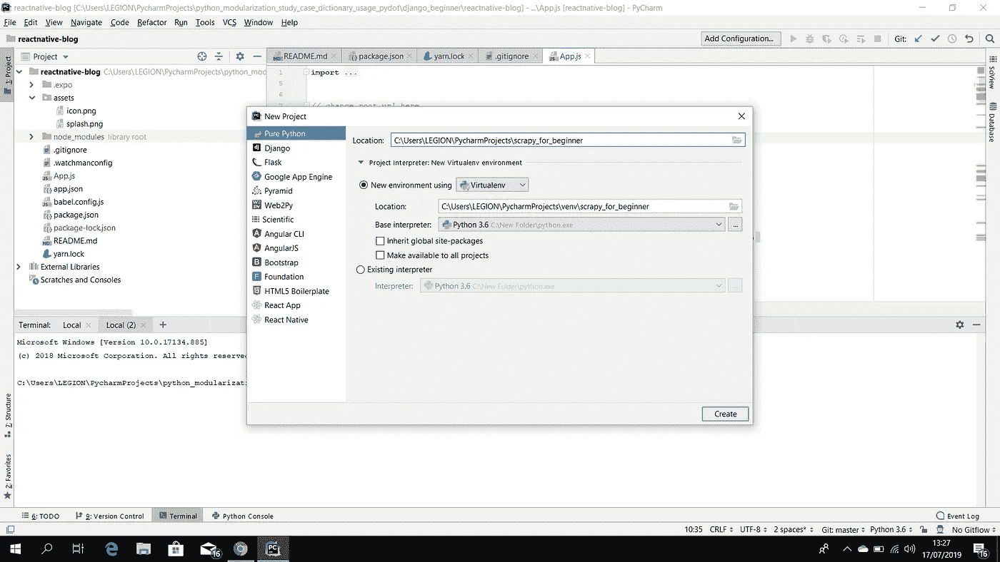
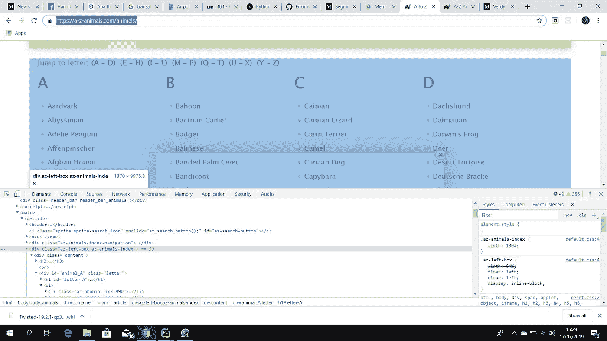
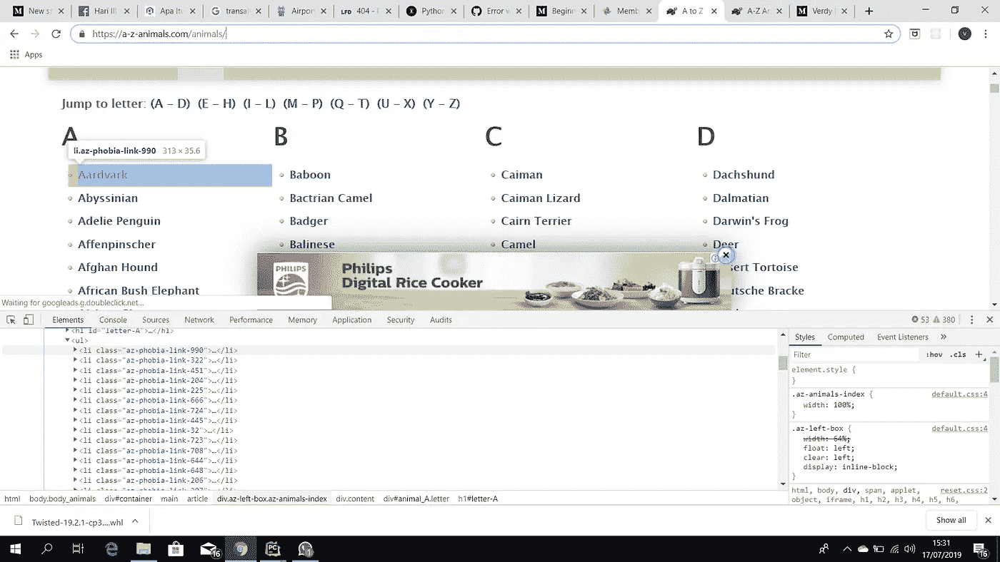
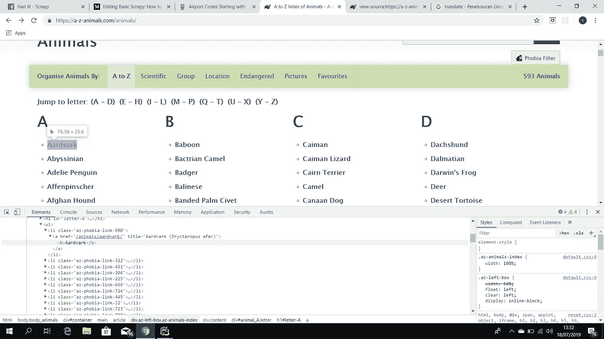
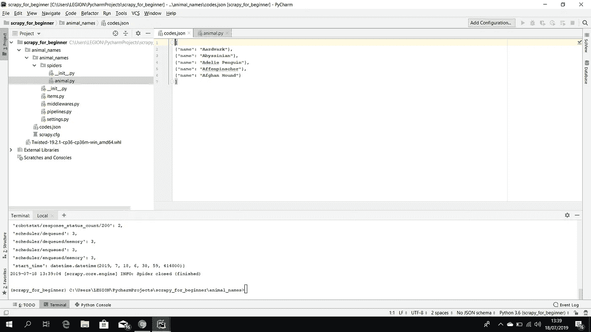
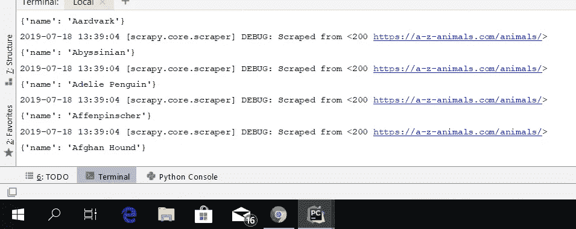

# 基础刮痧:如何刮动物名

> 原文：<https://medium.com/analytics-vidhya/basic-scrapy-how-to-scraping-animal-name-e34c3c825492?source=collection_archive---------3----------------------->

嗨，今天我要告诉你关于 scrapy 的事情。Scrapy 是一个用 Python 编写的免费开源网络爬行框架。它最初是为 web 抓取而设计的，也可以用于使用 API 提取数据或作为通用的 web 爬虫。它目前由一家网络抓取开发和服务公司 Scrapinghub Ltd .维护。


网页抓取功能从一个网站检索数据分区，例如从市场上获取价格数据进行比较，检索天气预报数据等等。这对一个公司的领导做决策是非常有用的。

在这一次，我想解释如何做简单的网页抓取。我们将检索[https://a-z-animals.com/animals/](https://a-z-animals.com/animals/)的机场名称数据

首先打开你的 PyCharm，用这样的虚拟环境新建一个项目。



在安装 Scrapy 之前，你必须先安装 Twisted，你可以在 https://www.lfd.uci.edu/~gohlke/pythonlibs/的[下载，根据你的 python 和你的 windows 版本搜索 Twisted 并下载。我的 Python 版本是 3.6，我的 windows 版本是 64 位，所以我选择了](https://www.lfd.uci.edu/~gohlke/pythonlibs/)[https://download . lfd . UCI . edu/Python libs/t 4 jqbe 6 o/Twisted-19 . 2 . 1-cp36-cp36m-win _ amd64 . whl](https://download.lfd.uci.edu/pythonlibs/t4jqbe6o/Twisted-19.2.1-cp36-cp36m-win_amd64.whl)。

在 windows 资源管理器中打开文件，点击复制，打开你的 Pycharm，右击 scrapy _ for _ 初学者目录，点击粘贴。那就跑

```
**pip install Twisted-19.2.1-cp36-cp36m-win_amd64.whl
pip install scrap**
```

我们现在可以开始抓取，首先我们必须命名这个抓取项目，在终端上运行它。

```
**scrapy startproject animal_names
cd animal_names
scrapy genspider animal www.a-z-animals.com**
```

之后，它们将是一个名为 animal.py 的新 python 文件。接下来我们必须安装 Pywin32，并将代码改为。json 格式，在 terminal.jelasin json 上运行这个

```
**pip install pywin32
scrapy crawl animal -o codes.json**
```

下一个类似的类型在 animal.py 上。

```
name = **'animal'** allowed_domains = [**'www.a-z-animals.com'**]
start_urls = [**'http://a-z-animals.com/animals'**]

**def** parse(self, response):
    data = []
    table = response.css(**'.az-leftbox.az-animal-index'**)
    row_selector = **".//li[@class='az-phobia-link-990']|.//li[@class='az-phobia-link-322']|"** \
                   **".//li[@class='az-phobia-link-451']|.//li[@class='az-phobia-link-204']|"** \
                   **".//li[@class='az-phobia-link-225']"**
```

允许的域是我们要检索数据的主 url。Start_urls 是我们想要检索数据的特定 url，在本例中，我们想要依次检索第一个字母为 A 的 5 个动物名称。我从哪里获得代码的源代码？你可以打开 https://a-z-animals.com/animals/的网址[点击鼠标右键](https://a-z-animals.com/animals/)并进行检查。



这是我们想要检索数据的主类。写在上面

```
table = response.css(**'.az-leftbox.az-animal-index'**)
```



这是我们想要检索数据的子类，在本例中，我们想要检索第一个字母为 A 的 5 个动物名称，因此只需在 animal.py 上写入子类的前五个。

```
row_selector = **".//li[@class='az-phobia-link-990']|.//li[@class='az-phobia-link-322']|"** \
                   **".//li[@class='az-phobia-link-451']|.//li[@class='az-phobia-link-204']|"** \
                   **".//li[@class='az-phobia-link-225']"**
```

然后，您必须选择行。



我们想要检索土豚，红阿比，阿德利企鹅，Affenpinscher，Afgan 猎犬文本，它们在 html 中的位置在。/a/b，然后我们键入文本。/a/b/text()并将其放在我们的代码中，如下所示。

```
**for** row **in** table.xpath(row_selector):
    name = row.xpath(**'./a/b/text()'**).extract_first()
    print(name)

    data.append({
        **"name"**: name
    })
```

我还添加了名称文本，使结果更加整洁。如果要添加一些文本或函数，可以键入 data.append，然后键入文本。这是最后的代码，你在 animal.py 中的整个代码应该是这样的。

```
**import** scrapy

**class** AnimalSpider(scrapy.Spider):
    name = **'animal'** allowed_domains = [**'https://www.a-z-animals.com'**]
    start_urls = [**'https://www.a-z-animals.com/animals'**]

    **def** parse(self, response):
        data = []
        table = response.css(**'.az-left-box.az-animals-index'**)
        row_selector = **".//li[@class='az-phobia-link-990']|.//li[@class='az-phobia-link-322']|"** \
                       **".//li[@class='az-phobia-link-451']|.//li[@class='az-phobia-link-204']|"** \
                       **".//li[@class='az-phobia-link-225']"

        for** row **in** table.xpath(row_selector):
            name = row.xpath(**'./a/b/text()'**).extract_first()
            print(name)

            data.append({
                **"name"**: name
            })

        **return** data
```

然后去终端输入 scrapy crawl animal -o codes.json，在 package.json 上查看一下就会得到这个。



因为我们在代码上键入 print(name ),结果也会添加到终端中。



这就是如何抓取一个网站的例子。在这个例子中，我们依次抓取了五个动物的名字，第一个字母是 A。在下一篇文章中，我将再次分享更多关于 Python、Javascript 或 HTML 的内容。

请继续关注我的下一篇文章！！