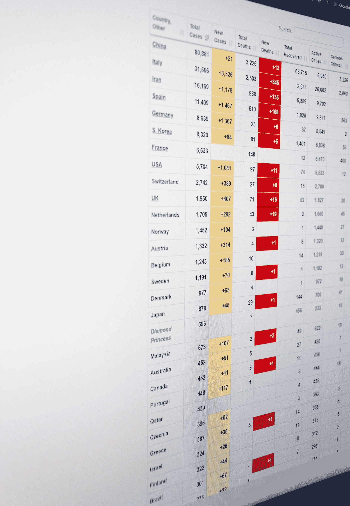
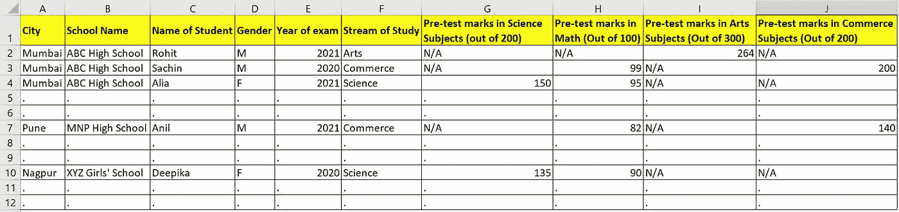
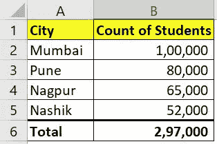
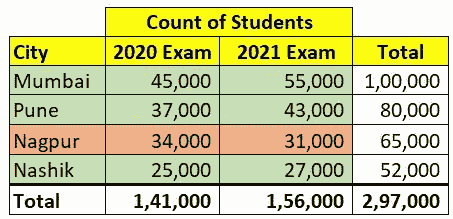
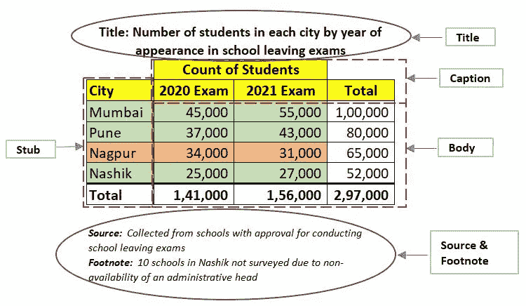
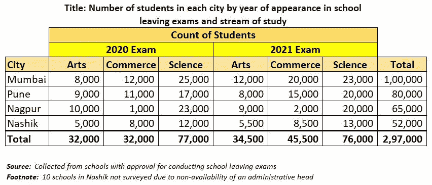

# 基本统计学:数据及其表格表示

> 原文：<https://medium.com/analytics-vidhya/basic-statistics-data-and-its-representation-f15a9110ffc0?source=collection_archive---------22----------------------->

## 从数据中挖掘快速洞察力是统计学的基础步骤。本文提供了使用表格表示从数据中有效挖掘信息的技巧。

克里斯汀·三都在 [Unsplash](https://unsplash.com?utm_source=medium&utm_medium=referral) 上的照片

如今的互联网上充斥着大量文章、电子书和在线课程，声称可以让你在人工智能、数据科学和机器学习领域的旅程更加顺畅。我个人从许多这样的课程中学到了东西，并发现它们对学习许多新领域的基础知识或进步非常有帮助，可以有效地解决古老的问题。虽然这些课程真的很有用，但绝对初学者需要做一些预备阅读。

我的帖子将有一个谦卑的目标，总结现有的关于统计学基本概念的文献。我的希望是，一个想要在数据科学和机器学习领域取得成功的初学者，可以在阅读了这本重要基本概念的汇编之后，爬上阶梯的第一步。

我计划发表一系列文章，提出一些统计学中的概念，这些概念在任何已完成的数据挖掘工作中都是日常使用的。

# 什么是数据？

在我们深入研究数据之前，让我们从我们研究主题的最基本的问题开始，**什么是统计学？**

我的观点是，它是一种数学科学，通过将数据转换成可分析的格式，帮助我们收集数据和理解数据，实现探索，绘制解释和演示。

定义中的第一件事是**数据**。它是事实的集合；数字、类别、文本、尺寸、语音、图像等。例如，印度某城市在 7 月份一周内每天的降雨量。当今世界，2020 年新冠肺炎疫情病毒肆虐，有大量关于感染、康复和死亡人数的数据。不仅仅是人类水平的数据，还有大量关于病毒行为的数据。

有各种类型的数据。最高级别有两种类型:

*   **定量:**这类数据处理的是数字。例如，印度每天从新冠肺炎恢复的 **的**数量**，过去几天的降雨量或者一家公司过去 6 个月的每日股票价格。它可以进一步细分为两个子类型:**离散**和**连续**。一个离散的 ***变量*** 只能取某些特定的或孤立的值。例如，一个班级的学生人数。另一方面，连续变量*可以取指定区间内的任何值，包括分数。比如一个班学生的身高。身高可以是 166 厘米或 165.8 厘米，甚至更精确的值，如 165.7916，这取决于我们如何定义它。*定量数据也称为* ***变量*** *(如上所用)，因为它们可以根据我们正在测量的情况而变化。****
*   **定性:**定性数据又称*属性*，是一种不能用数字表示的数据类型。它们无法用任何尺度来衡量。但是，在某些情况下，可以订购它们。**名义**属性是简单的类别或类。它们没有测量刻度，也不能订购。例如，一个人的性别，如男性、女性等。或居住国，如印度、美国、德国、日本等。还有第二种类型的属性叫做**序数。**与名义属性不同，这些属性可以排序。例如，您对餐馆或在线送餐服务满意度调查的回答可以排序为非常满意、满意、不满意和非常不满意。即使你不能衡量它们，你至少可以把它们按顺序排列。
*   还有一些其他类型的数据被频繁使用，如 ***区间*** 和 ***比率*** 。**区间**是可以排序的数据类型，它们的差异有意义。例如，未来一个月的预测温度范围，如夏季 25–30 度，冬季 17–22 度，或信用评分如 500–750、750–850 等。这些值可以降到零度以下，就像温度的情况一样。**比率**另一方面是区间的延伸，其中定义了真正的零点。例如，200 克是 100 克的两倍，但不能低于 0。

# 数据收集的类型

现在我们已经了解了不同类型的数据，让我们来了解数据是如何收集的，以及它们是如何构成的。

*   **原始数据**:第一手收集原始数据。最终用户或调查人员将亲自到现场收集这些数据。例如，作为大学宿舍的厨房经理，你需要计划每天的膳食，你需要的主要信息是宿舍中素食和非素食学生的数量。你去每个学生的房间，询问他们的用餐偏好，这有助于你订购适量的厨房用品。或者，可能有一家公司在孟买市推出他们的护肤品之前做了市场调查。他们让一些员工带着一份调查问卷到城市中去，调查人们对护肤品的期望。(*精神食粮:你认为他们能在孟买这样一个人口密集的城市调查所有人吗？*)
*   **二级数据:**该数据不是研究者本人收集的。在大多数情况下，你会从那些不辞辛苦收集它的人那里购买，或者从公共网站上免费下载。例如，如果你想知道美国过去 1 年的月失业率，你可以去美国劳工统计局[网站](https://www.bls.gov/)下载。广泛搜索的 2020 年新冠肺炎感染率和死亡率也可以从二手来源获得，比如一个国家的卫生部网站，比如印度的[这里](https://www.mohfw.gov.in/)。

这两种类型的数据收集各有利弊，最终需要权衡成本与收益。原始数据更准确，非常具体的调查，并提供了收集的灵活性。但是它需要高成本、高规划、高时间和高努力。二手数据的麻烦较少，因为它不需要复杂的数据收集工作，但它的灵活性有限，并且所有数据可能都与调查无关。

# 数据的列表和表示

一旦你收集了数据，你如何存储它，并从中提取基本的见解？这是一个非常重要的概念。你可能已经很努力地收集了调查所需的所有信息，但是如果你不能以适当的方式呈现给你的上级，他们将无法确定你的分析的可信度。所以，这就把我们带到了制表和数据表示的概念。就我个人而言，这是我处理数据时最令人兴奋的事情之一。在本节中，我们将通过一个常见的日常例子。

让我们假设你为一个教育内容创作者工作。您的经理告诉您，公司计划在印度马哈拉施特拉邦推出一门名为“ *StatAdv* ”的新的本科水平统计和编程在线课程。现在你的工作是帮助她审查这些内容的市场。她要求你从简单开始，专注于该邦的 4 个主要城市集群——孟买、浦那、那格浦尔和塔那，收集参加 2021 年毕业考试的学生的数据。你去这些城市所有可能的学校，收集学生的数据。每个学校都以不同的可能格式向你提供这些数据。

经过几天收集数据的辛苦工作，你终于回到办公室，喝杯咖啡，考虑如何把这些到处都是的数据带给你的经理。喝一口咖啡，瞧！您的计算机上有一个电子表格应用程序(例如，Microsoft Excel 及其类似物)。你打开它，试着把收集到的数据以表格的形式放到一个更好的形状里。这就是**制表**的过程。您首先创建将用于多种其他目的的基础。为了便于说明，下面显示了一个快照(未给出完整数据):

图 1:将采集的数据放入 ***表***

您的**数据表**现在已经创建完毕(图 1)。你有一个**观察**对于每个城市的每个学校的每个学生。这些列向您显示了*变量*和*属性*(还记得前面的部分吗？)你已经为每一次观察收集了。

如果你现在把这张简单的表格拿给你的经理，你认为她会留下深刻印象吗？大概不会。她可能太忙了，没有时间浏览所有内容，让你强调关键的见解。你现在做什么？你需要创造一些看起来更直观的东西。在你去那里之前，值得强调的是，即使在像图 1 这样的简单表格中，你只是记录了收集的数据，这也是一个很好的做法，让它变得直观。查看列标题。在“城市”这样的栏目中，我们的思维已经习惯于思考可能的价值(孟买、那格浦尔等。).然而，在像考前标记这样的栏目中，你需要更多的信息。虽然数学本身是一门学科，但科学学科是物理和化学的结合。因此，数学的最高分可能是 100 分，而物理和化学加起来最高分可能是 200 分。一个好的做法是在标题中调用它们，就像在上面我们用括号来说明什么是最大标记。

那么，你现在如何得出真知灼见呢？让我们想一想，你可以用最少的努力获得什么，但这可以显示一些咀嚼。你首先想知道学生总数，如果可能的话，按城市分类。由于表中的每个观察值都是一个学生，所以您只需统计每个城市的观察值。因此，您会得到以下结果:

图 2:简单频率表

你现在已经创建了一个有几个名字的东西——**简单**表和**频率**表。一个*简单的表格*是一个只显示一个特性概要的表格。在图 2 中，您只显示了每个城市的学生人数。 *Frequency* 表格简单地显示了关注的特定项目的观察次数的计数。在图 2 中，该项是学生。

你的经理现在开始说话了。很明显，与 Nashik 相比，贵公司在孟买有更高的学生销售基础。现在，你受到了鼓励，继续往下钻。接下来你会做什么？请注意，学校不仅给了你 2021 年参加考试的学生名单，还提供了 2020 年的数据。你可能没有要求它，但它可能是一个有趣的补充。我认为，2020 年的学生将比 2021 年的学生更早进入大学。所以，前者比后者更需要你的内容:

图 3:显示一个以上特征频率的复杂表格

您已经成功地创建了图 3 中频率表的一个片段，该片段显示了在离校考试中出现的城市和年份的学生数量。您知道，孟买有 45，000 名学生可能在未来几周需要这些内容，而 55，000 名学生仍有时间，可能在今年晚些时候需要这些内容。这是**复杂表格**的一个例子，它显示了一个以上特性的汇总。请注意以下几点:

*   **表的构造:**表有各种组件。下面的图 4 使用图 3 作为例子，并且示出了不同的可能组件。请注意，添加了**标题**、**来源** & **脚注**后，阅读变得更加容易:

图 4:表格的不同组成部分

**标题**展示了表格的描述或其目的。**标题**显示列和子列的描述。**存根**显示最左列各行的特征描述。 **Body** 是主要部分，包含所有由标题和存根元素分类的数字信息。**资料来源**获取了关于数据收集来源的信息，而**脚注**列出了任何值得注意的地方，例如，这里给出了没有收集纳什克 10 所学校数据的原因。

*   **颜色高亮:**注意不同的行是如何着色的。你可以看到，在 2020 年到 2021 年间，所有城市的学生人数都有所上升，除了那格浦尔有所下降。这可能有多种原因——入学人数下降、合格学生减少或数据收集/列表问题。用一种配色方案很容易就能把它们画出来。看看橙色在大部分是绿色的桌体中是如何突出的。另外，花点时间回顾一下帖子开头的图片。它按日期和国家列出了新冠肺炎的统计数据。请注意死亡人数是如何用红色突出显示的，这引起了人们对需要注意的事情的明显关注。因此，使用颜色有助于突出任何你想让观众注意到的信息。

太棒了。你已经学习了一些制表的基本概念。然而，你可以对数据做更多的删减。比如你认为所有学生都需要 *StatAdv* 课程内容吗？如果你合理地认为，可能是科学和商业流的学生更需要它作为他们课程的一部分，也许有一小撮艺术学生只是出于兴趣而不是为了任何课程而阅读它。图 5 向您展示了进一步的流切割，以使*真实的*客户群(科学和商业学生)更加明显。

图 5:进一步深入，从表格中找到更多的见解

图 1 中所有这些原始数据的切割都可以使用简单的工具来完成，如 MS Excel 中的数据透视表。看微软教程[这里](https://support.office.com/en-us/article/create-a-pivottable-to-analyze-worksheet-data-a9a84538-bfe9-40a9-a8e9-f99134456576)。然而，在一个点之后，你需要停止进一步的切割，因为它们可能会使表示复杂化。因此，在开始任何类型的数据制表之前，**你需要明确设定你想要解决的目标。**在本帖的示例问题中，我们着手对极有可能购买课程内容的客户群进行基本评估。通过使用制表方法进行深入研究，我们现在可以看到，我们在参加孟买 2020 年学校毕业考试的科学和商业学生中拥有良好的基础！经理对这个最初的故事印象深刻，尽管有**多种其他统计技术可以从这个数据中得出更多的推论**。那些比这个高一个等级。所以，让我们改天再讨论这些。

你的经理是一名数学毕业生，了解所有的事情。但是现在你们两个需要在下周把它交给营销主管，他对数学有一个秘密的敌意。这些桌子会给他留下同样深刻的印象吗？或者更多的视觉效果会更好吗？我将在下一篇文章中讨论这部分数据的图形表示。

***注:*** *本帖中使用的所有数据仅用于说明目的，在现实世界中可能不准确。*