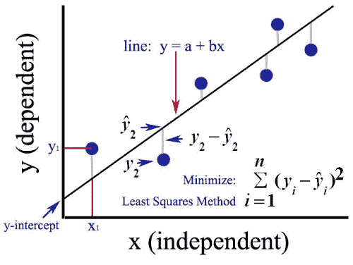

# 数据科学基础统计学

> 原文：<https://medium.com/analytics-vidhya/basic-statistics-for-data-science-edb52d2ddcd5?source=collection_archive---------16----------------------->

本文的目的是为刚刚开始学习数据科学的人提供基本的统计知识。统计学在数据科学中起着核心作用；了解描述性统计和概率理论有助于更深入地了解数据。在本文中，我将概述为了在数据科学中出类拔萃，您必须了解的基本统计概念。

# 数据类型

## 1)分类数据

**a)名义数据** 它们没有任何量化值，只用来标注变量。
示例:性别、邮政编码、血型、眼睛颜色
**b)顺序数据** 它涉及单元之间的顺序，但是点之间的距离不相等或不可测量。它通常用于调查问卷。
例子:李克特量表(非常开心—开心—中性—不开心—非常不开心)

## **2)连续数据**

**c)区间数据
它没有绝对的零点，也就是说，零并不意味着被测量的不存在。
举例:温度、时间、智商测试
**d)比值数据** 单位之间是有顺序的，它们之间的距离是相等的，它有一个绝对零点。因此它不能是负的。
示例:身高、体重、持续时间**

# **集中趋势的衡量标准**

集中趋势的度量是试图描述整个数据集的单个值。三个主要的衡量标准是众数、中位数和平均数。
**模式:**最常出现的值。与中位数和平均值相比，使用众数的优势在于众数既可以用于分类数据，也可以用于数值数据。
**中位数:**当数值按升序或降序排列时，它是分布的“中间值”。在分布有偶数个值的情况下，中位数是两个中间值的平均值。它受异常值的影响较小。因此，当分布中有许多异常值时，通常更喜欢使用中位数而不是平均值。
它的局限性是受离群值的影响。

# 离差的度量

## 5 个数字摘要和方框图

箱形图

5 数字汇总用于描述性统计中，以给出关于观察值分布的概念，并以箱线图显示。5 数字汇总由最小值、下四分位数(Q1)、中值(Q2)、上四分位数(Q3)和最大值组成。换句话说，它们分别是第 0、25、50、75、100 个百分位数。点之间的每个间隔包含 25%的数据。箱形图很有用，因为它显示了数据集的偏斜度。如果中位数更接近盒子的底部，这意味着分布是正偏的(右偏)。如果它更靠近盒子的顶部，那么分布是负偏的(偏左)。
**范围:**最大值和最小值之差。
**四分位数范围(IQR):** 是第三个四分位数减去第一个四分位数(Q3 — Q1)。因此，可以说 *IQR* 是一个数据集中间 50%的点差量。
**异常值:**异常值是指与其余观察值异常远离的观察值。超出内部界限的值称为**轻度异常值**。超出外部界限的值被称为极端异常值。
*下内栏:Q1-1.5 *智商
上内栏:Q3+1.5 *智商
下外栏:Q1-3 *智商
上外栏:Q3+3 *智商*

## 标准偏差和方差

**标准差(σ)和方差(σ )** 衡量数据关于平均值的分布。
**方差**的计算方法是取每个值与平均值的差，然后将差平方使之为正，再除以值的个数。
**标准差**是方差的平方根。它总是以与原始数据相同的单位进行测量。

# 相关系数和协方差

协方差只告诉我们变量之间线性关系的方向。然而，相关系数显示了关系的方向和强度。因此，相关系数优于协方差。

协方差和皮尔逊相关系数的公式

协方差不显示强度的原因是因为协方差是以单位来度量的。因此，当我们改变度量单位时，协方差也会改变。例如，当我们测量人的身高时，如果我们用米或厘米来测量，我们会得到不同的协方差值。因此，为了消除测量单位的影响，协方差除以两个变量的标准差，这个数称为相关系数。它显示了变量之间关系的方向和强度。
ꙩa**正协方差**意味着变量倾向于在**同**方向变化，而 a **负协方差**意味着它们倾向于在**反**方向变化。如果**协方差**是**零**，这意味着它们不一起变化。
ꙩ**相关系数**在-1 和 1 之间变化。如果是 **-1** ，则变量具有**完全负**相关性。如果是 **1** ，变量有完美的**正相关**。并且，如果是 **0** ，变量**不具有**一**线性**关系。

# **线性回归**

线性回归分析用于通过将线性方程拟合到观察数据来估计因变量和自变量之间的关系。
**自变量:**在试验中被操纵的变量，以测试对因变量的影响。 **因变量:**是其值依赖于自变量的变量。
在建立线性回归模型之前，我们要用散点图或者相关系数来看看变量之间是否有关系。如果没有任何线性关系，使用线性回归模型将没有用。
线性回归线有一个形式为 ***y = a + bx 的方程。***

方程中 **a** 为**截距/常数**(x 为 0 时 y 的值) **b** 为**斜率**， **x** 为**独立**变量， **y** 为**非独立**变量。通常使用**普通** **最小二乘法**来拟合回归线。目标是最小化误差的平方和(点和线之间的距离)。所以线性回归线必须尽可能接近所有点。
**示例** 假设我们有一个数据集，其中包含关于某个特定区域的客厅数量*和房屋价值的信息。在这种情况下，我们可以假设它们有关系，并且随着客厅数量的增加，其价值也增加。我们已经有了显示客厅数量(自变量)和一些房屋价值(因变量)的训练数据。但我们应该建立一个回归模型，如果给定房子的客厅数量，就可以预测房子的价值。我们应该拟合一条能给出最小误差的线性回归线。因此，通过普通的最小二乘模型，我们得到一个类似 y= a+bx 的方程。在这个等式中，“a”(截距)是 x=0 时的值。因此，如果房子没有起居室，我们预计它的价格是 a。“b”(系数)表示 y 的变化除以 x 的变化。因此，房子里起居室的数量每增加一个单位，房子的价值就增加“b”个单位。*