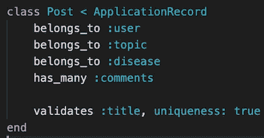
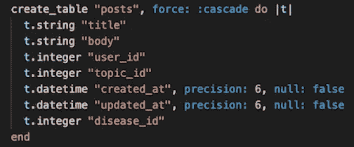
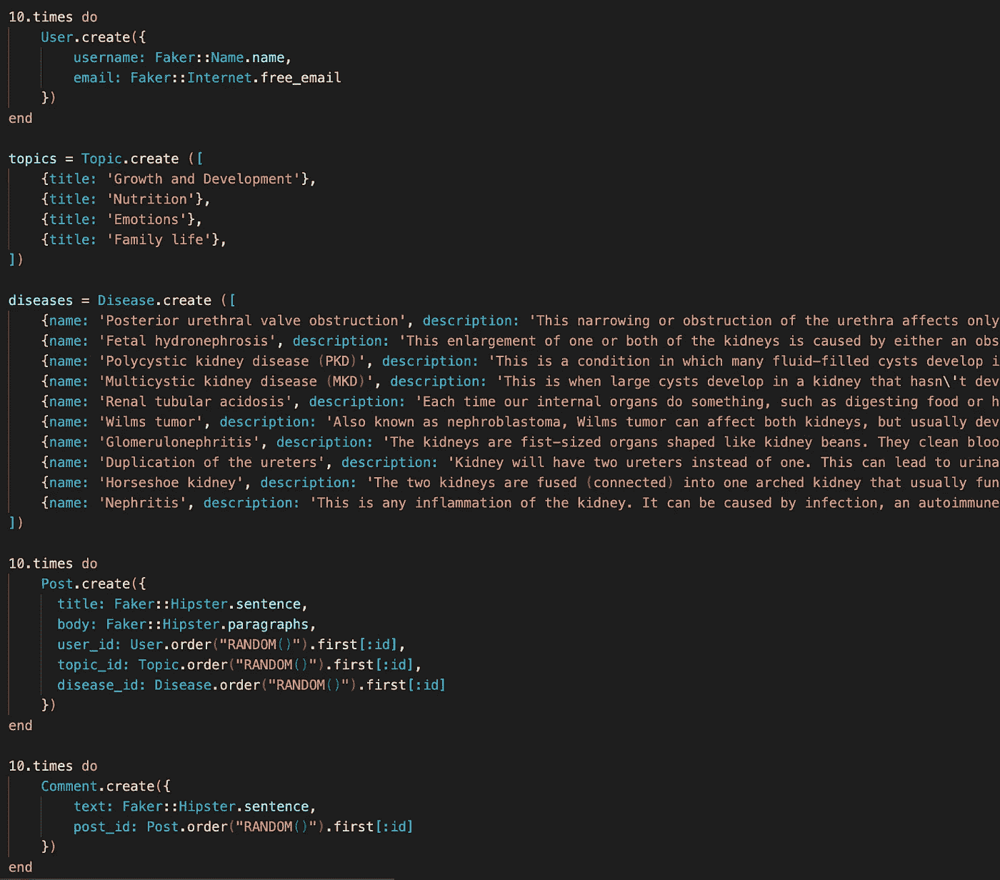
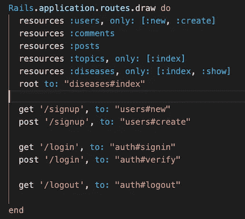
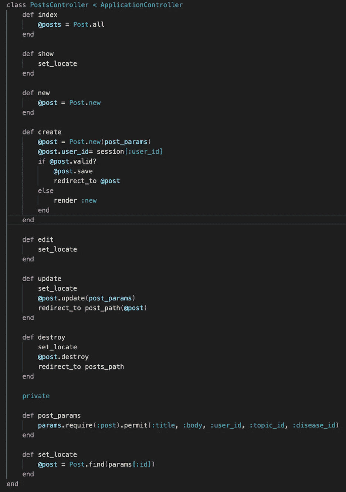
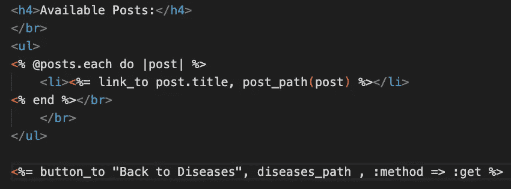
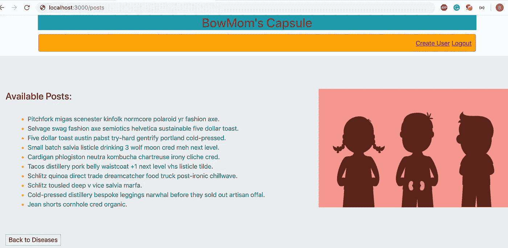
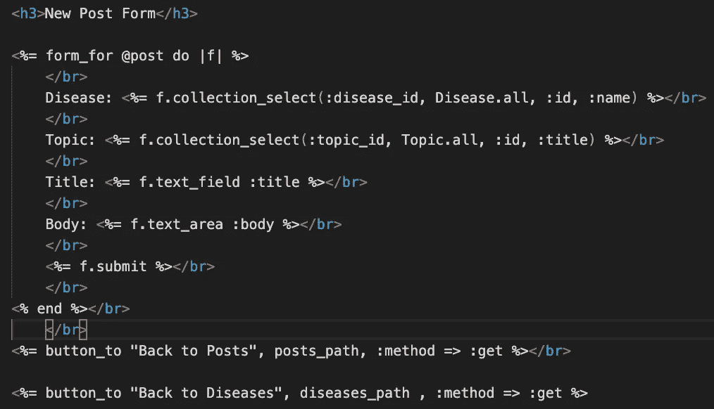
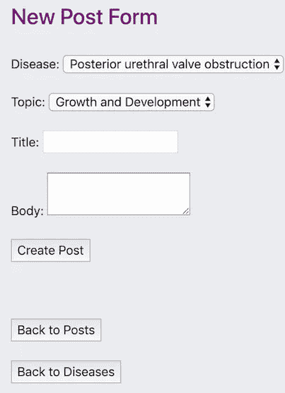

# 用 Ruby on Rails 构建 CRUD 应用程序的基本步骤

> 原文：<https://medium.com/analytics-vidhya/basic-steps-to-build-a-crud-app-with-ruby-on-rails-c92557b0feb2?source=collection_archive---------11----------------------->

我使用 Ruby on Rails 构建了一个 CRUD(创建、读取、更新、销毁)web 应用程序，并在下面列出了简单的步骤。在这个项目中，遵循基本的 MVC(模型-视图-控制器)模式，为患有肾脏疾病的儿童的母亲创建了一个博客。登录后，用户可以列出与他们选择的主题或疾病相关的所有帖子。用户将能够添加、编辑和删除他们提交的帖子。与帖子类似，用户也可以创建和删除与帖子相关的评论。

1.  首先，您需要打开您喜欢的终端并执行下面的**来为您的新项目初始化 Rails 目录**:

```
$ rails new Bowmoms-Capsule
```

2.**使用 Rails 命令“generator”**来创建模型、控制器和迁移。我的应用程序总共有 5 个不同的模型，这里我只使用了“post”模型进行演示:

`$ rails generate resource Post title body user_id:integer topic_id:integer disease_id:integer`

除非另有说明，否则 Rails 默认使用 string 作为数据类型，这就是为什么我不需要显式地编写 title 和 body 的数据类型。`resource` generator 通过创建我们的应用程序启动所需的所有文件，为我们节省了大量时间。

3.**在模型和**之间添加关联**构建您的验证**:



我加入了一个验证来确保文章标题不会重复。

4.**运行数据库迁移**并检查您的模式:

```
$ rails db:migrate
```



ActiveRecord 迁移用于创建表。

5.**播种数据库** : Faker gem 用于为我的 3 个模型(包括 post 模型)生成随机数据。我使用 create 方法来填充其他两个模型的种子数据。

```
$ rails db:seed
```



运行`$ rails console`，这允许我们在控制台中测试我们的代码，以确认您想要的一切都已添加到您的数据库中。

6.**构建您的路线:**在*配置*文件夹中的 *routes.rb* 文件中设置路线。我的 app 默认地址是`diseases#index`，是疾病列表页面。运行`$ rails routes`来查看你的应用程序被配置到的所有路由。



请注意，添加了自定义路线。

现在是时候处理我们的 **CRUD** 函数了:

7.控制器:控制器将我们的模型和视图联系在一起。它管理用户、模型和视图之间的数据流；它接受用户的请求，修改模型，并最终呈现视图。



我的应用程序使用 post 模型的所有 7 条 RESTful 路径。

当创建操作成功时，一篇文章的新实例将被保存到我们的数据库中。如果验证失败，控制器会重新呈现`:new`页面，并给用户另一次提交帖子的机会。另外，请注意，每个用户都有一个记录的会话。

8.**视图**:单击表单上的按钮后，Rails 向用户显示结果以及相关的视图页面。



视图使用 **link_to** 助手创建一个带有所提供路径的超链接。

`$ rails server`允许我们从浏览器访问我们的应用。运行`$ rails server`并导航到`[http://localhost:3000/posts](http://localhost:3000/posts)`，看看你的页面看起来如何:



我们需要一个简单的形式来添加一个新的职位到我们的数据库。`collection_select` 下拉按钮用于选择帖子实例的关联疾病和主题。



**form_for** form helper 用于方便使用用户输入创建新帖子。

再次启动服务器并导航至`[http://localhost:3000/posts/new](http://localhost:3000/posts/new)`查看表单:



添加了“回到文章”和“回到疾病”按钮来在页面之间导航。

我们已经完成了一个运行在 Rails 上的全功能 CRUD 应用程序！最后；确保你最好的朋友在你工作的时候调试和提交。这个项目帮助我理解了整个过程中的 CRUD 和 RESTful 操作，我希望它对你有用。